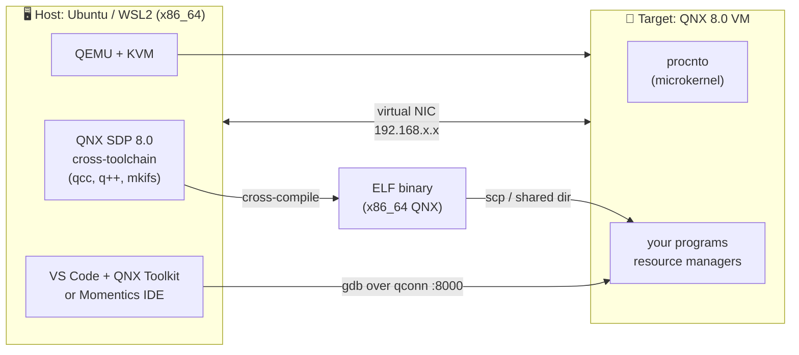

<div align="center">

# 🐧➡️🔷 QNX: Zero to Hero

**A complete, hands-on, beginner-friendly course on the QNX Real-Time Operating System**
*for embedded engineers with a C/C++ and Python background.*

[](docs/meta/CourseState.md)
[](https://qnx.software/)
[](docs/guides/Setup_03_QEMU_VM.md)
[](LICENSE)

</div>

---

## 📌 What is this?

This repository is a **self-paced course** that takes you from *"I have never heard of QNX"* to
*"I can design, build, debug and ship a QNX-based embedded system."*

It is written as a **book you can execute**: every chapter has explanations, diagrams, and labs you
run on your own machine inside a **QEMU/KVM virtual machine** — no expensive hardware required to
start.

> **Who wrote this and how do I use it?**
> This course is authored and maintained collaboratively with an AI assistant, chapter by chapter.
> Progress is tracked in [CourseState.md](docs/meta/CourseState.md). You never lose your place.

---

## 🎯 Three learning paths

Pick one. You can switch at any time — every chapter is tagged for all three.

| Path | Icon | Who it's for | Time budget | What you skip |
|------|------|--------------|-------------|---------------|
| **Path A — Absolute Beginner** | 🐣 | Zero embedded background, little/no coding. Wants to *understand* QNX (managers, PMs, students, testers). | ~2 h/week | All C coding labs; you read the code, run pre-built binaries, and answer concept checks. |
| **Path B — Self-Learner** | 🚶 | Embedded engineer with C/C++ (that's you, by default). Wants depth + working code. | ~5 h/week | Nothing. This is the full course. |
| **Path C — Fast-Track Pro** | 🏃 | Working professional, already knows Linux/RTOS internals, needs QNX-specific knowledge *fast*. | ~10 h total | All "background" theory. Jump straight to QNX-specific deltas, cheat sheets, and capstone. |

Every chapter contains blocks marked like this:

```
🐣 Path A  → read this
🚶 Path B  → read this + do the labs
🏃 Path C  → read only the "Fast-Track Summary" box at the top
```

📖 Full path definitions: **[docs/PLAN.md § Learning Paths](docs/PLAN.md#3-learning-paths)**

---

## 🗺️ Start here

| Step | Document | Why |
|------|----------|-----|
| 1️⃣ | **[PLAN.md](docs/PLAN.md)** | The complete course plan: philosophy, structure, timeline, deliverables. |
| 2️⃣ | **[TableOfContents.md](docs/TableOfContents.md)** | The full chapter index with status and path tags. |
| 3️⃣ | **[Chapter 00 — How To Use This Course](docs/chapters/Chapter00_HowToUseThisCourse.md)** | Conventions, notation, how labs work. |
| 4️⃣ | **[Setup Guide 01 — Prerequisites](docs/guides/Setup_01_Prerequisites.md)** | Get your host machine ready. |
| 5️⃣ | **[Chapter 01](docs/chapters/Chapter01_WhatIsARealTimeSystem.md)** | Begin learning. |

---

## 📂 Repository structure

```text
qnx-zero-to-hero/
├── README.md                      ← you are here
├── LICENSE
├── .gitignore
│
├── docs/
│   ├── PLAN.md                    ← master course plan
│   ├── TableOfContents.md         ← the index / TOC
│   │
│   ├── chapters/                  ← ChapterNN_Title.md — the course itself
│   │   ├── Chapter00_HowToUseThisCourse.md
│   │   ├── Chapter01_....md
│   │   └── ...
│   │
│   ├── guides/                    ← installation & hardware guides
│   │   ├── Setup_01_Prerequisites.md
│   │   ├── Setup_02_QNX_Account_And_License.md
│   │   ├── Setup_03_QEMU_VM.md            ← main lab environment
│   │   ├── Setup_04_IDE_And_Tooling.md
│   │   ├── Hardware_01_Public_Boards.md   ← Raspberry Pi, Intel, NXP, TI...
│   │   ├── Hardware_02_Custom_Board.md    ← your own PCB: BSP & bring-up
│   │   └── PDF_Export.md                  ← turn these .md files into PDFs
│   │
│   ├── reference/
│   │   ├── ReferenceLinks.md      ← every external link, curated
│   │   ├── ResourcesMeta.md       ← books, courses, videos + quality ratings
│   │   ├── Glossary.md            ← QNX terminology A–Z
│   │   └── cheatsheets/           ← one-page printable refs
│   │
│   └── meta/                      ← course bookkeeping (living documents)
│       ├── CourseState.md         ← where you are, what's next
│       ├── Decisions.md           ← current active decisions (the "what")
│       ├── DecisionsLog.md        ← append-only history (the "why & when")
│       ├── CompactContext.md      ← 1-page summary to re-prime any session
│       ├── ToDos.md               ← open work items
│       └── Doubts.md              ← every question you asked + the answer
│
├── labs/                          ← runnable code for each chapter
│   ├── common/                    ← shared Makefiles, helper scripts
│   ├── lab01_.../
│   └── ...
│
├── tools/
│   ├── qemu/                      ← VM launch / management scripts
│   ├── pdf/                       ← Pandoc/CSS assets for PDF export
│   └── build-pdf.sh               ← one command → PDFs
│
└── assets/
    ├── diagrams/                  ← Mermaid / SVG sources
    └── images/
```

---

## 🖥️ Lab environment at a glance



You will build this in **[Setup Guide 03](docs/guides/Setup_03_QEMU_VM.md)**.

---

## 💰 Cost

**₹0 / $0.** The course uses the **QNX Everywhere** free non-commercial licence for QNX SDP 8.0.
See [Setup Guide 02](docs/guides/Setup_02_QNX_Account_And_License.md) for the exact registration steps
and what "non-commercial" legally means.

Optional hardware (later, entirely skippable): a **Raspberry Pi 4 or 5** (~₹5,000–9,000).

---

## 📄 Exporting to PDF

All documents are written in **Pandoc-compatible GitHub-Flavoured Markdown** with PDF export in mind
(no HTML-only tricks, Mermaid diagrams pre-rendered on export, absolute-free relative links).

```bash
./tools/build-pdf.sh            # → build/pdf/*.pdf  + QNX-Zero-to-Hero.pdf (whole book)
```

Full instructions & dependency install: **[docs/guides/PDF_Export.md](docs/guides/PDF_Export.md)**

---

## ❓ Asking questions

Ask anything, at any time. Every question you ask is **logged with its full answer** in
**[docs/meta/Doubts.md](docs/meta/Doubts.md)** with a stable ID (`D-001`, `D-002`, …) so it becomes
part of the course material. Chapters cross-reference doubts where relevant.

---

## 🧭 Current status

> See **[docs/meta/CourseState.md](docs/meta/CourseState.md)** for the authoritative, always-current status.

| | |
|---|---|
| **Phase** | 2 — Writing chapters |
| **Plan** | ✅ Approved (2026-08-25) |
| **Chapters published** | **4 / 34** — 🎉 **Part 0 complete**: [00 How To Use This Course](docs/chapters/Chapter00_HowToUseThisCourse.md) · [01 What Is a Real-Time System?](docs/chapters/Chapter01_WhatIsARealTimeSystem.md) · [02 What Is QNX?](docs/chapters/Chapter02_WhatIsQNX.md) · [03 Why & Where QNX Is Used](docs/chapters/Chapter03_WhyAndWhereQNXIsUsed.md) |
| **Setup guides published** | **3 / 5, all ✅ verified end to end** — [01 Prerequisites](docs/guides/Setup_01_Prerequisites.md) · [02 Licence & SDP](docs/guides/Setup_02_QNX_Account_And_License.md) · [03 QEMU VM](docs/guides/Setup_03_QEMU_VM.md) |
| **Verified against** | QNX 8.0.0 (kernel build `2026/02/27`) on QEMU/KVM, Ubuntu 26.04 / WSL2 |
| **Start here** | [Chapter 00](docs/chapters/Chapter00_HowToUseThisCourse.md), then [Setup Guide 01](docs/guides/Setup_01_Prerequisites.md) |

---

## 📜 Licence

Course text, diagrams and documentation: **CC BY-SA 4.0**.
Lab source code: **MIT** (see `labs/LICENSE`).

QNX®, Neutrino®, Momentics® and QNX Software Development Platform are trademarks of
BlackBerry Limited. This course is **not** affiliated with or endorsed by BlackBerry/QNX.
QNX software itself is proprietary and is obtained under BlackBerry's own licence terms.
