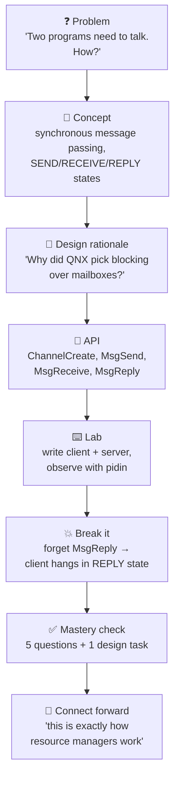
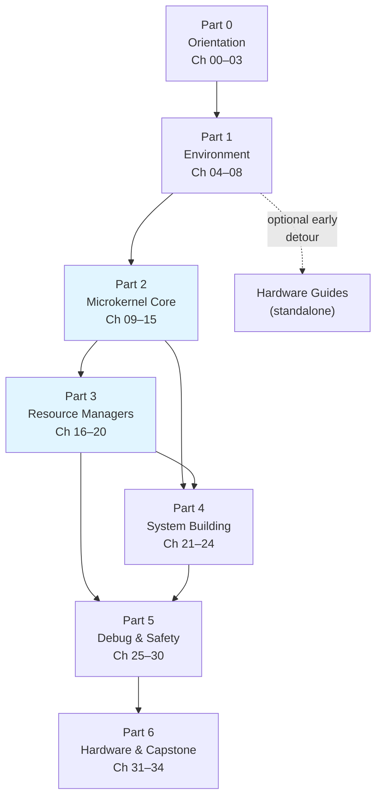
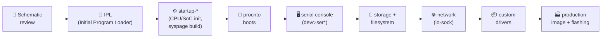
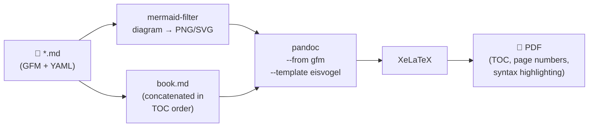
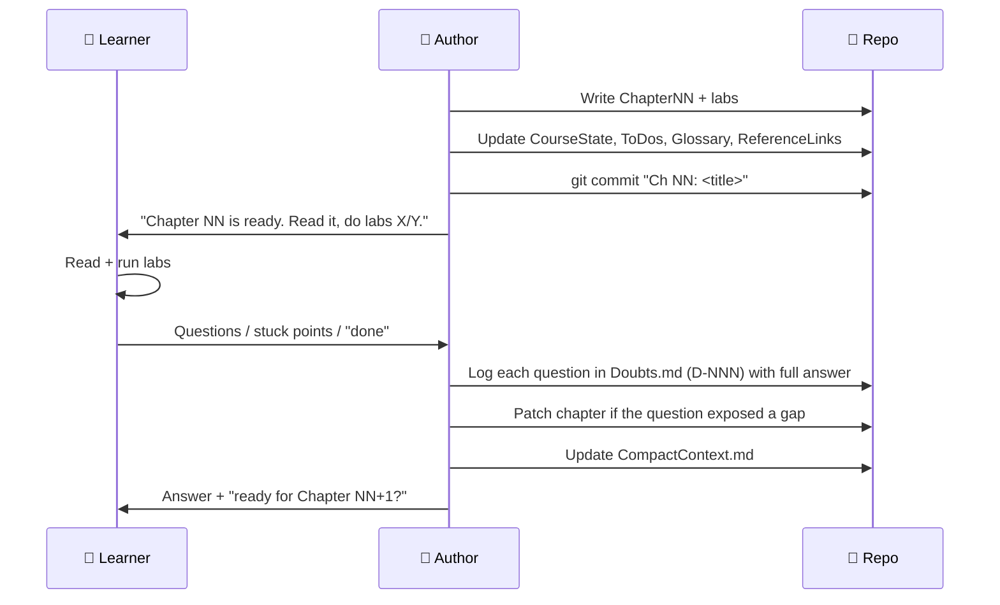

# 📐 PLAN.md — Master Course Plan

> **Purpose of this document**
> This is the *constitution* of the course. It defines what we are building, why, for whom, in what
> order, with what tools, and how we know we are done. Every other document derives from this one.
> If this document and any other document disagree, **this document wins** — and the other document
> gets fixed.

---

## Table of contents of this plan

1. [Learner profile & goals](#1-learner-profile--goals)
2. [Course philosophy](#2-course-philosophy)
3. [Learning paths](#3-learning-paths)
4. [Course architecture (6 parts, 34 chapters)](#4-course-architecture)
5. [Chapter anatomy — the standard template](#5-chapter-anatomy)
6. [Lab strategy](#6-lab-strategy)
7. [Toolchain & environment decisions](#7-toolchain--environment-decisions)
8. [Hardware track (separate from labs)](#8-hardware-track)
9. [Documentation system](#9-documentation-system)
10. [Formatting & style rules](#10-formatting--style-rules)
11. [PDF export strategy](#11-pdf-export-strategy)
12. [Workflow: how a chapter gets made](#12-workflow-how-a-chapter-gets-made)
13. [Question / doubt handling protocol](#13-question--doubt-handling-protocol)
14. [Assessment & mastery checks](#14-assessment--mastery-checks)
15. [Timeline & milestones](#15-timeline--milestones)
16. [Risks & mitigations](#16-risks--mitigations)
17. [Definition of done](#17-definition-of-done)

---

## 1. Learner profile & goals

### 1.1 Who this course is built for (primary learner)

| Attribute | Value |
|---|---|
| Role | Starting-level embedded engineer |
| Languages | **C / C++** — comfortable. **Python** — strong. |
| OS background | Assumed **minimal**. We teach OS concepts from first principles. |
| RTOS background | Assumed **zero**. |
| Hardware access | None required. Host PC only (x86_64 Linux / WSL2). |
| Host machine (verified) | Ubuntu 26.04 on WSL2, Intel i7-11850H (16 threads), 23 GB RAM, ~950 GB free, `/dev/kvm` present ✅ |

### 1.2 Goals — what you will be able to do at the end

By the end of this course you will be able to:

- ✅ **Explain** what a real-time operating system is, and precisely where QNX sits in the RTOS landscape.
- ✅ **Justify** to an architect/manager *why* a project should (or should not) use QNX.
- ✅ **Install** QNX SDP 8.0, obtain a legal licence, and build a bootable QNX VM from scratch.
- ✅ **Write, cross-compile, deploy and debug** C/C++ applications on a QNX target.
- ✅ **Use QNX's defining feature** — synchronous message passing — correctly and idiomatically.
- ✅ **Write a resource manager** (QNX's equivalent of a device driver) that appears in the filesystem.
- ✅ **Handle interrupts** and talk to memory-mapped hardware.
- ✅ **Build a custom boot image** (IFS) with `mkifs` and a build file.
- ✅ **Debug and profile** a live system with `pidin`, `gdb`, `slog2`, the System Analysis Toolkit.
- ✅ **Understand BSPs** well enough to port QNX to a new board.
- ✅ **Speak the language** of functional safety (ISO 26262 / IEC 61508) as it applies to QNX.
- ✅ **Complete a capstone project**: a small multi-process real-time system, end to end.

### 1.3 Explicit non-goals

- ❌ We do not teach C or C++ syntax. (Assumed.)
- ❌ We do not cover the *legacy* QNX 4 / QNX 6.x (Neutrino 6.5) product lines beyond historical context.
- ❌ We do not teach automotive middleware stacks (AUTOSAR Adaptive, SOME/IP) in depth — only where
  they touch QNX.
- ❌ We do not provide QNX software. You obtain it yourself, legally, via QNX Everywhere.

---

## 2. Course philosophy

Seven rules that govern every page written:

| # | Rule | What it means in practice |
|---|------|---------------------------|
| 1 | **From scratch, always** | Never assume a term. First use of any term → defined inline **and** added to `Glossary.md`. **This includes library functions**: any function a chapter or lab calls must be explained on first use — what it does, its arguments, its return value, and which header it lives in — or linked to where that explanation is. |
| 2 | **Why before how** | Every mechanism starts with the *problem it solves*, then the *design*, then the *API*. |
| 3 | **Compare to what you know** | Every QNX concept gets a "🐧 In Linux this would be…" box. Analogy is the fastest teacher. |
| 4 | **Nothing is a black box** | If we run a command, we explain every flag. If there is a magic number, we explain where it came from. |
| 5 | **Every concept has a lab** | Reading about message passing teaches nothing. You will write it, break it, and fix it. |
| 6 | **Fail on purpose** | Each chapter has a "💥 Break it" exercise — deliberately introduce the classic bug, observe the symptom, learn the diagnostic. |
| 7 | **Copy-pasteable** | Every install step is a literal, verified command block with expected output. No "install the usual dependencies". |

### 2.1 The pedagogical spine



---

## 3. Learning paths

Three parallel tracks through the same material. **The chapters are identical files** — paths are
implemented as *markers inside* each chapter, so you never have to read a different document.

> ⚠️ **Mandate (ADR-008).** Content for **all three paths is written in full for every chapter**,
> regardless of which path the current learner follows. A path that exists only as a marker is a
> broken promise to the next reader. Enforced by the [Definition of Done](#17-definition-of-done).

### 3.1 🐣 Path A — Absolute Beginner (no coding)

| | |
|---|---|
| **Target reader** | Product manager, student, QA engineer, technical writer, someone evaluating QNX, or a true beginner who wants understanding before code. |
| **Assumes** | Ability to read English and use a computer. Nothing else. |
| **Pace** | ~2 hours/week, ~4 months |
| **You will** | Read every conceptual section. Run **pre-built** binaries in the VM using copy-paste commands. Answer concept-check questions. Look at annotated code without writing it. |
| **You will skip** | Writing C code, Makefiles, build files, driver internals, BSP porting. |
| **End state** | You can hold an informed architectural conversation about QNX, read a QNX system diagram, and know what your engineers are talking about. |
| **Marker in text** | Sections tagged `🐣` and all untagged prose. Sections tagged `🚶+` or `🏃` may be skipped. |

### 3.2 🚶 Path B — Self-Learner (codes, no prior RTOS)

| | |
|---|---|
| **Target reader** | **You, by default.** Embedded engineer with C/C++, new to QNX and to RTOS internals. |
| **Assumes** | C fluency, basic Linux shell, ability to read a man page. |
| **Pace** | ~5 hours/week, ~6 months |
| **You will** | Everything. Read all theory, do all labs, do all "break it" exercises, do the capstone. |
| **You will skip** | Nothing. Optional "🔬 Deep dive" boxes are genuinely optional. |
| **End state** | Employable as a junior/mid QNX developer. Can write resource managers and debug a live system. |
| **Marker in text** | Everything except `🏃-only` shortcut boxes (which are just summaries of what you already read). |

### 3.3 🏃 Path C — Fast-Track Pro (professional, time-poor)

| | |
|---|---|
| **Target reader** | Experienced Linux kernel / RTOS / embedded engineer told "we're moving to QNX, ship in 6 weeks." |
| **Assumes** | Strong OS internals, POSIX, scheduling, drivers, build systems. |
| **Pace** | ~10–15 hours **total**, ~1 week |
| **You will** | Read only the `🏃 Fast-Track Summary` box at the top of each chapter (≈1 page, "here is the QNX delta vs. what you already know"), the cheat sheets, and do the 6 "core" labs marked `⭐ core`. |
| **You will skip** | All first-principles OS theory (Ch. 01, 09–11 background halves), all analogies. |
| **End state** | Productive on a QNX codebase in days. Knows where to look things up. |
| **Marker in text** | The `🏃 Fast-Track Summary` box, all code blocks, all cheat sheets, `⭐ core` labs. |

### 3.4 Path coverage matrix (by course part)

| Part | 🐣 A | 🚶 B | 🏃 C |
|------|:---:|:---:|:---:|
| Part 0 — Orientation & Why | Full | Full | Summary only |
| Part 1 — Environment setup | Full (VM only) | Full | Skim, install only |
| Part 2 — Microkernel core | Concepts only | Full + labs | Summaries + `⭐` labs |
| Part 3 — Resource managers & drivers | Concepts only | Full + labs | Summaries + `⭐` labs |
| Part 4 — System building & images | Concepts only | Full + labs | Full (this is where pros get stuck) |
| Part 5 — Debug, safety, production | Full concepts | Full + labs | Full |
| Part 6 — Hardware & career | Full | Full | Optional |

### 3.5 What every chapter owes each path

| Path | Guaranteed deliverable in every chapter | Where it lives |
|------|----------------------------------------|----------------|
| 🐣 **A** | A **no-coding activity**: run a pre-built binary, observe, answer questions. Plus 🐣 beginner notes wherever background is assumed. | `## 🧪 Labs → 🐣 Path A Activity`, binaries in `labs/labNN_*/prebuilt/` |
| 🚶 **B** | Full theory, skeleton-to-solution labs, a 💥 break-it exercise, mastery check. | Whole chapter |
| 🏃 **C** | A genuine **≤1-page Fast-Track Summary** — "here is the QNX delta vs. what you already know" — plus the chapter cheat sheet and `⭐ core` lab tagging. | `## 🏃 Fast-Track Summary` at the top |

> 💡 **Insight.** The Path C box is the hardest thing to write well. It must be a *complete* mental
> model for a professional, not a teaser for the full chapter. If a senior engineer could not do
> their job from it, it isn't finished.

---

## 4. Course architecture

**6 parts · 34 chapters · ~30 labs · 1 capstone**

### Part 0 — Orientation: What & Why (4 chapters)

| # | Chapter | Core question answered |
|---|---------|------------------------|
| 00 | How To Use This Course | How do I navigate, what do the symbols mean, how do labs work? |
| 01 | What Is a Real-Time System? | What does "real-time" actually mean? Hard vs. soft. Determinism. Latency. |
| 02 | What Is QNX? | History (1980→2026), the microkernel bet, product family, editions, versions. |
| 03 | Why & Where QNX Is Used | Cars, medical, rail, nuclear, robotics. Why not Linux? Competitive landscape. |

### Part 1 — Getting Your Environment (5 chapters + 4 setup guides)

| # | Chapter | Core question answered |
|---|---------|------------------------|
| 04 | QNX Licensing & QNX Everywhere | How do I legally get QNX for free? What am I allowed to do with it? |
| 05 | Installing QNX SDP 8.0 | QNX Software Center, install layout, `qnxsdp-env.sh`, licence files. |
| 06 | Your First QNX VM on QEMU | `mkqnximage`, disk images, networking, first boot. ⭐ |
| 07 | First Contact — The QNX Shell | Booting, `ksh`, filesystem layout, `pidin`, `ls /proc`, the pathname space. |
| 08 | The Toolchain: `qcc`, `q++`, and Deployment | Cross-compiling, target/CPU triples, `scp`, `qconn`, remote `gdb`. ⭐ |

### Part 2 — The Microkernel Core (7 chapters)

| # | Chapter | Core question answered |
|---|---------|------------------------|
| 09 | Microkernel Architecture & `procnto` | What's actually *in* the kernel? Why is a driver crash survivable? |
| 10 | Processes and Threads | Process model, address spaces, thread lifecycle, `pthread_*` on QNX. |
| 11 | Scheduling & Real-Time Priorities | 256 priorities, FIFO/RR/sporadic, priority inversion, `SchedSet`. |
| 12 | Synchronization Primitives | Mutex, condvar, semaphore, barrier, spinlock, priority inheritance. |
| 13 | Message Passing I — Send/Receive/Reply | **The heart of QNX.** Channels, connections, blocking states, `MsgSend`. ⭐ |
| 14 | Message Passing II — Pulses, Events, Timers | Asynchronous notification, `sigevent`, `MsgDeliverEvent`, timers, `ionotify`. ⭐ |
| 15 | Memory Management | Virtual memory, `mmap`, shared memory, typed memory, `mmap_device_memory`. |

### Part 3 — Resource Managers & Drivers (5 chapters)

| # | Chapter | Core question answered |
|---|---------|------------------------|
| 16 | The Pathname Space | Why is *everything* a path in QNX, and how does that beat `/dev` + ioctl? |
| 17 | Your First Resource Manager | Skeleton, `dispatch_*`, `resmgr_attach`, `iofunc_*` — a `/dev/hello`. ⭐ |
| 18 | Resource Manager Deep Dive | `io_read`, `io_write`, `io_devctl`, attributes, OCBs, multi-threaded resmgrs. |
| 19 | Interrupts & Hardware Access | `InterruptAttach` vs `InterruptAttachEvent`, ISR rules, PCI, MMIO. |
| 20 | Device Drivers & Filesystems | `devc-*`, `devb-*`, `io-usb`, QNX6 FS, ETFS, RAM disks, `fs-*`. |

### Part 4 — Building the System (4 chapters)

| # | Chapter | Core question answered |
|---|---------|------------------------|
| 21 | Boot Process & the IFS | IPL → startup → `procnto` → `/proc/boot`. `mkifs`, build-file syntax. ⭐ |
| 22 | Board Support Packages (BSPs) | What's in a BSP, how to build one, how to modify one. |
| 23 | Networking on QNX | `io-sock`/`io-pkt`, sockets, `ifconfig`, `qconn`, NFS, remote workflows. |
| 24 | PPS, Logging & Persistence | Persistent Publish/Subscribe, `slog2`, `slog2info`, data persistence patterns. |

### Part 5 — Debug, Performance, Safety, Production (6 chapters)

| # | Chapter | Core question answered |
|---|---------|------------------------|
| 25 | Debugging Toolbox | `gdb`, core dumps, `dumper`, `pidin` recipes, `hogs`, `showmem`. ⭐ |
| 26 | Tracing & Performance Analysis | System Analysis Toolkit, `tracelogger`, `traceprinter`, kernel event trace, latency measurement. |
| 27 | Adaptive Partitioning & High Availability | Budget-based CPU partitioning, HAM, watchdogs, restartable drivers. |
| 28 | Security on QNX | Process isolation, ASLR, RELRO, secure boot, QNX security policies, CVE handling. |
| 29 | Functional Safety | IEC 61508 SIL3, ISO 26262 ASIL D, freedom from interference, safety manuals, what certification buys you. |
| 30 | QNX Hypervisor | Type-1 hypervisor, guest OSes, virtio, mixed-criticality consolidation. |

### Part 6 — Real Hardware, Capstone & Beyond (4 chapters)

| # | Chapter | Core question answered |
|---|---------|------------------------|
| 31 | Running QNX on Real Hardware | Raspberry Pi 4/5, Intel x86 boards, NXP/TI/Qualcomm/Renesas SoCs. |
| 32 | Bringing Up a Custom Board | From schematic to `procnto` prompt: IPL, startup, minimal BSP, debugging a dead board. |
| 33 | Capstone Project — **three domain flavours** | Build a complete multi-process real-time system. One shared architecture and rubric, three interchangeable domain briefs: 🤖 robotics, 🚗 automotive, 🏥 medical/industrial. **You pick one; all three are documented.** |
| 34 | Ecosystem, Career & Next Steps | Open-source ports, QNX certifications, job market, community, what to learn next. |

### 4.0.1 The capstone, in three flavours (ADR-019)

The *QNX* content is identical in all three. Only the domain vocabulary and the safety story change.

| Track | Project | Real-time hook | Safety framing |
|-------|---------|----------------|----------------|
| 🤖 **33-R Robotics** | Motor-control loop + sensor fusion + telemetry link | 1 kHz control loop must not jitter | Emergency stop, safe torque off |
| 🚗 **33-A Automotive** | Sensor → control → actuator chain with CAN-style messaging and an instrument-cluster consumer | Bounded end-to-end latency from sensor to actuator | ISO 26262 framing, freedom from interference |
| 🏥 **33-M Medical / Industrial** | Dose/setpoint controller with alarm supervision and safe-state fallback | Alarm must be raised within a hard deadline | IEC 62304 / IEC 61508 framing, fail-safe design |

Shared across all three: a resource manager, synchronous message passing, deliberate priority
assignment, a custom IFS that boots into your application, and measured timing evidence.

> 💡 Worked examples throughout Parts 2–4 deliberately **rotate** between these three domains, so no
> reader feels the course is "not for my industry".

### 4.1 Dependency graph



**Critical path:** Ch 05 → 06 → 08 → 13 → 17 → 21. If you only ever do six chapters, do those.

---

## 5. Chapter anatomy

Every `ChapterNN_*.md` follows this **exact** template. Consistency is what makes a course feel
professional and makes PDF export predictable.

```markdown
---
YAML front matter: chapter, title, part, paths, est_time, prereqs, status, version
---

# Chapter NN — Title

> One-sentence promise: "By the end of this chapter you will ___."

## 🏃 Fast-Track Summary          ← Path C reads ONLY this (≤1 page)
## 🎯 Learning Objectives          ← checkbox list
## 🧭 Prerequisites                ← links to earlier chapters
## 🗺️ Mental model                 ← a diagram, always
---
## 1. The Problem                  ← why does this thing exist?
## 2. The Concept                  ← plain-English explanation, 🐣-friendly
   ### 🐧 Linux comparison box
   ### 📦 Analogy box
## 3. The Mechanism                ← how QNX actually does it
   ### 🔬 Deep dive (optional)
## 4. The API                      ← functions, signatures, parameters, return values
## 5. Worked Example               ← fully annotated code, line by line
---
## 🧪 Labs
   ### Lab NN.1 — <name>  [🚶🏃] [⭐ core]
   ### Lab NN.2 — <name>  [🚶]
   ### 💥 Break It — <name> [🚶]
   ### 🐣 Path A Activity — <observe-only version>
---
## ✅ Mastery Check                 ← 5 questions, answers collapsed
## 🧠 Concept Recap                 ← bullet summary
## 📎 Cheat Sheet                   ← table of every API/command introduced
## 🔗 Further Reading               ← links into ReferenceLinks.md
## ➡️ What's Next
## 📝 Chapter Changelog
```

### 5.1 Standard callout boxes

| Box | Rendered as | Meaning |
|-----|-------------|---------|
| 💡 **Insight** | blockquote | A key idea worth remembering |
| ⚠️ **Warning** | blockquote | Something that will bite you |
| 🐧 **In Linux** | blockquote | Analogy to Linux/POSIX |
| 🔬 **Deep dive** | collapsed `<details>` | Optional depth, safe to skip |
| 🏃 **Fast-track** | bordered table | Path C shortcut |
| 🐣 **Beginner note** | blockquote | Extra hand-holding |
| 💥 **Break it** | fenced section | Deliberate-failure exercise |
| 📖 **Term** | inline bold + glossary link | First use of a defined term |

---

## 6. Lab strategy

### 6.1 Principles

1. **Every lab runs in the QEMU VM.** No hardware needed, ever, for the core course.
2. **Every lab is idempotent.** You can re-run it from a clean VM.
3. **Every lab has a verification step** — an exact command and its exact expected output.
4. **Every lab is version-controlled** in `labs/labNN_name/` with a `Makefile` and `README.md`.
5. **Every lab has three variants**, where applicable:
   - 🐣 *observe*: run a pre-built binary, read the output, answer questions.
   - 🚶 *build*: write the code from a skeleton with `TODO` markers.
   - 🏃 *reference*: the complete solution, read it and move on.

### 6.2 Lab directory template

```text
labs/lab13_message_passing/
├── README.md          # objective, steps, expected output, troubleshooting
├── Makefile           # QNX recursive Makefile (common.mk / x86_64/…)
├── skeleton/          # 🚶 your starting point, with TODOs
│   ├── server.c
│   └── client.c
├── solution/          # 🏃 complete, working reference
│   ├── server.c
│   └── client.c
├── prebuilt/          # 🐣 binaries, so Path A can just run them
└── expected_output.txt
```

### 6.3 The `⭐ core` labs (Path C minimum set)

| Lab | Chapter | Why it's core |
|-----|---------|---------------|
| ⭐ L06 | Ch 06 | Build & boot the VM — nothing works without it |
| ⭐ L08 | Ch 08 | Cross-compile + deploy + remote-debug loop |
| ⭐ L13 | Ch 13 | Send/Receive/Reply — the single most QNX-specific skill |
| ⭐ L17 | Ch 17 | Write a resource manager |
| ⭐ L21 | Ch 21 | Build a custom IFS boot image |
| ⭐ L25 | Ch 25 | Diagnose a hung/blocked system with `pidin` |

---

## 7. Toolchain & environment decisions

> Rationale for each of these is recorded in [`Decisions.md`](meta/Decisions.md) and
> [`DecisionsLog.md`](meta/DecisionsLog.md).

| Area | Decision | Short reason |
|------|----------|--------------|
| QNX version | **QNX SDP 8.0** (QNX OS 8.0) | Current generation; free via QNX Everywhere; what new projects use. QNX 7.1 noted where relevant. |
| Licence | **QNX Everywhere** (free, non-commercial) | Zero cost, legal, covers learning + hobby projects. |
| Host OS | **Ubuntu 26.04 on WSL2** (your machine) | Already installed and verified; KVM available. |
| Virtualization | **QEMU + KVM** | Free, scriptable, near-native speed. |
| VM image (stage 1) | **QSTI** — QNX's official pre-built *Quick Start Target Image* for QEMU | Officially documented for exactly our scenario, includes sample apps, and has its own troubleshooting page. Shortest path to a `qnx#` prompt. |
| VM image (stage 2) | **CTI** — *Custom Target Image*, then raw **`mkifs`** | You don't know QNX until you've built the image yourself. Taught in Chapter 21. |
| Target arch | **`x86_64`** for all labs | Uses KVM → fast. `aarch64le` covered in the hardware track. |
| Editor / IDE | **VS Code + QNX Toolkit** primary; **Momentics IDE** documented as alternative | You already live in VS Code. Momentics is Eclipse-based and heavier. |
| Build system | **QNX recursive Makefiles** (`common.mk`) primary; plain `qcc` command lines shown first | Teaches what's really happening before hiding it. CMake shown in Ch 08 appendix. |
| Version control | **Git + GitHub** (`Tyrostir/qnx-zero-to-hero`) | Progress is committed per chapter; you can diff and roll back. |
| Diagrams | **Mermaid** in Markdown | Renders on GitHub, text-diffable, exports to PDF via `mermaid-filter`. |
| PDF | **Pandoc + XeLaTeX (Eisvogel template)** | Best Markdown→PDF quality, handles emoji + code highlighting. |

### 7.1 What gets installed on your host (full list, in order)

| # | Component | Size (approx) | Installed in |
|---|-----------|---------------|--------------|
| 1 | Build essentials, `qemu-system-x86`, `bridge-utils` | ~500 MB | Setup Guide 01 |
| 2 | myQNX account + QNX Everywhere licence | — | Setup Guide 02 |
| 3 | QNX Software Center | ~300 MB | Setup Guide 02 |
| 4 | QNX SDP 8.0 (host tools + target images) | **~43 GB** ⚠️ *(measured; QNX's own figure of 8–12 GB is optimistic)* | Setup Guide 02 |
| 5 | QSTI — QNX Quick Start Target Image for QEMU | ~2–4 GB | Setup Guide 03 |
| 6 | VS Code QNX Toolkit extension | ~50 MB | Setup Guide 04 |
| 7 | Pandoc + TeX Live + Node/mermaid-cli (PDF only) | ~2–4 GB | PDF_Export.md |

**Total disk budget: ~50 GB** — revised upward from ~25 GB after measuring a real install
(Setup Guide 02 §12.1). A full SDP pulls both `x86_64` and `aarch64le` targets plus debug symbols
for everything. ✅ Verified against the host: 951 GB free before, 908 GB after.

---

## 8. Hardware track

Deliberately kept **outside** the main course so the core path stays free and frictionless.

### 8.1 `Hardware_01_Public_Boards.md` — commercially available hardware

Covers, in order of accessibility:

| Board | Arch | QNX support | Cost | Notes |
|-------|------|-------------|------|-------|
| **Raspberry Pi 4 / 5** | aarch64 | Official free **QNX Quick Start Image** | ₹5k–9k | ⭐ Recommended first hardware |
| Generic x86_64 PC / Intel NUC | x86_64 | Generic x86_64 BSP | varies | Boot QNX from USB on a spare laptop |
| NXP i.MX 8 / S32G eval kits | aarch64 | Official BSP | $$$ | Automotive standard |
| TI J721E / AM62 | aarch64 | Official BSP | $$$ | ADAS / industrial |
| Qualcomm Snapdragon (SA8xxx) | aarch64 | Official BSP | $$$$ | Automotive cockpit |
| Renesas R-Car | aarch64 | Official BSP | $$$$ | Automotive |

Content: where to buy, exact image flashing steps, serial console wiring, network setup,
first-boot checklist, and how to run the course labs on it.

### 8.2 `Hardware_02_Custom_Board.md` — your own PCB

Covers the full bring-up chain:



Content: BSP anatomy, `startup` customization, syspage, memory map, `mkifs` build files for a real
board, JTAG debugging of `startup`, common bring-up failures and their signatures, and the
licensing/commercial implications (you cannot ship a product on a non-commercial licence).

---

## 9. Documentation system

### 9.1 Living documents (`docs/meta/`) — updated continuously

| File | Purpose | Update trigger | Format |
|------|---------|----------------|--------|
| **`CourseState.md`** | Single source of truth for *where we are*. Chapter status table, current position, next action, session log. | End of every session / chapter | Tables + log |
| **`Decisions.md`** | The **current, active** set of decisions (the "what"). Superseded entries are removed here. | When a decision is made or changed | ADR-style table |
| **`DecisionsLog.md`** | **Append-only** chronological history (the "why & when"). Nothing is ever deleted. Includes superseded decisions. | Same time as `Decisions.md` | Dated entries |
| **`CompactContext.md`** | A ≤1-page compressed summary of everything: learner profile, environment, decisions, progress. Used to re-prime a fresh session in one read. | End of every session | Dense bullets |
| **`ToDos.md`** | Open work items with owner (you / me), priority, status. | Continuously | Kanban-ish tables |
| **`Doubts.md`** | Every question you ask, with a full answer, an ID, a date, and links to relevant chapters. | Every time you ask something | `D-NNN` entries |

### 9.2 Reference documents (`docs/reference/`)

| File | Purpose |
|------|---------|
| `ReferenceLinks.md` | Every external URL used, categorized, with a note on what it's good for and when it was verified. |
| `ResourcesMeta.md` | Curated *meta-review* of learning resources: official docs, books, video courses, forums, GitHub repos — each rated for quality, depth, cost, and which path (A/B/C) should use it. |
| `Glossary.md` | A–Z of every QNX term, with the chapter where it's introduced. |
| `cheatsheets/` | One-page printable references: `pidin`, `qcc` flags, message-passing states, build-file syntax, `slog2`. |

### 9.3 Naming conventions

| Kind | Pattern | Example |
|------|---------|---------|
| Chapter | `ChapterNN_PascalCaseTitle.md` | `Chapter13_MessagePassingI.md` |
| Setup guide | `Setup_NN_Topic.md` | `Setup_03_QEMU_VM.md` |
| Hardware guide | `Hardware_NN_Topic.md` | `Hardware_01_Public_Boards.md` |
| Lab folder | `labs/labNN_snake_case/` | `labs/lab13_message_passing/` |
| Cheat sheet | `cheatsheets/CS_Topic.md` | `cheatsheets/CS_pidin.md` |
| Decision ID | `ADR-NNN` | `ADR-004` |
| Doubt ID | `D-NNN` | `D-012` |
| ToDo ID | `T-NNN` | `T-007` |

### 9.4 Note on `TableOfContext.md`

You wrote `TableOfContext.md`; the intended artefact is a **Table of Contents**. The file is named
[`TableOfContents.md`](TableOfContents.md) and a stub `TableOfContext.md` redirects to it, so either
name works. Recorded as **ADR-012**.

---

## 10. Formatting & style rules

Applies to *every* `.md` file in this repository.

### 10.1 Structure rules

- ✅ **YAML front matter** on every document (title, id, version, status, dates). Pandoc uses it.
- ✅ **Exactly one `# H1`** per document, matching the front-matter title.
- ✅ Heading levels never skip (`##` → `###`, never `##` → `####`).
- ✅ Every document ≥ 2 screens long begins with its own mini table of contents.
- ✅ Every document ends with a **Changelog** table.

### 10.2 Content rules

- ✅ Every code block is **fenced and language-tagged** (` ```c `, ` ```bash `, ` ```mermaid `).
- ✅ Shell blocks distinguish host from target with a prompt prefix:
  - `host$` — your Ubuntu/WSL2 shell
  - `qnx#` — the QNX target shell (root)
  - `#` alone is never used (ambiguous with comments)
- ✅ Expected output is always shown, in a separate block labelled `Expected output:`.
- ✅ Tables have a header row and aligned pipes.
- ✅ Links are **relative** within the repo (PDF + GitHub both work).
- ✅ External links go into `ReferenceLinks.md` **and** are cited inline as `[text][ref-id]` where practical.
- ✅ Emoji used **semantically only** (per the box table in §5.1), never decoratively.
- ✅ Line length soft-wrapped at ~100 chars in source (better git diffs).

### 10.3 Accessibility / PDF safety

- ❌ No raw HTML except `<details>`/`<summary>` (Pandoc-safe) and centered `<div align="center">` in README.
- ❌ No GitHub-only alert syntax (`> [!NOTE]`) — it breaks Pandoc. Use `> 💡 **Insight**` instead.
- ❌ No images without alt text.
- ✅ Mermaid diagrams always accompanied by a one-line text description (for PDF fallback + screen readers).

---

## 11. PDF export strategy

**Goal:** `./tools/build-pdf.sh` produces both per-chapter PDFs and a single bound book.

### 11.1 Pipeline



### 11.2 Outputs

| Output | Path |
|--------|------|
| Per-chapter PDFs | `build/pdf/Chapter01_*.pdf`, … |
| Complete book (with cover, TOC, page numbers) | `build/pdf/QNX-Zero-to-Hero.pdf` |
| Path-specific books (A / B / C, filtered) | `build/pdf/QNX-Zero-to-Hero-PathA.pdf`, … *(stretch goal)* |

### 11.3 Why the constraints in §10.3 exist

They exist *entirely* so PDF export never breaks. Writing GitHub-only syntax now means rewriting
34 chapters later. Full detail: [`docs/guides/PDF_Export.md`](guides/PDF_Export.md).

---

## 12. Workflow: how a chapter gets made



**One chapter = one git commit** (plus follow-up commits for doubts/fixes). Commit message format:

```
Ch13: Message Passing I — Send/Receive/Reply

- chapter text + 3 labs + break-it exercise
- glossary: +7 terms
- refs: +4 links
```

---

## 13. Question / doubt handling protocol

> **Rule: no question is ever answered only in chat.** Every question becomes a permanent artefact.

When you ask anything — at any time, about anything, even mid-chapter — the following happens:

1. The question is assigned the next ID: `D-001`, `D-002`, …
2. An entry is appended to [`docs/meta/Doubts.md`](meta/Doubts.md) containing:
   - **ID**, **date**, **asked during** (which chapter/context)
   - **Question** (verbatim, as you asked it)
   - **Short answer** (2–3 sentences, for skimming)
   - **Full answer** (as deep as needed, with code/diagrams)
   - **Related chapters / links**
   - **Status**: `Answered` / `Needs verification` / `Open`
3. If the question revealed a **gap in a chapter**, the chapter is edited and its changelog updated.
4. If the question revealed a **decision that was never recorded**, an ADR is added.
5. `Doubts.md` maintains an index table at the top, grouped by topic, so it becomes a searchable FAQ.

Categories used in the index: `Concept` · `Setup/Install` · `Toolchain` · `Kernel/IPC` · `Drivers` ·
`Build/Image` · `Debug` · `Hardware` · `Licensing` · `Career` · `Course logistics`.

---

## 14. Assessment & mastery checks

| Level | Mechanism | Where |
|-------|-----------|-------|
| Per-section | 🐣 "Check your understanding" — 1 question | Inline |
| Per-chapter | ✅ **Mastery Check** — 5 questions (2 recall, 2 apply, 1 design) with collapsed answers | End of chapter |
| Per-part | 🏁 **Part Review** — a mini-project combining the part's chapters | End of each part |
| Course | 🎓 **Capstone** (Ch 33) — full system in your chosen domain flavour, graded against a shared rubric | Ch 33 |

**Capstone rubric preview** (details in Ch 33, applies identically to all three flavours):
correctness · real-time behaviour with measured evidence · use of QNX idioms (resmgr + message
passing, not sockets-everywhere) · error handling and fault recovery · custom IFS builds and boots ·
documentation.

---

## 15. Timeline & milestones

Estimated for **🚶 Path B at ~5 h/week**. Adjust freely — the course is self-paced and
`CourseState.md` tracks reality, not the plan.

| Milestone | Chapters | Est. effort | You can then… |
|-----------|----------|-------------|---------------|
| **M0 — Plan approved** | — | — | Start |
| **M1 — "I get it"** | 00–03 | ~1 week | Explain QNX to your team |
| **M2 — "It boots"** 🎉 | 04–08 + Setup 01–04 | ~2 weeks | Run and debug code on QNX |
| **M3 — "I speak QNX"** | 09–15 | ~5 weeks | Write correct multi-threaded, message-passing apps |
| **M4 — "I can extend the OS"** | 16–20 | ~4 weeks | Write resource managers and touch hardware |
| **M5 — "I own the image"** | 21–24 | ~3 weeks | Build and boot a custom system image |
| **M6 — "I can ship it"** | 25–30 | ~4 weeks | Debug, profile, and reason about safety/security |
| **M7 — "Hero"** 🏆 | 31–34 | ~4 weeks | Bring up hardware + complete the capstone |

**Total ≈ 23 weeks (~6 months) at 5 h/week.**
🏃 Path C compresses to **~1 week**. 🐣 Path A ≈ **~4 months at 2 h/week**.

---

## 16. Risks & mitigations

| # | Risk | Likelihood | Impact | Mitigation |
|---|------|-----------|--------|------------|
| R1 | QNX Everywhere licence registration is delayed or rejected | Medium | **Blocking** | Setup Guide 02 has a troubleshooting section + the `myqnx@blackberry.com` escalation path. Chapters 00–03 need no software, so you can start immediately while waiting. |
| R2 | QNX Software Center / SDP install fails on WSL2 (GUI, Java, or `qnxsoftwarecenter` quirks) | Medium | High | Setup Guide 02 documents WSLg GUI, headless/CLI install (`qnxsoftwarecenter_clt`), and a native-Linux/VM fallback. |
| R3 | KVM unavailable or nested-virt disabled | Low (verified present ✅) | High | Fallback to QEMU TCG (slower but works); documented in Setup Guide 03. |
| R4 | QNX docs/URLs move (BlackBerry rebranded to `qnx.software` in 2025) | High | Medium | `ReferenceLinks.md` records a "verified on" date per link; links re-checked each part. |
| R5 | Version drift (SDP 8.0 patch releases change behaviour) | Medium | Low | Every chapter records the exact SDP build it was written against, in front matter. |
| R6 | Course stalls / long gaps between sessions | Medium | Medium | `CompactContext.md` + `CourseState.md` let any session resume instantly with zero re-explanation. |
| R7 | Scope creep (34 chapters is a lot) | Medium | Medium | Strict chapter template; `⭐ core` subset defined; parts are independently valuable. |
| R8 | Learner accidentally uses the non-commercial licence for commercial work | Low | **Legal** | Explicit, repeated licensing warnings in Ch 04 and Hardware_02. |
| R9 | **Host OS is newer than QNX documents.** QNX documents QSTI-for-QEMU on Ubuntu 22.04/24.04; the learner runs **Ubuntu 26.04**. Package names and library versions may differ. | Medium | Medium | Setup Guide 01 maps QNX's documented package lists onto Ubuntu 26.04 names and verifies each. Any divergence is recorded in Setup Guide 05 and reported upstream via Discord. |
| R10 | Authoring all three paths in full (ADR-008) inflates per-chapter effort ~20–30 % | High | Low | Accepted deliberately. Mitigated by the strict chapter template and by reusing lab code across path variants (same binary serves 🐣 `prebuilt/` and 🏃 `solution/`). |

---

## 17. Definition of done

The course is **done** when every box below is ticked.

### Per chapter
- [ ] Follows the §5 template exactly
- [ ] **🏃 Fast-Track Summary is a genuine standalone ≤1-page brief** — a professional could work from it alone
- [ ] **🐣 Path A activity present**, with a pre-built binary in `labs/labNN_*/prebuilt/` where the chapter has a lab
- [ ] **🚶 Path B full labs present** (skeleton + solution + expected output)
- [ ] ≥1 Mermaid diagram, each followed by a one-line text description
- [ ] ≥1 lab with verified expected output (run on the actual VM)
- [ ] ≥1 "💥 Break it" exercise
- [ ] ≥1 🐧 "In Linux this would be…" comparison box
- [ ] Mastery check with 5 questions + collapsed answers
- [ ] Cheat-sheet table
- [ ] **Every library function the chapter or its labs call is explained on first use** (purpose, arguments, return value, header) or linked to where it is
- [ ] New terms added to `Glossary.md`
- [ ] New links added to `ReferenceLinks.md` with verification date
- [ ] Exports to PDF without errors
- [ ] Committed and pushed

### Whole course
- [ ] 34 chapters complete
- [ ] 4 setup guides + 2 hardware guides complete
- [ ] All labs run clean on a fresh VM
- [ ] **All three capstone flavours documented** with reference solutions (ADR-019)
- [ ] `build-pdf.sh` produces the complete book
- [ ] Capstone completed by the learner
- [ ] `Doubts.md` has zero `Open` entries

---

## 📝 Changelog

| Version | Date | Change | Author |
|---------|------|--------|--------|
| 1.3 | 2026-08-26 | Rule 1 (§2) extended to library functions, and a matching checkbox added to the per-chapter Definition of Done (§17). Prompted by [D-014](meta/Doubts.md#d-014): Chapter 01's lab used four library functions without explaining any of them — a rule-#4 violation the rules did not catch because they spoke only of *terms*. |
| 1.2 | 2026-08-26 | Disk budget corrected from ~25 GB to ~50 GB after measuring a real SDP install (§7.1). |
| 1.1 | 2026-08-25 | **Approved by the learner.** Amendments: all three paths authored in full (§3, §17); capstone ships in three domain flavours (§4.0.1); VM strategy revised to QSTI → CTI → `mkifs` (§7); risks R9 (host newer than documented) and R10 (three-path authoring cost) added. | AI Author |
| 1.0 | 2026-08-25 | Initial complete plan drafted; 6 parts / 34 chapters / 3 paths defined. | AI Author |

---

## ✅ Approval

> **Status: ✅ Approved by the learner on 2026-08-25.**
>
> Approved *as-is*, with two amendments requested and incorporated:
> 1. **All three learning paths must be authored in full** — not just the learner's Path B — so that
>    future readers can enter by whichever path suits them. → ADR-008 strengthened, §3.5 added.
> 2. **All three capstone flavours must be present** — robotics, automotive and medical/industrial —
>    with the reader choosing. → ADR-019, §4.0.1 added.
>
> Delivery mode: **one chapter per turn, auto-committed and pushed** (ADR-020).
> Learner's path: **🚶 Path B** (ADR-018).
>
> This plan may still be amended at any time. Amendments are recorded here and in
> [`meta/DecisionsLog.md`](meta/DecisionsLog.md).
