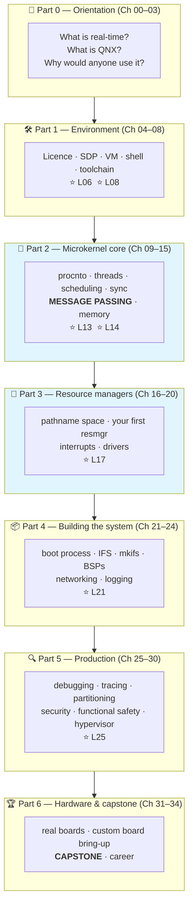
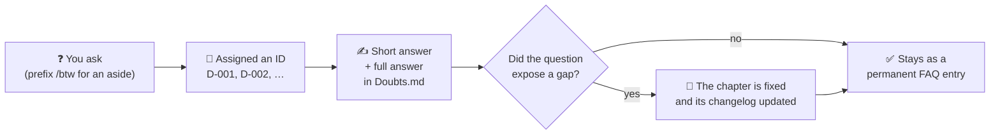

# Chapter 00 — How To Use This Course

> **By the end of this chapter you will** know exactly how to read every remaining chapter: which
> path is yours, what every symbol means, how the labs work, and what to do when something breaks.

---

## 🏃 Fast-Track Summary

> **🏃 Path C reads only this box.** It is a complete brief — you can work from it alone.

**What this is.** A 34-chapter QNX course. Chapters live in `docs/chapters/`, labs in `labs/`,
everything is Markdown and exports to PDF.

**The six chapters that matter if you read nothing else** — the critical path:

```text
Ch 05 (install) → 06 (boot a VM) → 08 (cross-compile + remote debug)
    → 13 (message passing) → 17 (resource manager) → 21 (build your own boot image)
```

**Six `⭐ core` labs**, one per critical-path chapter: **L06** boot · **L08** deploy/debug loop ·
**L13** send/receive/reply · **L17** first resource manager · **L21** custom IFS · **L25** diagnose a
hung system with `pidin`.

**Reading protocol for you.** Each chapter opens with a `🏃 Fast-Track Summary` box exactly like this
one — *"here is the QNX delta versus what you already know"*. Read it, read the code blocks, read the
`📎 Cheat Sheet` at the end. Skip everything between. Do the `⭐ core` labs. Total ≈ 10–15 hours.

**Conventions you must not misread:**

| Symbol | Meaning |
|--------|---------|
| `host$` | Command runs on **your Linux host** |
| `qnx#` / `qnx$` | Command runs **inside the QNX target** (root / unprivileged) |
| ⭐ | Core lab — do it even on the fast track |
| 💥 | *Break it* exercise — deliberately induce the classic bug |
| 🐧 | "In Linux this would be…" comparison |
| 🔬 | Optional deep dive — safe to skip |

**Target credentials** (QSTI QEMU image): console `root`/`root`; **SSH `qnxuser`/`qnxuser`** — root
is refused over SSH (`PermitRootLogin no`). Launch with `mkqnximage --run` from
`~/qnx800/images/qemu/qemu`; stop with `Ctrl+A` then `X`.

**The one QNX idea that is not optional.** Everything specific to QNX descends from **synchronous
message passing** — `MsgSend` blocks the client until the server calls `MsgReply`. Resource managers,
drivers, `pidin`'s blocking states and priority inheritance are all consequences of that one design
decision. If you are short on time, Chapter 13 is the chapter.

**When something breaks:** every question you ask becomes a permanent numbered entry in
[`Doubts.md`](../meta/Doubts.md) with a full answer. Thirteen are already answered, several of them
setup traps you would otherwise hit yourself.

---

## 🎯 Learning Objectives

By the end of this chapter you will be able to:

- [ ] **Choose** the learning path that fits your background and time budget — and switch later without losing anything.
- [ ] **Read** any chapter's structure at a glance and know which parts apply to you.
- [ ] **Interpret** every symbol, callout box and shell prompt this course uses.
- [ ] **Run** a lab: find the skeleton, build it, deploy it, verify the expected output.
- [ ] **Diagnose** a failure the way this course teaches — read the error, form a hypothesis, check it.
- [ ] **Ask** a question in a way that makes it part of the course permanently.
- [ ] **Resume** after a break of any length, without re-reading anything you have already done.

---

## 🧭 Prerequisites

**None to read this chapter.**

To *do* its labs you need a working QNX VM, which is
[Setup Guides 01–03](../guides/README.md). If you have not done those yet, read this chapter anyway —
it will make the setup guides make more sense — then come back for the labs.

| You have… | Then… |
|-----------|-------|
| Nothing installed | Read this chapter, then [Setup Guide 01](../guides/Setup_01_Prerequisites.md) |
| SDP installed, no VM | Read this chapter, then [Setup Guide 03](../guides/Setup_03_QEMU_VM.md) |
| A booting VM ✅ | Read this chapter and do all its labs |

---

## 🗺️ Mental model



*Diagram: the course runs in seven blocks, from orientation through the microkernel core and resource
managers to system building, production concerns, and finally real hardware and the capstone; the two
shaded blocks are where QNX stops resembling Linux.*

> 💡 **Where the course actually turns.** Parts 0 and 1 are setup and context — useful, but you could
> get most of it from a good article. **Part 2 is where QNX stops being "Unix with better timing"**
> and starts being a different design. Everything after it builds on Chapter 13.

---

## 1. The Problem

You have a working QNX VM and 34 chapters ahead of you. Three things can go wrong before you learn
anything.

**You read the wrong material.** A course written for beginners bores an experienced engineer into
abandoning it; a course written for professionals loses a beginner in chapter two. Most courses pick
one audience and lose the other.

**You lose your place.** Self-paced learning means gaps — a week, a month. Coming back to "chapter
14 of 34" with no memory of chapters 1–13 is where most self-study dies.

**You get stuck and stay stuck.** An unexplained error at 11 p.m. with nobody to ask ends more
learning attempts than any concept ever has.

This chapter is the answer to all three: **paths** so you read only what suits you, **state tracking**
so you never lose your place, and a **doubt protocol** so no question is ever answered once and then
lost.

> 💡 **This is not throat-clearing.** Setup Guides 01–03 contained eight documented bugs before they
> were run on a real machine. You will hit things this course did not predict. The protocol in §3.5
> is how those become permanent answers instead of wasted evenings.

---

## 2. The Concept — three paths, one file

Three readers want three different books. This course ships all three **inside the same chapters**,
marked with symbols, rather than as three separate documents that drift apart.

### 2.1 Which one is yours?

| | 🐣 **Path A — Absolute Beginner** | 🚶 **Path B — Self-Learner** | 🏃 **Path C — Fast-Track Pro** |
|---|---|---|---|
| **You are** | A manager, student, tester or writer who needs to *understand* QNX | An embedded engineer with C/C++, new to RTOS internals | A senior engineer told "we ship on QNX in six weeks" |
| **You know** | How to use a computer | C, the shell, how to read a man page | Linux internals, POSIX, scheduling, drivers |
| **Pace** | ~2 h/week, ~4 months | ~5 h/week, ~6 months | ~10–15 h **total**, ~1 week |
| **You write** | No code. You run **pre-built** binaries and read annotated source | Everything | Only the `⭐ core` labs |
| **You end up** | Able to hold an informed architectural conversation about QNX | Employable as a junior/mid QNX developer | Productive on a QNX codebase in days |

> 💡 **Choose by *time available*, not by ego.** A senior engineer with six months should walk Path B
> — it is a better education. A capable engineer with one week should take Path C even if they would
> enjoy the long road. The wrong choice is picking B and then doing 20 % of it.

> 🐣 **Beginner note.** Path A is not a lesser version. It skips the *typing*, not the
> *understanding*. You will read the same explanations and run the same programs — you just will not
> write them. Plenty of people who make excellent QNX decisions never write a resource manager.

### 2.2 Switching paths

Free, any time, no bookkeeping. The chapters are the same files. Switching means reading more or
fewer sections of a chapter you are already in.

A common and sensible pattern: **Path C through Part 1** to get running fast, then **Path B from
Chapter 09** once the interesting material starts.

### 🐧 In Linux this would be…

If you have learned Linux, the closest analogue to this course's structure is *The Linux Programming
Interface* — but with two differences that matter.

| | TLPI | This course |
|---|---|---|
| Assumes | You already run Linux | Nothing. Setup Guides 01–03 build your environment from zero |
| Verification | You trust the book | **Every command here has been executed on a real machine**, and its actual output pasted in |

That second point is a promise with a mechanism behind it, and it is worth knowing about before you
trust a single command in this course. See §3.6.

### 📦 Analogy

Think of the three paths as **three tours of the same factory**.

- 🐣 **Path A** rides the visitor trolley. Every machine is pointed out and explained. You do not
  touch anything.
- 🚶 **Path B** is the apprenticeship. You stop at each machine, learn what it does, run it, and
  deliberately jam it once so you know what a jam looks like.
- 🏃 **Path C** is the visiting engineer from the sister plant. You already know what a lathe is —
  you need to know where *this* factory keeps its lathes and which one has the unusual chuck.

Same factory. Same machines. Different questions.

---

## 3. The Mechanism — how a chapter is built

Every chapter from 01 to 34 has the same skeleton. Once you know it, you can navigate any chapter in
five seconds.

### 3.1 The chapter skeleton

```text
Chapter NN — Title
  One-sentence promise ......... what you will be able to do afterwards
  🏃 Fast-Track Summary ........ 🏃 READ ONLY THIS  (≤1 page, standalone)
  🎯 Learning Objectives ....... checkboxes
  🧭 Prerequisites ............. what to read first
  🗺️ Mental model .............. a diagram, always
  ─────────────────────────────────────────────────
  1. The Problem ............... why does this thing exist?
  2. The Concept ............... plain English   🐣 starts here
     🐧 In Linux this would be…
     📦 Analogy
  3. The Mechanism ............. how QNX actually does it
     🔬 Deep dive .............. optional, safe to skip
  4. The API ................... signatures, parameters, return values
  5. Worked Example ............ annotated code, line by line
  ─────────────────────────────────────────────────
  🧪 Labs
     Lab NN.1 ⭐ ............... core — everyone who codes does this
     Lab NN.2 .................. 🚶 depth
     💥 Break It ............... deliberately induce the classic bug
     🐣 Path A Activity ........ run a pre-built binary, observe, answer
  ─────────────────────────────────────────────────
  ✅ Mastery Check ............. 5 questions, answers collapsed
  🧠 Concept Recap ............. bullets
  📎 Cheat Sheet ............... every command/API introduced
  🔗 Further Reading
  ➡️ What's Next
```

> 💡 **The order is deliberate: problem → concept → mechanism → API → code.** You will never meet a
> function before you have met the problem it solves. If a chapter ever shows you an API you cannot
> motivate, that is a bug in the chapter — report it.

### 3.2 Callout boxes

| Box | Meaning | Skippable? |
|-----|---------|-----------|
| 💡 **Insight** | A key idea worth remembering | No |
| ⚠️ **Warning** | Something that will bite you | **No** |
| 🐧 **In Linux** | The analogy to Linux/POSIX | Only if you do not know Linux |
| 📦 **Analogy** | A non-technical comparison | 🏃 yes |
| 🔬 **Deep dive** | Optional depth, collapsed | Yes, genuinely |
| 🐣 **Beginner note** | Extra hand-holding | 🚶🏃 yes |
| 💥 **Break it** | A deliberate-failure exercise | 🐣 yes |
| 🏃 **Fast-track** | The Path C shortcut | 🐣🚶 no — you are reading the long version |

### 3.3 Shell prompts — read these carefully

**The single most common way to waste an hour in this course is running the right command on the
wrong machine.**

| Prompt | Machine | You are |
|--------|---------|---------|
| `host$` | Your Linux host — Ubuntu 26.04 / WSL2 | Yourself |
| `qnx#` | The QNX target, via the serial console | `root` |
| `qnx$` | The QNX target, via SSH | `qnxuser` |

```bash
host$ qcc -Vgcc_ntox86_64 -o hello hello.c    # compiles ON LINUX, for QNX
```

```bash
qnx#  ./hello                                  # runs ON QNX
```

> ⚠️ **A bare `#` prompt is never used in this course.** In shell scripts `#` starts a comment, so a
> line beginning `#` is genuinely ambiguous. Every command block here names its machine.

> 🐧 **In Linux this would be…** the same `$`/`#` convention for user versus root. QNX adds a second
> *machine* to the confusion, which is why the prompt carries the machine name too.

### 3.4 Path markers inside a chapter

Sections are tagged with the paths they belong to:

```text
### Lab 13.1 — Client and server  [🚶🏃] [⭐ core]
```

**Untagged prose belongs to everyone.** A tag *adds* an audience restriction; it never removes one.

| If you are… | Read |
|-------------|------|
| 🐣 Path A | All untagged prose, everything tagged 🐣, and the 🐣 Path A Activity. Skip the API sections and the coding labs. |
| 🚶 Path B | Everything except the `🏃 Fast-Track Summary` — which is only a compressed version of what you are about to read properly. |
| 🏃 Path C | The `🏃 Fast-Track Summary`, every code block, the `📎 Cheat Sheet`, and `⭐ core` labs. |

### 3.5 When you get stuck — the doubt protocol

> **The rule: no question is ever answered only in conversation.**

Ask anything, at any time, however small. What happens next:



*Diagram: a question becomes a numbered entry with a short and a full answer; if it exposed a gap in
the material, the chapter itself is corrected as well.*

**Why bother.** [`Doubts.md`](../meta/Doubts.md) already holds **13 answered entries**, and several
are setup traps that cost real time to find — a directory that must be entered twice
(`D-006`), a QNX Software Center option that does not exist (`D-007`), and an SSH refusal that looks
like a wrong password and is not (`D-009`). Reading them costs ten minutes and may save you an
evening.

> 💡 **Prefix an aside with `/btw`** and it is guaranteed to become an entry — useful for the
> questions that occur to you mid-lab and would otherwise evaporate.

### 3.6 The `[UNVERIFIED]` promise

If you ever see this marker:

```text
[UNVERIFIED]
```

it means: **this step is written from documentation but has not been executed on a real machine.**
It is a warning label, and it is removed only when someone runs the command and pastes back the real
output.

> ⚠️ **This is not a formality.** Setup Guides 01–03 were carefully written from official QNX
> documentation, and running them exposed **eight bugs** — a nonexistent command-line option, a
> directory that is nested one level deeper than documented, a disk estimate four times too small, an
> SSH policy misidentified, a sample program missing an `#include`. Every one looked completely
> reasonable on paper.
>
> **There are currently no `[UNVERIFIED]` markers anywhere in this course.** Everything you are about
> to read has been run.

### 🔬 Deep dive — how the course tracks its own state

<details>
<summary>Optional. Useful if you take a long break, or are curious how the material is maintained.</summary>

Six living documents in `docs/meta/` keep the course honest:

| File | Answers |
|------|---------|
| [`CourseState.md`](../meta/CourseState.md) | Where am I? What is next? ⭐ **read this first after a break** |
| [`CompactContext.md`](../meta/CompactContext.md) | One dense page that restores full context in a single read |
| [`Decisions.md`](../meta/Decisions.md) | What was decided (25 numbered decisions) |
| [`DecisionsLog.md`](../meta/DecisionsLog.md) | *Why*, when, and what was rejected — append-only |
| [`ToDos.md`](../meta/ToDos.md) | Open work items, yours and the author's |
| [`Doubts.md`](../meta/Doubts.md) | Every question, with its full answer |

**Why this exists.** The course is written incrementally and read incrementally, often with gaps on
both sides. Rather than hoping everyone remembers, the state is written down. Coming back after two
months costs about three minutes: `CourseState.md` §1–2, then `CompactContext.md`.

The design has already proved itself once — the course changed authors mid-project and lost nothing.

</details>

---

## 4. The Notation Reference

> Chapters 01+ use this section for the **API** being taught. Chapter 00's "API" is the notation
> itself. **Bookmark this section** — it is the one you will come back to.

### 4.1 Symbols

| Symbol | Meaning |
|--------|---------|
| 🐣 | Path A — Absolute Beginner |
| 🚶 | Path B — Self-Learner |
| 🏃 | Path C — Fast-Track Pro |
| ⭐ | **Core lab.** Do it on every coding path |
| 💥 | Break-it exercise |
| 🐧 | Linux comparison |
| 🔬 | Optional deep dive |
| 📖 | A defined term — it is in the [Glossary](../reference/Glossary.md) |
| 📕 📙 📄 | Document status: published · drafting · planned |

### 4.2 Identifiers you will see referenced

| Form | Means | Lives in |
|------|-------|----------|
| `D-NNN` | A question and its answer | [`Doubts.md`](../meta/Doubts.md) |
| `ADR-NNN` | An architectural decision about the course | [`Decisions.md`](../meta/Decisions.md) |
| `T-NNN` | An open work item | [`ToDos.md`](../meta/ToDos.md) |
| `L NN.N` | A lab, numbered by chapter | `labs/labNN_*/` |
| `R N` | A project risk | [`PLAN.md` §16](../PLAN.md#16-risks--mitigations) |

### 4.3 Lab directory layout

Every lab looks like this:

```text
labs/lab13_message_passing/
├── README.md            objective, steps, expected output, troubleshooting
├── Makefile             builds for the QNX target
├── skeleton/            🚶 your starting point, with TODO markers
│   ├── server.c
│   └── client.c
├── solution/            🏃 the complete reference implementation
├── prebuilt/            🐣 ready-to-run binaries — no compiler needed
└── expected_output.txt  what success looks like, exactly
```

| Path | Where you start |
|------|-----------------|
| 🐣 A | `prebuilt/` — copy to the target and run |
| 🚶 B | `skeleton/` — fill in the `TODO`s; consult `solution/` only when stuck |
| 🏃 C | `solution/` — read it, run it, move on |

### 4.4 Target quick reference

Verified against QNX 8.0.0 (kernel build `2026/02/27-11:02:56EST`) on the QSTI QEMU image:

| What | Value |
|------|-------|
| Start the VM | `cd ~/qnx800/images/qemu/qemu && mkqnximage --run` |
| Stop it | `Ctrl+A` then `X`, or `mkqnximage --stop` |
| Find its IP | `mkqnximage --getip` |
| Console login | `root` / `root` |
| **SSH login** | **`qnxuser` / `qnxuser`** — root is refused (`PermitRootLogin no`) |
| Copy a file over | `scp prog qnxuser@<ip>:/tmp/` |
| Cross-compile | `qcc -Vgcc_ntox86_64 -o prog prog.c` |
| What is running | `pidin` |
| System summary | `pidin info` |

> ⚠️ **`ssh root@<ip>` will always fail on this image**, no matter how correct the password is. Use
> `qnxuser` and `sudo -i`. Full explanation: [D-009](../meta/Doubts.md#d-009).

---

## 5. Worked Example — reading a chapter section

Here is a section in the style you will meet from Chapter 09 onwards, followed by a line-by-line
reading of *how to read it*.

> **🔎 Sample — from a future Chapter 11**
>
> **The problem.** Two threads are ready to run and one CPU is free. Which runs?
>
> **The concept.** QNX gives every thread a **📖 priority** from 0 to 255. The highest-priority ready
> thread runs. Always. Immediately.
>
> > 🐧 **In Linux this would be…** `SCHED_OTHER` with dynamic priorities and fairness heuristics.
> > QNX does not do fairness — it does *obedience*. If a priority-200 thread is ready, nothing below
> > it runs, however long it has waited. That is the trade: predictable, not fair.
>
> **The mechanism.** Priority is per **thread**, not per process — which is why `pidin` lists threads:
>
> ```text
>     pid tid name                         prio STATE
>   32773   1 proc/boot/devb-eide           10r SIGWAITINFO
>   32773   3 proc/boot/devb-eide          254i INTR
> ```
>
> One process, two threads, priorities 10 and 254.

**Now, how to read that:**

| What you saw | Why it is there |
|--------------|-----------------|
| **The problem first** | You could not evaluate a scheduler without knowing what it must decide. |
| **The concept in two sentences** | 🐣 Path A can stop here and still be correct. |
| **A 🐧 box that names the trade-off** | The fastest way to learn a new system is by *difference* from one you know. "Predictable, not fair" is the whole idea in three words. |
| **📖 on "priority"** | First use of a defined term. It is in the [Glossary](../reference/Glossary.md). |
| **Real output, not invented** | Those two lines are from an actual `pidin` run on the course's VM. Every listing in this course is real. |
| **The output proves the claim** | The text says priority is per-thread; the listing shows one process with two different priorities. Claim and evidence, together. |

> 💡 **Read the code blocks even on Path A.** You are not being asked to write them. But
> `254i INTR` next to `10r SIGWAITINFO` tells you something no paragraph can: a disk driver has an
> ordinary worker thread *and* a near-top-priority interrupt thread. That is a design, visible in
> six characters.


---

## 🧪 Labs

> **The VM must be booted for these.** If it is not:
> `cd ~/qnx800/images/qemu/qemu && mkqnximage --run`

### Lab 00.1 — Prove your environment, and take the tour  [🐣🚶🏃] [⭐ core]

> **Objective.** Confirm every piece of the toolchain works, and meet the four commands you will use
> in almost every later lab.
> **Time.** 10 minutes.

**Step 1 — the host side.**

```bash
host$ cd ~/exercises/qnx-zero-to-hero
host$ ./tools/check-environment.sh
```

✅ **Expected:** `24 passed · 3 warnings · 0 failed`. The three warnings are the optional PDF
toolchain. **Any `failed` means stop and revisit
[Setup Guide 01](../guides/Setup_01_Prerequisites.md).**

**Step 2 — boot, and log in.**

```bash
host$ cd ~/qnx800/images/qemu/qemu
host$ mkqnximage --run
```

Log in as `root` / `root`.

**Step 3 — the four commands.**

```bash
qnx# uname -a
qnx# pidin info
qnx# pidin | head -20
qnx# ls /proc/boot
```

✅ **Expected output** (real, from the reference run):

```text
QNX qnxqemu 8.0.0 2026/02/27-11:02:56EST x86pc x86_64
CPU:X86_64 Release:8.0.0  FreeMem:3659MB/4095MB  ...
Processes: 31, Threads: 207
```

**Step 4 — verification questions.** Answer these from your own output, not from the sample.

1. How many **processes** are running, and how many **threads**? Why are those numbers so different?
2. Find `io-sock` in the `pidin` listing. On Linux, where would that code live?
3. Find `ldqnx-64.so.2` in `ls /proc/boot`. Why does that file matter to you specifically?

<details>
<summary>Answers</summary>

1. About **31 processes and 207 threads** — roughly seven threads per process. QNX schedules
   *threads*, and servers use pools of them so that one blocked request never stalls the others.
   Chapter 10 covers the model.
2. `io-sock` is the **entire TCP/IP stack**. On Linux it is kernel code. Here it is an ordinary
   user-space process with a PID you can see and, in principle, restart. That is the microkernel
   design in one line of output (Chapter 09).
3. It is QNX's **dynamic linker** — the file your Linux machine could not find in Setup Guide 02 when
   it refused to run your cross-compiled binary with `cannot execute: required file not found`. It
   was never missing; it lives here, on the target.

</details>

---

### Lab 00.2 — Set up your working habits  [🚶🏃]

> **Objective.** Establish the three habits that make the next six months cheap.
> **Time.** 10 minutes.

**Habit 1 — one terminal per machine.** Keep two terminals open, permanently:

| Terminal | Purpose |
|----------|---------|
| **A** | `host$` — editing, `qcc`, `scp`. The SDP environment is loaded here |
| **B** | `qnx$` / `qnx#` — SSH'd into the target |

Confirm terminal A is ready:

```bash
host$ echo $QNX_HOST
```

✅ **Expected:** `/home/<you>/qnx800/host/linux/x86_64`. If it is empty:
`source ~/qnx800/qnxsdp-env.sh`, and see
[Setup Guide 02 §10.5](../guides/Setup_02_QNX_Account_And_License.md) to make it permanent.

**Habit 2 — stop typing the password.** You will `scp` hundreds of times:

```bash
host$ ssh-keygen -t ed25519 -C qnx-lab      # only if you have no key
host$ ssh-copy-id qnxuser@$(cd ~/qnx800/images/qemu/qemu && mkqnximage --getip)
```

✅ **Verify:** `ssh qnxuser@<ip>` now connects without a prompt.

> ⚠️ **`qnxuser`, never `root`.** `PermitRootLogin no` blocks root by every method, keys included
> ([D-009](../meta/Doubts.md#d-009)).

**Habit 3 — know where you are.** Bookmark [`CourseState.md`](../meta/CourseState.md). After any
break longer than a week, read its §1 and §2 before anything else. It takes ninety seconds and tells
you exactly where you stopped.

---

### 💥 Break It — read an error instead of guessing  [🚶]

> **Objective.** Practise the diagnostic habit this course teaches, on a failure that costs nothing.
> **Time.** 5 minutes.

Break it deliberately. Run the launcher from **one directory too high**:

```bash
host$ cd ~/qnx800/images/qemu
host$ mkqnximage --run
```

💥 **Expected failure:**

```text
The current directory is neither that of an existing mkqnximage virtual image nor is it
an empty directory. This might be OK but as creating virtual images in random locations
is often not what is intended, you have to include the --force option to enable it.
```

**Now work it out before reading on.**

1. What does the tool *believe* about this directory?
2. What is actually in it? — `ls`
3. What does an image directory contain that this one does not? — `ls qemu/`
4. The message suggests `--force`. **What would `--force` actually do?**

<details>
<summary>Answers — and the trap</summary>

1. It believes this is neither an existing image **nor an empty directory**, so it cannot tell
   whether you want to launch or to create.
2. Two `.tar.gz` archives, `unpack_qemu_image.sh`, a `README.md`, and a `qemu/` subdirectory.
3. `local/` and `output/` — which live inside `qemu/`, one level down. `mkqnximage` identifies an
   image directory by exactly those two.
4. 🚨 **`--force` does not mean "run anyway".** It means *"yes, create a new virtual image in this
   unusual location"*. It would start building a **fresh** image beside your archives and ignore the
   47 GB one you already unpacked — a long wait ending in the wrong result.

**The fix is `cd qemu`, not `--force`.** Recorded as [D-006](../meta/Doubts.md#d-006).

</details>

> 💡 **The habit, which is the actual point of this exercise.** An error message tells you what the
> program *believes*, and offers an escape hatch for the case where the program is wrong. Ask which
> it is **before** reaching for the flag. Here the program was right and the working directory was
> wrong — and the suggested flag would have made things worse, slowly.
>
> You will meet this pattern repeatedly in QNX: `-f` on `slay`, `--force` on image tools, `-Wno-*`
> on the compiler. Each one silences a program that had a point.

---

### 🐣 Path A Activity — read a live system  [🐣]

> **Objective.** Learn to read a QNX system's process listing. No coding, no compiler.
> **Time.** 10 minutes.

Ask someone to boot the VM for you, or follow Lab 00.1 Step 2 — it is four commands and needs no
programming. Then, at the `qnx#` prompt:

```bash
qnx# pidin | head -30
```

You will see a table. Read only three columns: **name**, **prio**, **STATE**.

**Answer these from what you see:**

1. Which process has **pid 1**? What is special about it?
2. Find `devb-eide`. Given `devb` means *device block*, what does it do?
3. Find a thread whose STATE is `RECEIVE`. What do you think it is doing?
4. Compare the `prio` numbers on `devb-eide`'s threads. Why would one process want threads at very
   different priorities?

<details>
<summary>Answers</summary>

1. **`procnto-smp-instr`** — the QNX kernel itself, and the *only* thing in that listing that is
   kernel code. Everything else, including all the drivers, is an ordinary user-space program.
2. The **disk driver**. On Linux this would be inside the kernel; on QNX it is a process you can
   list, stop and restart. That is the central QNX design decision (Chapter 09).
3. **Waiting for a message.** It has nothing to do until a client asks it for something, so it is
   blocked — consuming no CPU at all. This is how nearly every QNX server spends most of its life
   (Chapter 13).
4. One thread waits for **interrupts** from the disk controller and must respond immediately, so it
   sits near the top of the 256-level priority scale. The others do ordinary work at priority 10. A
   single program, deliberately split across the urgency scale (Chapter 11).

</details>

> 💡 **You just read a real-time system's structure from a table.** That skill — not writing code —
> is what makes someone useful in an architecture discussion.

---

## ✅ Mastery Check

Five questions. Answer before expanding.

**1.** You are an experienced Linux kernel developer with three weeks before a QNX project starts.
Which path, and what exactly do you read in each chapter?

<details><summary>Answer</summary>

**🏃 Path C.** Per chapter: the `🏃 Fast-Track Summary` box, every code block, and the
`📎 Cheat Sheet`. Plus the six `⭐ core` labs (L06, L08, L13, L17, L21, L25).

With *three* weeks rather than one, the better move is Path C through Parts 0–1, then **switch to
Path B from Chapter 09** — Part 2 is where QNX stops resembling Linux, and it is worth the long
version.

</details>

**2.** A command block begins `qnx$`. What does that tell you, and how does it differ from `qnx#`?

<details><summary>Answer</summary>

`qnx$` = run it **on the QNX target**, as the unprivileged user `qnxuser` (normally over SSH).
`qnx#` = on the target as **root**, normally at the serial console.

Both differ from `host$`, which is your Linux machine. Running a target command on the host — or the
reverse — is the most common way to lose an hour.

</details>

**3.** You hit an error the course does not mention. What is the *productive* thing to do, and why is
it not just "search the web"?

<details><summary>Answer</summary>

**Report it.** It becomes a numbered `D-NNN` entry with a full answer, and if it exposed a gap the
chapter itself is fixed.

Not just the web, because much online QNX material is stale — BlackBerry rebranded to `qnx.software`,
the free tier changed, and the current SDP is 8.0 while most search results describe 6.x. An answer
verified against *your* setup beats a plausible one from 2014. (This is exactly how D-006 through
D-013 came to exist.)

</details>

**4.** You see `[UNVERIFIED]` on an install step. What does it mean, what should you do, and how many
such markers are in the course right now?

<details><summary>Answer</summary>

It means the step is written from documentation but **has not been executed on a real machine** — a
warning label, not a formality. Run it carefully and report what actually happened; the marker is
removed only when real output replaces it.

**There are currently zero.** All three setup guides have been executed end to end — a process that
found eight real bugs.

</details>

**5.** *(Design)* You are asked to teach a colleague QNX in two days. Using this course's structure,
what do you give them, and what do you deliberately leave out?

<details><summary>Answer</summary>

**Give them:** Chapter 02 (what QNX is) and Chapter 03 (why it is used) for context — half a day.
Then Setup Guides 01–03 so they have a booting VM, and Chapter 13's Fast-Track Summary plus
`⭐ L13`, because message passing is the one thing that will not transfer from their existing
knowledge.

**Leave out:** all of Part 5 (safety, security, hypervisor — irrelevant until they ship), BSPs and
custom boards, and the whole first-principles half of Part 2. Scheduling and synchronization
transfer largely intact from Linux; **message passing does not.**

**The reasoning is the point:** teach the *delta*, not the overlap. That is precisely what Path C is,
and why every chapter is required to carry a Fast-Track Summary.

</details>

---

## 🧠 Concept Recap

- **Three paths, one set of files.** 🐣 understand · 🚶 build · 🏃 deltas only. Switch any time.
- **Every chapter has the same skeleton:** problem → concept → mechanism → API → worked example →
  labs → mastery check. You will never meet an API before the problem it solves.
- **Prompts name the machine.** `host$` Linux · `qnx#` target as root · `qnx$` target as `qnxuser`.
  A bare `#` is never used.
- **Tags add an audience, never remove one.** Untagged prose is for everyone.
- **`⭐` marks the six core labs.** If you do only six, do those.
- **Every question becomes a permanent `D-NNN` entry.** Thirteen already exist; several are setup
  traps.
- **`[UNVERIFIED]` means not yet run on a real machine.** There are currently none.
- **After a break, read [`CourseState.md`](../meta/CourseState.md) §1–2.** Ninety seconds to full
  context.

---

## 📎 Cheat Sheet

**Notation**

| Symbol | Meaning | Symbol | Meaning |
|--------|---------|--------|---------|
| 🐣 | Path A — beginner | 💥 | Break-it exercise |
| 🚶 | Path B — self-learner | 🐧 | Linux comparison |
| 🏃 | Path C — fast track | 🔬 | Optional deep dive |
| ⭐ | Core lab | 📖 | Term is in the Glossary |
| ⚠️ | Will bite you | 💡 | Worth remembering |

**Prompts**

| Prompt | Machine | User |
|--------|---------|------|
| `host$` | Linux host | you |
| `qnx#` | QNX target (console) | `root` |
| `qnx$` | QNX target (SSH) | `qnxuser` |

**Commands introduced in this chapter**

| Command | Runs on | Does |
|---------|---------|------|
| `./tools/check-environment.sh` | host | Reports host readiness — expect `24 · 3 · 0` |
| `mkqnximage --run` | host | Boots the VM *(from `~/qnx800/images/qemu/qemu`)* |
| `mkqnximage --stop` / `Ctrl+A` `X` | host | Stops it |
| `mkqnximage --getip` | host | Prints the target's IP |
| `ssh qnxuser@<ip>` | host | Log in to the target — **never `root@`** |
| `scp f qnxuser@<ip>:/tmp/` | host | Copy a file to the target |
| `uname -a` | target | OS, version, kernel build date |
| `pidin` | target | Processes **and threads**, with priority and blocking state |
| `pidin info` | target | Version, uptime, free memory, CPU count |
| `ls /proc/boot` | target | The contents of the boot image, as a directory |

**Where things live**

| Want | Go to |
|------|-------|
| The chapter list | [`TableOfContents.md`](../TableOfContents.md) |
| Where I stopped | [`CourseState.md`](../meta/CourseState.md) |
| A term I do not know | [`Glossary.md`](../reference/Glossary.md) |
| A question already answered | [`Doubts.md`](../meta/Doubts.md) |
| An external link | [`ReferenceLinks.md`](../reference/ReferenceLinks.md) |
| Lab code | `labs/labNN_*/` |

---

## 🔗 Further Reading

Optional. Nothing here is required to continue.

| Resource | Why |
|----------|-----|
| [`PLAN.md`](../PLAN.md) | The course's constitution — philosophy, all 34 chapters, the definition of done |
| [`Doubts.md`](../meta/Doubts.md) | Thirteen answered questions, several of them setup traps. **Ten minutes well spent** |
| [`Glossary.md`](../reference/Glossary.md) | Every term this course defines |
| [`ResourcesMeta.md`](../reference/ResourcesMeta.md) | Honest ratings of books, videos and forums — including what is stale |
| [QNX Everywhere docs](https://www.qnx.com/developers/docs/qnxeverywhere/introduction.html) | QNX's own introduction to the free tier |

---

## ➡️ What's Next

**[Chapter 01 — What Is a Real-Time System?](Chapter01_WhatIsARealTimeSystem.md)**

Before QNX can be explained, "real-time" has to mean something precise. Chapter 01 defines hard versus
soft real-time, determinism, latency, jitter and WCET — and shows why "fast" and "real-time" are
different properties, one of which QNX deliberately trades away for the other.

No software required. You can read Part 0 anywhere.

> 🏃 **Path C:** skim Chapter 01's Fast-Track Summary and go to Chapter 02.
> 🐣 **Path A:** Chapter 01 is written for you and needs no setup at all.

---

## 📝 Chapter Changelog

| Version | Date | Change |
|---------|------|--------|
| 1.0 | 2026-08-26 | Created. Establishes the three paths, the chapter skeleton, the notation, the doubt protocol and the `[UNVERIFIED]` promise. Labs verified against QNX 8.0.0 (kernel build `2026/02/27-11:02:56EST`) on the QSTI QEMU image. |
