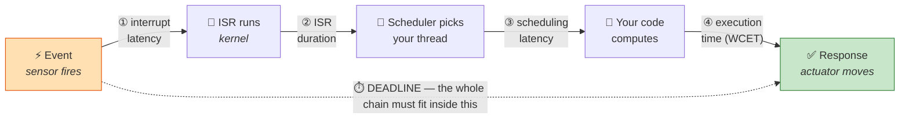
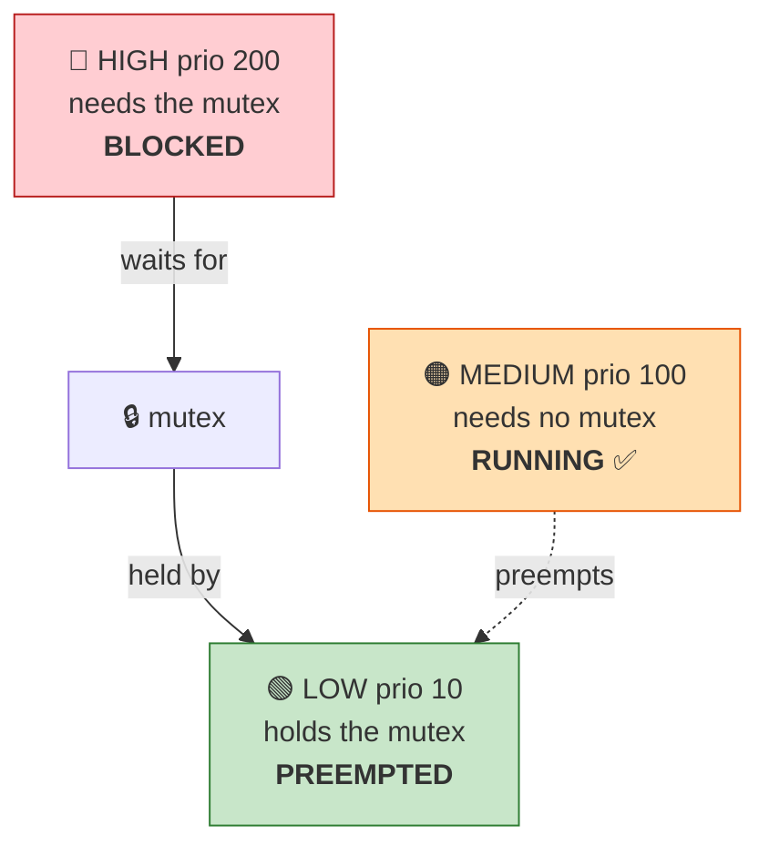

# Chapter 01 — What Is a Real-Time System?

> **By the end of this chapter you will** be able to say precisely what "real-time" means, tell hard
> from soft, and explain why a *faster* computer can be *worse* at real-time than a slower one.

---

## 🏃 Fast-Track Summary

> **🏃 Path C reads only this box**, then goes to Chapter 02. You already know this material; what
> follows is the vocabulary this course will use precisely, and one QNX-specific number.

**The definition.** A real-time system is one whose correctness depends on **when** a result is
produced as well as **what** it is. Late is wrong, even if the answer is right.

**The one sentence that matters.** Real-time is about the **worst case**, not the average. A system
with a 2 µs mean and a 40 ms tail is worse, for real-time purposes, than one that never exceeds
100 µs. Optimising the mean is a *throughput* discipline; optimising the tail is a *real-time* one,
and they often pull in opposite directions.

**Vocabulary this course uses strictly:**

| Term | Definition |
|------|-----------|
| **Deadline** | The latest acceptable completion time for a response |
| **Latency** | Elapsed time from stimulus to response |
| **Jitter** | *Variation* in latency (max − min, or a percentile spread) |
| **Determinism** | Latency is **bounded** and the bound is knowable — not that it is small |
| **WCET** | Worst-Case Execution Time — the upper bound on one computation |
| **Hard / firm / soft** | Missing a deadline is a *failure* / makes the result *worthless* / merely *degrades quality* |

**The four latency components**, in order: interrupt latency → ISR → scheduling latency → your code.
Only the last is yours. The first three belong to the OS, and are what you are buying when you buy
an RTOS.

**The five classic sources of unbounded latency:** interrupt masking with no bound · **priority
inversion** · unbounded loops or recursion · demand paging and page faults · dynamic allocation
(`malloc`, garbage collection). All five have QNX answers, covered in Chapters 11, 12, 15 and 19.

**Where QNX sits.** A **hard** real-time microkernel. Its defining trade is *obedience over
fairness*: the highest-priority ready thread runs immediately, always, however long anything else has
waited. That is why 256 fixed priorities exist and why there is no fair-share scheduler by default.

**🏃 Skip to:** [Chapter 02 — What Is QNX?](Chapter02_WhatIsQNX.md). If you have never had to defend
a WCET number to a safety assessor, §4 of this chapter is a 5-minute read worth having.

---

## 🎯 Learning Objectives

By the end of this chapter you will be able to:

- [ ] **Define** real-time without using the word "fast".
- [ ] **Distinguish** hard, firm and soft real-time, and classify a system you are shown.
- [ ] **Use** latency, jitter, determinism, WCET and deadline correctly and separately.
- [ ] **Break down** a response time into its four components and say which the OS controls.
- [ ] **Name** the five classic sources of unbounded latency and recognise them in code.
- [ ] **Compute** a timing budget for a periodic control loop and say whether it is feasible.
- [ ] **Explain** why "our system is usually fast enough" is not an engineering claim.

---

## 🧭 Prerequisites

| Need | Why |
|------|-----|
| [Chapter 00](Chapter00_HowToUseThisCourse.md) | Conventions, path markers, how labs work |
| A booting QNX VM *(labs only)* | [Setup Guides 01–03](../guides/README.md). The reading needs nothing |

No C is required to read this chapter. Lab 01.2 uses a short C program; Path A has a
no-coding alternative.

---

## 🗺️ Mental model

Every real-time argument is about this timeline, and about one number on it.



*Diagram: a response time is the sum of interrupt latency, ISR duration, scheduling latency and your
code's execution time; the deadline applies to the total, and the first three components belong to
the operating system rather than to you.*

> 💡 **Read the diagram twice.** Three of the four segments are the operating system's, not yours.
> You can profile your own code all week; if segment ③ can occasionally take 40 ms because another
> thread held a lock, your careful 200 µs computation is irrelevant. **That is what an RTOS is for:
> putting a bound on the parts you do not write.**

---

## 1. The Problem

### 1.1 A concrete deadline

A car detects a frontal impact. The airbag must be fully inflated **before** the occupant's head
reaches it — roughly **30 milliseconds** from impact.

The controller must, in that window: read accelerometers, discriminate a crash from a pothole, decide
whether and how hard to deploy, and fire the igniter.

Now suppose the software is *excellent*. Median response: **1.2 ms**. Twenty-five times faster than
required.

But once in every hundred thousand deployments, a driver holds a lock a fraction too long and the
response takes **45 ms**.

**The airbag inflates into the occupant's face.**

> ⚠️ **The median was never the engineering claim.** "1.2 ms typical" is a marketing number. The
> number that matters is the one you can *guarantee*: *"under all conditions, including the worst
> interleaving of every interrupt and every lock, this response completes within N milliseconds."*
> If you cannot say that sentence, you do not have a real-time system. You have a fast one.

### 1.2 Why "just make it faster" fails

The intuitive fix is a faster processor. It does not work, and understanding why is the whole point
of this chapter.

| Making it faster… | …does not remove |
|-------------------|------------------|
| A faster CPU | A thread that blocks for 40 ms waiting on a lock held by a lower-priority thread |
| More cores | An interrupt disabled for an unbounded stretch inside a driver |
| A bigger cache | A page fault that goes to disk at exactly the wrong moment |
| A better compiler | A `malloc` that occasionally takes a slow path through the allocator |

Every one of those is a **structural** unbound, not a speed problem. Doubling the clock halves the
*typical* time and leaves the *worst* case exactly where it was.

> 💡 **Worse: speed optimisations often make the tail longer.** Caches, branch prediction,
> speculative execution and lazy allocation all improve the average by making the *rare* case more
> expensive. A cache is a bet that the past predicts the future. Most of the time it wins. Real-time
> engineering is about the times it does not.

### 1.3 The three questions this chapter answers

1. What exactly does "real-time" mean, if not "fast"?
2. What determines how long a response actually takes?
3. How do you *state* a timing requirement so that it can be tested rather than hoped for?

---

## 2. The Concept

### 2.1 The definition

> 📖 **Real-time system.** A system whose **correctness depends on the time at which results are
> produced, not only on their logical correctness.** A late answer is a wrong answer.

Read what that does *not* say. It says nothing about speed. A system with a ten-second deadline is
real-time if ten seconds is a *requirement* rather than an aspiration.

> 📦 **Analogy — the courier and the train.**
>
> A **motorcycle courier** crosses the city in 20 minutes on a good day, 15 if traffic is light, and
> 90 if a bridge is closed. Average: excellent. **Not real-time.**
>
> A **suburban train** takes 35 minutes. Every time. It is slower than the courier's average and it
> is *never* 90.
>
> If you need to be at the airport by a fixed time, you take the train — and you take it even though
> it is slower, because you can *plan around* 35 minutes and you cannot plan around "20, usually".
>
> **QNX is the train.** So is every RTOS. The engineering is in the guarantee, not the speed.

### 2.2 Hard, firm and soft

The distinction is about **what happens when a deadline is missed** — not about how tight it is.

| | 🔴 **Hard** | 🟠 **Firm** | 🟡 **Soft** |
|---|---|---|---|
| **A miss means** | System failure. Possibly harm | The result is worthless, but no damage | Quality degrades |
| **Value after the deadline** | Negative | Zero | Diminishing |
| **Example** | Airbag deployment · flight control surfaces · pacemaker pacing | A video frame that arrives after its display slot | Web page load · audio buffering · UI responsiveness |
| **Response to a miss** | Must be *proven impossible* | Discard and continue | Log it and carry on |
| **Certified?** | Usually — ISO 26262, IEC 61508, DO-178C | Sometimes | No |

> 💡 **"Hard" does not mean "microseconds".** A chemical reactor whose stirrer must reverse within
> **two seconds** or the batch is ruined is a *hard* real-time system with a comfortable deadline. A
> game rendering at 144 Hz has a **6.9 ms** deadline and is *soft* — a dropped frame is a
> disappointment, not an incident.
>
> **Hardness is about consequences. Tightness is about magnitude. They are independent.**

> 🐣 **Beginner note.** You will hear "real-time" used loosely — "real-time chat", "real-time
> analytics". That usage means *"promptly"*. In this course it always means the strict definition
> above: **a deadline exists, and missing it is a defined failure.**

### 2.3 The property you actually want: determinism

> 📖 **Determinism.** The property that a system's timing is **bounded and the bound is knowable**.
> Not that it is *small*.

This is the single most misused word in the field. Determinism is a statement about the **shape of
the distribution**, not its position.

```text
System A  ── "fast"                    System B  ── "deterministic"

  frequency                              frequency
     │█                                     │
     │█                                     │      ███
     │█                                     │     █████
     │█                                     │     █████
     │██                            ▏       │     █████
     └──┴──────────────────────────┴──►     └─────┴───┴───────────────►
        2µs                       40ms            80µs 120µs        latency

   mean 2.4 µs                            mean 100 µs
   worst case 40 ms  ← unbounded          worst case 120 µs  ← GUARANTEED
```

*Text description: system A clusters at 2 µs but has a rare 40 ms outlier; system B is centred at
100 µs and never exceeds 120 µs. B is forty times slower on average and is the only one of the two
that can be used for a hard deadline of 1 ms.*

**System A is forty times faster on average and completely unusable** for any deadline under 40 ms.
System B is the one you can build a safety case on.

> 💡 **This is why an RTOS can benchmark *worse* than Linux and still be the right choice.** Throughput
> benchmarks measure the peak of the left-hand histogram. Real-time engineering is a fight about the
> right-hand tail. A vendor quoting only average latency is answering a question you did not ask.

### 🐧 In Linux this would be…

Standard Linux is a **throughput-optimised, soft real-time** system, and every one of its defaults is
the opposite of what an RTOS wants.

| | 🐧 Standard Linux | 🔷 QNX |
|---|---|---|
| Scheduler goal | **Fairness** — every task gets a share | **Obedience** — the highest-priority ready thread runs, immediately |
| Default policy | `SCHED_OTHER` (CFS), dynamic priorities | Fixed priority, 0–255, FIFO or round-robin |
| Priority meaning | A *hint* that influences share | An *order*. Priority 200 preempts 199 without negotiation |
| Preemption | Configurable; historically limited inside the kernel | Fully preemptible microkernel, by design |
| A misbehaving driver | Can hang the machine — it is kernel code | Is a user process. It dies; the system does not |
| Worst-case latency | Not specified by the vendor | Specified, measured and certified |

**`PREEMPT_RT`** — mainlined in 2024 — closes much of this gap and makes Linux genuinely usable for
soft and many firm systems. What it does not provide is a **safety certification** (IEC 61508 SIL 3,
ISO 26262 ASIL D) with a vendor's evidence package behind it. That, more than raw latency, is why
QNX is in the vehicle you drove today. Chapter 03 makes the full comparison; Chapter 29 covers
certification.

> ⚠️ **This is not "Linux is bad".** Linux makes the right trade for its target: maximum work per
> second across many tasks. QNX makes the right trade for *its* target: a bounded worst case for the
> most urgent task. **A design is only right relative to a requirement.**

---

## 3. The Mechanism — where the time actually goes

### 3.1 The four components

Return to the mental model. Every response time decomposes the same way:

| # | Component | Owner | What it is |
|---|-----------|-------|-----------|
| ① | **Interrupt latency** | 🔧 OS + hardware | Signal asserted → first instruction of the handler. Includes any interval where interrupts were *disabled* |
| ② | **ISR duration** | 🔧 driver | The handler itself. On QNX, deliberately tiny — it usually just returns an event |
| ③ | **Scheduling latency** | 🔧 OS | Thread becomes ready → thread actually runs. Where priority inversion lives |
| ④ | **Execution time** | 👤 **you** | Your computation. Its upper bound is the **WCET** |

> 💡 **You control one of four.** This is the central practical fact of the chapter. Choosing an RTOS
> is buying a *bound* on ① and ③; writing a good driver bounds ②; ④ is your engineering. Miss any one
> and the total is unbounded, no matter how good the other three are.

### 3.2 The five classic sources of an unbounded tail

Each has a name, a signature, and a QNX answer.

#### ① Unbounded interrupt masking

A driver disables interrupts and then does something slow — a loop over a variable-length list, a
poll with no timeout.

```c
InterruptDisable();
for (n = head; n != NULL; n = n->next)   /* how long is this list? */
    process(n);
InterruptEnable();
```

> 📖 **`InterruptDisable()` / `InterruptEnable()`** — QNX calls, declared in `<sys/neutrino.h>`.
> Each takes no arguments and returns nothing. They switch hardware interrupt delivery off and on for
> the whole processor. **These are QNX-specific**, unlike almost everything else you will meet before
> Chapter 13; Chapter 19 covers when — and how rarely — you should use them.

While interrupts are off, **nothing** can preempt — not even the highest-priority thread in the
system. Interrupt latency becomes the length of that loop.

**QNX's answer:** ISRs are tiny and usually do nothing but return a `sigevent`; the real work happens
in an ordinary, preemptible, prioritised thread. Chapter 19.

#### ② Priority inversion ⚠️ *the classic*

A high-priority thread waits on a mutex held by a low-priority thread, which is itself preempted by a
medium-priority thread that needs no lock at all.



*Diagram: the high-priority thread is blocked on a mutex held by a low-priority thread, which cannot
run because a medium-priority thread that needs no mutex is using the CPU — so the highest-priority
thread waits on the lowest, indefinitely.*

The high-priority thread is now effectively running at the *medium* thread's priority — for
**unbounded** time, because nothing stops more medium-priority work arriving.

> 💡 **This is not a textbook curiosity.** In July 1997 the **Mars Pathfinder** lander began resetting
> itself repeatedly on the Martian surface. The cause was exactly this: a high-priority bus-management
> task blocked on a mutex held by a low-priority meteorological task, preempted by medium-priority
> communications work. A watchdog saw the high-priority task miss its deadline and rebooted the
> spacecraft. JPL diagnosed it from Earth, and fixed it by enabling **priority inheritance** — a flag
> that had been switched off for performance. A one-line configuration change, on another planet.

**QNX's answer:** priority inheritance on mutexes — the lock holder is temporarily boosted to the
priority of the highest waiter — and, for message passing, a server automatically **inherits its
client's priority** while handling that client's request. Chapters 12 and 13.

#### ③ Unbounded computation

```c
while (!converged) { refine(); }     /* how many iterations? */
qsort(data, n, ...);                  /* what is the largest n? */
```

> 📖 **`qsort()`** — the ISO C standard library's sort, from `<stdlib.h>`. It sorts an array in place
> using a comparison function you supply. It is used here as a cautionary example because **the C
> standard does not specify its worst case** — it need not even be quicksort. Full signature and
> arguments: [Lab 01.2's README](../../labs/lab01_timing/README.md) and
> [D-014](../meta/Doubts.md#d-014).

If you cannot state an upper bound on the iterations, you cannot state a WCET.

**The discipline:** every loop in real-time code has a provable maximum count. Prefer algorithms with
a good *worst* case over a good *average* — this is why hard real-time code so often uses fixed-size
arrays and bounded, in-place algorithms rather than the asymptotically elegant choice.

#### ④ Demand paging

The first touch of a page traps to the kernel, which may go to storage. A memory access that usually
costs nanoseconds occasionally costs milliseconds.

**QNX's answer:** lock critical pages into RAM (`mlockall`), and pre-fault them at startup. Chapter 15.

#### ⑤ Dynamic memory

`malloc` may take a fast path, or coalesce free blocks, or ask the kernel for more. Its worst case is
usually unspecified — and a garbage-collected language adds a whole collection cycle.

**The discipline:** allocate everything during initialisation; never `malloc` in a deadline-bound
path. Use pools and pre-allocated buffers.

> ⚠️ **These five compose.** A system with four of them solved and one remaining is not
> "80 % deterministic". **The worst case is the maximum over all paths** — one unbounded component
> makes the whole response unbounded. This is why real-time engineering feels unforgiving: it is a
> conjunction, not a score.

### 3.3 Jitter, and why periodic tasks care more than you expect

> 📖 **Jitter.** The *variation* in latency. Usually reported as max − min, or as a percentile spread
> such as p99.9 − p50.

For a task that runs **once**, jitter barely matters. For a **periodic** task, it can dominate.

A motor control loop at 1 kHz samples every 1000 µs and computes a correction assuming that interval.
If actual intervals wander between 900 µs and 1100 µs, every derivative term in the controller is
computed against a wrong Δt. The controller does not merely respond late — **it responds wrongly**,
and in a feedback loop wrong corrections can amplify into audible or physical oscillation.

> 💡 **Low mean latency with high jitter is often worse than higher, stable latency.** A control
> engineer will usually take a consistent 200 µs over a 50 µs average that occasionally reaches
> 500 µs, because the first can be compensated in the model and the second cannot.

### 🔬 Deep dive — why WCET is genuinely hard

<details>
<summary>Optional. Read it if you will ever have to defend a timing number to an assessor.</summary>

> 📖 **WCET — Worst-Case Execution Time.** The upper bound on the time one piece of code takes,
> across all inputs and all machine states, excluding preemption.

You might expect this to be measurable. It is not, in general.

**Measurement gives a lower bound, not an upper one.** Run the code a million times, take the maximum
— and you have found the worst case *you happened to hit*. The input that evicts exactly the wrong
cache lines may need a one-in-10⁹ interleaving you will never see on the bench.

**Static analysis gives an upper bound that may be uselessly loose.** Tools that model the pipeline
and cache produce a provable bound — but must assume the worst at every branch, every cache access
and every pipeline hazard. Bounds 5–10× above anything achievable in practice are common. You can
build a safety case on that, but you may be paying for ten times the hardware.

**Modern hardware makes both harder:**

| Feature | Why it hurts WCET |
|---------|-------------------|
| Caches | Hit or miss changes timing by 100× and depends on execution history |
| Branch prediction | Misprediction costs a pipeline flush, and depends on history |
| Out-of-order execution | Instruction timing depends on surrounding instructions |
| Multi-core + shared cache | **Another core's activity changes your timing.** This is the hard one |
| DRAM refresh, DVFS, SMT | Timing varies with state you neither see nor control |

**What practitioners actually do:** hybrid measurement-based analysis (measure basic blocks, compose
along the worst path), plus generous margin, plus runtime deadline monitoring so an overrun is
*detected* rather than silently tolerated. On multi-core safety systems, cores are often partitioned
or shared caches disabled — deliberately giving up performance to regain predictability.

**The connection to this course:** Chapter 26's tracing tools measure real timing on your real
system, and Chapter 27's adaptive partitioning bounds what other subsystems can do to you. Chapter 29
covers what a certification body will actually accept as evidence.

</details>


---

## 4. The Vocabulary — stating a timing requirement precisely

> Chapters that teach an API use this section for function signatures. This chapter's "API" is the
> set of quantities you must be able to name, measure and defend. Getting them confused is how timing
> arguments go wrong.

### 4.1 The eight quantities

| Quantity | Symbol | Definition | Unit | How you get it |
|----------|--------|-----------|------|----------------|
| **Period** | `T` | Interval between successive releases of a periodic task | s | A requirement — you choose it |
| **Deadline** | `D` | Latest acceptable completion, measured from release | s | A requirement. Often `D = T` |
| **Release time** | `r` | When the task becomes ready to run | s | Timer or event |
| **Response time** | `R` | Release → completion. **Includes time spent preempted** | s | Measured |
| **Execution time** | `C` | CPU time actually used, excluding preemption | s | Measured or analysed |
| **WCET** | `C_max` | Upper bound on `C` over all inputs and states | s | Analysis + measurement + margin |
| **Latency** | `L` | Stimulus → response, for event-driven work | s | Measured |
| **Jitter** | `J` | Variation in `L` or `R` | s | `max − min`, or p99.9 − p50 |

> ⚠️ **`R` and `C` are different, and confusing them is the most common beginner error.** A task that
> uses 200 µs of CPU (`C`) may take 5 ms to finish (`R`) because it was preempted for 4.8 ms.
> **Deadlines apply to `R`.** A profiler that reports only CPU time is answering the wrong question.

### 4.2 Utilisation, and the feasibility question

> 📖 **Utilisation.** The fraction of CPU time a task set demands: `U = Σ (Cᵢ / Tᵢ)`.

`U > 1.0` is infeasible on one core — you are asking for more CPU-seconds per second than exist. No
scheduler can rescue it.

`U ≤ 1.0` is **necessary but not sufficient**. Whether the set is actually schedulable depends on the
policy:

| Policy | Guarantee |
|--------|-----------|
| **Rate-monotonic** (fixed priority, shorter period ⇒ higher priority) | Schedulable if `U ≤ n(2^(1/n) − 1)`. For large `n` that limit approaches **≈ 69 %** |
| **Earliest-deadline-first** (dynamic) | Schedulable for any `U ≤ 1.0` — optimal, but harder to reason about under overload |

> 💡 **The 69 % number is worth carrying around.** Under fixed-priority scheduling — which is what
> QNX gives you by default — a task set can start missing deadlines at **69 % CPU utilisation**, with
> a third of the CPU idle. "We have plenty of headroom, the CPU is only 75 % busy" is not an argument
> about schedulability. Chapter 11 covers this properly.

### 4.3 How to write a requirement that can be tested

| ❌ Not a requirement | ✅ A requirement |
|---------------------|-----------------|
| "The system shall respond quickly" | "The system shall respond within **5 ms** of the sensor edge" |
| "Latency shall be minimised" | "**p99.9** end-to-end latency shall not exceed **5 ms**, measured at the actuator, over a 24-hour run under peak load" |
| "The control loop runs at 1 kHz" | "The control loop shall execute with period **1000 µs ± 50 µs**; three consecutive misses shall trigger the safe state" |

**A testable timing requirement names five things:**

1. **What** is being measured (stimulus and response points — physical, not "in my function")
2. **The bound** (a number and a unit)
3. **The statistic** (worst case? p99.9? mean is almost never right)
4. **The conditions** (peak load, worst-case input, all cores busy)
5. **What happens on a miss** (this is what makes it hard, firm or soft)

> ⚠️ **Point 5 is the one that gets left out**, and it is the one that determines your entire
> architecture. "Respond within 5 ms" and "respond within 5 ms **or enter the safe state**" are
> different systems: the second needs deadline monitoring, a defined safe state, and a way to reach
> it. That is Chapter 27.

---

## 5. Worked Example — budgeting a 1 kHz control loop

A robot joint controller. Requirement:

> Read the encoder, compute a PID correction, and command the motor **every 1000 µs**, with the
> command issued **within 300 µs** of the encoder sample. Three consecutive misses shall trigger safe
> torque off.

Classify it first: a miss is tolerated twice and then triggers a safe state, so this is **hard
real-time with a defined degradation path** — the safety case rests on the safe state being reachable,
not on never missing.

### 5.1 The budget

`T = 1000 µs`. `D = 300 µs` from sample to command.

| # | Component | Budget | Notes |
|---|-----------|-------:|-------|
| ① | Interrupt latency | 20 µs | OS + hardware. Measure it; do not assume it |
| ② | ISR duration | 5 µs | Reads a register, returns a `sigevent`. Nothing else |
| ③ | Scheduling latency | 25 µs | Ready → running for the highest-priority thread |
| ④ | Read encoder over SPI | 80 µs | **A blocking transfer — the largest single item** |
| ⑤ | PID computation | 15 µs | Fixed-point, no loops, no allocation |
| ⑥ | Write motor command | 60 µs | Another SPI transfer |
| | **Total** | **205 µs** | |
| | **Deadline** | **300 µs** | |
| | **Margin** | **95 µs (32 %)** | |

**Feasible — with a caveat.** Every number must be a **worst case**, not a typical one. If ④'s
80 µs is the median SPI transfer and the bus occasionally retries, the budget is fiction.

### 5.2 Utilisation

The loop uses roughly 205 µs of a 1000 µs period:

```text
U = 205 / 1000 = 0.205 = 20.5 %
```

Comfortably under the ~69 % rate-monotonic bound — **for this task alone**. Add telemetry at 100 Hz,
a safety monitor at 500 Hz and a diagnostics logger, and you must recompute the sum. This is where
real systems get into trouble: each task is individually reasonable.

### 5.3 Where it breaks — and the fix

Now suppose telemetry and the control loop share a data structure behind a mutex.

| Without priority inheritance | With priority inheritance |
|------------------------------|---------------------------|
| Telemetry (prio 20) takes the mutex | Telemetry (prio 20) takes the mutex |
| Control loop (prio 200) needs it → **blocks** | Control loop (prio 200) needs it → blocks |
| Diagnostics (prio 100) preempts telemetry | **Telemetry is boosted to 200** |
| Telemetry cannot run, so the mutex is never released | Diagnostics **cannot** preempt it |
| Control loop misses its deadline. Then again. Then again → **safe torque off** | Telemetry finishes, releases, drops back. Control loop proceeds |
| ③ was **unbounded** | ③ is bounded by telemetry's critical section |

> 💡 **Nothing in that first column is a bug.** Every thread does exactly what it was written to do.
> The failure is **structural** — three correct components composing into an unbounded wait. This is
> why real-time is an operating-system concern and not only a coding-discipline one, and it is the
> Mars Pathfinder failure in miniature.

**The fix is one attribute at initialisation:**

```c
pthread_mutexattr_t attr;
pthread_mutexattr_init(&attr);
pthread_mutexattr_setprotocol(&attr, PTHREAD_PRIO_INHERIT);   /* ← the whole fix */
pthread_mutex_init(&data_lock, &attr);
```

**The three calls, since this is their first appearance in the course.** All are **POSIX threads**
(`pthread`) functions from `<pthread.h>` — standard POSIX, **not QNX inventions**, and identical on
Linux:

| Call | Arguments | Returns | Does |
|------|-----------|---------|------|
| `pthread_mutexattr_init` | pointer to a `pthread_mutexattr_t` you own | `0`, or an error number | Initialises an **attributes object** — a bundle of settings, not a mutex |
| `pthread_mutexattr_setprotocol` | that object; a protocol constant | `0`, or an error number | Sets the protocol. `PTHREAD_PRIO_INHERIT` = priority inheritance; `PTHREAD_PRIO_NONE` is the default |
| `pthread_mutex_init` | the mutex to create; the attributes to create it *with* | `0`, or an error number | Creates the mutex, **applying those attributes** |

> ⚠️ **These return an error number directly — they do not set `errno`.** Most POSIX functions return
> `-1` and set `errno`; the `pthread_*` family is the well-known exception. `if (rc != 0)`, not
> `if (rc == -1)`.

> 💡 **Read the shape, not the API.** A mutex is created *with* attributes, so the protocol must be
> chosen **before** the mutex exists — you cannot switch on priority inheritance later, under load,
> when you discover you needed it. That is an architectural decision disguised as an initialisation
> detail, and it is exactly the flag JPL had to change on Mars.

Chapter 12 covers this properly. For now, note the shape of the thing: **a timing failure with no
buggy line of code, fixed by a scheduling policy rather than by making anything faster.**

### 5.4 The lesson

| Step | What it gave you |
|------|------------------|
| Classify the deadline | Told you a safe state is required — an architectural consequence |
| Decompose the response | Showed that three of six items belong to the OS |
| Sum the worst cases | Turned "should be fine" into 205 µs with 32 % margin |
| Compute utilisation | Made it possible to add the *next* task without guessing |
| Look for inversion | Found an unbounded wait that no profiler would ever show you |

**That is the entire method.** Every remaining chapter gives you better tools for one of those steps.


---

## 🧪 Labs

> **Lab 01.1 and the Path A activity need only a booted VM.** Lab 01.2 and the break-it exercise
> compile a short C program.
>
> Boot with: `cd ~/qnx800/images/qemu/qemu && mkqnximage --run`

### Lab 01.1 — Find the priority scale on a live system  [🐣🚶🏃]

> **Objective.** See this chapter's abstractions — priorities, blocking states, urgency — as
> concrete numbers on a running QNX system.
> **Time.** 10 minutes. **No coding.**

At the target:

```bash
qnx# pidin | head -30
```

✅ **Real output** (abridged, from the reference run):

```text
     pid tid name                         prio STATE          Blocked
       1   1 /proc/boot/procnto-smp-instr   0f RUNNING
       1   9 /proc/boot/procnto-smp-instr 255i RUNNING
       1  11 /proc/boot/procnto-smp-instr 255i INTR
       1  17 /proc/boot/procnto-smp-instr 254i INTR
       1  25 /proc/boot/procnto-smp-instr   1f NANOSLEEP
       1  26 /proc/boot/procnto-smp-instr  10r RECEIVE        1
   32773   1 proc/boot/devb-eide           10r SIGWAITINFO
   32773   3 proc/boot/devb-eide          254i INTR
   81927   1 proc/boot/devc-ser8250        25r RUNNING
   81931   1 system/bin/io-sock            21r SIGWAITINFO
  249881  13 system/bin/screen             10r REPLY          184343
  397328   1 system/bin/fullscreen-winmgr  10r REPLY          249881
```

The `prio` column is a **number** plus a **letter** for the scheduling policy — `f` FIFO,
`r` round-robin.

**Answer from your own output:**

1. What is the **highest** priority number you can find, and what kind of thread has it?
2. What is the **lowest**, and what is that thread doing?
3. `devb-eide` (the disk driver) has threads at **two very different** priorities. Why would one
   program want that?
4. Find a thread in state `REPLY`. The `Blocked` column shows a **PID**. What is that thread waiting
   for, and what does that tell you about how QNX programs talk to each other?

<details>
<summary>Answers</summary>

1. **255** — the top of QNX's 0–255 scale, on the kernel's **interrupt-handling threads** (`INTR`).
   Nothing in the system may delay them.
2. **0** — the **idle** thread. It runs only when nothing else can, which is the definition of idle.
   Note that priority 0 is not "unimportant work"; it is *literally* the absence of work.
3. Thread 3 waits for **interrupts** from the disk controller and must respond immediately, so it
   sits at 254. The others do ordinary request handling at 10. **One program, deliberately split
   across the urgency scale** — exactly the ①②③④ decomposition from §3.1, visible in a process
   listing. Chapter 19 shows you how to write this.
4. It is blocked waiting for **a reply to a message it sent** to that PID. `fullscreen-winmgr` is
   waiting on `screen`; `screen` is waiting on `io-hid`. QNX programs talk by **synchronous message
   passing** — the sender blocks until the receiver replies — and the blocking state names the exact
   partner. Chapter 13 is built on this.

</details>

> 💡 **Connect it back.** §3.1 said scheduling latency belongs to the OS. This listing shows the
> mechanism: a strict 0–255 order in which "the highest-priority ready thread runs" is a rule, not a
> preference. Chapter 11 shows you how to place your own threads on that scale.

---

### Lab 01.2 — Measure jitter on your own machine  [🚶🏃]

> **Objective.** Produce real latency numbers, and see the difference between mean and worst case
> with your own data rather than taking this chapter's word for it.
> **Time.** 20 minutes.
>
> 📌 **`[UNVERIFIED]`** — this lab has been written but not yet executed on the target. Report what
> you actually get; the numbers below are what to *expect*, not what was observed.

**What it does.** Ask to sleep for exactly 1 ms, ten thousand times, and measure how long each sleep
actually took. The difference between request and reality *is* jitter.

> 🐣 **Not sure what `clock_gettime`, `nanosleep`, `perror` or `qsort` are?** The lab's
> [README §*The library functions this lab uses*](../../labs/lab01_timing/README.md) explains all
> four — what they do, their arguments, what they return, and which header each lives in.
>
> **Short version: none of them is QNX-specific.** Two are from the **ISO C standard library**
> (`qsort`, `perror`) and two from **POSIX.1b**, the 1993 *real-time extensions* (`nanosleep`,
> `clock_gettime`). The code lives in `libc.so.6` — one of the ~80 files you listed in `/proc/boot`
> in Chapter 00. That your ordinary C knowledge works unchanged here **is** the meaning of "QNX is
> POSIX-compliant"; QNX's own calls arrive in Chapter 13. See [D-014](../meta/Doubts.md#d-014).

**Step 1 — build it on the host.**

```bash
host$ cd ~/exercises/qnx-zero-to-hero/labs/lab01_timing
host$ make
```

**Step 2 — deploy and run.**

```bash
host$ scp solution/jitter qnxuser@<ip>:/tmp/
host$ ssh qnxuser@<ip>
qnx$ /tmp/jitter
```

✅ **Expected shape of the output** (your numbers will differ):

```text
samples : 10000   requested interval : 1000 us
min     :  1000 us
mean    :  1043 us
p99     :  1180 us
max     :  2350 us
jitter  :  1350 us  (max - min)
```

**Step 3 — read what you got.**

1. Is `min` ever **below** 1000 µs? Should it be?
2. How far apart are `mean` and `max`? Which one would you put in a datasheet, and which one would
   you put in a safety case?
3. If your deadline were 1100 µs, would this task have met it every time?

<details>
<summary>What the numbers are telling you</summary>

1. **`min` should never be below 1000 µs.** `nanosleep` guarantees *at least* the requested time. A
   value below it means your measurement is wrong, not that the sleep was short.
2. Typically several hundred microseconds apart — and the gap grows the longer you run. The **mean**
   is the datasheet number; the **max** is the only one a safety case can use. A single 2350 µs
   sample means this task cannot claim a 2 ms bound, no matter how good the other 9999 were.
3. Almost certainly **no** — and that is the lesson. A task that meets its deadline 99 % of the time
   fails a hard requirement 100 % of the time.

**Why even a good result overshoots.** QNX's default clock tick is **1 ms**. A 1 ms sleep almost
always wakes on the *next* tick, so 1000 µs requested becomes 1000–2000 µs actual. Timer resolution
is itself a source of jitter, and it is adjustable: **`ClockPeriod()`** — a QNX call in
`<sys/neutrino.h>` that reads or sets the system clock's tick interval — is Chapter 14's subject,
along with the rest of QNX's timer machinery.

</details>

---

### 💥 Break It — make the tail grow  [🚶]

> **Objective.** Watch the mean stay still while the worst case moves. This is §2.3's histogram,
> reproduced on your own machine.
> **Time.** 10 minutes. 📌 `[UNVERIFIED]`

**Step 1.** Run `jitter` on an idle system and note `mean` and `max`.

**Step 2.** Load the machine, then run it again *concurrently*:

```bash
qnx$ /tmp/jitter &
qnx$ while true; do :; done &
qnx$ while true; do :; done &
qnx$ while true; do :; done &
```

*(Kill the loops afterwards with `slay sh`, or just reboot the VM.)*

**Step 3.** Compare the two runs.

**Predict before you look:** which moves more — `mean` or `max`? By what factor?

<details>
<summary>What you should see, and why it matters</summary>

**`mean` moves a little. `max` moves a lot.** That is the entire chapter in one experiment: load
mostly steals a bit of average throughput, but it *destroys* the tail — which is the number your
deadline actually depends on.

**Then try the QNX answer.** Run the measurement at a high priority instead:

```bash
qnx$ on -p 63 /tmp/jitter
```

`on -p` launches a program at a given priority. At 63 the measurement thread outranks the busy loops
(which inherit the shell's priority, typically 10), so QNX's "highest-priority ready thread runs,
always" rule should push `max` back down close to its idle value — **even though the machine is still
fully loaded.**

> 💡 **That is what you are buying.** Not speed. The ability to say *"this thread's timing does not
> depend on what else the system is doing"* — and to be right.

📋 **Please report all three runs** (idle, loaded, loaded-at-priority-63). If the third does not
behave as described, that is a genuine finding and the chapter needs correcting.

</details>

---

### 🐣 Path A Activity — classify five systems  [🐣]

> **Objective.** Practise the judgement, without any code.
> **Time.** 15 minutes. **No compiler, no VM required for part 1.**

**Part 1 — classify.** For each system: is it **hard**, **firm** or **soft**? What is roughly the
deadline? And critically — **what happens on a miss?**

| # | System |
|---|--------|
| 1 | A pacemaker delivering a pacing pulse |
| 2 | A video call dropping a frame |
| 3 | A train's automatic braking on a red signal |
| 4 | An online shop's checkout page |
| 5 | A washing machine's door lock before the drum spins |

<details>
<summary>Answers</summary>

| # | Class | Deadline | On a miss |
|---|-------|----------|-----------|
| 1 | 🔴 **Hard** | ~ms | Patient harm. Must be proven impossible |
| 2 | 🟠 **Firm** | ~33 ms (30 fps) | The frame is worthless — discard it. No damage; quality dips |
| 3 | 🔴 **Hard** | ~100 ms | Collision. Certified to EN 50128 |
| 4 | 🟡 **Soft** | ~1 s | The user is annoyed; some abandon the cart. Revenue, not safety |
| 5 | 🔴 **Hard** | ~100 ms | A hand in a spinning drum. Comfortable deadline, absolute consequence |

**The point of number 5:** its deadline is *loose* and its class is **hard**. Hardness is about
**consequences**, not tightness — and #2's much tighter deadline is only *firm*.

</details>

**Part 2 — a budget on paper.** A drone must stop its rotors within **50 ms** of a "kill" command.
The chain is: radio receiver **8 ms** → decode **2 ms** → safety check **1 ms** → motor controller
command **5 ms** → rotors spin down **30 ms**.

1. What is the total?
2. What is the margin?
3. Which single component would you attack first, and why?

<details>
<summary>Answers</summary>

1. **46 ms.**
2. **4 ms — about 8 %.** Uncomfortably thin. A rule of thumb in safety work is to want *at least*
   20–30 % margin, because every number in that chain is an estimate.
3. **The radio receiver, at 8 ms** — the largest component you can actually influence. The 30 ms
   spin-down is physics: it is mass and drag, not software. **Attack the biggest number you control**,
   and be suspicious that "8 ms" is a typical figure rather than a worst case — radio links retry.

**The deeper lesson:** 30 of the 46 ms are *not software at all*. Real-time engineering starts at the
physics and works back. A software team optimising its 3 ms of decode-and-check is polishing 6 % of
the problem.

</details>


---

## ✅ Mastery Check

**1.** *(Recall)* Define a real-time system without using the word "fast".

<details><summary>Answer</summary>

A system whose **correctness depends on when a result is produced as well as what it is**. A late
answer is a wrong answer, because a deadline exists and missing it is a defined failure.

</details>

**2.** *(Recall)* System A: mean 50 µs, worst case 90 ms. System B: mean 900 µs, worst case 1.1 ms.
Which is suitable for a 5 ms hard deadline, and why?

<details><summary>Answer</summary>

**System B.** It never exceeds 1.1 ms, so a 5 ms deadline is guaranteed with margin. System A is
eighteen times faster on average and **will miss the deadline** whenever it hits its 90 ms tail —
and it only has to do that once.

Real-time is a property of the **worst case**. System A is *fast*; System B is *real-time*.

</details>

**3.** *(Apply)* Response times are measured at 190, 205, 198, 210, 850 and 201 µs. The deadline is
300 µs. What do you report, and what do you do next?

<details><summary>Answer</summary>

**Report a failure.** One sample at 850 µs exceeds the 300 µs deadline. The mean (309 µs) is not the
relevant statistic, and neither is "five out of six passed".

**Next:** find out *what happened during that sample.* Six samples is far too few to characterise a
tail, so the job is not statistics — it is **causation**. A single 4× outlier among tight clustering
is the signature of a blocking event: a lock, a page fault, an interrupt storm, or a preemption by
something you did not expect. Chapter 26's tracing tools show exactly which.

</details>

**4.** *(Apply)* A colleague says: *"We profiled it — our function only uses 200 µs of CPU, well
inside our 1 ms deadline."* What is wrong with that reasoning?

<details><summary>Answer</summary>

They measured **execution time `C`**, but the deadline applies to **response time `R`**. `R` includes
every interval the task spent *preempted or blocked*, which a CPU profiler does not show.

A task using 200 µs of CPU can easily take 5 ms wall-clock if it is preempted by higher-priority work
or blocked on a lock. **`R ≥ C`, and the gap is exactly what an RTOS exists to bound.**

The right measurement is wall-clock from release to completion, under worst-case load — which is what
Lab 01.2 does.

</details>

**5.** *(Design)* You are handed: *"the system shall respond to the emergency stop quickly."* Rewrite
it as a testable requirement, and say what each addition buys you.

<details><summary>Answer</summary>

> "On assertion of the emergency-stop input, the drive shall be commanded to zero torque within
> **20 ms**, measured from the electrical edge at the input terminal to the command on the motor bus,
> **worst case** (not mean), **with all subsystems at peak load and all cores busy**. Failure to meet
> this shall assert the hardware safe-torque-off line within a further 5 ms."

| Addition | What it buys |
|----------|--------------|
| **20 ms** | A number to design and test against |
| **Terminal → motor bus** | Physical measurement points. "In my function" is not testable and excludes the parts that usually break |
| **Worst case** | Rules out passing on averages — the single most common way timing requirements are quietly defeated |
| **Peak load, all cores busy** | Test conditions. An idle-system measurement proves nothing |
| **…or safe-torque-off within 5 ms** | Turns an aspiration into an architecture: you now need deadline monitoring, a defined safe state, and a path to it |

**The last row is the real answer.** Any competent engineer can add a number. Specifying what happens
on a miss is what determines whether you are building a hard real-time system or hoping.

</details>

---

## 🧠 Concept Recap

- **Real-time ≠ fast.** Correctness depends on *when*, not only *what*. Late is wrong.
- **The worst case is the only case that matters.** Mean latency is a throughput statistic.
- **Determinism = bounded and knowable**, not small. A slower system with a tight bound beats a
  faster one with a long tail.
- **Hard / firm / soft is about consequences**, not tightness. A 2-second deadline can be hard; a
  6.9 ms one can be soft.
- **Four latency components:** interrupt latency → ISR → scheduling latency → your execution. **You
  own one.** The RTOS bounds the rest.
- **Five classic unbounds:** interrupt masking · **priority inversion** · unbounded loops · page
  faults · dynamic allocation. They *compose* — one unfixed makes the total unbounded.
- **`R` (response) ≠ `C` (execution).** Deadlines apply to `R`. Profilers usually report `C`.
- **Fixed-priority scheduling can miss deadlines at ~69 % utilisation.** "The CPU is only 75 % busy"
  is not a schedulability argument.
- **A testable requirement names five things:** measurement points, bound, statistic, conditions, and
  **what happens on a miss**.
- **QNX's trade is obedience over fairness** — 256 fixed priorities, highest ready thread runs
  immediately. Everything in Part 2 follows from that.

---

## 📎 Cheat Sheet

**Quantities**

| Symbol | Name | Applies to | Note |
|--------|------|-----------|------|
| `T` | Period | Periodic tasks | A requirement |
| `D` | Deadline | Both | Often `D = T` |
| `R` | **Response time** | Both | Release → completion, **including preemption** ⭐ |
| `C` | Execution time | Both | CPU time only, excluding preemption |
| `C_max` | **WCET** | Both | Upper bound over all inputs and states |
| `L` | Latency | Event-driven | Stimulus → response |
| `J` | Jitter | Periodic | `max − min`, or p99.9 − p50 |
| `U` | Utilisation | Task set | `Σ(Cᵢ/Tᵢ)`. `> 1.0` is infeasible |

**Classification**

| Class | On a miss | Value after deadline |
|-------|-----------|---------------------|
| 🔴 Hard | System failure, possibly harm | Negative |
| 🟠 Firm | Result is worthless | Zero |
| 🟡 Soft | Quality degrades | Diminishing |

**The five unbounds, and where QNX answers them**

| Source | Signature | Chapter |
|--------|-----------|---------|
| Unbounded interrupt masking | Slow work between disable/enable | 19 |
| **Priority inversion** | High-priority thread blocked on a low-priority lock holder | 12, 13 |
| Unbounded computation | A loop with no provable maximum | 11 |
| Demand paging | Rare millisecond memory access | 15 |
| Dynamic allocation | `malloc` / GC on a hot path | 15 |

**Numbers worth remembering**

| Number | Meaning |
|--------|---------|
| **0–255** | QNX priority range. 0 = idle, 255 = kernel interrupt threads |
| **≈ 69 %** | Rate-monotonic utilisation bound for large task sets |
| **1 ms** | QNX's default clock tick — a floor on timer jitter (adjustable, Ch 14) |

**Commands used in this chapter**

| Command | Runs on | Does |
|---------|---------|------|
| `pidin` | target | Threads with priority, policy and blocking state |
| `on -p N prog` | target | Launch `prog` at priority `N` |
| `slay name` | target | Terminate processes by name |

---

## 🔗 Further Reading

| Resource | Why |
|----------|-----|
| [`Glossary.md`](../reference/Glossary.md) | Every term defined here, plus the ones coming in Part 2 |
| [Mars Pathfinder priority inversion (Glenn Reeves, JPL)](http://www.cs.cmu.edu/~rajkumar/15745/pathfinder.html) | The engineer's own first-hand account of §3.2's failure. Short, and the best real-world illustration in the field |
| [Liu & Layland (1973), *Scheduling Algorithms for Multiprogramming in a Hard-Real-Time Environment*](https://dl.acm.org/doi/10.1145/321738.321743) | Where rate-monotonic scheduling and the 69 % bound come from. Still the foundational paper |
| [QNX 8.0 System Architecture](https://www.qnx.com/developers/docs/8.0/com.qnx.doc.neutrino.sys_arch/topic/about.html) | QNX's own account of how it delivers the guarantees this chapter demands |
| [`ResourcesMeta.md`](../reference/ResourcesMeta.md) | Rated review of books and courses — including which are stale |

---

## ➡️ What's Next

**[Chapter 02 — What Is QNX?](Chapter02_WhatIsQNX.md)**

You now know what a real-time system must guarantee and where the guarantees are won and lost.
Chapter 02 introduces the system that was designed around those guarantees in 1980 and has kept the
same architectural bet ever since: history, the microkernel decision, the product family, and how
QNX 8.0 relates to everything you will find written about QNX 6.x online.

> 🐣 **Path A:** Chapter 02 is the most readable chapter in the course. No setup needed.
> 🚶 **Path B:** Chapter 02 then Chapter 03, then Part 1 begins the real work.
> 🏃 **Path C:** Chapter 02's Fast-Track Summary, then straight to Chapter 04 (licensing).

---

## 📝 Chapter Changelog

| Version | Date | Change |
|---------|------|--------|
| 1.2 | 2026-08-26 | **Library-function audit** under the new `PLAN.md` §2/§17 rule. Explained on first use: `InterruptDisable`/`InterruptEnable` (§3.2, QNX-specific), `qsort` (§3.2, with a pointer to the full signature), the three `pthread_mutexattr_*`/`pthread_mutex_init` calls (§5.3 — including the trap that the `pthread_*` family returns an error number rather than setting `errno`), and `ClockPeriod` (§ lab notes). |
| 1.1 | 2026-08-26 | Lab 01.2 now points at the lab README's explanation of `clock_gettime`, `nanosleep`, `perror` and `qsort` before the build step, and states up front that none is QNX-specific ([D-014](../meta/Doubts.md#d-014)). |
| 1.0 | 2026-08-26 | Created. Defines real-time, determinism, hard/firm/soft, the four latency components, the five classic unbounds, and the vocabulary (`T`, `D`, `R`, `C`, WCET, jitter, utilisation). Worked example budgets a 1 kHz control loop and derives a priority-inversion failure. Lab 01.1 verified against QNX 8.0.0; Lab 01.2 and the break-it exercise are `[UNVERIFIED]` pending block V6. |
