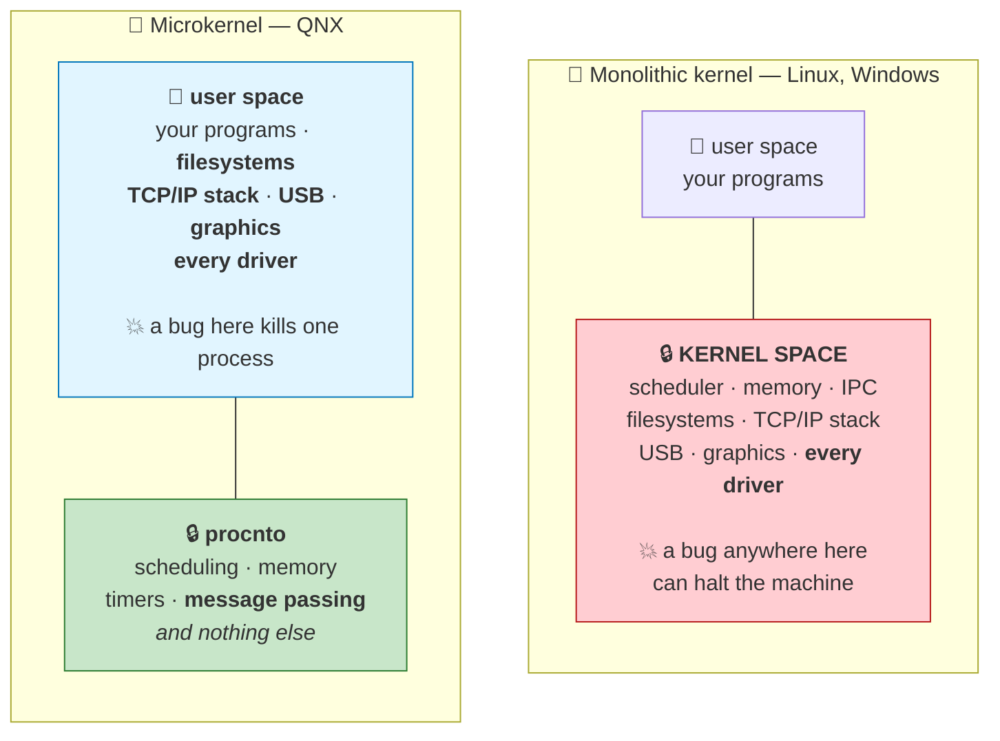
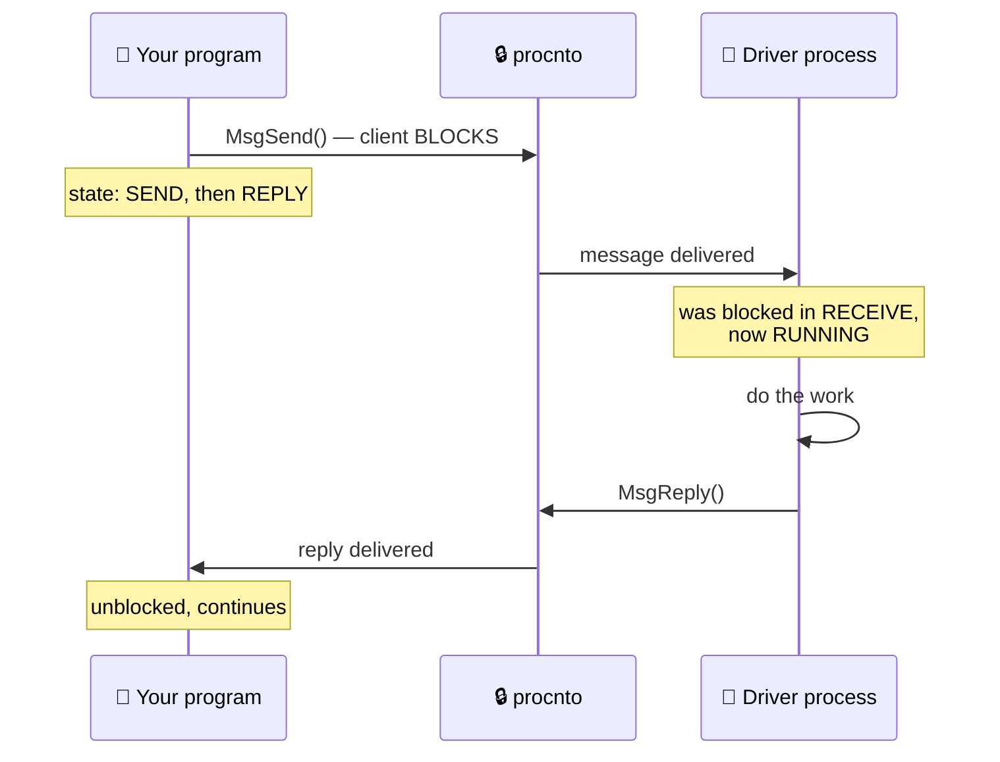

# Chapter 02 — What Is QNX?

> **By the end of this chapter you will** be able to explain QNX's one architectural bet, why it has
> survived unchanged since 1980, and how to tell whether anything you read about QNX online still
> applies to the system on your desk.

---

## 🏃 Fast-Track Summary

> **🏃 Path C reads only this box**, then goes to [Chapter 04](Chapter04_LicensingAndQNXEverywhere.md) — Chapter 03
> is the "why choose it" argument, which you may not need.

**What QNX is.** A commercial, **hard real-time**, **POSIX-compliant**, **microkernel** operating
system. Founded 1980, owned by BlackBerry since 2010, shipping in roughly **255 million vehicles**
plus medical, rail, industrial and nuclear systems. Certified to **IEC 61508 SIL 3** and
**ISO 26262 ASIL D**.

**The one bet.** Almost nothing runs in kernel space. `procnto` — the kernel — provides scheduling,
message passing, timers and memory management, and **nothing else**. Filesystems, the TCP/IP stack,
USB, graphics and every device driver are ordinary user-space processes with PIDs you can see, stop
and restart. Everything else about QNX is a consequence of that.

**The glue is synchronous message passing.** `MsgSend` blocks the client until the server calls
`MsgReply`. Because a driver is just a process, calling it *is* sending it a message — which is why
QNX made IPC fast enough to be the primary system call mechanism rather than an accessory. Chapter 13.

**Version map — the part that matters when reading anything online:**

| Name you may see | What it actually is | Still current? |
|------------------|---------------------|----------------|
| QNX 2, QNX 4 | 1980s / ~1991. Different kernel, different everything | ❌ Legacy |
| **QNX Neutrino** / QNX 6.x | The microkernel line, from 1995. `procnto` starts here | ⚠️ Ancestor of today's |
| QNX SDP 7.0 / 7.1 | 64-bit era, 2017 / 2020 | ⚠️ Supported, not free |
| **QNX SDP 8.0 · QNX OS 8.0** | **GA 21 March 2024.** What you installed | ✅ **This course** |

⚠️ **Most QNX material online describes 6.x.** "Neutrino" in a URL, `io-pkt` instead of `io-sock`,
`mkqnximage` as the only image tool, or `blackberry.qnx.com` as the domain are all reliable signals of
age. The concepts usually carry over; the commands often do not.

**Product family:** **QNX OS** (the RTOS) · **QNX SDP** (OS + toolchain, what you install) ·
**QNX Momentics** (the Eclipse IDE) · **QNX Hypervisor** (type-1, Ch 30) · **QNX OS for Safety** (the
certified variant) · **QNX Everywhere** (the free non-commercial tier you are using).

**Decode your kernel's name:** `procnto-smp-instr` = **proc**ess manager + **N**eu**t**rin**o**, the
**SMP** (multi-core) build, **instr**umented (kernel tracing enabled — Ch 26). Non-instrumented
variants exist for production.

**🏃 Skip to:** [Chapter 04 — QNX Licensing](Chapter04_LicensingAndQNXEverywhere.md). §4 of this chapter is a 5-minute
reference for decoding version numbers and stale documentation; §3.4 is the history, and is optional.

---

## 🎯 Learning Objectives

By the end of this chapter you will be able to:

- [ ] **State** what QNX is in three words, and defend each one.
- [ ] **Explain** the microkernel bet, and what it costs as well as what it buys.
- [ ] **Name** what is inside `procnto` and what is deliberately outside it.
- [ ] **Place** any QNX version or product name on a timeline and say whether it is current.
- [ ] **Recognise** stale QNX documentation from four reliable signals.
- [ ] **Decode** a QNX kernel binary's name and say what variant is running.
- [ ] **Demonstrate**, on your own VM, that a system service can die without taking the system down.

---

## 🧭 Prerequisites

| Need | Why |
|------|-----|
| [Chapter 01](Chapter01_WhatIsARealTimeSystem.md) | This chapter assumes you know what "hard real-time" means and why the worst case is what matters |
| A booting QNX VM *(labs only)* | [Setup Guides 01–03](../guides/README.md) |

---

## 🗺️ Mental model

One picture explains QNX. Everything else in this course is a detail of it.



*Diagram: a monolithic kernel places filesystems, the network stack and every driver inside kernel
space, where a fault can halt the machine; QNX places all of them in user space and leaves only
scheduling, memory, timers and message passing inside the kernel.*

> 💡 **You have already seen the right-hand box, on your own machine.** In Chapter 00's Lab 00.1 you
> ran `pidin` and found `devb-eide`, `io-sock`, `io-usb-otg` and `drm-virtio` sitting in the process
> list with ordinary PIDs. On Linux, all four are kernel code. That listing *is* this diagram.

---

## 1. The Problem

### 1.1 The question every OS designer has to answer

An operating system must do a great many things: schedule threads, manage memory, drive disks and
network cards, mount filesystems, paint pixels. **How much of that should run with unrestricted
privilege?**

The obvious answer is *"as much as possible"* — privileged code is fast, because it can touch any
memory and call any function directly.

QNX's founders gave the opposite answer in 1980, and have never changed it.

### 1.2 What the obvious answer costs

Consider a defect in a USB driver — a single bad pointer.

| | 🐧 Monolithic kernel | 🔷 QNX microkernel |
|---|---|---|
| Where the driver runs | **Kernel space**, unrestricted | **User space**, in its own address space |
| What the bad pointer can reach | **Any memory in the system** — the scheduler, another driver, your application | Only that driver's own pages. The MMU stops it |
| The result | Kernel panic. The machine stops | The driver process dies |
| Recovery | Reboot | Restart the process. Often nobody notices |
| Effect on the airbag task | It is gone, with the rest of the machine | **It never noticed** |

> ⚠️ **Now recall Chapter 01.** A hard deadline requires a *bound* on the worst case. **A kernel panic
> is an infinitely long response time.** No amount of careful scheduling matters if a third-party USB
> driver can end the system — and in a car, some of those drivers are third-party.

### 1.3 Why this is an argument about *evidence*, not just reliability

There is a second, less obvious consequence, and it is the one that put QNX in vehicles.

To certify a system to **ISO 26262 ASIL D**, you must produce evidence that nothing can interfere
with the safety-critical function. In a monolithic kernel, *everything privileged* is potentially in
scope: your safety case has to reason about the graphics driver, because it runs with the same
authority as the safety task.

When drivers are separate processes with hardware-enforced boundaries, you can argue **freedom from
interference** structurally — the MMU enforces it, and you can point at that. The safety argument
shrinks from "the whole kernel" to "the microkernel plus the components I chose".

> 💡 **This is why the architecture outlived its performance rationale.** Microkernels were
> controversial in the 1990s and mostly lost on speed. QNX kept the design, and it turned out that
> the thing worth having was not the fault isolation itself but **the ability to prove it to a
> third party.** Chapter 29 covers certification properly.

---

## 2. The Concept — the microkernel bet

### 2.1 What is left in the kernel

> 📖 **Microkernel.** An operating-system design in which the kernel provides only the services that
> *cannot* be provided anywhere else, and everything else runs as an ordinary user-space process.

QNX's kernel is called **`procnto`** — *process manager* + *Neutrino*. It provides exactly four
things:

| In `procnto` | Why it cannot be elsewhere |
|--------------|---------------------------|
| **Scheduling** | Something must decide which thread runs, and it must be the final authority |
| **Memory management** | Only privileged code can program the MMU |
| **Timers and clocks** | Must be tied to the hardware timer interrupt |
| **Message passing (IPC)** | Must cross address-space boundaries safely — so it must be privileged |

**Everything else is a process:**

| Component | On QNX it is… | You have already seen it as |
|-----------|---------------|-----------------------------|
| Disk driver | a process | `devb-eide` |
| Whole TCP/IP stack | a process | `io-sock` |
| USB stack | a process | `io-usb-otg` |
| Serial driver | a process | `devc-ser8250` |
| Graphics | a process | `drm-virtio`, `screen` |
| Filesystems | shared objects loaded by a process | `fs-qnx6.so`, `fs-dos.so` |
| Service launcher | a process | `slm` |

> 💡 **Read that table against Chapter 01's four latency components.** Because drivers are *ordinary
> threads*, they have *ordinary priorities* — you saw `devb-eide` running threads at 10 and 254. A
> driver cannot silently outrank your control loop just because it is a driver. On a monolithic
> kernel, kernel code effectively does.

### 2.2 What it costs

An honest account has to include the bill.

| Cost | Detail | How QNX manages it |
|------|--------|--------------------|
| **A message instead of a call** | A monolithic kernel calls its filesystem directly; QNX sends it a message | The IPC path is the most optimised code in the system — it *is* the system call mechanism |
| **Context switches** | Crossing address spaces costs real cycles | Kept small and, crucially, **bounded** — a known cost beats a small unpredictable one (Ch 01 §2.3) |
| **More processes** | 31 at idle on your VM, versus a handful on a minimal Linux | Each is small, and each is separately restartable |
| **Unfamiliarity** | Writing a driver means writing a *resource manager*, not a kernel module | Chapters 16–20 |

> ⚠️ **Do not oversell it.** For a build server or a laptop, this trade is simply bad: you pay for
> isolation you do not need with throughput you do. **QNX is not a better Linux.** It is a different
> answer to a different requirement — and Chapter 03 is about telling those requirements apart.

### 🐧 In Linux this would be…

| | 🐧 Linux | 🔷 QNX |
|---|---|---|
| Kernel size | ~30+ million lines, all privileged | Microkernel, orders of magnitude smaller |
| A new driver | A kernel module, loaded into kernel space | A **user-space process** — a *resource manager* |
| Driver crashes | Kernel panic, or a wedged subsystem | One process dies |
| Debugging a driver | `printk`, `kgdb`, careful | **Attach `gdb` to it like any program** ⭐ |
| Restarting a driver | Often means rebooting | `slay` it and start it again |
| Filesystem | In-kernel (`ext4.ko`) | A process (`fs-qnx6.so` under a manager) |
| Adding a syscall | Patch the kernel | You do not — you register a **path**, and clients `open()` it |

> 💡 **The debugging row is the one engineers notice first.** A QNX driver is an ordinary program. You
> can run it under `gdb`, set a breakpoint, inspect variables, and restart it — while the rest of the
> system keeps running. Anyone who has debugged a kernel module understands immediately what that is
> worth. Chapter 17 has you write one.

> ⚠️ **Linux has closed part of this gap.** FUSE puts filesystems in user space; DPDK and SPDK do the
> same for networking and storage; `PREEMPT_RT` bounds latency. The direction of travel is towards
> QNX's answer. What Linux does not offer is a **certified** version of it with a vendor's evidence
> package — see §1.3.

### 📦 Analogy — the hospital

> 🏥 **A monolithic kernel is a hospital where every member of staff has a master key.** The porter,
> the caterer, the radiographer — all of them can open the drug cabinet, the server room, the
> operating theatre. It is efficient: nobody ever waits for access. It works well right up until one
> person makes one mistake, and then the mistake can be *anywhere*.
>
> 🔷 **A microkernel is a hospital where each person has exactly the keys their job needs.** The
> caterer cannot enter the operating theatre. Passing something between departments takes a moment
> longer, because it goes through a defined handover instead of someone just walking in.
>
> **And here is the part that matters for certification:** when the inspector asks *"can the caterer
> affect surgery?"*, the second hospital can answer **"no, structurally — here is the lock."** The
> first can only answer *"we have policies."*

---

## 3. The Mechanism — how the pieces fit

### 3.1 If drivers are processes, how does anything reach them?

By **sending them a message**. This is why message passing sits *inside* the kernel: it is not an IPC
feature bolted onto QNX — it is how the operating system is assembled.



*Diagram: a client calls MsgSend and blocks; the kernel delivers the message to a driver process that
was waiting in RECEIVE; the driver does the work, calls MsgReply, and the client resumes.*

> 💡 **You watched this happen in Chapter 00.** Your `pidin` output showed
> `fullscreen-winmgr … REPLY 249881` — blocked waiting for `screen` — and `screen … REPLY 184343`,
> waiting for `io-hid`. That is this diagram, twice, on a live system nobody instrumented.

**Why *synchronous* — why does the client block?** Because it makes the message behave exactly like a
function call: the client cannot continue until the answer arrives, so there is no queue to size, no
callback to manage, and no "did it arrive?" to worry about. It also enables **priority inheritance**:
while the driver is handling your request it runs *at your priority*, which is the fix for
Chapter 01's priority-inversion problem, applied automatically to every service in the system.

> 📖 **`MsgSend()` and `MsgReply()`** — QNX calls, declared in `<sys/neutrino.h>`. **These are the
> two most important functions in QNX**, and unlike almost everything else you have met, they have no
> Linux equivalent. In outline: `MsgSend()` takes a connection, a message to send and a buffer for
> the reply, and **blocks** until the server answers; `MsgReply()` takes the client's identity, a
> status and the reply data, and unblocks it. Full signatures, every argument, and the third call
> (`MsgReceive()`) are Chapter 13's subject — that whole chapter exists to explain these properly.

Chapter 13 is built on this. For now: **a QNX system is a set of processes sending each other
messages, and `procnto` is the post office.**

### 3.2 Everything is a path

Because clients need to *name* the server they are messaging, QNX gives every service a **path**.

```bash
qnx# ls /dev
```

Those entries are not files. They are **processes that have registered a name** in a namespace the
kernel maintains. When you `open("/dev/ser1")`, the kernel looks up which process owns that path and
hands you a connection to it — after which `read()` and `write()` are messages to that process.

> 📖 **`open()`, `read()`, `write()`** — ordinary **POSIX** calls from `<fcntl.h>` and `<unistd.h>`,
> identical to Linux. `open()` takes a path and flags and returns a **file descriptor** (a small
> integer) or `-1` with `errno` set; `read()` and `write()` take that descriptor, a buffer and a
> length, and return the number of bytes transferred or `-1`.
>
> 💡 **The point is that they are unchanged.** On Linux they enter the kernel; on QNX they become
> **messages to a process** — and your code cannot tell the difference. That is what makes an
> existing POSIX program run on QNX without modification, and it is why writing a QNX driver means
> writing something clients reach through `open()` rather than through a new API. Chapters 16–17.

> 🐧 **In Linux this would be…** `/dev` populated by `udev` from kernel-internal device numbers.
> The resemblance is real but the mechanism is inverted: on QNX the *process* claims the path, and
> can be replaced at runtime by another process claiming it. Chapter 16 covers the pathname space;
> Chapter 17 has you register your own.

### 3.3 What this means for you, practically

| To do this | On QNX you | Chapter |
|------------|-----------|---------|
| Write a device driver | Write a normal C program that registers a path | 17 |
| Debug that driver | Run `gdb` on it | 08, 25 |
| Replace a driver at runtime | Kill it, start the new one | 27 |
| Survive a driver bug | Nothing extra — it is already isolated | 09 |
| Prove isolation to an auditor | Point at the MMU and the process boundary | 29 |

### 3.4 The history — evidence that the bet held

*(Optional. 🏃 Path C: skip. It is here because "since 1980" is a claim, and claims deserve dates.)*

| When | What happened |
|------|---------------|
| **1980** | **Dan Dodge** and **Gordon Bell**, both University of Waterloo graduates, found **Quantum Software Systems Limited** in Ontario, Canada. The product is called **QUNIX** — *Quantum Unix* |
| **1982** | First commercial release, for the Intel **8088**. A cease-and-desist from AT&T's lawyers over the *Unix* trademark forces a rename to **QNX** |
| early 1980s | **QNX 2.** QNX's own documentation notes it "is still running in many mission-critical systems to this day" |
| **~1991** | **QNX 4** — 32-bit, and **POSIX support**. The decision that makes your C knowledge transferable |
| **1995** | **QNX Neutrino** — the modern microkernel, and the origin of `procnto`. Everything you will run in this course descends from it |
| 1999 | The famous **1.44 MB demo floppy**: a bootable QNX with a GUI, web browser and TCP/IP stack on a single floppy disk. Still the most eloquent argument for a small kernel ever shipped |
| **2002** | QNX becomes a founding member of the **Eclipse** consortium; the IDE ships as **QNX Momentics Tool Suite** |
| **2004** | Acquired by **Harman International** — the automotive infotainment route in |
| **2010** | Acquired by **Research In Motion** (later **BlackBerry**) for roughly **$200 million**. QNX becomes the basis of the BlackBerry PlayBook and BlackBerry 10 |
| 2017 / 2020 | **QNX SDP 7.0** and **7.1** — the 64-bit era |
| **Jan 2024** | **QNX Everywhere** announced — the free non-commercial tier you are using |
| **21 Mar 2024** | **QNX SDP 8.0** general availability — QNX OS 8.0. **What you installed** |
| 2025 | The web presence moves from `blackberry.qnx.com` to **`qnx.software`** |

> 💡 **Two things worth taking from that table.**
>
> **Forty-five years is the argument.** Architectures that do not work get abandoned. The microkernel
> design chosen in 1980 is the one running on your VM — refined continuously, never replaced. Compare
> the fate of Mach, the other famous microkernel of the era, which survives mainly as a hybrid inside
> macOS.
>
> **The POSIX decision in 1991 is why you are not learning a new language.** QNX could have invented
> its own interfaces. Because it did not, `clock_gettime`, `nanosleep` and `pthread_mutex_init` mean
> the same on QNX as on Linux ([D-014](../meta/Doubts.md#d-014)), and only the genuinely QNX-specific
> parts — message passing, resource managers — have to be learned.

> 🐣 **Not the same Gordon Bell.** QNX's co-founder shares a name with the famous DEC computer
> architect (of Bell's Law and the Gordon Bell Prize). They are different people, and search engines
> will happily conflate them.


---

## 4. The Product & Version Map

> Chapters that teach an API use §4 for function signatures. This chapter's referenceable material is
> **how to place any QNX name, number or web page in time** — which is the difference between
> following a working instruction and following a 2011 one.

### 4.1 The product family

**"QNX" names a company, an OS, a toolkit and a licence tier.** Untangling them:

| Name | What it is | Do you have it? |
|------|-----------|-----------------|
| **QNX OS** | The operating system itself — `procnto` and its services. Formerly *QNX Neutrino RTOS* | ✅ Running in your VM |
| **QNX SDP** | *Software Development Platform* — the OS **plus** the cross-toolchain, headers, libraries and target images | ✅ `~/qnx800` |
| **QNX Momentics** | The Eclipse-based IDE, shipped with SDP | ⬜ Optional (Setup Guide 04) |
| **QNX Software Center** | The installer/updater that fetched your SDP | ✅ `~/qnx/qnxsoftwarecenter` |
| **QNX OS for Safety** | The pre-certified variant, with its safety manual and evidence package | ❌ Commercial |
| **QNX Hypervisor** | Type-1 hypervisor — run QNX and Linux side by side on one SoC | ❌ Commercial (Ch 30) |
| **QNX Everywhere** | The **free non-commercial licence tier**, announced January 2024 | ✅ **What you are using** |

> ⚠️ **"QNX SDP 8.0" and "QNX OS 8.0" are not the same thing**, though they version together. The SDP
> is what you install on Linux; the OS is what runs on the target. `uname -a` on the target reports
> the **OS** version.

### 4.2 The version timeline, and what each name signals

| Version | Era | Kernel | Reading material about it |
|---------|-----|--------|---------------------------|
| QNX 2 | early 1980s | Pre-Neutrino | ❌ Historical only |
| QNX 4 | ~1991 | Pre-Neutrino, 32-bit, POSIX | ❌ Legacy; still in the field |
| **QNX Neutrino / QNX 6.x** | 1995 → 2010s | **`procnto`** | ⚠️ **Concepts yes, commands often no** |
| QNX SDP 7.0 / 7.1 | 2017 / 2020 | `procnto`, 64-bit | ⚠️ Mostly applies. **7.1 is not in the free tier** |
| **QNX SDP 8.0 / QNX OS 8.0** | **21 Mar 2024** | `procnto` | ✅ **Yours** |

### 4.3 ⚠️ How to spot stale QNX material — four reliable signals

**This is the single most useful skill in this section.** Most QNX writing on the web describes 6.x,
and it looks perfectly authoritative.

| Signal | What you see | What it means |
|--------|--------------|---------------|
| **The domain** | `blackberry.qnx.com` | Pre-2025. Now redirects to `qnx.software`, but archived copies and blog posts still show it |
| **The word "Neutrino" in a product name** | "QNX Neutrino RTOS 6.5" | The 6.x line. Present-day docs say *QNX OS*; `procnto` keeps the name internally |
| **`io-pkt`** | `io-pkt-v6-hc` for networking | The **old** network stack. QNX 8.0 uses **`io-sock`** — which is what your `pidin` showed |
| **The doc URL's version segment** | `.../docs/6.5.0/...` or `.../docs/7.0.0/...` | Read the number. `docs/8.0/` is current |

**Two more worth knowing:**

- **`mkqnximage` presented as the only way to get a VM.** Still a real tool — you used it — but 8.0
  adds **QSTI** (pre-built images) and **CTI** (custom images). Material that does not mention them
  predates them.
- **Momentics presented as the only IDE.** VS Code with the QNX Toolkit is now a first-class option.

> 💡 **The rule of thumb.** *Concepts* age well — message passing, resource managers and the priority
> model have been stable for thirty years, so a 2009 explanation of `MsgSend` is probably still
> excellent. **Commands, filenames, URLs and package names age badly.** Read old material for
> understanding; verify every command against the 8.0 documentation before typing it.

> ⚠️ **This course is not exempt.** Its own guides have been wrong five times so far — a QNX Software
> Center option that does not exist, a nested directory, an SSH policy misidentified. That is why
> every step carries an `[UNVERIFIED]` marker until someone runs it. Apply the same suspicion here
> that you would to a 2011 forum post.

### 4.4 Where to look things up

| Need | Go to |
|------|-------|
| The 8.0 documentation set | [qnx.com/developers/docs/8.0](https://www.qnx.com/developers/docs/8.0/) |
| QNX Everywhere (free tier) docs | [qnx.com/developers/docs/qnxeverywhere](https://www.qnx.com/developers/docs/qnxeverywhere/introduction.html) |
| A C library function | *C Library Reference*, in the 8.0 set — and the header on your own disk |
| Open-source ports | [github.com/qnx-ports](https://github.com/qnx-ports) · [gitlab.com/qnx/ports](https://gitlab.com/qnx/ports) |
| People | Discord, r/QNX, Stack Overflow's `qnx` tag |
| This course's curated set | [`ReferenceLinks.md`](../reference/ReferenceLinks.md) — every link with the date it was verified |

---

## 5. Worked Example — reading your own system's identity

Everything in §§1–4 is visible on the VM you booted. Here is how to read it.

### 5.1 The kernel's name is a specification

From your Chapter 00 lab:

```text
       1   1 /proc/boot/procnto-smp-instr   0f RUNNING
```

**Decode it:**

```text
procnto-smp-instr
│   │  │   └── instrumented — kernel event tracing is compiled in
│   │  └────── SMP — symmetric multiprocessing, uses all your cores
│   └───────── nto — NeuTrinO
└───────────── proc — the process manager
```

| Part | Means | Consequence for you |
|------|-------|---------------------|
| `proc` | **Process manager.** The kernel's other half: it creates processes, owns the pathname space, and handles memory | This is why the kernel is not called "kernel" — process management *is* what it mostly does |
| `nto` | **Neutrino** | The 1995 microkernel line. Still the internal name three decades on |
| `-smp` | Built for **multiple cores** | `pidin info` showed 8 processors, and QNX is using them |
| `-instr` | **Instrumented** — the tracing hooks are compiled in | **Chapter 26's System Analysis Toolkit will work on your VM.** A production image would usually drop this to save the overhead |

> 💡 **The kernel comes in variants, and you are running the developer-friendly one.** That is a
> deliberate choice by whoever built the QSTI image: instrumentation costs a little performance and
> buys complete visibility. Chapter 21 has you make this choice yourself, in a build file.

### 5.2 The OS's identity

```text
QNX qnxqemu 8.0.0 2026/02/27-11:02:56EST x86pc x86_64
 │      │      │              │             │      └── architecture — matches gcc_ntox86_64
 │      │      │              │             └───────── machine class
 │      │      │              └─────────────────────── kernel build timestamp ⭐
 │      │      └────────────────────────────────────── QNX OS version (§4.2 → current)
 │      └───────────────────────────────────────────── hostname, from the image
 └──────────────────────────────────────────────────── the OS
```

> ⭐ **The build timestamp is the identity that matters.** "8.0.0" is a product line;
> `2026/02/27-11:02:56EST` is *this exact kernel*. When you report a problem — to this course, to a
> forum, or to QNX — that string is the first thing anyone competent will ask for. Every chapter in
> this course records it in its front matter for exactly that reason.

### 5.3 The architecture, visible in a directory listing

```bash
qnx# ls /proc/boot
```

Your Chapter 00 output contained, among about eighty files:

| File | What it proves |
|------|----------------|
| `procnto-smp-instr` | **The kernel.** One file |
| `devb-eide`, `devc-ser8250` | Disk and serial drivers — **as separate binaries**, not kernel modules |
| `fs-qnx6.so`, `fs-dos.so` | Filesystems — **shared objects**, loaded by a process |
| `libc.so.6`, `ldqnx-64.so.2` | The C library and dynamic linker — the same POSIX ones from [D-014](../meta/Doubts.md#d-014) |
| `slm`, `slm.cfg` | The service launcher and **its plain-text configuration** |
| `pidin`, `ksh`, `ls`, `cat` | Ordinary utilities, in the boot image because they are needed before any disk mounts |

> 💡 **Count the kernel.** One file out of eighty is `procnto`. The other seventy-nine are ordinary
> programs and libraries. On Linux, the equivalents of `devb-eide`, `fs-*.so` and the network stack
> would all be *inside* `vmlinuz`.
>
> **That ratio is the microkernel bet, expressed as a directory listing.** Nothing in §§1–3 is
> theoretical — you can `ls` it.

### 5.4 Putting it together

You can now answer, from your own machine, the question this chapter is named after:

> **What is QNX?** A hard real-time operating system whose kernel — `procnto-smp-instr`, one file of
> about eighty in the boot image — provides only scheduling, memory, timers and message passing.
> Every driver, filesystem and network stack runs beside your own programs as an ordinary process
> with an ordinary priority. It has held that design since 1980, it speaks POSIX so your C knowledge
> transfers, and the version on this machine is QNX OS 8.0.0, kernel build `2026/02/27`.


---

## 🧪 Labs

> Boot the VM: `cd ~/qnx800/images/qemu/qemu && mkqnximage --run`
> **No compiler needed for any lab in this chapter.**

### Lab 02.1 — Identify your system  [🐣🚶🏃]

> **Objective.** Read your system's identity and place it on §4's map.
> **Time.** 10 minutes. **No coding.**

```bash
qnx# uname -a
qnx# ls /proc/boot | wc -l
qnx# ls /proc/boot | grep procnto
```

**New commands, since this course explains everything it uses:**

| Command | Standard | Does |
|---------|----------|------|
| `uname -a` | POSIX | Prints system name, hostname, release, version, machine — *all* fields (`-a`) |
| `wc -l` | POSIX | *Word count.* `-l` counts **lines** — so it counts entries from `ls` |
| `grep pattern` | POSIX | Prints only the lines matching `pattern` |
| `\|` (pipe) | POSIX shell | Sends one command's output into the next command's input |

✅ **Expected:** a `QNX … 8.0.0 …` line, roughly **80** files, and one `procnto-*` binary plus its
`.sym` symbol file.

**Answer from your own output:**

1. Which **QNX OS version** are you running, and where does it sit on §4.2's timeline?
2. What is your **kernel build timestamp**, and why does it matter more than "8.0.0"?
3. What **variant** of the kernel is running? Decode every part of the name.
4. Roughly what fraction of `/proc/boot` is the kernel?

<details>
<summary>Answers</summary>

1. **QNX OS 8.0.0** — the current line, GA 21 March 2024. Everything in the 8.0 documentation applies
   to you; 6.x material may not.
2. **`2026/02/27-11:02:56EST`** (yours may differ). It identifies *this exact kernel build*, where
   "8.0.0" identifies only a product line. It is the first thing anyone will ask for in a bug report.
3. **`procnto-smp-instr`** — **proc**ess manager, **N**eu**t**rin**o**, **SMP** (multi-core),
   **instr**umented (kernel tracing compiled in, so Chapter 26's tools will work here).
4. **One file in about eighty.** Everything else is ordinary programs and libraries. That ratio is
   the microkernel design, visible without reading a word of documentation.

</details>

---

### Lab 02.2 — Watch a service die, and bring it back  [🚶🏃]

> **Objective.** Demonstrate on your own machine the claim §1.2 makes: a system service can fail
> without taking the system with it.
> **Time.** 15 minutes. 📌 `[UNVERIFIED]` — verification block **V7**.

> ⚠️ **Do this at the serial console, or over SSH but on a *non-network* target.** Killing a network
> component over SSH kills your own session. This lab deliberately picks a harmless target.

**Step 1 — find a non-essential service.**

```bash
qnx# pidin | grep vncserv
```

`vncserv` is the VNC server the image starts by default. Nothing in this course uses it, which makes
it a safe volunteer.

**Step 2 — kill it.**

```bash
qnx# slay vncserv
qnx# pidin | grep vncserv
```

| Command | Does |
|---------|------|
| `slay name` | **QNX-specific.** Terminates processes **by name** — no need to look up a PID first. Roughly Linux's `pkill`. `slay -f` forces; plain `slay` asks politely |

✅ **Expected:** the second `pidin` finds nothing. The process is gone.

**Step 3 — check the system.**

```bash
qnx# pidin info
qnx# ls /
qnx# uname -a
```

✅ **Expected: everything still works.** You killed a running server and the operating system did not
notice.

**Step 4 — bring it back.**

```bash
qnx# vncserv &
qnx# pidin | grep vncserv
```

| Syntax | Does |
|--------|------|
| `&` | POSIX shell — run in the **background**, returning your prompt immediately |

✅ **Expected:** a new process, with a **different PID** ([D-013](../meta/Doubts.md#d-013) explains
why it is not the old one).

> 💡 **What you just did is not possible on a monolithic kernel.** There is no way to kill Linux's
> network stack and start a new one, because it is not a *thing* that can be killed — it is code
> inside the kernel. Here it is a process, and processes can be replaced.
>
> **This is the foundation of high availability**, which Chapter 27 builds on: if a service can be
> restarted, it can be restarted *automatically*, by a monitor that notices it died. `slm` — the
> launcher in your boot log — is the beginning of exactly that.

📋 **Please report all four steps.** If `slay vncserv` needs different syntax, or the restart fails,
that is a genuine finding.

---

### 💥 Break It — try to kill the kernel  [🚶]

> **Objective.** Find the boundary. §2.1 claims `procnto` is different in kind from everything else;
> test it.
> **Time.** 5 minutes. 📌 `[UNVERIFIED]`

> ⚠️ **This may stop your VM.** That is fine — it is disposable, and restarting it is one command.
> **Do not run this on anything you care about**, and be sure you know how to reboot:
> `Ctrl+A` then `X`, then `mkqnximage --run` again.

**Predict first, then run it:**

```bash
qnx# pidin | head -3
qnx# slay procnto-smp-instr
```

**Before you press enter — what do you expect?**

1. It works, and the system halts?
2. It is refused, with an error?
3. It appears to succeed and nothing happens?

<details>
<summary>What it means, whichever happens</summary>

**Most likely: refused**, with a permission or "no such process" error. `procnto` is **pid 1**, and
it is not an ordinary process that happens to be important — it is the code implementing `slay`
itself. Asking the kernel to terminate the kernel is asking the scheduler to deschedule the
scheduler.

**If your VM halted instead:** you have proved the same point from the other direction, and more
memorably. Reboot with `mkqnximage --run` — nothing is lost, the image is read-only and your work
lives on the host.

**Either way, the lesson is the same, and it is the point of the whole chapter.** In Lab 02.2 you
killed the VNC server and the system shrugged. Here you reached the one component that *is* the
system. **QNX's design is precisely about making that set as small as possible** — one file out of
eighty in `/proc/boot`.

> 💡 **The engineering question this poses**, which Chapter 09 answers properly: *what else is in the
> "cannot be restarted" set?* On QNX it is `procnto`, and — depending on how you built the image —
> a very small number of components everything else depends on. On a monolithic kernel that set is
> **every line of kernel code**, including the graphics driver.

</details>

📋 **Report which of the three outcomes you got**, and the exact message. The guide currently predicts
outcome 2 and has never been run.

---

### 🐣 Path A Activity — date the documentation  [🐣]

> **Objective.** Practise §4.3's skill — the most immediately useful thing in this chapter.
> **Time.** 15 minutes. **No VM required.**

For each snippet: **which QNX era is it from, what is the giveaway, and does the advice still apply?**

| # | Snippet |
|---|---------|
| 1 | *"Start the network stack with `io-pkt-v6-hc -d e1000`, then run `ifconfig` to check the address."* |
| 2 | *"Full documentation is at `http://blackberry.qnx.com/developers/docs/6.5.0SP1/`"* |
| 3 | *"Use `MsgSend()` to send a message to the server; the client blocks until the server calls `MsgReply()`."* |
| 4 | *"Create your VM with `mkqnximage --build`, then `mkqnximage --run`."* |
| 5 | *"QNX Neutrino RTOS 6.6 supports both ARMv7 and x86."* |

<details>
<summary>Answers</summary>

| # | Era | Giveaway | Still applies? |
|---|-----|----------|----------------|
| 1 | **6.x / 7.x** | **`io-pkt`** — QNX 8.0 uses **`io-sock`**, which is what your `pidin` showed | ❌ The command is wrong. The *idea* — the network stack is a process you start — is exactly right |
| 2 | **Pre-2025** | The **`blackberry.qnx.com`** domain *and* the **`6.5.0`** version segment | ❌ Two signals at once. Current is `qnx.com/developers/docs/8.0/` |
| 3 | **Any era — timeless** | Nothing dates it | ✅ **Still exactly true.** Message passing has been stable for thirty years. This is the "concepts age well" rule |
| 4 | **7.x-era, still valid** | No stale signal, but no mention of QSTI or CTI | ⚠️ **`mkqnximage` still works — you use it.** But 8.0 offers pre-built (QSTI) and custom (CTI) images too, so this is incomplete rather than wrong |
| 5 | **6.x** | **"Neutrino RTOS 6.6"** — present-day naming is *QNX OS 8.0* | ❌ As a version statement. Note QNX 8.0 supports **x86_64 and AArch64 only** — 32-bit ARMv7 is gone |

**The pattern:** #3 is a *concept* and survives; #1, #2 and #5 are *commands, URLs and version
numbers* and do not. #4 shows the subtler case — **still correct, but no longer the whole picture**,
which is the hardest kind of staleness to spot.

</details>

> 💡 **Keep this instinct.** You will spend real time on QNX reading material written for an older
> version, because there is not that much of it and the good explanations are often old. The skill is
> not avoiding old material — it is **reading it for concepts and verifying every command.**


---

## ✅ Mastery Check

**1.** *(Recall)* Name the four things `procnto` provides, and say why each cannot live in user space.

<details><summary>Answer</summary>

| | Why it must be privileged |
|---|---|
| **Scheduling** | Something must be the final authority on which thread runs |
| **Memory management** | Only privileged code can program the MMU |
| **Timers and clocks** | Must be tied to the hardware timer interrupt |
| **Message passing** | Must move data across address-space boundaries safely |

Everything else — filesystems, drivers, the network stack, graphics — is deliberately outside.

</details>

**2.** *(Recall)* You find a blog post recommending `io-pkt-v6-hc` on `blackberry.qnx.com`. Two things
date it. What are they, and is the post worthless?

<details><summary>Answer</summary>

**`io-pkt`** — QNX 8.0's stack is **`io-sock`**. And **`blackberry.qnx.com`** — the domain moved to
`qnx.software` in 2025.

**Not worthless.** Its *commands* are wrong; its *explanation* of how a user-space network stack
works is probably still accurate, because the architecture has not changed. Read it for
understanding, verify every command against the 8.0 docs.

</details>

**3.** *(Apply)* A colleague says: *"QNX is just Linux with better real-time scheduling."* Give the
two-sentence correction.

<details><summary>Answer</summary>

The scheduler is the *smaller* difference. **QNX's kernel contains only scheduling, memory, timers
and message passing** — every driver, filesystem and network stack runs as an ordinary user-space
process, so a driver fault kills a process rather than the machine.

That structural isolation is also what makes ISO 26262 ASIL D certification tractable: freedom from
interference can be argued from the MMU rather than from code review of the whole kernel.

</details>

**4.** *(Apply)* You run `slay io-sock` over SSH. Predict what happens, and what it demonstrates.

<details><summary>Answer</summary>

**Your SSH session dies immediately** — `io-sock` *is* the network stack, so killing it destroys the
connection carrying your command.

But the **system keeps running.** At the serial console you would find it alive, with `io-sock`
missing, and you could start it again.

**It demonstrates the chapter's whole thesis, painfully.** The network stack is a process: killable,
restartable, and not part of the kernel. On Linux there is nothing to kill — it is code inside
`vmlinuz`. This is why Lab 02.2 uses `vncserv` instead, and why Chapter 27's high-availability
manager exists: if a service can be restarted, it can be restarted *automatically*.

</details>

**5.** *(Design)* You are choosing an OS for an industrial controller: a 500 Hz control loop, a
touchscreen HMI, and a USB port for third-party diagnostic dongles whose drivers you did not write.
Which QNX property matters most, and why is it a *safety* argument rather than a reliability one?

<details><summary>Answer</summary>

**Process isolation of the USB driver.**

The third-party driver is code you did not write and cannot fully review, and the deadline that
matters is the 500 Hz loop. On a monolithic kernel that driver runs with **full kernel privilege**:
a bad pointer in it can corrupt the scheduler, and a long interrupt-disabled region in it can delay
your control loop by an unbounded amount (Chapter 01 §3.2, unbound ①). Your worst-case analysis would
have to include code you do not control.

On QNX it is a **process**. It has an ordinary priority — below your control loop — and its memory
is fenced by the MMU.

**Why it is a safety argument.** Reliability says *"it probably will not crash"*. Safety requires
**evidence**. Here you can point at a hardware-enforced boundary and a priority that is strictly
lower, and argue **freedom from interference** structurally. "We reviewed the driver carefully" is
not evidence; "it cannot reach our memory and cannot outrank our loop" is.

</details>

---

## 🧠 Concept Recap

- **Three words: real-time, microkernel, POSIX.** Each is load-bearing.
- **`procnto` provides four things** — scheduling, memory, timers, message passing — **and nothing
  else.** Everything else is a process.
- **The bet's real payoff is evidence, not just reliability.** Isolation you can point at is what
  makes ASIL D certification tractable.
- **The cost is real:** messages instead of function calls, more context switches, an unfamiliar
  driver model. Worth it only when the requirement demands it.
- **Message passing is the glue**, which is why it is inside the kernel. `MsgSend` blocks; the server
  inherits the client's priority.
- **Everything is a path.** A service registers a name; clients `open()` it.
- **Since 1980, one architecture.** POSIX arrived in QNX 4 (~1991); `procnto` in Neutrino (1995);
  QNX SDP 8.0 went GA **21 March 2024**.
- **Four staleness signals:** `blackberry.qnx.com` · "Neutrino" in a product name · `io-pkt` ·
  a version segment in a doc URL.
- **Concepts age well; commands age badly.** Read old QNX material for understanding, verify every
  command.
- **`procnto-smp-instr`** = process manager · Neutrino · multi-core · instrumented for tracing.

---

## 📎 Cheat Sheet

**The family**

| Name | Is |
|------|----|
| **QNX OS** | The RTOS. Formerly *QNX Neutrino RTOS* |
| **QNX SDP** | OS + cross-toolchain + images. What you installed |
| **QNX Momentics** | The Eclipse IDE |
| **QNX Everywhere** | The free non-commercial licence tier |
| **QNX OS for Safety** / **Hypervisor** | Commercial variants |

**Version map**

| Version | Year | Verdict |
|---------|------|---------|
| QNX 2 / QNX 4 | 1980s / ~1991 | ❌ Legacy |
| QNX Neutrino 6.x | 1995 → | ⚠️ Concepts yes, commands no |
| SDP 7.0 / 7.1 | 2017 / 2020 | ⚠️ Not in the free tier |
| **SDP 8.0 / QNX OS 8.0** | **21 Mar 2024** | ✅ Current |

**Staleness signals**

| Sign | Age |
|------|-----|
| `blackberry.qnx.com` | Pre-2025 |
| "QNX Neutrino RTOS 6.x" | 6.x |
| `io-pkt` *(8.0 uses `io-sock`)* | Pre-8.0 |
| `docs/6.5.0/`, `docs/7.0.0/` in a URL | Read the number |

**Decoding `procnto-smp-instr`**

| Part | Means |
|------|-------|
| `proc` | Process manager |
| `nto` | Neutrino |
| `-smp` | Multi-core build |
| `-instr` | Instrumented — kernel tracing available (Ch 26) |

**Commands introduced in this chapter**

| Command | Standard | Does |
|---------|----------|------|
| `uname -a` | POSIX | System name, host, release, version, machine |
| `wc -l` | POSIX | Count lines |
| `grep pattern` | POSIX | Print matching lines |
| `cmd1 \| cmd2` | POSIX shell | Pipe output into input |
| `cmd &` | POSIX shell | Run in the background |
| **`slay name`** | **QNX** | Terminate processes **by name**. `-f` forces. Roughly Linux's `pkill` |

---

## 🔗 Further Reading

| Resource | Why |
|----------|-----|
| [QNX's own "A little history"](https://get.qnx.com/developers/docs/7.0.0/com.qnx.doc.neutrino.getting_started/topic/preface_History.html) | The founding, the AT&T letter and the version milestones, in QNX's words. Source for §3.4 |
| [QNX SDP 8.0 Release Notes](https://www.qnx.com/developers/docs/relnotes8.0/com.qnx.doc.release_notes/topic/sdp8_rn.html) | What changed in the version you are running |
| [QNX 8.0 System Architecture](https://www.qnx.com/developers/docs/8.0/com.qnx.doc.neutrino.sys_arch/topic/about.html) | The authoritative account of §§2–3. **The best single document about QNX** |
| [QNX (Wikipedia)](https://en.wikipedia.org/wiki/QNX) | The acquisition history and wider context |
| [`ResourcesMeta.md`](../reference/ResourcesMeta.md) | Rated review of books, courses and videos — including which are stale |

---

## ➡️ What's Next

**[Chapter 03 — Why & Where QNX Is Used](Chapter03_WhyAndWhereQNXIsUsed.md)**

You know *what* QNX is and what it trades. Chapter 03 is the argument you will actually have at work:
where QNX is deployed and why, how it compares with Linux, FreeRTOS, VxWorks and Zephyr, and — just
as importantly — **when the honest answer is "use Linux".**

It closes Part 0. After it, Part 1 begins the hands-on work.

> 🐣 **Path A:** Chapter 03 is written for you — it is the business and architecture case.
> 🚶 **Path B:** Chapter 03, then Part 1.
> 🏃 **Path C:** skip to [Chapter 04](Chapter04_LicensingAndQNXEverywhere.md) unless you need to justify the choice to
> someone.

---

## 📝 Chapter Changelog

| Version | Date | Change |
|---------|------|--------|
| 1.0 | 2026-08-26 | Created, with the `PLAN.md` §17 library-function audit applied at authoring time: `MsgSend`/`MsgReply` (§3.1) and `open`/`read`/`write` (§3.2) explained on first use, and every shell command introduced in the labs given a purpose-and-standard table. The microkernel bet and its costs; what is in `procnto` and what is deliberately outside; message passing as the glue; the product family and version map; four signals for spotting stale documentation. History verified against QNX's own account and BlackBerry's SDP 8.0 GA announcement. §5 decodes the learner's own `procnto-smp-instr`, `uname -a` and `/proc/boot`. Lab 02.1 uses verified output; Lab 02.2 and the break-it exercise are `[UNVERIFIED]` pending block V7. |
