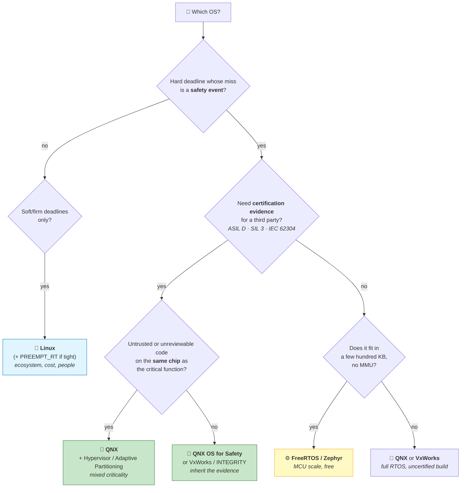

# Chapter 03 — Why & Where QNX Is Used

> **By the end of this chapter you will** be able to decide whether a given project should use QNX —
> and to argue it, in either direction, to an architect who will push back.

---

## 🏃 Fast-Track Summary

> **🏃 Path C reads only this box**, then goes to [Chapter 04](Chapter04_Licensing.md). This is the
> chapter you need only if you have to *justify* the choice to somebody.

**Where QNX actually is.** **255 million vehicles** on the road (BlackBerry, 15 October 2024 — up
20 million year on year, 80 million since 2020). Plus surgical robots and infusion pumps, rail
signalling, industrial control, nuclear instrumentation, and increasingly robotics.

**The certifications are the product.** IEC 61508 **SIL 3** · ISO 26262 **ASIL D** ·
IEC 62304 **Class C** (medical) · EN 50128 / EN 50657 **SIL 3** (rail). QNX sells a *pre-certified*
OS with an evidence package — you inherit the argument rather than constructing it.

**Three questions decide it.** Answer these and the choice usually makes itself:

| Question | If yes |
|----------|--------|
| 1. Is there a **hard deadline** whose miss is a safety event? | → RTOS territory |
| 2. Do you need **certification evidence** from a third party? | → **QNX or another certified RTOS.** This is the decisive one |
| 3. Must **untrusted or unreviewable code** coexist with critical code on one chip? | → microkernel / hypervisor |

**Two "no"s and you probably want Linux.**

**The landscape:**

| | Best at | Weak at |
|---|---|---|
| **QNX** | Certified hard real-time, mixed criticality, MMU isolation | Cost; smaller ecosystem; overkill for soft real-time |
| **Linux + `PREEMPT_RT`** | Ecosystem, drivers, developers, cost | No mainline ASIL D story; monolithic blast radius |
| **FreeRTOS** | Kilobyte-scale MCUs, free, simple | Not an OS — a scheduler. No MMU isolation. Certification is a separate product (SafeRTOS) |
| **Zephyr** | Modern MCU RTOS, Apache 2.0, strong momentum | Younger safety story; MCU-scale |
| **VxWorks** | The incumbent in aerospace/defence, DO-178C pedigree | Cost; proprietary; similar niche to QNX |
| **INTEGRITY** | Highest-assurance separation kernel | Cost; specialised |

**The honest answer is often Linux.** A telemetry gateway, a kiosk, a data logger, an ML inference
box — none of these needs a bounded worst case, and paying for one costs you drivers, developers and
budget. **Knowing when not to use QNX is the judgement that gets you taken seriously.**

**🏃 Skip to:** [Chapter 04 — QNX Licensing](Chapter04_Licensing.md). §4 is a decision checklist worth
five minutes if you will ever be in that meeting.

---

## 🎯 Learning Objectives

By the end of this chapter you will be able to:

- [ ] **Name** the industries QNX dominates, and the *reason* in each case — which is not the same reason.
- [ ] **Explain** why certification, not latency, is usually the deciding factor.
- [ ] **Apply** a three-question test to a real project and reach a defensible answer.
- [ ] **Compare** QNX against Linux, FreeRTOS, Zephyr, VxWorks and INTEGRITY on the axes that matter.
- [ ] **Argue the other side** — identify projects where QNX is the wrong answer, and say why.
- [ ] **Write** a one-page recommendation that an architect would accept or reject on its merits.

---

## 🧭 Prerequisites

| Need | Why |
|------|-----|
| [Chapter 01](Chapter01_WhatIsARealTimeSystem.md) | "Hard deadline" and "bounded worst case" are used precisely here |
| [Chapter 02](Chapter02_WhatIsQNX.md) | The microkernel bet, and *freedom from interference* |
| A booting VM | **Lab 03.2 only.** Everything else is paper |

---

## 🗺️ Mental model

Most OS choices are made badly — by habit, by what the last project used, or by whoever argues
loudest. Here is the decision, drawn properly.



*Diagram: a decision tree that starts with whether a missed deadline is a safety event, then asks
whether third-party certification evidence is required, then whether untrusted code must share the
chip — routing to Linux, an MCU RTOS, or QNX accordingly.*

> 💡 **Notice where the tree branches hardest.** Not at "how fast?" — at **"do you need evidence?"**
> Latency is an engineering problem with many solutions. Certification is a procurement and liability
> problem with very few.

---

## 1. The Problem

### 1.1 How OS choices actually get made

In practice, four bad reasons decide most projects:

| Bad reason | Why it fails |
|-----------|--------------|
| *"It's what we used last time."* | The last project's requirements were different. This is how a soft real-time media box ends up on a licensed RTOS, and how a brake controller ends up on stock Linux |
| *"Linux is free."* | The licence is free. Certifying it is not, and for ASIL D may not be possible at all on your schedule |
| *"We need real-time, so we need an RTOS."* | Chapter 01: *hard* real-time needs an RTOS. Soft real-time usually does not |
| *"The vendor has certification."* | Certification applies to a **specific configuration** used in a **specific way**. It is inherited, not automatic |

The last one is the most expensive, because it is nearly right.

### 1.2 The question that is actually being asked

When someone asks *"should we use QNX?"*, they are almost never asking about latency. They are asking
one of these:

- **"Can we ship this without being sued?"** → a liability question
- **"Will the certification body accept it?"** → an evidence question
- **"Can we afford it — in money, people and schedule?"** → an economics question
- **"Will one supplier's bad driver kill our product?"** → an architecture question

**Only the last is technical.** This chapter is mostly about the other three, because that is where
the decision is genuinely made — and because an engineer who can speak to them is far more useful
than one who can only quote interrupt latencies.

---

## 2. The Concept — the three questions

### 2.1 Question 1: is a missed deadline a safety event?

Chapter 01's classification, applied.

| Your answer | Means |
|-------------|-------|
| **"Yes — someone could be hurt."** | 🔴 Hard real-time. You need a bounded worst case, and you need to be able to *prove* the bound |
| **"No, but the result becomes useless."** | 🟠 Firm. An RTOS helps; Linux with `PREEMPT_RT` is often enough |
| **"No, it just gets worse."** | 🟡 Soft. **Use Linux.** An RTOS buys you nothing here and costs you a great deal |

> ⚠️ **Be honest at this step, in both directions.** Teams overstate hardness because it sounds
> serious, and understate it because the honest answer is inconvenient. A dropped video frame in a
> reversing camera is firm. A dropped frame in the *object-detection* path that triggers automatic
> braking is not.

### 2.2 Question 2: do you need certification evidence? ⭐

**This is the decisive question**, and the one engineers most often skip.

> 📖 **Functional safety certification.** An independent assessor's judgement that a system meets a
> standard's requirements — reached by examining *evidence*: development process, hazard analysis,
> test coverage, tool qualification, and freedom-from-interference arguments.

| Standard | Domain | QNX holds |
|----------|--------|-----------|
| **IEC 61508** | The general industrial base standard | **SIL 3** |
| **ISO 26262** | Road vehicles | **ASIL D** — the most stringent level |
| **IEC 62304** | Medical device software | **Class C** — can cause death or serious injury |
| **EN 50128 / EN 50657** | Rail (software / on-board) | **SIL 3** |

**What buying a certified OS actually buys you.** Not correctness — a safety manual and an evidence
package. The vendor has already done the hazard analysis, the tool qualification and the test
campaigns for the OS, and hands you the artefacts. Your assessor examines *your* application against
that baseline instead of against a bare kernel.

> 💡 **The economics, which nobody tells you up front.** Certifying an OS from scratch is measured in
> **years and millions**, and much of that cost is not engineering — it is producing documentation an
> assessor will accept. When a vendor sells you a certified OS, you are buying **their** completed
> paperwork. That is why a per-unit royalty on a $30 000 medical device is not the argument people
> think it is.

> ⚠️ **Certification is inherited, not automatic.** It applies to a **specific version**, in a
> **specific configuration**, used in **specific ways** documented in the safety manual. Enable a
> feature the manual excludes and you are outside the certified envelope. Chapter 29 covers this
> properly; for now, know that "QNX is ASIL D certified" is a true sentence that has been used to
> justify a great many uncertifiable systems.

### 2.3 Question 3: must untrusted code share the chip?

Modern embedded systems consolidate. One SoC now runs what used to be four boxes: an instrument
cluster, infotainment, a connectivity stack, and something safety-critical.

The moment code you did not write — a third-party driver, an app store, a Linux guest — shares
silicon with your safety function, you need **isolation you can demonstrate**.

| Approach | What it gives |
|----------|---------------|
| **Microkernel process isolation** | MMU-enforced boundaries between drivers and your code (Chapter 02) |
| **Adaptive partitioning** | Guaranteed CPU budgets, so a runaway subsystem cannot starve yours (Chapter 27) |
| **Type-1 hypervisor** | Whole guest OSes isolated — QNX and Linux side by side, with the safety function outside the Linux guest (Chapter 30) |

> 💡 **This is why "QNX or Linux?" is often a false choice.** The common automotive answer is
> **both**: QNX Hypervisor underneath, a Linux guest for the infotainment stack and its ecosystem,
> and the safety-critical function in a QNX guest beside it. You get Android's app store *and* an
> ASIL D braking path, on one chip, with a boundary you can point at.

### 🐧 In Linux this would be… — and when Linux is the right answer

This section exists because a course that cannot say when its subject is wrong is marketing.

**Choose Linux when:**

| Situation | Why |
|-----------|-----|
| Deadlines are soft or firm | `PREEMPT_RT` (mainlined 2024) handles a great deal. Latency is rarely the real constraint |
| You need breadth of hardware support | Linux drives essentially everything. QNX drives what QNX has a BSP for |
| You need people | Linux developers are abundant; QNX developers are not — **which cuts both ways for your career** |
| You need the ecosystem | Containers, Python, ROS 2, ML frameworks, package managers. All far easier |
| Unit cost dominates | No royalties, no seats |
| It is a gateway, kiosk, logger or ML box | None of these has a hard deadline |

**Choose QNX when:**

| Situation | Why |
|-----------|-----|
| A missed deadline is a safety event | Bounded, provable worst case |
| **You must satisfy an assessor** | The evidence package. **Usually the real reason** |
| Mixed criticality on one chip | Microkernel + partitioning + hypervisor |
| A driver fault must not be fatal | Process isolation |
| Long field life with a supported OS | A vendor who will still be patching in fifteen years |

> ⚠️ **On "certified Linux".** There are real efforts — the Linux Foundation's **ELISA** project, and
> commercial vendors offering certified Linux variants at lower integrity levels. What does not exist
> today is **mainline Linux certified to ASIL D**. If someone tells you otherwise, ask which
> configuration, which version, which assessor, and to which level. The answer is informative either
> way.

### 📦 Analogy — the building inspector

> 🏗️ **Two builders quote for a hospital operating theatre.**
>
> **Builder A** is excellent, cheap, and has built thousands of houses. Their work is genuinely good.
> When the inspector asks for the fire-rating certificates on the wall assemblies, they say: *"we used
> good materials and we're careful."*
>
> **Builder B** costs more and offers less choice of finish. But every assembly comes with a
> certificate, a test report, and an installation manual saying exactly how it must be used to remain
> valid.
>
> **For a garden room, hire A.** For the operating theatre, B — not because A's walls would burn, but
> because you cannot *open* the theatre without the paperwork.
>
> **QNX is builder B.** The engineering is good, and the paperwork is what you are buying.

---

## 3. The Mechanism — where QNX actually is, and why

Each industry chose QNX for a *different* reason. Knowing which reason applies to your project is
most of the skill.

### 3.1 🚗 Automotive — the largest deployment

**255 million vehicles** (BlackBerry, 15 October 2024): +20 million year on year, +80 million since
2020. QNX is in digital cockpits, instrument clusters, ADAS, gateways and telematics.

**Why automotive chose it:**

| Reason | Detail |
|--------|--------|
| **ASIL D** | The instrument cluster must display a warning light. The braking path must not be interfered with |
| **Consolidation** | One SoC replaces several ECUs — which forces mixed criticality (§2.3) |
| **Field life** | A vehicle is supported for 15+ years. So must the OS be |
| **Supply chain** | Tier-1 suppliers already know QNX. Familiarity is a real procurement force |
| **The hypervisor** | QNX's hypervisor was the first to be certified to ASIL D, which made "Android cluster + safe braking, one chip" a shippable architecture |

### 3.2 🏥 Medical — where the paperwork is the product

Surgical robots, infusion pumps, ventilators, imaging, patient monitors.

**IEC 62304 Class C** is the relevant classification: software whose failure can cause death or
serious injury. QNX holds it.

> 💡 **Medical device economics invert the usual argument.** A royalty per unit is trivial against a
> device selling for tens of thousands, and against a regulatory submission costing far more. What
> matters is **time to submission** — and an OS that arrives with its evidence package can remove
> months. In this market the licence fee is not a cost centre; it is schedule insurance.

### 3.3 🚆 Rail and 🏭 industrial

Signalling, interlocking, train control, on-board systems — **EN 50128** and **EN 50657 SIL 3**.
Industrial control, robotics and process automation lean on **IEC 61508 SIL 3**.

> 💡 **Note the deadlines here.** Rail signalling deadlines are often *seconds*, not microseconds —
> comfortable by any measure. **These are hard real-time systems with loose deadlines**, exactly
> Chapter 01 §2.2's point that hardness is about consequences, not tightness. Nobody chose QNX for
> rail because of latency.

### 3.4 🤖 Robotics — the growing one

BlackBerry has been explicit about diversifying beyond automotive into **robotics and medical**,
leveraging the certifications it already holds.

The driver is **collaborative robots** — machines that share space with people. A cobot arm needs a
hard-deadline safety function (stop on contact) alongside a soft-deadline application stack (vision,
planning, ROS 2). That is §2.3's mixed criticality exactly, and it is why this course's capstone
offers a robotics flavour.

### 3.5 The competitive landscape

| | **QNX** | **Linux + `PREEMPT_RT`** | **FreeRTOS** | **Zephyr** | **VxWorks** | **INTEGRITY** |
|---|---|---|---|---|---|---|
| **Kind** | Microkernel RTOS | Monolithic GPOS | Scheduler/kernel | RTOS | RTOS | Separation kernel |
| **Scale** | MMU-class SoCs | MMU-class SoCs | **Kilobytes**, MCUs | KB–MB, MCUs | MMU-class | MMU-class |
| **Licence** | Commercial *(free non-commercial)* | GPL, free | MIT, free | Apache 2.0, free | Commercial | Commercial |
| **MMU isolation** | ✅ Core to the design | ✅ For apps; **drivers are in-kernel** | ❌ Usually no MMU | ⚠️ Limited | ✅ | ✅ Strongest |
| **Hard real-time** | ✅ | ⚠️ Good, not certified | ✅ | ✅ | ✅ | ✅ |
| **Safety certification** | ✅ **ASIL D, SIL 3, 62304 C, EN 50128** | ❌ Not mainline | ⚠️ Via **SafeRTOS** | ⚠️ Emerging | ✅ Strong, esp. DO-178C | ✅ Highest assurance |
| **Ecosystem** | Modest, growing | 🏆 Enormous | Large for MCUs | Growing fast | Modest | Small |
| **Hiring** | ⚠️ Scarce | 🏆 Abundant | Easy | Easy | ⚠️ Scarce | ⚠️ Very scarce |
| **Best at** | Certified mixed-criticality | Everything else | Tiny deterministic controllers | Modern MCU work | Aerospace/defence heritage | Highest assurance |

> 💡 **Read the "Hiring" row twice.** Scarcity is a project risk *and* a career opportunity. It is the
> reason this course exists, and the reason Chapter 34 covers the job market.

> ⚠️ **FreeRTOS is not in QNX's category, despite both being called "RTOS".** FreeRTOS is a
> **scheduler** — a few thousand lines, no MMU, no filesystem, no networking unless you add them, and
> typically **one address space** where any task can corrupt any other. That is the right design for
> a sensor node with 64 KB of RAM, and completely unrelated to what QNX does. Comparing them is like
> comparing a bicycle to a train: both are transport.

### 🔬 Deep dive — what certification actually costs and buys

<details>
<summary>Optional. Read it before your first conversation with a safety manager.</summary>

**What an assessor examines** is not mainly your code:

| Evidence | What it means |
|----------|---------------|
| Hazard analysis | You identified what can go wrong and how badly |
| Requirements traceability | Every safety requirement traces to design, code and a test |
| Test coverage | Often **MC/DC** at the highest levels — expensive to achieve and to prove |
| Tool qualification | Your **compiler** must be qualified. A miscompilation is a hazard |
| Freedom from interference | Non-critical code cannot affect critical code — Chapter 02 §1.3 |
| Development process | Reviews, configuration management, change control, competence records |

**Why buying beats building.** Producing that set for an operating system is a multi-year programme
in which documentation, not code, is the dominant cost. Vendors amortise it across every customer.

**What you still have to do.** Everything above, **for your application** — plus proving you used the
OS within its safety manual. The manual is the contract: it lists the certified configuration,
prohibited features, and the assumptions the certificate rests on.

> ⚠️ **The most common expensive mistake** is discovering, late, that the architecture relies on a
> feature the safety manual excludes. Read the safety manual **before** the architecture is fixed,
> not during the assessment.

**Tool qualification is the underrated one.** `qcc` is a compiler; a compiler bug is a systematic
fault. At ASIL D you need evidence the toolchain is fit for purpose — which is another artefact
vendors sell, and another reason "we'll use GCC and Linux" is cheaper only until the assessor arrives.

Chapter 29 covers all of this properly.

</details>


---

## 4. The Decision Framework

> This chapter's referenceable material is a checklist you can take into a meeting. Chapters that
> teach an API use §4 for signatures; here it is the procedure.

### 4.1 The eight questions, in order

Work down. **Stop at the first one that decides it.**

| # | Question | If yes | If no |
|---|----------|--------|-------|
| **1** | Is there a deadline whose miss could **injure someone or destroy property**? | → Q2 | → Q6 |
| **2** | Will an **independent assessor** examine this system? | → Q3 | → Q5 |
| **3** | Which standard and level? *(ASIL D · SIL 3 · IEC 62304 C · EN 50128)* | Shortlist OSes **holding that certification** | — |
| **4** | Must **untrusted or unreviewable code** run on the same chip? | Add hypervisor / partitioning to the requirement | — |
| **5** | Hard deadline, no certification needed. Does it fit in a few hundred KB with no MMU? | **FreeRTOS / Zephyr** | **QNX / VxWorks**, uncertified build |
| **6** | Are deadlines **firm** — a late result is worthless but harmless? | **Linux + `PREEMPT_RT`**, and measure | → Q7 |
| **7** | Soft deadlines only? | **Linux.** Stop here | → Q8 |
| **8** | Is a deadline involved at all? | Reread the requirements | **Linux** |

### 4.2 The cost columns nobody fills in

When someone says "QNX is expensive", make the comparison complete:

| Cost | QNX | Linux |
|------|-----|-------|
| Licence / royalty | 💰 Real | Free |
| Certification evidence for the OS | **Included** | 💰💰💰 Yours to produce, or buy from a vendor |
| Tool qualification | Available | 💰 Yours to arrange |
| Developer salaries | 💰 Scarcer, so pricier | Abundant |
| Driver development | 💰 Fewer BSPs — you may write one | Usually exists |
| Schedule risk on certification | Low — evidence exists | 💰💰 **High. The one that kills projects** |
| Long-term support | Vendor contract | Yours to arrange, or a vendor's |

> 💡 **The bottom two rows decide most real arguments.** A licence fee is a known number in a
> spreadsheet. *"We think we can certify Linux for ASIL D, and we'll find out eighteen months in"* is
> an unbounded risk — and unbounded risk is exactly what Chapter 01 taught you to distrust.

### 4.3 Four sentences that should trigger a follow-up question

| When you hear… | Ask |
|----------------|-----|
| *"We need real-time."* | **"Hard, firm or soft? What happens on a miss?"** |
| *"QNX is certified."* | **"To what level, in which configuration, and have we read the safety manual?"** |
| *"Linux is free."* | **"Including the certification evidence and the tool qualification?"** |
| *"We'll add real-time later."* | **"Which of the five unbounds are we adding it around?"** (Ch 01 §3.2) |

### 4.4 What to write down

A recommendation an architect will engage with contains exactly this:

1. **The deadline**, with a number, a statistic and the consequence of a miss *(Chapter 01 §4.3)*
2. **The certification requirement**, if any — standard and level
3. **The isolation requirement** — what untrusted code exists, and where
4. **The recommendation**, in one sentence
5. **The cost of being wrong**, in both directions
6. **What you would need to learn** to change your mind

> 💡 **Point 6 is what separates a recommendation from an opinion.** Stating in advance what evidence
> would change your answer is the fastest way to be trusted — and occasionally the fastest way to
> discover you are wrong before it is expensive.

---

## 5. Worked Example — three projects, three answers

Same framework, three outcomes. **One of them is Linux**, and that is the point.

### 5.1 🤖 A collaborative robot arm

> A robot arm shares a workspace with human operators. It must stop within **10 ms** of detecting
> contact. It also runs vision, path planning and a ROS 2 stack. Sold into EU factories.

| # | Question | Answer |
|---|----------|--------|
| 1 | Injury possible? | **Yes** — a cobot arm can crush a hand |
| 2 | Assessor? | **Yes** — EU machinery directive |
| 3 | Standard? | **IEC 61508 SIL 3** (via ISO 10218 for robots) |
| 4 | Untrusted code on-chip? | **Yes** — ROS 2 and a vision stack nobody will formally review |

**Recommendation: QNX**, with the safety function in a QNX partition and the ROS 2 stack either in a
Linux guest under the hypervisor or in a separate adaptive partition.

**Cost of being wrong:**
- *Wrongly QNX*: you overpaid and hired scarcer engineers.
- *Wrongly Linux*: **you cannot ship**, discovered late, because the assessor will not accept the
  freedom-from-interference argument for a ROS 2 stack sharing a monolithic kernel with the stop
  function.

> 💡 **Asymmetric consequences.** One error costs money; the other costs the product. Where the
> penalties are lopsided, the framework should be too.

### 5.2 🏭 A factory telemetry gateway

> Collects sensor data from 200 machines, buffers it, uploads to the cloud every 30 seconds. A
> dashboard shows live values. Runs on an industrial x86 box.

| # | Question | Answer |
|---|----------|--------|
| 1 | Injury possible? | **No.** It reads and forwards. It controls nothing |
| 6 | Firm deadlines? | **No** |
| 7 | Soft only? | **Yes** — a late upload is a slightly stale dashboard |

**Recommendation: Linux.** Stop at Q7.

**And the reasoning is worth stating out loud**, because this is the project that most often gets
over-engineered: you need MQTT libraries, TLS, a package manager, container deployment, cloud SDKs
and people who can maintain it at 2 a.m. Linux gives you all of that. QNX would cost money, cost
ecosystem, cost hiring — and buy a bounded worst case that **nothing in the requirements asks for**.

> ⚠️ **"But it's industrial, so it must be real-time."** No. *Industrial* is a market; *real-time* is
> a timing property. Chapter 01 §2.1 exists to keep those separate, and this is where the distinction
> earns its keep.

### 5.3 🏥 An infusion pump

> Delivers medication at a programmed rate. An over-delivery can kill. A touchscreen shows dose and
> alarms. Wi-Fi reports to the hospital system. Sells for ~$8 000; expected field life 12 years.

| # | Question | Answer |
|---|----------|--------|
| 1 | Injury possible? | **Yes** — this is the textbook case |
| 2 | Assessor? | **Yes** — FDA submission, or equivalent |
| 3 | Standard? | **IEC 62304 Class C** |
| 4 | Untrusted code on-chip? | **Yes** — a Wi-Fi stack, and the UI |

**Recommendation: QNX**, dosing logic isolated from UI and connectivity.

**Now the economics**, which look different from §5.1:

| | |
|---|---|
| Royalty per unit | Small fraction of an $8 000 device |
| Regulatory submission | Far larger than the OS cost |
| **Time to submission** | **The dominant business variable** |
| 12-year support | A vendor contract, versus maintaining your own kernel fork for twelve years |

**The licence fee is not the decision.** Schedule and support are. An OS arriving with its evidence
package can remove months from a submission, and months of delay on a medical device cost more than
the OS ever will.

> 💡 **Three projects, three different reasons.** The cobot chose QNX for **isolation**; the pump for
> **schedule and evidence**; the gateway chose Linux because **it had no deadline at all**. If you
> take one thing from this chapter, take that: *"is it real-time?"* is rarely the question that
> decides.


---

## 🧪 Labs

> Only Lab 03.2 needs the VM. Everything else is judgement, which is the skill this chapter teaches.

### Lab 03.1 — Decide four projects  [🐣🚶🏃]

> **Objective.** Use §4.1's framework until it is automatic.
> **Time.** 20 minutes. **Paper only.**

For each: work the questions **in order**, stop at the first that decides, and write the one-sentence
recommendation.

| # | Project |
|---|---------|
| 1 | A **smart thermostat**. Reads temperature, drives a relay, has a phone app. If it responds a second late, the room is 0.1 °C off |
| 2 | An **engine control unit**. Injection timing at 6000 rpm; a miss can destroy the engine or cause a stall in traffic |
| 3 | A **digital signage player** in an airport. Shows flight information, updates every 30 s, must not display a stale screen for more than 2 minutes |
| 4 | A **drone flight controller**. 400 Hz stabilisation loop; also runs camera streaming and a mission planner. Sold commercially in the EU |

<details>
<summary>Answers</summary>

**1. Thermostat → 🐧 Linux** *(or an MCU RTOS, on cost grounds)*
Q1 no — nobody is hurt by 0.1 °C. Q6 no. Q7 **yes, soft**. Stop.
*If the BOM demands a microcontroller, FreeRTOS or Zephyr — but that is a **cost** decision, not a
real-time one.*

**2. Engine control unit → ⚙️ FreeRTOS/Zephyr, or 🔷 QNX — it depends on Q2**
Q1 **yes** — a stall in traffic is a safety event. Q2 is the pivot: a modern ECU is in ISO 26262
scope, so **Q3 → ASIL B–D → a certified RTOS**. Q4 usually no: an engine ECU is a dedicated
microcontroller with nothing untrusted on it.
*Note the trap: this is a hard real-time system that may well run on an MCU-class RTOS, because
nothing untrusted shares the chip. **Hard real-time does not automatically mean QNX.***

**3. Signage player → 🐧 Linux**
Q1 no. Q6 — arguably firm: a stale screen is worthless. But 2 minutes is an eternity, and Linux meets
it while asleep. Q7 **yes**. Stop.
*A 2-minute deadline is a scheduling problem, not a real-time one.*

**4. Drone flight controller → 🔷 QNX** *(or a split architecture)*
Q1 **yes** — a falling drone injures people. Q2 **yes** — EU commercial operation. Q3 → the relevant
aviation/machinery regime. Q4 **yes** — camera streaming and mission planning are not safety code.
*Common real-world answer: **split it.** A dedicated MCU running the 400 Hz loop with FreeRTOS, plus
a Linux companion for camera and planning — isolation by **separate silicon** rather than by
partitioning. Both are valid; the framework tells you isolation is **required**, not how to buy it.*

</details>

> 💡 **The two most instructive answers are #2 and #4**, because in both the framework says
> *"certified RTOS"* and the cheapest way to satisfy it may not be QNX. **The framework tells you the
> requirement, not the product.** An engineer who confuses those has stopped thinking and started
> shopping.

---

### 💥 Break It — argue the wrong side  [🚶🏃]

> **Objective.** Test whether you understand the decision or have only memorised the answer.
> **Time.** 15 minutes. **Paper only.**

Take **§5.2's telemetry gateway** — the one where the answer was clearly Linux.

**Your task: build the strongest possible case for QNX.** Genuinely try. Then find where it breaks.

<details>
<summary>How this usually goes, and what it teaches</summary>

**The strongest honest case for QNX here:**

1. *"Future-proofing — one day it might do closed-loop control."* Plausible-sounding.
2. *"It talks to 200 machines; a driver bug could take the gateway down."* True — uptime matters.
3. *"Consistent latency makes the dashboard feel better."* True but trivial.
4. *"We already have QNX licences and QNX engineers."* **The strongest one, and it is not technical.**

**Where each breaks:**

1. **Speculative requirements are how systems get over-built.** If closed-loop control arrives, it
   will need its own hazard analysis and probably its own hardware. Design for the requirement you
   have, and keep the interfaces clean.
2. **The failure mode is wrong.** A gateway that dies and restarts in 10 seconds loses 10 seconds of
   buffered telemetry. That is an availability requirement met by a watchdog and a restart — not a
   safety requirement needing MMU isolation.
3. Consistent latency is not worth an ecosystem.
4. **This one might actually win** — and it is worth understanding why. Organisational capability is a
   real engineering input: a team that knows QNX may deliver faster on QNX than on an unfamiliar
   Linux stack. *But say it out loud.* "We are choosing QNX because our team knows it" is a defensible
   argument. Dressing it up as a technical requirement is not, and it corrodes trust when discovered.

**What the exercise teaches:** most bad OS decisions are not made by fools. They are made by
reasonable people generalising a real requirement from a project where it applied. The defence is
Q1: **is a missed deadline a safety event?** For the gateway the answer is no, and everything after
that is preference.

</details>

> 💡 **Do this to yourself on real projects.** Before recommending anything, spend ten minutes
> genuinely arguing the other side. If you cannot construct a decent counter-case, you do not
> understand the decision well enough to make it.

---

### Lab 03.2 — Find the certification machinery on your own target  [🚶🏃]

> **Objective.** See that §2.2's claims are not marketing — the mechanisms are on your disk.
> **Time.** 10 minutes. 📌 `[UNVERIFIED]` — verification block **V8**.

Certification requires *enforceable* boundaries, not intentions. QNX ships the enforcement.

```bash
qnx# ls /proc/boot | grep -i -E 'secpol|ability'
```

| Command | Standard | Does |
|---------|----------|------|
| `grep -i -E 'a\|b'` | POSIX | `-i` ignore case; `-E` extended regular expressions, where `\|` means *or* |

✅ **Expected** — from the Chapter 00 listing, these were present:

```text
ability
libsecpol.so.1
```

**What they are:**

| Item | What it does |
|------|-------------|
| **`libsecpol.so.1`** | QNX's **security policy** library. Policies declare which process may do what — register which paths, open which devices, use which kernel calls |
| **`ability`** | QNX **abilities** — fine-grained privileges replacing all-or-nothing root. A process can be granted *exactly* the power to attach one interrupt, and nothing else |

> 💡 **This is what "freedom from interference" looks like as a file.** Chapter 02 §1.3 argued that
> QNX's advantage is being able to *point at* an enforced boundary. Here it is: a policy file the
> kernel enforces, and a privilege model that lets a driver hold one capability instead of root.
>
> An assessor asking *"what stops the telemetry process writing to the actuator?"* can be answered
> with a policy, not a promise. Chapter 28 covers this properly.

Two more, still from your boot image:

```bash
qnx# ls /proc/boot | grep -E 'procnto|slm'
```

| Item | Relevance to certification |
|------|---------------------------|
| `procnto-smp-instr` | **One** kernel binary. The certified item is small and enumerable — versus "every line of kernel code" |
| `slm`, `slm.cfg` | A **declarative, human-readable** launch configuration. An assessor can read what starts, in what order, at what priority |

📋 **Please report the output.** If `ability` or `libsecpol.so.1` are missing from your image, that is
worth knowing — it would mean the QSTI image ships without the security policy machinery, and this
lab needs rewriting.

---

### 🐣 Path A Activity — write the memo  [🐣]

> **Objective.** Produce the actual deliverable this chapter is training you for.
> **Time.** 25 minutes. **No VM, no code.** *(This is also the **Part 0 review**.)*

**Pick one:** a project at your work, or §5.1's collaborative robot.

Write **one page**, using §4.4's six headings:

```text
1. The deadline .......... number, statistic, and what happens on a miss
2. Certification ......... standard and level, or "none required"
3. Isolation ............. what untrusted code exists, and where it runs
4. Recommendation ........ one sentence
5. Cost of being wrong ... in BOTH directions
6. What would change my mind
```

**Rules that make it a real memo:**

- ❌ No sentence containing "fast" without a number beside it
- ❌ No "real-time" without hard / firm / soft attached
- ✅ Section 5 must be honest in **both** directions — including the cost of *your own* recommendation being wrong
- ✅ Section 6 must name **specific evidence**, not "further investigation"

<details>
<summary>What a good section 6 looks like</summary>

| ❌ Weak | ✅ Strong |
|---------|----------|
| "Further investigation needed" | "If the safety assessor confirms a ROS 2 stack can be argued as freedom-from-interference on a monolithic kernel, Linux becomes viable and I would change my recommendation" |
| "Depends on cost" | "If QNX royalties exceed $40/unit at our 50 000/year volume, the certified-Linux route becomes worth a two-week feasibility study" |
| "We might need more performance" | "If measured worst-case stop latency on the Linux prototype stays under 6 ms across a 48-hour loaded soak, Q1's premise weakens" |

**The difference:** a strong section 6 names a **test that could be run** and a **threshold that
would flip the answer**. It converts an opinion into a hypothesis — and it is the paragraph that
makes senior people trust you.

</details>

> 💡 **This memo is the most transferable thing in Part 0.** The QNX APIs in Parts 2–4 are valuable,
> but plenty of people can learn an API. Being the engineer who can write a clear, honest,
> falsifiable one-page recommendation is rarer — and it works on every technology choice, not just
> this one.


---

## ✅ Mastery Check

**1.** *(Recall)* Name the four certifications QNX holds and the domain each serves.

<details><summary>Answer</summary>

| Standard | Level | Domain |
|----------|-------|--------|
| IEC 61508 | **SIL 3** | General industrial — the base standard others derive from |
| ISO 26262 | **ASIL D** | Road vehicles |
| IEC 62304 | **Class C** | Medical device software |
| EN 50128 / EN 50657 | **SIL 3** | Rail — software / on-board |

</details>

**2.** *(Recall)* Why is *"QNX is certified"* an incomplete statement?

<details><summary>Answer</summary>

Certification applies to a **specific version**, in a **specific configuration**, used in **specific
ways** set out in the safety manual. Step outside that envelope — enable an excluded feature, use an
unqualified toolchain, ignore a documented assumption — and the certificate does not cover you.

You **inherit** the evidence; you do not receive it automatically. The follow-up questions are: *to
what level, in which configuration, and have we read the safety manual?*

</details>

**3.** *(Apply)* A team says: *"Our system is real-time — it processes 10 000 messages per second — so
we need QNX."* What is wrong, and what do you ask?

<details><summary>Answer</summary>

**They have described throughput, not a deadline.** 10 000 messages/second is a *rate*; it says
nothing about whether any individual message has a completion deadline, or what happens if one is
late. A batch system can hit that rate with 5-second latency.

**Ask:** *"What is the deadline for a single message, and what happens if one is late?"*

If the answer is *"nothing, it just queues"* → **soft, use Linux.** If it is *"the actuator moves at
the wrong moment"* → now you have a real-time requirement, and the framework can start.

**High throughput often argues *for* Linux**, which is optimised for exactly that.

</details>

**4.** *(Apply)* Your manager: *"Linux is free, QNX costs $X per unit. Justify the difference."*
Answer in four sentences.

<details><summary>Answer</summary>

> The licence is one line of the comparison. We also need certification evidence for the OS, a
> qualified toolchain, and fifteen years of security patches — with QNX those are included, and with
> Linux they are ours to produce or buy. The item that should worry us most is not the fee but the
> schedule: certifying an OS ourselves is an unbounded risk on the critical path to submission, and
> QNX converts it into a known number. If we conclude we do not actually need certification, then I
> agree — we should use Linux, and I will say so.

**Why the last sentence matters.** It shows you applied a framework rather than defending a
preference, and it makes the first three sentences credible.

</details>

**5.** *(Design)* A car's infotainment must run Android for its app store. The instrument cluster —
same SoC — must display the brake warning light to **ASIL D**. Propose an architecture and say what
each part buys.

<details><summary>Answer</summary>

**QNX Hypervisor on the bare metal**, with two guests:

| Component | Runs | Why |
|-----------|------|-----|
| **Hypervisor** | Bare metal | Type-1, ASIL D certified. Enforces the boundary in hardware |
| **Guest A: Android** | Under the hypervisor | The app store, media, third-party code. **Assumed hostile** |
| **Guest B: QNX** | Under the hypervisor | The cluster and the brake warning path. ASIL D |
| **Partitioning** | Within guest B | Guarantees CPU budget so the cluster cannot be starved (Ch 27) |

**What each buys:**

- **The hypervisor** makes freedom from interference an argument about **hardware**, not about
  reviewing Android.
- **Two guests** means the app ecosystem and the safety function coexist without the safety case
  covering Android.
- **QNX for guest B** brings the ASIL D evidence package for the guest itself.

**Why not one OS.** Android on QNX loses the app ecosystem, which is the commercial reason the
infotainment exists. Everything on Linux makes the ASIL D case for the warning light effectively
unarguable — the Android stack shares a kernel with it.

**This is §2.3's point:** "QNX *or* Linux" is often a false choice, and the industry's answer at scale
is **both, with a certified boundary between them**.

</details>

---

## 🧠 Concept Recap

- **255 million vehicles** (Oct 2024), plus medical, rail, industrial and robotics.
- **The certifications are the product:** IEC 61508 SIL 3 · ISO 26262 ASIL D · IEC 62304 Class C ·
  EN 50128/50657 SIL 3.
- **Three questions decide it:** safety-critical deadline? · certification evidence needed? ·
  untrusted code on the same chip?
- **Certification, not latency, is usually decisive.** Latency has many solutions; evidence has few.
- **Certification is inherited, not automatic** — a version, a configuration, a safety manual.
- **Each industry chose QNX for a different reason:** automotive for consolidation + ASIL D; medical
  for schedule and evidence; rail for SIL 3 with *loose* deadlines; robotics for mixed criticality.
- **Hard real-time does not automatically mean QNX.** If nothing untrusted shares the chip, an MCU
  RTOS may satisfy the same requirement far more cheaply.
- **FreeRTOS is a scheduler, not an OS.** Different category, despite the shared acronym.
- **"QNX or Linux" is often a false choice** — the scaled answer is a hypervisor with both.
- **Frequently the honest answer is Linux.** Say so. It is the judgement that earns trust.
- **The cost columns nobody fills in:** certification evidence, tool qualification, and **schedule
  risk** — the last being the one that kills projects.

---

## 📎 Cheat Sheet

**The framework — stop at the first decision**

| # | Question | Yes | No |
|---|----------|-----|-----|
| 1 | Miss = injury or destruction? | → 2 | → 6 |
| 2 | Independent assessor? | → 3 | → 5 |
| 3 | Which standard/level? | Shortlist OSes holding it | — |
| 4 | Untrusted code on-chip? | + hypervisor / partitioning | — |
| 5 | Fits in a few hundred KB, no MMU? | FreeRTOS / Zephyr | QNX / VxWorks |
| 6 | Firm deadlines? | Linux + `PREEMPT_RT` | → 7 |
| 7 | Soft only? | **Linux** | → 8 |
| 8 | Any deadline at all? | Reread the requirements | **Linux** |

**Certifications QNX holds**

| Standard | Level | Domain |
|----------|-------|--------|
| IEC 61508 | SIL 3 | Industrial (base) |
| ISO 26262 | **ASIL D** | Automotive |
| IEC 62304 | Class C | Medical |
| EN 50128 / 50657 | SIL 3 | Rail |

**Landscape, in one line each**

| OS | One line |
|----|----------|
| **QNX** | Certified microkernel RTOS. Mixed criticality. Costs money |
| **Linux + `PREEMPT_RT`** | Everything else. No mainline ASIL D |
| **FreeRTOS** | A scheduler for kilobyte MCUs. SafeRTOS is the certified sibling |
| **Zephyr** | Modern MCU RTOS, Apache 2.0, momentum, younger safety story |
| **VxWorks** | Commercial RTOS; aerospace/defence heritage, DO-178C |
| **INTEGRITY** | Highest-assurance separation kernel |

**Questions to ask**

| Hearing | Ask |
|---------|-----|
| "We need real-time" | "Hard, firm or soft? What happens on a miss?" |
| "QNX is certified" | "To what level, which configuration, read the safety manual?" |
| "Linux is free" | "Including certification evidence and tool qualification?" |
| "We'll add real-time later" | "Around which of the five unbounds?" |

**Commands used in this chapter**

| Command | Standard | Does |
|---------|----------|------|
| `grep -i -E 'a\|b'` | POSIX | Case-insensitive extended-regex match; `\|` = or |
| `ls \| grep x` | POSIX shell | List, keep only matching lines |

---

## 🔗 Further Reading

| Resource | Why |
|----------|-----|
| [BlackBerry: QNX powers 255 million vehicles](https://www.automotiveworld.com/news-releases/blackberry-qnx-embedded-technology-powers-255-million-vehicles-on-the-road-today/) | The source for §3.1's figure, 15 October 2024 |
| [QNX Hypervisor: first ASIL D certification](https://www.prnewswire.com/news-releases/blackberry-qnx-hypervisor-awarded-worlds-first-automotive-safety-integrity-level-asil-d-certification-300969956.html) | Why "Android cluster + safe braking on one chip" became shippable |
| [QNX functional safety](https://www.qnx.com/) | The current certification list, from the vendor |
| [ELISA Project](https://elisa.tech/) | The serious effort to make Linux usable in safety-critical systems. Read it before claiming Linux "can't" be certified |
| [`ResourcesMeta.md`](../reference/ResourcesMeta.md) | Rated review of books, courses and videos |

> ⚠️ **Vendor pages are marketing, and this one is no exception in kind.** BlackBerry's numbers are
> auditable claims in investor communications, which is why they are usable here — but always ask
> *which configuration was certified*, and read the safety manual rather than the datasheet.

---

## ➡️ What's Next

**🎉 That completes Part 0.** You can now say what real-time means, what QNX is, and when to use it —
which is the entire conceptual foundation. Everything from here is hands-on.

**[Chapter 04 — QNX Licensing & QNX Everywhere](Chapter04_Licensing.md)**

Part 1 begins with the thing you have already done: the licence. Chapter 04 explains *what you
actually agreed to* — what "non-commercial" permits and forbids, why writing training material is
explicitly allowed, and what would have to change to ship a product.

> 🏁 **Part 0 review.** If you have not done it, the 🐣 Path A activity above — the one-page memo — is
> the review for this part, and it is worth doing on **all** paths.

> 🐣 **Path A:** Part 1 gets more technical. Chapters 04 and 07 remain very readable.
> 🚶 **Path B:** straight on to Chapter 04.
> 🏃 **Path C:** Chapter 04, then 06 and 08 — your `⭐ core` labs start there.

---

## 📝 Chapter Changelog

| Version | Date | Change |
|---------|------|--------|
| 1.0 | 2026-08-26 | Created. Closes Part 0. Three-question test and an eight-step decision framework; deployment by industry with the *distinct* reason in each; competitive comparison against Linux, FreeRTOS, Zephyr, VxWorks and INTEGRITY; the cost columns nobody fills in. Worked examples decide three projects, **one of which is Linux**. The 💥 exercise argues the wrong side deliberately. Market and certification figures verified against BlackBerry's 15 October 2024 announcement. Lab 03.2 is `[UNVERIFIED]` pending block V8. |
