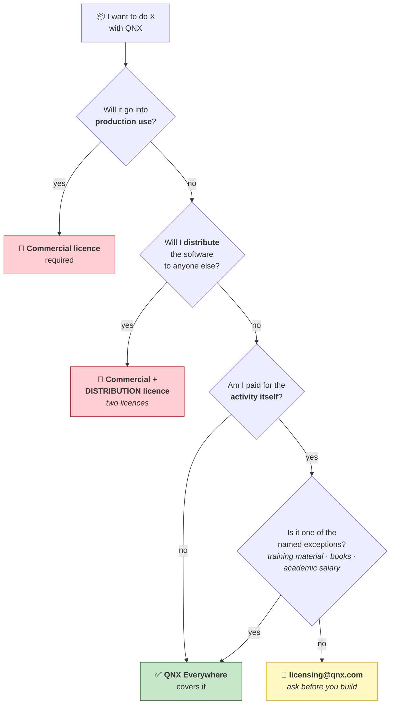
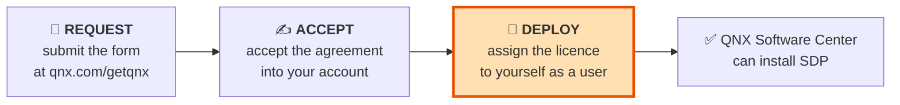

# Chapter 04 — QNX Licensing & QNX Everywhere

> **By the end of this chapter you will** know exactly what you agreed to when you deployed your
> licence, where the line between permitted and forbidden actually falls — **it is not where most
> people assume** — and what would have to change to ship a product.

> ⚠️ **This chapter is not legal advice.** It explains a licence in engineering terms so you know
> which questions to ask. **The agreement you accepted is the binding document**, and Lab 04.1 has you
> read it. For anything consequential, ask `licensing@qnx.com` — they answer.

---

## 🏃 Fast-Track Summary

> **🏃 Path C reads only this box**, then goes to [Chapter 06](Chapter06_FirstQNXVMOnQEMU.md) — your
> first `⭐ core` lab.

**What you hold.** A **QNX Everywhere** free **non-commercial** development licence for QNX SDP 8.0.
Not a trial, not time-limited in the way an evaluation is, and **not** a production licence.

**The boundary is `production` and `distribution` — not "is money involved".** This surprises people
in both directions. QNX's licensing page lists as **permitted**:

| Permitted | Condition |
|-----------|-----------|
| Learning QNX; academic work | — |
| **Hobby/maker projects — including building a product or system** | *"provided you do not make a commercial product or put the resulting software or system into production use"* |
| Open-source software interoperable with QNX | *"provided you make the resulting OSS publicly available at no charge"* |
| **Training material or books — commercially** | *"including if you intend to offer that material commercially"* |
| **Demonstrating a product or system to existing or potential customers** | *"e.g. as part of a product roadmap"* |
| Certain research prototypes | ⚠️ Conditional — confirm with `licensing@qnx.com` |

**Prohibited:** commercial product development and business operations · **production deployment** ·
**distribution** · activities *"in exchange for a fee or consideration of any kind"*, beyond the
exceptions above.

**Two licences, not one, for a real product.** A **commercial development licence** lets you build
it; **distribution requires a separate licence** — that is true even for commercial licence holders.
Budget for both.

**Practical rules:**

- ⚠️ **Never mix commercial and non-commercial licences on one myQNX account.** QNX says so
  explicitly. Keep learning on a personal account and a personal machine.
- The licence lives at **`~/.qnx/license/licenses`** on your host. It is not DRM — it is a record of
  what you agreed to.
- **7.1 is not in the free programme.** QNX Everywhere covers **SDP 8.0**.
- Anything ambiguous: **`licensing@qnx.com`**. Asking is free; guessing is not.

**🏃 Skip to:** [Chapter 06](Chapter06_FirstQNXVMOnQEMU.md). §4 is a one-page permission reference worth
bookmarking if you work anywhere near a product roadmap.

---

## 🎯 Learning Objectives

By the end of this chapter you will be able to:

- [ ] **State** what your licence permits and forbids, and cite the wording.
- [ ] **Locate** the boundary correctly — production and distribution, not the presence of money.
- [ ] **Distinguish** a development licence from a distribution licence, and say why both are needed.
- [ ] **Classify** a proposed activity as permitted, forbidden, or *ask first*.
- [ ] **Explain** why writing this course is explicitly allowed — and what condition attaches.
- [ ] **Find** your licence on disk and read the agreement you accepted.
- [ ] **Recognise** the compliance traps: mixing licence types, quiet scope creep, and inherited assumptions.

---

## 🧭 Prerequisites

| Need | Why |
|------|-----|
| [Chapter 02](Chapter02_WhatIsQNX.md) | The product family — OS, SDP, Everywhere tier |
| [Setup Guide 02](../guides/Setup_02_QNX_Account_And_License.md) | **You already did this.** You requested, accepted and deployed a licence |
| Your own licence file | Lab 04.1 reads it. If `~/.qnx/license/licenses` is missing, revisit Setup Guide 02 |

> 💡 **This chapter runs backwards from the usual order**, and deliberately. You obtained the licence
> in Setup Guide 02 because the course needed a working environment. Now you find out what you agreed
> to — with the artefact in front of you, which is a better way to read a licence than in the
> abstract.

---

## 🗺️ Mental model

Almost every licensing question reduces to this one diagram.



*Diagram: production use or distribution requires a commercial licence — and distribution requires a
second, separate one; otherwise QNX Everywhere covers the activity unless you are paid for it, and
even then several named exceptions apply.*

> 💡 **Read the shape.** The first two questions are about **what happens to the software**. Only the
> third is about money — and it has explicit exceptions. Most people carry the diagram in the wrong
> order, asking about money first. That mistake goes in both directions: it makes engineers refuse
> things they are allowed to do, and assume things they are not.

---

## 1. The Problem

### 1.1 Why an engineer should care about a licence

Licensing feels like someone else's job. It is not, for three reasons.

**You are the one who commits the violation.** Legal signs the agreement; an engineer types
`scp firmware.bin` onto a device that ships to a customer. The gap between "we have a licence" and
"we have the *right* licence for what I just did" is closed by whoever is at the keyboard.

**The discovery is always late and always expensive.** Nobody finds out on day one. They find out
during due diligence, at an audit, or when a customer's procurement team asks for a software bill of
materials — by which point the architecture is fixed and the ship date is near.

**And the more common failure is the quiet one.** Not piracy — **scope creep**. A learning project
becomes a demo, the demo becomes a prototype, the prototype ships to a pilot customer, and the pilot
becomes production. **No single step looked like a violation.**

### 1.2 The boundary is not where people assume

Ask an engineer where the line falls and most will say *"anything commercial"*. That is wrong in both
directions, and the errors are instructive.

| Common belief | Reality |
|---------------|---------|
| *"I can't build anything real — only toys."* | ❌ Wrong. You may **build a product or system** as a hobbyist or maker |
| *"I can't show it to a customer."* | ❌ Wrong. Demonstrating to existing or potential customers is **explicitly permitted** |
| *"I can't write about it for money."* | ❌ Wrong. Training material and books are permitted *"including if you intend to offer that material commercially"* |
| *"It's fine, we're not selling it — it's just running our internal test rig."* | ⚠️ **This is the dangerous one.** An internal test rig running continuously is plausibly **production use** |
| *"We only sent it to one pilot customer."* | ⚠️ That is **distribution** |

> ⚠️ **The trap is the last two.** People police the word *commercial* and ignore the words
> **production** and **distribution** — which are the ones the licence actually turns on. A free,
> internal, revenue-less deployment can still be production use.

> 💡 **This course got it wrong too.** [Setup Guide 02 §2](../guides/Setup_02_QNX_Account_And_License.md)
> listed *"demo to existing or potential customers"* as **forbidden**. QNX's own licensing page lists
> it as **permitted**. The error was found by checking the source while writing this chapter, and is
> corrected. **Verify licence claims against the licence** — including the ones in here.

---

## 2. The Concept — what you actually agreed to

> ⚠️ **Wording below is quoted from QNX's licensing page, verified 2026-08-26.** The **agreement you
> accepted** is the binding document; Lab 04.1 has you read it. Where they differ, the agreement wins.

### 2.1 Permitted

| # | Permitted use | Condition attached |
|---|---------------|--------------------|
| 1 | **Learning and academic work** — *"working on a non-commercial project in pursuit of an academic goal (e.g. in a classroom setting or as part of your academic studies)"* | — |
| 2 | **Hobby and maker projects** — *"Build a product or system as a hobbyist or maker (whether using Raspberry Pi images or any other QNX-provided BSP…)"* | *"provided you do not make a commercial product or put the resulting software or system into production use"* |
| 3 | **Open-source software** — *"Develop open-source software (OSS) that is interoperable with QNX software"* | ⚠️ *"provided you make the resulting OSS publicly available **at no charge**"* |
| 4 | **Training material and books** — *"Develop training material or books describing how to use our products"* | *"including if you intend to offer that material commercially"* |
| 5 | **Customer demonstrations** — *"Build or develop a product or system (e.g. as part of a product roadmap) to demonstrate to existing or potential customers"* | — |
| 6 | **Certain research prototypes** — *"leading to initial prototypes"* | ⚠️ *"subject to conditions"* — confirm with `licensing@qnx.com` |

> 💡 **Read #2 and #5 together, because they are more generous than the reputation suggests.** You may
> build a real system, on real hardware, and show it to a real customer as part of a real product
> roadmap. What you may not do is **ship it** or **run it in production**. The licence draws the line
> at deployment, not at ambition.

> ⚠️ **#3 has a hard condition that is easy to miss.** Open-source work must be *publicly available at
> no charge*. A private repository, or an "open source" component sold as part of a bundle, does not
> satisfy it.

### 2.2 Prohibited

| Prohibited | What it means in practice |
|-----------|---------------------------|
| **Commercial product development and business operations** | Building the thing you intend to sell |
| **Production deployment** | Running it for real — including internally, including unpaid |
| **Distribution** | Giving the software to anyone else, in any form. Even one pilot customer |
| **Activities for a fee** — *"in exchange for a fee or consideration of any kind"* | Paid consulting on QNX, paid porting work, delivering it as a service |

…all *"with limited exceptions"* — which are exactly the six in §2.1.

> ⚠️ **"Consideration of any kind" is broader than money.** Barter, equity, contra deals and services
> in kind are consideration. If you are receiving *something* for the activity and it is not one of
> the named exceptions, ask.

### 2.3 The two-licence structure for a real product

This is the part that surprises people with budget responsibility.

```text
      Non-commercial (yours)         Commercial development       Distribution licence
      ─────────────────────          ──────────────────────       ───────────────────
      learn · hobby · demos          build the product            SHIP the product
      training material              internally                   to customers
      OSS (free, public)
                                     ❌ still may not ship        ✅ now you may ship
```

> ⚠️ **A commercial development licence is not permission to ship.** *"Distribution and production use
> is not permitted under a development license and requires a separate distribution license."* Teams
> discover this while planning a launch, which is the worst possible time.
>
> 💡 **Say it out loud early.** "Do we have a distribution licence, or only development?" is a good
> question to ask in month one of a project, and an awkward one in month twenty.

### 🐧 In Linux this would be…

The models are not just different in cost — they are different in **shape**, and the shape is what
catches people out.

| | 🐧 GPL (Linux) | 🔷 QNX Everywhere |
|---|---|---|
| Cost to obtain | Free | Free |
| **Restricts *use*?** | ❌ **No.** Use it for anything, including production | ✅ **Yes.** No production, no distribution |
| **Restricts *distribution*?** | ✅ Yes — you must offer source under the same terms | ✅ Yes — needs a separate licence |
| The obligation lands when… | You **distribute** | You **use it beyond the permitted purposes** |
| Compliance question | *"Have I published my modifications?"* | *"Is this activity on the permitted list?"* |

> 💡 **The mental habit that transfers badly.** Open-source experience trains you to think *"the
> licence only matters when I ship"*. Under GPL that is roughly right. Under a **development
> licence** the restriction is on **use**, so compliance is a question you answer *continuously*, not
> once at release.
>
> That single difference explains most accidental non-compliance by engineers who have only ever
> worked with open source.

### 📦 Analogy — the manufacturer's demo car

> 🚗 **A manufacturer lends you a pre-production car.** You may drive it, take it apart, photograph
> it, write a review — even a paid one — and show it to people you hope will buy one.
>
> You may **not** put it into service as a taxi, and you may **not** sell it or lend it on.
>
> **Notice where the line is.** Not at "is money involved" — you may be paid to review it. At
> **putting it into service** and **passing it on**. That is exactly QNX Everywhere: production and
> distribution.

---

## 3. The Mechanism — how it actually works

### 3.1 The three verbs, which you have already done

Setup Guide 02 made you do this before explaining it:



*Diagram: a licence must be requested, accepted into the account, and then deployed to an individual
user before the Software Center can install anything.*

> 💡 **Why three steps, and why the third is the one everyone misses.** QNX's licensing is built for
> **companies**. A licence administrator accepts licences into the organisation's account, then
> *deploys* individual seats to individual engineers. As an individual you are both roles, which makes
> the middle step feel redundant — right up until QNX Software Center shows zero installable products
> and does not say why.

### 3.2 What is on your disk

```text
~/.qnx/license/licenses
```

> ⚠️ **This is not DRM.** QNX does not phone home, and nothing stops you compiling if the file is
> absent — as the 💥 exercise below shows. The file is a **record of the agreement you accepted**,
> and the compliance obligation is yours regardless of what any tool checks.
>
> 💡 **That is worth internalising.** The absence of technical enforcement is not the absence of
> obligation. Many engineers reason, unconsciously, that if a tool permitted it, it was allowed.

### 3.3 What is covered

| | |
|---|---|
| **Product** | **QNX SDP 8.0** and QNX OS 8.0 |
| **Not covered** | **SDP 7.1 and earlier are not in the free programme** — a common surprise for anyone maintaining an older project |
| Target images | QSTI for QEMU and Raspberry Pi, CTI, and QNX-provided BSPs |
| Host | x86-64 Linux or Windows |

### 3.4 If you need commercial use

| Step | What |
|------|------|
| 1 | Contact QNX sales, or `licensing@qnx.com` |
| 2 | Obtain a **commercial development licence** — seats for your engineers |
| 3 | Obtain a **distribution licence** — separately, before you ship |
| 4 | If certification matters, discuss **QNX OS for Safety** and its safety manual (Chapters 03, 29) |
| 5 | **Separate the environments.** Do not deploy commercial and non-commercial licences to the same account |

> ⚠️ **Step 5 is a real operational rule, not caution.** QNX's licensing page states plainly: *"Do not
> simultaneously deploy both commercial and non-commercial licenses to the same user account."* If
> your employer holds a commercial licence, keep this course on a **personal account and a personal
> machine.** Untangling a mixed account later is genuinely difficult, and it is the sort of mess that
> surfaces during an audit rather than at a convenient moment.


---

## 4. The Permission Reference

> Chapters that teach an API use §4 for signatures. Here it is the table you check before starting
> something — and the procedure for when the table does not settle it.

### 4.1 Quick classification

| Activity | Verdict |
|----------|---------|
| Working through this course | ✅ Permitted |
| University coursework, thesis, teaching | ✅ Permitted |
| A hobby robot in your garage | ✅ Permitted |
| Writing a QNX blog, book or course — **even paid** | ✅ Permitted |
| Publishing a **free, public** open-source QNX library | ✅ Permitted |
| Building a prototype and **demoing it to a customer** | ✅ Permitted |
| Learning QNX on your own time for a job you hope to get | ✅ Permitted |
| A company research prototype | ⚠️ **Ask** — conditional |
| Paid consulting: porting a client's app to QNX | ❌ Fee for the activity |
| An internal test rig running continuously in the lab | ❌ **Production use** |
| Shipping firmware to one pilot customer | ❌ **Distribution** |
| Selling a device with QNX inside | ❌ Commercial + distribution |
| An "open-source" library sold as part of a paid bundle | ❌ Fails *"publicly available at no charge"* |

### 4.2 The three questions, in order

Work them **in this order** — the order is the whole point:

1. **Will it go into production use?** → yes: commercial licence.
2. **Will the software leave my machine, to anyone?** → yes: commercial **and** distribution licence.
3. **Am I paid for the activity itself?** → yes, and not one of the six named exceptions: ask.

**All three no?** QNX Everywhere covers it.

### 4.3 The four grey areas, and how to think about them

| Grey area | The question that resolves it |
|-----------|-------------------------------|
| **"Internal use isn't production."** | Is it *relied upon* by anyone doing real work? A test rig that a team depends on daily is production, whether or not money changed hands |
| **"It's just a prototype."** | Prototypes are permitted. **Ask what happens next.** The problem is never the prototype; it is the prototype that quietly becomes the product |
| **"My employer has a commercial licence."** | Then use **that** licence, on **that** account, and keep this one separate. Do not mix (§3.4 step 5) |
| **"I'm paid a salary while learning."** | Academic salaries and RA stipends are named as permitted. A corporate salary while doing product work is not the same thing — if the *output* is product work, the salary is not what makes it non-compliant |

> 💡 **A better test than any table.** *"If QNX's licensing team read a full description of what I am
> doing, would they be surprised?"* If yes, send them that description. Emailing `licensing@qnx.com`
> costs ten minutes; the alternative costs a renegotiation under time pressure.

### 4.4 Where the authoritative text is

| Source | What it is |
|--------|-----------|
| **The agreement you accepted** | ⭐ **Binding.** Lab 04.1 finds it |
| [QNX licence options](https://qnx.software/en/developers/get-started/qnx-everywhere/licensing) | QNX's readable summary — the source of §2's quotations |
| [Non-commercial EULA](https://www.qnx.com/legal/licensing/non_commercial.html) | The evaluation / non-commercial / academic agreement |
| [Licence matrix (PDF)](https://www.qnx.com/legal/licensing/document_archive/current_matrix.pdf) | The formal comparison across licence types |
| `licensing@qnx.com` | **Humans who answer.** Use them |

> ⚠️ **Order of authority: agreement → EULA → licensing page → this chapter.** If this course and the
> licence disagree, the licence is right and the course has a bug. That has already happened once —
> see §1.2.

---

## 5. Worked Example — four activities, decided

### 5.1 This course

> A public GitHub repository teaching QNX, with runnable labs, written using a QNX Everywhere licence.
> Suppose it were later sold as a book.

| Question | Answer |
|----------|--------|
| Production use? | **No.** The labs teach; nothing is deployed |
| Distribution of QNX software? | **No.** It distributes *text and lab source*. Readers obtain QNX themselves, under their own licence |
| Paid for the activity? | Potentially — but permitted use **#4** covers *"training material or books… including if you intend to offer that material commercially"* |

**✅ Permitted**, explicitly.

> 💡 **This clause is why the course can exist in public**, and it is unusually generous — many
> proprietary vendors do not permit third-party paid training material at all. Note also what the
> course carefully does **not** do: it never ships QNX binaries. Setup Guides 01–03 walk you through
> obtaining your own licence precisely so that **distribution never enters the picture**. That was an
> architectural decision about the *course*, made for licensing reasons.

### 5.2 A hobby drone

> You build a QNX-based flight controller at home, fly it at weekends, and post the source publicly at
> no charge.

| Question | Answer |
|----------|--------|
| Production use? | **No.** Personal use is not production |
| Distribution? | ⚠️ **Careful.** Publishing *your own source* is fine under **#3**, provided it is public and free. Publishing a **flashable image containing QNX** would be distributing QNX |
| Paid? | No |

**✅ Permitted** — as source. **❌ Not** as a prebuilt image containing QNX.

> 💡 **A distinction worth carrying.** "Publishing my code" and "publishing a bootable image" feel
> equivalent to an engineer and are completely different to a lawyer. The image contains someone
> else's software.

### 5.3 The prototype that keeps growing

> Your team builds a QNX proof-of-concept on Everywhere licences. It demos well. A customer asks for a
> unit to trial. Eighteen months later it is in three factories.

**Walk the timeline:**

| Stage | Verdict |
|-------|---------|
| Proof of concept | ✅ Permitted — *"initial prototypes"*, and **#5** for the demo |
| Demo to the customer | ✅ Permitted — explicitly (**#5**) |
| **Sending a unit for trial** | ❌ **Distribution.** The line was crossed here |
| Three factories | ❌ Production, distribution, commercial product |

> ⚠️ **Notice where the violation occurred, and where it was *noticed*.** It happened at "send them a
> unit" — a step nobody flagged, because it did not feel like shipping. It gets discovered at the
> third factory, during due diligence, with a customer waiting.
>
> 💡 **The engineering lesson is a process one.** Put the licence question at the same gate as the
> safety question: **before hardware leaves the building.** "Which licence covers this unit?" belongs
> on the same checklist as "has this passed EMC?"

### 5.4 Paid consulting

> A client pays you to port their Linux application to QNX. You use your Everywhere licence.

| Question | Answer |
|----------|--------|
| Production use? | Eventually — theirs |
| Distribution? | You deliver the port to them |
| Paid for the activity? | **Yes**, and consulting is not among the six exceptions |

**❌ Not permitted.** The client needs a commercial licence, and you work under it.

> 💡 **Compare with §5.1 and notice how fine the line is.** *Writing a course about porting to QNX*,
> sold for money, is permitted. *Doing the port for a client*, for money, is not. The difference is
> that one produces **training material** — a named exception — and the other produces **product
> work** for a specific customer.
>
> That is the sharpest illustration in the chapter of §1.2's point: **it is not about whether money
> is involved.**


---

## 🧪 Labs

> These run on the **host**, not the target. No VM needed.

### Lab 04.1 — Read the agreement you accepted  [🐣🚶🏃] ⭐ *do this one*

> **Objective.** Look at your own licence, and read the binding document rather than a summary of it.
> **Time.** 15 minutes. **No coding.** 📌 `[UNVERIFIED]` — verification block **V9**.

**Step 1 — find the licence on disk.**

```bash
host$ ls -la ~/.qnx/license/
host$ cat ~/.qnx/license/licenses
```

| Command | Standard | Does |
|---------|----------|------|
| `ls -la` | POSIX | List directory contents; `-l` long format, `-a` include dotfiles |
| `cat file` | POSIX | *Concatenate* — with one argument, print the file |

✅ **Expected:** a small text file. It records **which licence** is deployed to you — a licence
identifier and product information, not a cryptographic key you must protect.

📋 **Please paste it** *(redact anything that looks like a personal identifier or serial)*. The
course currently only knows this file exists, not what it contains.

**Step 2 — ask the Software Center.**

```bash
host$ cd ~/qnx/qnxsoftwarecenter
host$ ./qnxsoftwarecenter_clt -listLicenseKeys
```

| Option | Does |
|--------|------|
| `-listLicenseKeys` | Lists every licence key known to this installation ([D-007](../meta/Doubts.md#d-007) has the full option list — and a warning about a plausible-looking option that does not exist) |

📋 **Paste the output.** 🎯 It should name the licence type — confirming you are on a **non-commercial**
licence and not something else.

**Step 3 — read the actual agreement.** ⭐ *This is the point of the lab.*

Log in at [qnx.com/account/dashboard](https://www.qnx.com/account/dashboard) and open the licence
agreement attached to your deployed licence. Alternatively read the
[non-commercial EULA](https://www.qnx.com/legal/licensing/non_commercial.html).

**Find and note where each of these is addressed:**

1. The permitted-use list — does it match §2.1?
2. Production use — how is it worded?
3. Distribution — and whether a separate licence is named
4. Term and termination — how long does this last, and how does it end?
5. Anything in it that **surprises** you

<details>
<summary>Why this is the one lab in the chapter that matters</summary>

Everything in §2 is quoted from QNX's **summary page**. That page is written to be readable, which
means it is written to be *approximately* right. The **agreement** is the document that binds you.

They will mostly agree. Where they do not, you have found something worth knowing — and you will have
learned the more useful skill, which is being someone who **reads the licence** rather than someone
who repeats what a colleague said about it.

📋 **If you find a discrepancy with anything in this chapter, report it.** §1.2 records the last time
this course got a licensing fact backwards; there is no reason to assume it was the only one.

</details>

---

### 💥 Break It — remove the licence and see what happens  [🚶🏃]

> **Objective.** Find out whether the licence is technically enforced — because the answer shapes how
> you should think about compliance.
> **Time.** 10 minutes. 📌 `[UNVERIFIED]`

> ⚠️ **This renames a file and renames it back.** Do both steps. If you stop halfway, restore with
> the command in step 4 — nothing is deleted at any point.

**Step 1 — predict.** With the licence file gone, will `qcc` still compile a QNX binary?

**Step 2 — move it aside.**

```bash
host$ mv ~/.qnx/license/licenses ~/.qnx/license/licenses.bak
host$ ls -la ~/.qnx/license/
```

| Command | Does |
|---------|------|
| `mv a b` | POSIX — **move/rename**. Nothing is copied or deleted; the file is renamed |

**Step 3 — try to build.**

```bash
host$ cd /tmp
host$ printf '#include <stdio.h>\nint main(void){printf("hi\\n");return 0;}\n' > lic_test.c
host$ qcc -Vgcc_ntox86_64 -o lic_test lic_test.c
host$ file lic_test
```

> 🐣 **`printf()`** — ISO C standard library, `<stdio.h>`. Prints formatted text to standard output
> and returns the number of characters written (or a negative value on error). Used here only to make
> a throwaway file to compile. `printf` shell builtin ≠ C `printf`, but they share the format syntax.

**Step 4 — restore it. Do this now, not later.**

```bash
host$ mv ~/.qnx/license/licenses.bak ~/.qnx/license/licenses
host$ ls -la ~/.qnx/license/
host$ rm -f /tmp/lic_test /tmp/lic_test.c
```

<details>
<summary>What it means — whichever way it went</summary>

**Most likely: it still compiles.** The QNX toolchain is not licence-gated at compile time in the way
commercial EDA tools often are. The licence gates **QNX Software Center** — which packages and
products you may *download and install*.

**If it failed instead**, you have learned something the course did not know, and the finding is more
valuable than the prediction.

> ⚠️ **The important part is what this does *not* mean.**
>
> "The tool let me" is not "the licence allows it". The obligation is contractual, not technical, and
> §3.2 said so before you ran this. **The point of running it anyway is that reading that sentence and
> watching a compiler cheerfully build something it "shouldn't" are different experiences** — and the
> second one is the one you remember when a deadline is near and nobody is checking.
>
> 💡 **Most licence violations in industry are not committed by people who decided to violate a
> licence.** They are committed by people who did the thing the tool allowed, and never asked.

</details>

📋 **Report which happened**, and any message you got.

---

### 🐣 Path A Activity — the compliance audit  [🐣]

> **Objective.** Practise the classification until it is quick.
> **Time.** 20 minutes. **No VM, no code.**

For each: **permitted**, **forbidden**, or **ask first** — and name the deciding question.

| # | Activity |
|---|----------|
| 1 | A student uses QNX for a final-year project, and is paid a stipend by the university |
| 2 | A startup builds a QNX prototype and demos it at a trade show to potential investors |
| 3 | A hobbyist publishes a QNX device driver on GitHub, free and public |
| 4 | The same hobbyist publishes a bootable SD-card image containing QNX |
| 5 | A company runs a QNX-based monitoring rig in its own lab, permanently |
| 6 | A YouTuber makes a monetised QNX tutorial series |
| 7 | An engineer learns QNX at home, hoping to change jobs |
| 8 | A consultant is paid to advise on whether a client should adopt QNX — no code written |

<details>
<summary>Answers</summary>

| # | Verdict | Deciding question |
|---|---------|-------------------|
| 1 | ✅ **Permitted** | Academic use, and academic compensation is explicitly named |
| 2 | ✅ **Permitted** | *"demonstrate to existing or potential customers"* — building a roadmap prototype and showing it is on the permitted list |
| 3 | ✅ **Permitted** | OSS interoperable with QNX, **public and free of charge** — both conditions met |
| 4 | ❌ **Forbidden** | The image contains **QNX software**. That is **distribution** — §5.2's distinction |
| 5 | ❌ **Forbidden** | **Production use.** No money changes hands, and it is still production — §4.3's first grey area |
| 6 | ✅ **Permitted** | Training material, *"including if you intend to offer that material commercially"* |
| 7 | ✅ **Permitted** | Learning. A future job is not consideration for the activity |
| 8 | ⚠️ **Ask** | Paid for the activity, no code written, no software used — arguably outside the licence entirely, since advisory work may not require the software at all. **Exactly the case for `licensing@qnx.com`** |

**#4 and #5 are the ones that catch people**, and they catch them for the same reason: neither
involves money, and both fail on **distribution** and **production**. If you got those two right, you
have the chapter.

**#8's real lesson** is that "ask first" is a legitimate answer, not a cop-out. Some questions are
genuinely unresolvable from a table, and the professional move is to send the description to the
people who can answer it.

</details>


---

## ✅ Mastery Check

**1.** *(Recall)* Where does QNX Everywhere draw the line — and what is the common wrong answer?

<details><summary>Answer</summary>

The line is **production use** and **distribution**.

The common wrong answer is *"anything commercial"*. That is wrong in both directions: you may build a
product as a hobbyist, demo it to customers, and write paid training material — while a **free,
internal, revenue-less** deployment can still be prohibited **production use**.

</details>

**2.** *(Recall)* You have a commercial development licence. May you ship?

<details><summary>Answer</summary>

**No.** *"Distribution and production use is not permitted under a development license and requires a
separate distribution license."*

Two licences: one to build it, one to ship it. Ask in month one, not month twenty.

</details>

**3.** *(Apply)* Your team demos a QNX prototype to a customer, who asks for a unit to trial. Your
manager says *"it's just a demo, we're covered."* Respond.

<details><summary>Answer</summary>

> The demo itself is fine — QNX explicitly permits building a system to demonstrate to existing or
> potential customers. **Sending them a unit is different: that's distribution**, and distribution
> needs a separate licence even for commercial licence holders. If we want to leave hardware with
> them, we need to talk to QNX licensing first.

**Why this is the right response.** It agrees with the part your manager has right — which makes the
correction land — and identifies the exact step that crosses the line. §5.3 shows why it matters:
this is the moment the violation happens, and it is typically discovered eighteen months later during
due diligence.

</details>

**4.** *(Apply)* Why is publishing your driver's **source** on GitHub permitted, while publishing a
**bootable image** is not?

<details><summary>Answer</summary>

Your source is **yours**. Publishing it publicly and free of charge satisfies permitted use #3 — OSS
interoperable with QNX.

A bootable image **contains QNX software**. Publishing it distributes *QNX's* software, which needs a
distribution licence.

**The distinction is what is inside the artefact**, not what you did to make it. It feels like a
technicality to an engineer and is the entire question to a lawyer.

</details>

**5.** *(Design)* You are technical lead on a product that will use QNX. Name the three licensing
things you would settle in **month one**, and why each must be early.

<details><summary>Answer</summary>

| # | Settle | Why it cannot wait |
|---|--------|--------------------|
| 1 | **Commercial development *and* distribution licences** — confirm both, with numbers | The distribution licence is the one teams discover late. It affects budget and cannot be arranged in a fortnight |
| 2 | **Whether you need QNX OS for Safety**, and read its **safety manual** | The safety manual defines the certified envelope. Discovering in month twenty that your architecture relies on an excluded feature is the classic expensive mistake (Ch 03) |
| 3 | **Separate the non-commercial environments** — accounts, machines, and a rule that no Everywhere-licensed artefact enters the product tree | Prevents the §5.3 drift, and keeps the audit answer simple |

**And one process item worth more than all three:** put *"which licence covers this?"* on the same
gate as *"has this passed EMC?"* — **before hardware leaves the building.** Licensing failures are
process failures, not knowledge failures. Everyone on the team in §5.3 knew the rules.

</details>

---

## 🧠 Concept Recap

- You hold a **QNX Everywhere free non-commercial development licence** for **SDP 8.0**. 7.1 is not
  in the programme.
- **The boundary is production use and distribution** — not whether money is involved.
- **Permitted:** learning · academic work · **hobby/maker products** · public free OSS ·
  **training material and books, even commercially** · **customer demonstrations** · certain research
  prototypes *(ask)*.
- **Prohibited:** commercial product development · production deployment · distribution · activities
  for a fee, outside the named exceptions.
- **A commercial development licence does not permit shipping.** Distribution is a **separate**
  licence.
- **`~/.qnx/license/licenses` is a record, not DRM.** No technical enforcement ≠ no obligation.
- **Never mix commercial and non-commercial licences on one account.**
- **Publishing source ≠ publishing an image.** The image contains QNX.
- **Scope creep is the real risk**: learning → demo → prototype → pilot → production, with no single
  step looking wrong. Put the licence question at the hardware-leaves-the-building gate.
- **"Ask first" is a professional answer.** `licensing@qnx.com`.
- **Order of authority:** your agreement → EULA → licensing page → this chapter.

---

## 📎 Cheat Sheet

**The three questions, in order**

| # | Question | If yes |
|---|----------|--------|
| 1 | Production use? | Commercial licence |
| 2 | Software leaves your machine? | Commercial **+ distribution** licence |
| 3 | Paid for the activity, outside the six exceptions? | **Ask** `licensing@qnx.com` |

**Permitted (with conditions)**

| Use | Condition |
|-----|-----------|
| Learning, academic work | — |
| Hobby/maker — **including building a system** | Not a commercial product; not production |
| Open-source interoperable with QNX | **Public, and free of charge** |
| Training material, books | Commercial sale is fine |
| **Customer demonstrations** | e.g. product roadmap |
| Research prototypes | ⚠️ Ask first |

**Prohibited**

Commercial product development · production deployment · **distribution** · activities for a fee or
*"consideration of any kind"*, outside the exceptions.

**Facts**

| | |
|---|---|
| Licence file | `~/.qnx/license/licenses` |
| Covers | **SDP 8.0** only |
| Portal | `qnx.com/account/dashboard` |
| Three verbs | request → accept → **deploy** |
| Questions | **`licensing@qnx.com`** |
| ⚠️ Never | Mix commercial and non-commercial on one account |

**Commands used**

| Command | Standard | Does |
|---------|----------|------|
| `ls -la` | POSIX | Long listing, including dotfiles |
| `cat f` | POSIX | Print a file |
| `mv a b` | POSIX | Move/rename — nothing copied or deleted |
| `qnxsoftwarecenter_clt -listLicenseKeys` | QNX | List licence keys known to this installation |

---

## 🔗 Further Reading

| Resource | Why |
|----------|-----|
| **Your accepted agreement** — `qnx.com/account/dashboard` | ⭐ **The binding document.** Lab 04.1 |
| [QNX licence options](https://qnx.software/en/developers/get-started/qnx-everywhere/licensing) | Source of every quotation in §2 |
| [Non-commercial EULA](https://www.qnx.com/legal/licensing/non_commercial.html) | The evaluation / non-commercial / academic agreement |
| [Licence matrix (PDF)](https://www.qnx.com/legal/licensing/document_archive/current_matrix.pdf) | Formal comparison across licence types |
| [Setup Guide 02](../guides/Setup_02_QNX_Account_And_License.md) | The mechanics you already performed |
| `licensing@qnx.com` | Humans. Use them |

---

## ➡️ What's Next

**[Chapter 05 — Installing QNX SDP 8.0](Chapter05_InstallingQNXSDP.md)**

You have the licence and you have the software. Chapter 05 explains the installation you already
performed: what QNX Software Center actually did, the layout under `~/qnx800`, what `qnxsdp-env.sh`
sets and why, and how `$QNX_HOST` and `$QNX_TARGET` divide the world in two.

> 🏃 **Path C:** skip to [Chapter 06](Chapter06_FirstQNXVMOnQEMU.md) — your first `⭐ core` lab — and
> come back to 05 only if a build behaves oddly.

---

## 📝 Chapter Changelog

| Version | Date | Change |
|---------|------|--------|
| 1.0 | 2026-08-26 | Created. Licence terms **verified against QNX's licensing page, 2026-08-26**, and quoted verbatim. Establishes that the boundary is **production and distribution**, not the presence of money — correcting [Setup Guide 02 §2](../guides/Setup_02_QNX_Account_And_License.md), which had listed customer demonstrations as forbidden when they are explicitly permitted. Covers the two-licence structure (development ≠ distribution), the GPL contrast, four worked scenarios including this course itself, and the scope-creep timeline. Lab 04.1 has the reader open the binding agreement rather than trust this chapter. |
