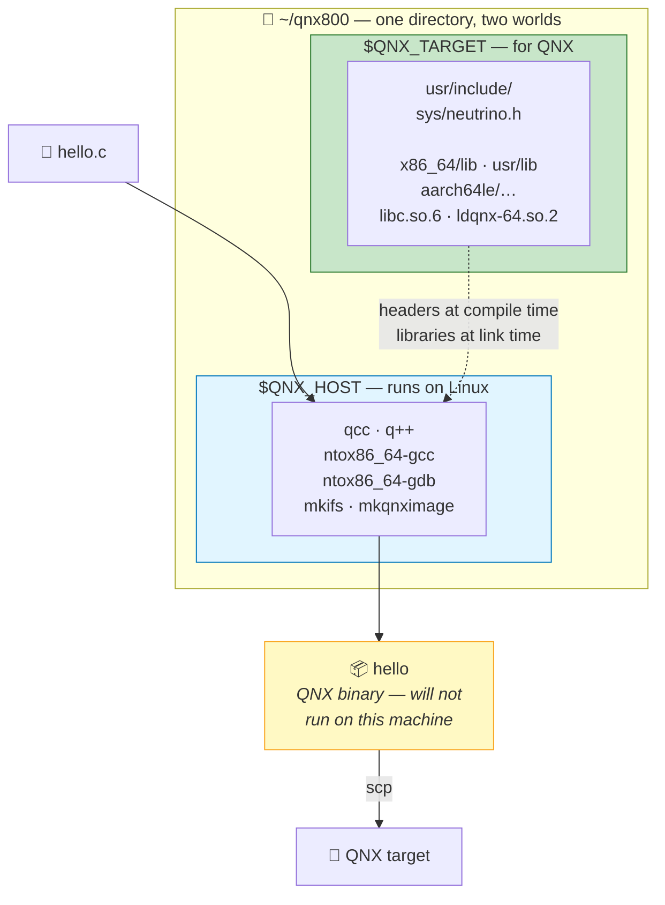

# Chapter 05 — Installing QNX SDP 8.0

> **By the end of this chapter you will** understand the installation you already performed: what
> QNX Software Center did, why `~/qnx800` has two parallel trees, and why almost every confusing QNX
> build error comes down to one of two environment variables.

---

## 🏃 Fast-Track Summary

> **🏃 Path C reads only this box**, then goes to [Chapter 06](Chapter06_FirstQNXVMOnQEMU.md) — your
> first `⭐ core` lab.

**The one idea.** `~/qnx800` contains **two operating systems' worth of files**: tools that run on
*your* machine, and headers/libraries for *QNX*. Everything else follows.

```text
~/qnx800/
├── host/linux/x86_64/     $QNX_HOST    ← runs on YOUR Linux box
│   └── usr/bin/           qcc, q++, ntox86_64-gdb, mkifs, mkqnximage
├── target/qnx/            $QNX_TARGET  ← for the QNX TARGET
│   ├── usr/include/       QNX headers (sys/neutrino.h)
│   ├── x86_64/            libraries + binaries, x86_64
│   └── aarch64le/         libraries + binaries, ARM64
├── images/qemu/           QSTI — the VM image (Setup Guide 03)
└── qnxsdp-env.sh          sets the variables above
```

**Two variables, and they explain most build failures:**

| Variable | Value on a verified install | Meaning |
|----------|------------------------------|---------|
| `$QNX_HOST` | `~/qnx800/host/linux/x86_64` | Where the **tools** live |
| `$QNX_TARGET` | `~/qnx800/target/qnx` | Where **QNX's** headers and libraries live |

`source ~/qnx800/qnxsdp-env.sh` sets both, prepends `$QNX_HOST/usr/bin` to `PATH`, and sets
`MAKEFLAGS`. **It affects only the current shell** — which is why Setup Guide 02 §10.5 had you add it
to `~/.bashrc`.

**The compiler is GCC 12.2.0**, and it is *not* your host's GCC. Six targets:
`gcc_ntox86_64` *(default)*, `_gpp`, `_cxx`, and the same three for `gcc_ntoaarch64le`.

**QNX Software Center vocabulary:** an **installation** lives at a path (`~/qnx800`); a **baseline**
is a whole SDP; **packages** are the pieces. Useful CLT commands:

| Command | Does |
|---------|------|
| `-listInstalled` / `-listInstalledRoots` | What you have |
| `-listAccessible` | What your licence entitles you to |
| `-listUpdates` · `-updateAll` | Updates |
| `-verifyInstallation` | Integrity check — exit code 4 on failure |
| `-listInstallationProperties` | Version/identity of this installation |

⚠️ **There is no `-listAvailablePackages`.** It does not exist ([D-007](../meta/Doubts.md#d-007)).

**Gotchas:** the install is **~43 GB**, not the 8–12 GB commonly quoted · `.sym` files beside every
binary are separated debug symbols, not clutter · `$QNX_TARGET/usr/include` is on **no default
include path** — `qcc` supplies it, plain `gcc` will not.

**🏃 Skip to:** [Chapter 06](Chapter06_FirstQNXVMOnQEMU.md). §5 traces a single `qcc` invocation
end to end and is worth ten minutes if you will ever debug a build.

---

## 🎯 Learning Objectives

By the end of this chapter you will be able to:

- [ ] **Explain** why the SDP has two parallel trees, and what belongs in each.
- [ ] **Say** what `$QNX_HOST` and `$QNX_TARGET` do, and diagnose what breaks when each is unset.
- [ ] **Describe** what `qnxsdp-env.sh` changes, and why it only affects one shell.
- [ ] **Navigate** `~/qnx800` and find any tool, header or library.
- [ ] **Use** QNX Software Center's command line to inspect and verify your installation.
- [ ] **Trace** a `qcc` invocation to the exact header, library and linker it used.
- [ ] **Recognise** `.sym` files and say why they exist.

---

## 🧭 Prerequisites

| Need | Why |
|------|-----|
| [Chapter 02](Chapter02_WhatIsQNX.md) | SDP vs OS vs Momentics |
| [Chapter 04](Chapter04_LicensingAndQNXEverywhere.md) | The licence that let you install it |
| A working SDP | You have one. `echo $QNX_HOST` should print a path |

> 💡 **Like Chapter 04, this runs backwards from the usual order.** You installed the SDP in Setup
> Guide 02 because the course needed a toolchain. Now you find out what happened — with the result on
> your disk, which beats reading about it.

---

## 🗺️ Mental model

Cross-development means **two machines' software on one disk**. Keeping them straight is the whole
discipline.



*Diagram: the host tree holds compilers and tools that execute on Linux; the target tree holds QNX's
headers and libraries; the compiler runs on the host but consumes the target's headers and libraries
to produce a binary that only runs on QNX.*

> 💡 **Notice the dotted arrow.** `qcc` *runs* from `$QNX_HOST` but *reads* from `$QNX_TARGET`. That
> single crossing is where cross-development gets confusing, and where most build errors live.

---

## 1. The Problem

### 1.1 Compiling for a machine you are not sitting at

When you run `gcc hello.c` on Linux, an enormous amount is assumed. The compiler knows where headers
live (`/usr/include`), which libraries to link (`/usr/lib`), which dynamic linker to record, and what
the target CPU is — **because they are all the machine it is running on.**

Cross-compilation removes every one of those assumptions. `qcc` runs on Linux and must produce a
binary for a **different operating system**, so it needs:

| Needs | Cannot use |
|-------|------------|
| QNX's headers | `/usr/include` — those describe Linux |
| QNX's libraries | `/usr/lib` — those are Linux ELF objects for a Linux loader |
| QNX's dynamic linker path | Linux's `/lib64/ld-linux-x86-64.so.2` |
| A code generator for the target CPU | Necessarily, but not sufficiently, your own |

**So the SDP ships a complete second world**, and that is why `~/qnx800` is ~43 GB rather than a few
hundred megabytes: it contains the C library, headers and utilities for **two architectures**, plus
debug symbols for all of it.

### 1.2 Why this is worth a chapter rather than a paragraph

Because when it goes wrong, the error message is almost never *"you have not set `$QNX_TARGET`"*. It
is:

```text
fatal error: sys/neutrino.h: No such file or directory
```

or a link failure naming a symbol you have never heard of, or — most confusingly — a build that
**succeeds** and produces a binary that will not run. Every one of those has the same root cause:
**something reached into the wrong world.**

> 💡 **The diagnostic habit this chapter is really teaching.** When a QNX build misbehaves, ask
> *"which tree did that come from?"* before anything else. `echo $QNX_HOST; echo $QNX_TARGET` answers
> more build questions than any amount of reading the compiler output.

---

## 2. The Concept — two trees, one purpose each

### 2.1 The split

> 📖 **`$QNX_HOST`.** The directory containing programs that **execute on your development machine**:
> compilers, linkers, debuggers, image builders. Platform-specific — hence
> `host/linux/x86_64`.

> 📖 **`$QNX_TARGET`.** The directory containing files **for the QNX target**: headers, libraries,
> and target utilities. Architecture-organised — `x86_64/`, `aarch64le/` — because one SDP builds for
> several targets.

| | `$QNX_HOST` | `$QNX_TARGET` |
|---|---|---|
| Contains | Executables | Headers, libraries, target binaries |
| Runs on | **Linux** (your machine) | **QNX** (the target) |
| Analogy | Your toolbox | The parts bin for the thing you are building |
| Organised by | Host platform | Target architecture |
| Example | `$QNX_HOST/usr/bin/qcc` | `$QNX_TARGET/usr/include/sys/neutrino.h` |

> ⚠️ **Nothing in `$QNX_TARGET` will run on your Linux machine**, even though some of it looks
> familiar. `$QNX_TARGET/x86_64/usr/bin/awk` is `awk` — compiled for QNX. Same CPU, different OS.
> This catches people who reason "it's x86_64, so it should run".

### 2.2 Why two trees, rather than one directory with flags

You could imagine a single tree with `--target=qnx` selecting behaviour. QNX's arrangement is better
for one specific reason: **the target tree is a faithful image of a real QNX filesystem.**

`$QNX_TARGET/x86_64/usr/bin/` contains what `/usr/bin` looks like on a QNX system. That means the
same tree serves three purposes at once:

| Purpose | Chapter |
|---------|---------|
| Supplies headers and libraries at build time | 05, 08 |
| Provides files to **copy into a boot image** with `mkifs` | 21 |
| Lets you inspect what exists on a QNX system without booting one | now |

> 💡 **You can browse a QNX system on your Linux disk right now**, without a VM:
>
> ```bash
> host$ ls $QNX_TARGET/x86_64/usr/bin | head -20
> ```
>
> On a verified install this begins `aac-enc`, `addr2line`, `amixer`, `aomdec`, `aplay`, `arecord`,
> `awk`, `bc`, `bunzip2`, `bzip2`… — audio codecs, a touchscreen calibrator, Valgrind's
> `callgrind_annotate`, camera samples. **That list is the reason a QNX boot image can be assembled
> without a package manager**: everything is already on your disk, and Chapter 21 has you choose from
> it.

### 🐧 In Linux this would be…

If you have cross-compiled on Linux, this is a **sysroot** — and the comparison is exact enough to be
useful, and different enough to matter.

| | 🐧 Linux cross-toolchain | 🔷 QNX SDP |
|---|---|---|
| Tools | `aarch64-linux-gnu-gcc` on `PATH` | `$QNX_HOST/usr/bin/qcc` |
| Target files | A **sysroot**, passed with `--sysroot=` | `$QNX_TARGET`, found via the environment variable |
| Selecting a target | A different compiler binary per triple | **One `qcc`**, with `-Vgcc_ntox86_64` |
| Multiple architectures | Usually a separate toolchain each | **One SDP**, `x86_64/` and `aarch64le/` side by side |
| Discovery | Explicit flags, or a wrapper script | Environment variables set by `qnxsdp-env.sh` |

> 💡 **The `-V` design is the interesting difference.** Linux cross-toolchains put the target in the
> *program name*; QNX puts it in a **flag**, so one driver serves every target. That is why
> `qcc -V` lists six things (Chapter 02 §5) and why switching from x86_64 to ARM in Part 6 changes a
> flag rather than a toolchain.

> ⚠️ **The trap for Linux veterans.** `$QNX_TARGET/usr/include` is on **no default include path**.
> `qcc` adds it because it knows about `$QNX_TARGET`. Invoke plain `gcc`, or a build system that
> bypasses `qcc`, and `sys/neutrino.h` is not found — which is the error in §1.2, and it is a
> *configuration* problem masquerading as a *missing file* problem.

### 📦 Analogy — the workshop and the parts bin

> 🔧 **You are building a car engine that will go into someone else's vehicle.**
>
> **`$QNX_HOST` is your workshop:** spanners, the press, the lathe. Yours, bolted to your floor,
> useless to the customer.
>
> **`$QNX_TARGET` is the parts bin:** pistons, gaskets, the manual for *their* engine. None of it
> works in your workshop; all of it goes into the finished product.
>
> **`qcc` is you** — standing in the workshop, using your tools on their parts.
>
> The confusion the whole chapter guards against is **reaching into the wrong bin**: picking up your
> own spare gasket (a Linux header) because it looks the same and is closer to hand.

---

## 3. The Mechanism

### 3.1 The layout, walked

```text
~/qnx800/
│
├── host/linux/x86_64/                 ← $QNX_HOST
│   ├── usr/bin/
│   │   ├── qcc, q++                   the compiler drivers
│   │   ├── ntox86_64-gcc              the actual GCC 12.2.0 underneath
│   │   ├── ntox86_64-gdb              the cross-debugger        (Ch 08, 25)
│   │   ├── ntox86_64-objdump, -nm     binary inspection         (Ch 25)
│   │   ├── mkifs                      builds boot images        (Ch 21)
│   │   └── mkqnximage                 builds/launches VMs       (Setup 03)
│   ├── usr/lib/                       libraries the TOOLS need
│   └── etc/qcc/                       target definitions — what `qcc -V` reads
│
├── target/qnx/                        ← $QNX_TARGET
│   ├── usr/include/                   QNX headers, architecture-independent
│   │   ├── sys/neutrino.h             MsgSend, ChannelCreate…   (Ch 13)
│   │   ├── time.h, stdio.h, stdlib.h  the POSIX ones            (D-014)
│   │   └── sys/resmgr.h               resource managers         (Ch 17)
│   ├── x86_64/                        everything FOR x86_64 QNX
│   │   ├── lib/, usr/lib/             libc.so.6, ldqnx-64.so.2, …
│   │   ├── bin/, usr/bin/             pidin, slay, awk, aplay, …
│   │   └── boot/                      procnto and boot pieces   (Ch 21)
│   └── aarch64le/                     the same, for ARM64       (Part 6)
│
├── images/qemu/                       QSTI — the VM image       (Setup 03)
└── qnxsdp-env.sh                      sets the environment
```

**Three observations worth making:**

| Observation | Why it matters |
|-------------|----------------|
| `usr/include` is **outside** the architecture directories | Headers are mostly architecture-independent. One copy serves both targets — which is also why a header can never tell you which architecture you are building for |
| Each architecture has its **own** `lib` and `bin` | Libraries are compiled code, so they cannot be shared. This is where the disk goes |
| `etc/qcc/` holds the **target definitions** | `qcc -V` reads this directory. Adding a target is adding a file here — not recompiling the compiler |

### 3.2 What `qnxsdp-env.sh` actually does

```bash
host$ source ~/qnx800/qnxsdp-env.sh
```

| Change | Effect |
|--------|--------|
| Sets **`QNX_HOST`** | Tools know where their siblings are |
| Sets **`QNX_TARGET`** | `qcc` knows where headers and libraries are |
| Prepends **`$QNX_HOST/usr/bin`** to `PATH` | `qcc` becomes callable by name |
| Sets **`MAKEFLAGS`** *(include path)* | QNX's recursive Makefiles find target headers (Ch 08) |

> ⚠️ **`source`, not `./`.** `source` (or `.`) runs the script **in your current shell**, so its
> variables persist. Running `./qnxsdp-env.sh` starts a *child* shell, which sets the variables, exits
> — and takes them with it. Nothing appears to happen. This is the single most common "I followed the
> instructions and it didn't work" on any Unix system, and it is not QNX-specific.

> ⚠️ **It affects one terminal only.** Open a new one and `qcc` is gone again. Setup Guide 02 §10.5
> had you add it to `~/.bashrc` for exactly this reason. Verify at any time:
>
> ```bash
> host$ echo $QNX_HOST
> ```
>
> ✅ On a verified install: `/home/<you>/qnx800/host/linux/x86_64`. **Empty output means the
> environment is not loaded**, and it is the first thing to check when a build behaves oddly.

### 3.3 QNX Software Center's model

QSC has four nouns, and knowing them makes its command line legible.

| Term | Meaning |
|------|---------|
| **Installation** | A directory holding one SDP — yours is `~/qnx800`. You may have several |
| **Profile** | QSC's handle for an installation. Yours reported `com.qnx.qnx800_1` |
| **Baseline** | A complete SDP release — installed with `-installBaseline` |
| **Package** | One component: a BSP, a target image, a tool. Installed with `-installPackage` |

Useful, **verified** command-line options *(from `qnxsoftwarecenter_clt -help`, CLT `2.0.4:v202501021438`)*:

| Option | Does |
|--------|------|
| `-listInstalled` | Every installed package |
| `-listInstalledRoots` | Installed top-level packages only — the readable summary |
| `-listAccessible` | What your licence entitles you to |
| `-listUpdates` · `-updateAll` | Check for and apply updates |
| `-verifyInstallation` | Integrity check. **Exit code 4 on failure** |
| `-listInstallationProperties` | Identity and version of the active installation |
| `-listLicenseKeys` | Licence keys (Chapter 04) |
| `-fileInfo <path>` | *"Which package does this file belong to?"* |
| `-offline` | Do not contact QNX's servers |

> ⚠️ **`-listAvailablePackages` does not exist**, despite sounding exactly right. It was in this
> course's guides for a while and produced `Error: Unknown argument`
> ([D-007](../meta/Doubts.md#d-007)). **`-help` is authoritative**; guessing an option name is how
> that bug happened.

> 💡 **`-fileInfo` is the underrated one.** Given a path inside the SDP it tells you which package
> owns it — the answer to *"where did this come from, and can I update just that?"*

### 3.4 The `.sym` files

Every listing of QNX binaries shows pairs:

```text
awk        awk.sym
aplay      aplay.sym
procnto-smp-instr    procnto-smp-instr.sym
```

> 📖 **Separated debug symbols.** The `.sym` file holds the debugging information — symbol names, line
> numbers, types — stripped out of the executable and stored beside it.

| | |
|---|---|
| **Why separate them** | The binary that ships to the target stays small; embedded flash is finite |
| **Why keep them** | Without symbols a backtrace is a list of hex addresses |
| **How they are used** | `gdb` loads the `.sym` file and gives you function names for a stripped binary running on the target |

> 💡 **This is why Chapter 25's debugging works at all.** You will run a small stripped binary on the
> target while `gdb` on your host reads the matching `.sym` — the same split that makes the target
> image compact and the debugging experience complete.
>
> ⚠️ **Symbols must match the binary exactly.** Rebuild the program and the old `.sym` is worthless —
> and worse than worthless, because it will produce confidently wrong function names.

### 🔬 Deep dive — where the ~43 GB goes

<details>
<summary>Optional. Useful if you are short of disk, or wondering why an OS needs 43 GB.</summary>

Measured on a verified install: free space fell from 951 GB to 908 GB — about **43 GB**, well above
the 8–12 GB commonly quoted (and previously stated by this course, [D-008](../meta/Doubts.md#d-008)).

The multipliers:

| Factor | Effect |
|--------|--------|
| **Two architectures** | `x86_64/` and `aarch64le/` are complete, independent copies |
| **Debug symbols for everything** | The `.sym` files are frequently larger than the binaries |
| **Host tools** | A full GCC 12.2.0 toolchain, GDB, binutils — twice, since they target two architectures |
| **Target images** | QSTI alone is ~1.9 GB compressed and far more unpacked |
| **Documentation and samples** | Substantial |

**Reducing it.** QNX Software Center lets you deselect target architectures. Dropping `aarch64le`
would save a large fraction — but it removes the hardware track in Part 6, so this course keeps it.

**Measure your own:**

```bash
host$ du -sh ~/qnx800
host$ du -sh ~/qnx800/*
```

| Command | Standard | Does |
|---------|----------|------|
| `du -sh` | POSIX | *Disk usage*; `-s` summarise (one total per argument), `-h` human-readable |

📋 The course does not yet know the real per-directory breakdown. If you run it, the numbers are
wanted — block **V10**.

</details>


---

## 4. The Layout & Command Reference

> Chapters that teach an API use §4 for signatures. Here it is the map and the commands — the section
> to come back to when a build misbehaves.

### 4.1 Where to find things

| Looking for | Path |
|-------------|------|
| `qcc`, `q++` | `$QNX_HOST/usr/bin/` |
| The real GCC | `$QNX_HOST/usr/bin/ntox86_64-gcc` |
| Cross-debugger | `$QNX_HOST/usr/bin/ntox86_64-gdb` |
| `mkifs` (Ch 21) · `mkqnximage` (Setup 03) | `$QNX_HOST/usr/bin/` |
| Available compiler targets | `$QNX_HOST/etc/qcc/` |
| **A QNX header** | `$QNX_TARGET/usr/include/` |
| `sys/neutrino.h` | `$QNX_TARGET/usr/include/sys/neutrino.h` |
| x86_64 libraries | `$QNX_TARGET/x86_64/lib/`, `.../usr/lib/` |
| x86_64 target binaries | `$QNX_TARGET/x86_64/usr/bin/` |
| `procnto`, boot pieces | `$QNX_TARGET/x86_64/boot/` |
| ARM64 equivalents | `$QNX_TARGET/aarch64le/…` |
| The VM image | `~/qnx800/images/qemu/qemu/output/` ⚠️ *note the nested directory* |
| Your licence | `~/.qnx/license/licenses` |
| QNX Software Center | `~/qnx/qnxsoftwarecenter/` |

### 4.2 Environment

| Variable | Verified value | Set by |
|----------|----------------|--------|
| `QNX_HOST` | `~/qnx800/host/linux/x86_64` | `qnxsdp-env.sh` |
| `QNX_TARGET` | `~/qnx800/target/qnx` | `qnxsdp-env.sh` |
| `PATH` | `$QNX_HOST/usr/bin` prepended | `qnxsdp-env.sh` |
| `MAKEFLAGS` | Include path for QNX Makefiles | `qnxsdp-env.sh` |

```bash
host$ source ~/qnx800/qnxsdp-env.sh     # note: source, not ./
host$ echo $QNX_HOST                    # empty = not loaded
```

### 4.3 Diagnosing the four common failures

| Symptom | Cause | Fix |
|---------|-------|-----|
| `qcc: command not found` | `PATH` lacks `$QNX_HOST/usr/bin` | `source ~/qnx800/qnxsdp-env.sh` |
| `sys/neutrino.h: No such file or directory` | `$QNX_TARGET` unset, or a build bypassing `qcc` | Check `echo $QNX_TARGET`; use `qcc`, not `gcc` |
| Link errors naming unfamiliar symbols | Linking host libraries into a target binary | Confirm you invoked `qcc` with `-V<target>` |
| Builds fine, **will not run on the target** | Wrong target selected, or built for the host | `file` the binary — look for `interpreter /usr/lib/ldqnx-64.so.2` |

> 💡 **All four are the same bug**, seen from four angles: **something reached into the wrong tree.**
> `echo $QNX_HOST; echo $QNX_TARGET` is the first diagnostic, always.

### 4.4 Software Center commands

```bash
host$ cd ~/qnx/qnxsoftwarecenter
host$ ./qnxsoftwarecenter_clt -help          # ⭐ authoritative
```

| Command | Does |
|---------|------|
| `-listInstalledRoots` | Readable summary of what you have |
| `-listInstalled` | Every package |
| `-listAccessible` | What your licence permits |
| `-listUpdates` · `-updateAll` | Updates |
| `-verifyInstallation` | Integrity check; exit code 4 on failure |
| `-listInstallationProperties` | This installation's identity and version |
| `-listLicenseKeys` | Licence keys (Ch 04) |
| `-fileInfo <path>` | Which package owns a file |
| `-installPackage <id>` · `-installBaseline <id>` | Install a package / a whole SDP |

---

## 5. Worked Example — where a single compile gets everything

Take the command from Setup Guide 02, and account for every piece.

```bash
host$ qcc -Vgcc_ntox86_64 -o hello hello.c
```

### 5.1 Step by step

| # | What happens | Which tree |
|---|--------------|-----------|
| 1 | Your shell finds `qcc` on `PATH` | **`$QNX_HOST`** — because `qnxsdp-env.sh` prepended it |
| 2 | `qcc` reads `-Vgcc_ntox86_64` and looks it up in `$QNX_HOST/etc/qcc/` | **host** |
| 3 | That definition selects **GCC 12.2.0** targeting `ntox86_64` | **host** |
| 4 | Compiling: `#include <stdio.h>` resolves under **`$QNX_TARGET/usr/include/`** | **target** ⭐ |
| 5 | Linking: `libc` is found under **`$QNX_TARGET/x86_64/usr/lib/`** | **target** ⭐ |
| 6 | The interpreter recorded in the ELF header is **`/usr/lib/ldqnx-64.so.2`** — a path on the *target's* filesystem, not yours | **target** ⭐ |
| 7 | `hello` is written to your current directory | your disk |

**Steps 4, 5 and 6 are the crossing.** A tool from the host tree, consuming the target tree, emitting
something for a filesystem that does not exist on this machine.

### 5.2 Prove it yourself

```bash
host$ qcc -Vgcc_ntox86_64 -v -o hello hello.c
```

| Flag | Does |
|------|------|
| `-v` | *Verbose* — print the actual sub-commands, include paths and library paths used |

📋 **This output is worth reading once, slowly.** You will see `$QNX_TARGET` paths passed as `-I` and
`-L`, and the real `ntox86_64-gcc` invocation underneath — which is `qcc`'s whole job: assembling that
command so you do not have to.

Then confirm the result:

```bash
host$ file hello
```

```text
hello: ELF 64-bit LSB pie executable, x86-64, version 1 (SYSV), dynamically linked,
interpreter /usr/lib/ldqnx-64.so.2, ... with debug_info, not stripped
```

> 💡 **`interpreter /usr/lib/ldqnx-64.so.2` is the whole chapter in one field.** Your Linux machine
> has no such file, so it refuses to run the binary — the failure you saw in Setup Guide 02. The
> target has it in `/proc/boot`, which you confirmed in Chapter 00's lab. **The compiler on your disk
> recorded a path that only makes sense on another computer**, and that is precisely what
> cross-compilation is.

### 5.3 The same, without `qcc`

```bash
host$ gcc -o hello hello.c
```

This builds a perfectly good **Linux** binary. No error, no warning — and it will not run on QNX.

> ⚠️ **This is the most dangerous failure mode in the chapter**, because nothing fails. You get a
> working executable for the wrong operating system, and find out at deployment.
>
> 💡 **Which is why `file` belongs in your build habits, not just your troubleshooting.** Checking the
> interpreter takes one second and distinguishes "built" from "built for the right machine". Chapter
> 08 puts it into a Makefile so you stop having to remember.


---

## 🧪 Labs

> **Host only — no VM needed for any lab in this chapter.**
> Load the environment first: `source ~/qnx800/qnxsdp-env.sh`

### Lab 05.1 — Explore your SDP  [🐣🚶🏃]

> **Objective.** Turn §3.1's map into something you have actually walked.
> **Time.** 15 minutes. **No coding.** 📌 `[UNVERIFIED]` — block **V10**.

```bash
host$ echo $QNX_HOST
host$ echo $QNX_TARGET
host$ du -sh ~/qnx800
host$ du -sh ~/qnx800/*
host$ ls $QNX_HOST/usr/bin | wc -l
host$ ls $QNX_TARGET/usr/include/sys/ | head -20
host$ ls $QNX_TARGET/x86_64/usr/lib/ | head -20
```

| Command | Standard | Does |
|---------|----------|------|
| `echo $VAR` | POSIX | Print a variable's value. **Empty means unset** |
| `du -sh` | POSIX | Disk usage; `-s` one total per argument, `-h` human-readable |
| `wc -l` | POSIX | Count lines |
| `head -20` | POSIX | First 20 lines |

**Answer from your own output:**

1. How large is `~/qnx800`, and which subdirectory dominates?
2. How many programs are in `$QNX_HOST/usr/bin`?
3. Find `neutrino.h`. Is it under an architecture directory? Why not?
4. In `$QNX_TARGET/x86_64/usr/lib/`, find `libc.so`. You have seen that name before — where?

<details>
<summary>Answers</summary>

1. **~43 GB** on a verified install. `target/` should dominate — two complete architectures plus
   debug symbols (§3 deep dive).
2. Dozens: `qcc`, `q++`, `ntox86_64-gcc`, `ntox86_64-gdb`, `objdump`, `nm`, `mkifs`, `mkqnximage`,
   and the `aarch64le` equivalents of each.
3. **`$QNX_TARGET/usr/include/sys/neutrino.h`** — *outside* the architecture directories, because
   headers are architecture-independent. One copy serves both targets (§3.1).
4. **`/proc/boot/libc.so.6` on the target**, in Chapter 00's lab — and it is where `clock_gettime`,
   `nanosleep`, `perror` and `qsort` actually live ([D-014](../meta/Doubts.md#d-014)). The copy here
   is what the *linker* uses; the copy on the target is what *runs*.

</details>

📋 **Please paste the `du -sh` output.** The course knows the total but not the breakdown, and it
should.

---

### Lab 05.2 — Watch `qcc` do its job  [🚶🏃]

> **Objective.** See §5's crossing happen, in the compiler's own output.
> **Time.** 15 minutes. 📌 `[UNVERIFIED]` — block **V10**.

```bash
host$ cd /tmp
host$ printf '#include <stdio.h>\n#include <unistd.h>\nint main(void){printf("pid %%d\\n",getpid());return 0;}\n' > sdp_demo.c
host$ qcc -Vgcc_ntox86_64 -v -o sdp_demo sdp_demo.c 2>&1 | tee /tmp/qcc_verbose.txt
```

| Command | Standard | Does |
|---------|----------|------|
| `printf 'fmt'` | POSIX shell builtin | Write formatted text — used here to create a file without an editor |
| `2>&1` | POSIX shell | Redirect **stderr** into **stdout**, so both go through the pipe |
| `tee file` | POSIX | Copy input to a file *and* to the screen |

> 🐣 **`printf()` and `getpid()`** are ISO C and POSIX respectively, from `<stdio.h>` and
> `<unistd.h>` — both explained in [D-014](../meta/Doubts.md#d-014). They are here only to give the
> compiler something to build; nothing in this lab depends on what the program does.

**Then search the log for the crossing:**

```bash
host$ grep -o '\-I[^ ]*' /tmp/qcc_verbose.txt | sort -u
host$ grep -o '\-L[^ ]*' /tmp/qcc_verbose.txt | sort -u
host$ grep -i 'ntox86_64-gcc' /tmp/qcc_verbose.txt | head -3
```

| Command | Does |
|---------|------|
| `grep -o 'pat'` | Print **only the matching part**, not the whole line |
| `sort -u` | Sort and remove duplicates |

**Then confirm the product:**

```bash
host$ file sdp_demo
host$ ./sdp_demo
host$ rm -f /tmp/sdp_demo /tmp/sdp_demo.c /tmp/qcc_verbose.txt
```

<details>
<summary>What you are looking for</summary>

| Question | What answers it |
|----------|-----------------|
| Where did headers come from? | `-I` paths under **`$QNX_TARGET/usr/include`** |
| Where did libraries come from? | `-L` paths under **`$QNX_TARGET/x86_64`** |
| What actually compiled it? | An `ntox86_64-gcc` invocation from **`$QNX_HOST`** |
| Did it work? | `file` shows `interpreter /usr/lib/ldqnx-64.so.2` |
| Can you run it? | **No** — `cannot execute: required file not found`. Correct |

**`qcc` is a driver, not a compiler.** Its job is to read `-Vgcc_ntox86_64`, look the target up in
`$QNX_HOST/etc/qcc/`, and assemble the long `ntox86_64-gcc` command with the right `-I`, `-L` and
linker settings. Everything §5.1 described is visible in that log.

</details>

📋 **Paste the `-I` and `-L` lists.** The course predicts they point into `$QNX_TARGET`; that has
never been confirmed.

---

### 💥 Break It — unset the environment  [🚶🏃]

> **Objective.** Produce §4.3's four failures deliberately, so you recognise them at speed.
> **Time.** 10 minutes. 📌 `[UNVERIFIED]`

> ⚠️ **Do this in a throwaway terminal**, or restore with `source ~/qnx800/qnxsdp-env.sh` at the end.
> Nothing is modified on disk — only shell variables.

**Experiment 1 — no `QNX_TARGET`.** Predict first.

```bash
host$ cd /tmp
host$ printf '#include <sys/neutrino.h>\nint main(void){return 0;}\n' > brk.c
host$ unset QNX_TARGET
host$ qcc -Vgcc_ntox86_64 -o brk brk.c
```

| Command | Does |
|---------|------|
| `unset VAR` | POSIX shell — remove a variable from the environment |

**Experiment 2 — the wrong compiler.**

```bash
host$ source ~/qnx800/qnxsdp-env.sh
host$ gcc -o brk_host brk.c
```

**Experiment 3 — no `PATH` entry.**

```bash
host$ env -i HOME="$HOME" PATH=/usr/bin:/bin bash -c 'qcc --version'
```

| Command | Does |
|---------|------|
| `env -i CMD` | Run `CMD` with an **empty** environment, plus only the variables you name |

**Clean up:**

```bash
host$ source ~/qnx800/qnxsdp-env.sh
host$ rm -f /tmp/brk /tmp/brk.c /tmp/brk_host
host$ echo $QNX_TARGET
```

<details>
<summary>What each proves</summary>

| # | Expected | The lesson |
|---|----------|-----------|
| 1 | `sys/neutrino.h: No such file or directory` | The header exists — it is right there on your disk. **The compiler was not told where to look.** A configuration failure wearing a missing-file costume |
| 2 | ⚠️ **This may well succeed** — Linux has its own `<sys/neutrino.h>`? No. It will most likely fail on the include, but if your program used only POSIX headers **it would build cleanly and be a Linux binary** | **The dangerous one** (§5.3): no error, wrong machine |
| 3 | `qcc: command not found` | `qnxsdp-env.sh` was never sourced in that shell. The most common QNX complaint, and always the same fix |

📋 **Report exactly what you got**, especially experiment 2. The course predicts the include fails,
but the *general* point — that plain `gcc` silently produces host binaries from portable source — is
what matters, and is best seen with a program that uses no QNX headers at all. Try it both ways.

> 💡 **Why deliberately breaking it is worth ten minutes.** These three messages account for a large
> share of the time beginners lose on QNX. Having produced each on purpose, you will recognise them
> instantly instead of searching the web — and each has the same one-line fix.

</details>

---

### 🐣 Path A Activity — map the two worlds  [🐣]

> **Objective.** Fix the host/target split in your mind. **No coding.**
> **Time.** 15 minutes.

For each item: does it belong in **`$QNX_HOST`** or **`$QNX_TARGET`** — and *why*?

| # | Item |
|---|------|
| 1 | The `qcc` compiler driver |
| 2 | `sys/neutrino.h` |
| 3 | `mkifs`, which builds boot images |
| 4 | `libc.so.6`, which QNX programs link against |
| 5 | `pidin`, which you ran on the target |
| 6 | `ntox86_64-gdb`, the cross-debugger |
| 7 | `procnto`, the QNX kernel |
| 8 | `etc/qcc/`, the target definitions |

<details>
<summary>Answers</summary>

| # | Where | Why |
|---|-------|-----|
| 1 | **HOST** | It executes on Linux |
| 2 | **TARGET** | A QNX header, consumed when building *for* QNX |
| 3 | **HOST** | The builder runs on Linux; its *output* is for the target |
| 4 | **TARGET** | QNX's C library. The linker reads this copy; another copy runs on the target |
| 5 | **TARGET** | A QNX program. It cannot run on your Linux machine |
| 6 | **HOST** | The debugger runs on Linux and talks to the target over the network (Ch 08) |
| 7 | **TARGET** | The QNX kernel — `$QNX_TARGET/x86_64/boot/` |
| 8 | **HOST** | Configuration for a host tool |

**The test that gets all eight right:** *"Which CPU and OS actually executes this file?"* Linux →
host. QNX → target. **#3 is the one people miss**, because `mkifs` feels like it belongs with the
target files it assembles. It does not — it *runs on Linux*.

</details>


---

## ✅ Mastery Check

**1.** *(Recall)* What do `$QNX_HOST` and `$QNX_TARGET` point at, and what is the one-question test
for deciding which a file belongs to?

<details><summary>Answer</summary>

`$QNX_HOST` = `~/qnx800/host/linux/x86_64` — programs that **execute on your Linux machine**.
`$QNX_TARGET` = `~/qnx800/target/qnx` — headers, libraries and binaries **for the QNX target**.

**The test:** *"Which CPU and OS actually executes this file?"* Linux → host. QNX → target.

</details>

**2.** *(Recall)* Why `source qnxsdp-env.sh` and not `./qnxsdp-env.sh`?

<details><summary>Answer</summary>

`source` (or `.`) runs the script **in your current shell**, so the variables it sets persist.
`./qnxsdp-env.sh` starts a **child** shell, which sets them, exits, and takes them with it — nothing
appears to happen.

Not QNX-specific: it is the most common Unix "I followed the instructions and nothing happened".

</details>

**3.** *(Apply)* A colleague reports `fatal error: sys/neutrino.h: No such file or directory`. The file
is definitely on their disk. What do you ask, in order?

<details><summary>Answer</summary>

1. **`echo $QNX_TARGET`** — empty means the environment was never sourced in that terminal. Most
   likely cause.
2. **Are you invoking `qcc`, or `gcc`?** Plain `gcc` does not know about `$QNX_TARGET` and will not
   find QNX headers.
3. **Is a build system bypassing `qcc`?** CMake or a hand-written Makefile with a hard-coded `CC=gcc`
   produces exactly this.

**The insight worth stating:** the file is present, so this is not a *missing file* problem — it is a
**configuration** problem. §1.2 and §4.3.

</details>

**4.** *(Apply)* A build produced a binary with no errors, but it will not run on the target. Name two
causes and the one command that distinguishes them.

<details><summary>Answer</summary>

**Causes:** built with plain `gcc` (a Linux binary), or built with the wrong `-V` target (e.g.
`gcc_ntoaarch64le` for an x86_64 VM).

**The command:**

```bash
host$ file ./yourbinary
```

A correct QNX x86_64 binary shows **`x86-64`** and **`interpreter /usr/lib/ldqnx-64.so.2`**. A Linux
binary shows `/lib64/ld-linux-x86-64.so.2`; a wrong-architecture build shows `ARM aarch64`.

**And the habit:** run `file` as part of building, not only when debugging. §5.3.

</details>

**5.** *(Design)* Your team wants a CI job that cross-compiles for QNX on a build server with no
interactive login. What must the job set up, and what would you check to prove it built the right
thing?

<details><summary>Answer</summary>

**Set up:**

| # | Requirement | Note |
|---|-------------|------|
| 1 | An SDP installation on the runner | QNX Software Center supports headless install (Setup Guide 02 §8.3) |
| 2 | **A licence appropriate to CI** | ⚠️ **Ask first.** Automated builds for a product are development work; Chapter 04's questions apply, and a non-commercial licence is unlikely to be the right answer for a company build server |
| 3 | `source $SDP/qnxsdp-env.sh` **inside the job's shell** | Each job is a fresh shell — §3.2 |
| 4 | Explicit `-V<target>` on every invocation | Never rely on the default; make the target visible in the log |

**Prove it built the right thing:**

```bash
file build/output | grep -q 'ldqnx-64.so.2' || exit 1
```

…and, better, run it on a real target — which is what Chapter 08's `qconn` workflow enables and what
turns a build check into a test.

**The point of the question is requirement 2.** The technical parts are easy; the licensing question
is the one that gets skipped and is genuinely consequential. An engineer who raises it before the CI
job exists is worth a great deal.

</details>

---

## 🧠 Concept Recap

- `~/qnx800` holds **two worlds**: `$QNX_HOST` (tools that run on Linux) and `$QNX_TARGET` (headers
  and libraries for QNX).
- **The test:** *which CPU and OS executes this file?*
- `qcc` **runs from the host tree and reads the target tree.** That crossing is where build errors
  live.
- **`source`, not `./`** — and it affects **one terminal only**.
- The compiler is **GCC 12.2.0**, separate from your host GCC. Six targets: x86_64 and aarch64le, each
  with C, `_gpp` and `_cxx`.
- Headers live **outside** the architecture directories; libraries live inside them.
- `$QNX_TARGET/x86_64/` is a **faithful image of a QNX filesystem** — build input, `mkifs` source, and
  something you can browse without booting.
- **QSC vocabulary:** installation · profile · baseline · package. **`-help` is authoritative**;
  `-listAvailablePackages` does not exist.
- **`.sym` files are separated debug symbols** — small binaries on the target, full symbols for `gdb`.
- The install is **~43 GB**, mostly two architectures plus debug symbols.
- **`file` belongs in your build habits.** `interpreter /usr/lib/ldqnx-64.so.2` is the proof.
- The worst failure is the silent one: plain `gcc` builds a **working binary for the wrong OS**.

---

## 📎 Cheat Sheet

**The two trees**

| | `$QNX_HOST` | `$QNX_TARGET` |
|---|---|---|
| Path | `~/qnx800/host/linux/x86_64` | `~/qnx800/target/qnx` |
| Holds | `qcc`, `gdb`, `mkifs`, `mkqnximage` | headers, libraries, target binaries |
| Executes on | **Linux** | **QNX** |

**Setup**

```bash
host$ source ~/qnx800/qnxsdp-env.sh
host$ echo $QNX_HOST     # empty = not loaded
```

**Where things are**

| Want | Path |
|------|------|
| Compilers | `$QNX_HOST/usr/bin/` |
| Target definitions | `$QNX_HOST/etc/qcc/` |
| QNX headers | `$QNX_TARGET/usr/include/` |
| x86_64 libraries | `$QNX_TARGET/x86_64/usr/lib/` |
| x86_64 target binaries | `$QNX_TARGET/x86_64/usr/bin/` |
| `procnto` | `$QNX_TARGET/x86_64/boot/` |
| VM image | `~/qnx800/images/qemu/qemu/output/` |
| Licence | `~/.qnx/license/licenses` |

**Four failures, one cause**

| Symptom | Fix |
|---------|-----|
| `qcc: command not found` | `source qnxsdp-env.sh` |
| `sys/neutrino.h: No such file` | Check `$QNX_TARGET`; use `qcc`, not `gcc` |
| Odd link errors | Confirm `-V<target>` |
| Builds but will not run | `file` it — check the interpreter |

**Software Center**

| Command | Does |
|---------|------|
| `-help` | ⭐ Authoritative option list |
| `-listInstalledRoots` | Readable summary |
| `-listAccessible` | What your licence permits |
| `-verifyInstallation` | Integrity check (exit 4 on failure) |
| `-fileInfo <path>` | Which package owns a file |

**Commands used in this chapter**

| Command | Standard | Does |
|---------|----------|------|
| `source f` / `. f` | POSIX shell | Run in the **current** shell |
| `unset VAR` | POSIX shell | Remove a variable |
| `env -i CMD` | POSIX | Run with an empty environment |
| `du -sh` | POSIX | Disk usage, summarised, human-readable |
| `tee f` | POSIX | Copy input to a file and the screen |
| `grep -o` | POSIX | Print only the matching part |
| `sort -u` | POSIX | Sort, removing duplicates |
| `2>&1` | POSIX shell | Merge stderr into stdout |
| `qcc -v` | QNX | Show the sub-commands `qcc` runs |
| `file f` | POSIX-ish | Identify a file — **check the interpreter** |

---

## 🔗 Further Reading

| Resource | Why |
|----------|-----|
| [Setup Guide 02](../guides/Setup_02_QNX_Account_And_License.md) | The mechanics you performed, now verified end to end |
| [QNX SDP 8.0 documentation](https://www.qnx.com/developers/docs/8.0/) | *Utilities Reference* covers `qcc` exhaustively |
| [QNX Software Center User's Guide](https://www.qnx.com/developers/docs/qsc/com.qnx.doc.qsc.user_guide/topic/about.html) | The GUI and CLT in full |
| `$QNX_TARGET/usr/include/` | ⭐ **The headers themselves** — authoritative for your version ([D-014](../meta/Doubts.md#d-014)) |
| [D-007](../meta/Doubts.md#d-007) · [D-008](../meta/Doubts.md#d-008) | The Software Center option that does not exist; where the disk went |

---

## ➡️ What's Next

**[Chapter 06 — Your First QNX VM on QEMU](Chapter06_FirstQNXVMOnQEMU.md)** ⭐

Your first **`⭐ core` lab**. You have a toolchain that builds QNX binaries and a machine that cannot
run them. Chapter 06 covers the target: what QSTI is, what `mkqnximage --run` actually starts, and how
`ifs.bin` and the virtual disk become a running system.

You have already done this once, in Setup Guide 03. Chapter 06 explains it — and then has you take it
apart.

> 🏃 **Path C:** Chapter 06 is a core lab. Do not skip it.
> 🐣 **Path A:** the concepts carry; the lab has an observe-only variant.

---

## 📝 Chapter Changelog

| Version | Date | Change |
|---------|------|--------|
| 1.0 | 2026-08-26 | Created. The host/target split as the organising idea, with the *"which CPU and OS executes this file?"* test. Covers the `~/qnx800` layout, what `qnxsdp-env.sh` changes and why `source` matters, QNX Software Center's installation/profile/baseline/package model with **verified** CLT options, `.sym` files, and where ~43 GB goes. §5 traces one `qcc` invocation to the exact tree each piece came from, and names the silent failure: plain `gcc` produces a working binary for the wrong OS. Labs are `[UNVERIFIED]` pending block **V10**. |
