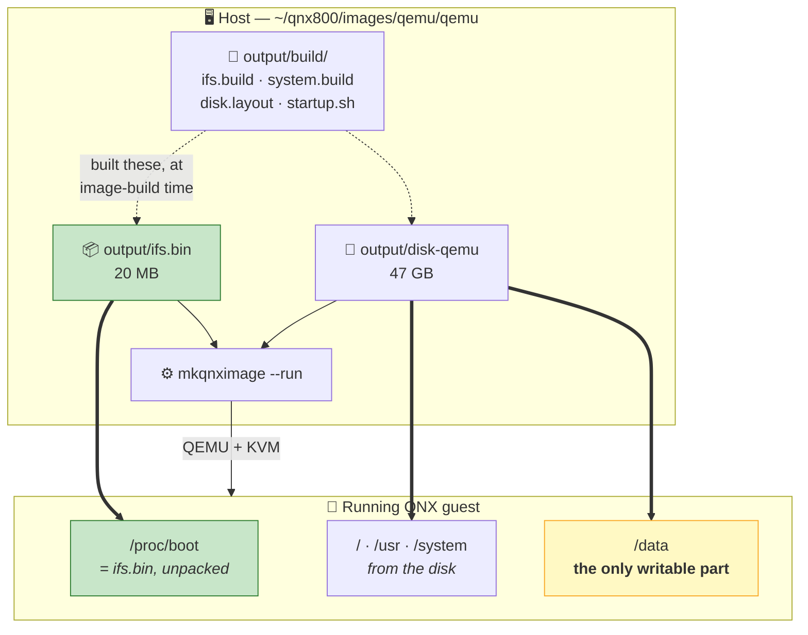
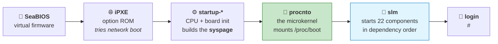

# Chapter 06 — Your First QNX VM on QEMU ⭐

> **By the end of this chapter you will** be able to account for every stage between pressing enter
> and reaching a `#` prompt — and to open the image that produced it and read how it was built.

> ⭐ **This chapter contains core lab L06.** Every coding path does it, including 🏃 Path C.

---

## 🏃 Fast-Track Summary

> **🏃 Path C reads this box and does Lab 06.1**, then goes to
> [Chapter 07](Chapter07_FirstContactTheQNXShell.md).

**Run it:**

```bash
host$ cd ~/qnx800/images/qemu/qemu     # ⚠️ "qemu" twice — see below
host$ mkqnximage --run
```

Login `root`/`root` at the console; **`qnxuser`/`qnxuser` over SSH** (root is refused —
`PermitRootLogin no`). Quit with `Ctrl+A` then `X`, or `mkqnximage --stop` from a second terminal.
`mkqnximage --getip` prints the address.

⚠️ **The nested directory.** `unpack_qemu_image.sh` extracts into a `qemu/` subdirectory, so the image
lives at `~/qnx800/images/qemu/qemu`. `mkqnximage` identifies an image by `local/` + `output/` in the
current directory; one level up it offers to build a **new** image — **never pass `--force`**
([D-006](../meta/Doubts.md#d-006)).

**What is in the image directory:**

| Path | What |
|------|------|
| `output/ifs.bin` | **20 MB.** The bootable image: `procnto`, drivers, a shell, ~80 files |
| `output/disk-qemu` + `.vmdk` | The virtual disk. **47 GB, and genuinely allocated — not sparse** ([D-008](../meta/Doubts.md#d-008)) |
| `output/build/` | ⭐ **The `mkifs` build files that produced it** — Chapter 21's source material |
| `output/option_files/`, `local/snippets/` | The feature switches that composed the image (CTI) |
| `output/procnto-smp-instr.sym` | 12 MB of kernel debug symbols |

**The boot chain:** SeaBIOS → iPXE → `startup-*` → **`procnto`** → **`slm`** (22 components) →
`login`. Four early warnings are benign ([D-010](../meta/Doubts.md#d-010)).

**QEMU defaults:** 8 CPUs · 4 GB *(⚠️ above 16 GB may misbehave)* · `bridge,br=virbr0` ·
`sdl,gl=on` · serial on `mon:stdio` — which is why `Ctrl+A` `X` works.

**The split that matters later:** the system comes from a **read-only image**; only **`/data`** is
writable. Edits to `/etc` may not survive a reboot. That is the shape of most embedded systems and
the reason Chapter 21 exists.

**🏃 Skip to:** [Chapter 07](Chapter07_FirstContactTheQNXShell.md). §3.4 (the option system) is the
part worth reading if you will later build your own image.

---

## 🎯 Learning Objectives

By the end of this chapter you will be able to:

- [ ] **Name** each stage of the boot, in order, and say what hands off to what.
- [ ] **Distinguish** `ifs.bin` from the virtual disk, and say what lives in each.
- [ ] **Explain** why `/proc/boot` exists and what it really is.
- [ ] **Find and read** the build files that produced your image.
- [ ] **Predict** which changes to a running QNX system survive a reboot, and why.
- [ ] **Operate** the VM confidently: start, stop, find its address, recover it.
- [ ] **Recognise** the four benign boot warnings, and tell them from real failures.

---

## 🧭 Prerequisites

| Need | Why |
|------|-----|
| [Chapter 02](Chapter02_WhatIsQNX.md) | `procnto`, and why drivers are processes |
| [Chapter 05](Chapter05_InstallingQNXSDP.md) | `$QNX_HOST` / `$QNX_TARGET`, and `mkqnximage`'s home |
| [Setup Guide 03](../guides/Setup_03_QEMU_VM.md) | **You already did this.** Verified end to end |

---

## 🗺️ Mental model

Two files, one launcher, one running system.



*Diagram: build files produced a boot image and a virtual disk; `mkqnximage --run` hands both to
QEMU; inside the guest the boot image appears as `/proc/boot` and the disk supplies the filesystem,
of which only `/data` is writable.*

> 💡 **Follow the two thick arrows.** `ifs.bin` **becomes** `/proc/boot` — the ~80 files you listed in
> Chapter 00 are literally the contents of that 20 MB file. The disk supplies everything else. Knowing
> which of the two a file came from tells you whether a change to it will survive a reboot.

---

## 1. The Problem

### 1.1 Bootstrapping is a chicken-and-egg problem

To mount a filesystem you need a disk driver. To load a disk driver you need a filesystem to load it
*from*. To run either you need a kernel, which is itself a file on a disk you cannot yet read.

Every operating system solves this the same way in outline: **something small and self-contained is
loaded into memory by the firmware, and it contains just enough to reach everything else.**

On Linux that is `vmlinuz` plus an `initramfs`. On QNX it is a single file: **`ifs.bin`** — the
*Image File System*.

### 1.2 What makes QNX's answer distinctive

`ifs.bin` is not a compressed archive that gets unpacked into a temporary filesystem and discarded.
It is **mounted, in place, in RAM, permanently**, and appears as `/proc/boot`.

| Consequence | Why it matters |
|-------------|----------------|
| Its contents are **always available**, from the first instruction onwards | No "before the real root is mounted" phase to reason about |
| It is **read-only** | Nothing can corrupt the recovery tools |
| It is a **single file you build** | Chapter 21. You choose every one of those ~80 files |
| It works with **no disk at all** | A QNX system can boot and run entirely from `ifs.bin` — which is how many embedded devices ship |

> 💡 **That last row is the one to hold on to.** Your VM has a 47 GB disk, so it looks like a
> conventional computer. A real embedded QNX device may have **no writable storage whatsoever** —
> `ifs.bin` in flash, RAM for working memory, and nothing else. Everything in this chapter is
> arranged so that you can see which parts of your system are which.

### 1.3 Why "it already worked" is not enough

You booted this VM in Setup Guide 03 by following instructions. That is the right way to start, and
it leaves three things unanswered:

- **What happens between `mkqnximage --run` and the login prompt?** Twenty-odd lines scrolled past.
- **Where did this system come from?** Someone chose those ~80 files. On what basis?
- **What can you change, and what will survive?** The answer is not obvious, and getting it wrong
  wastes an afternoon.

This chapter answers all three, and each answer is a preview of Chapter 21 — where you build the
image yourself.

---

## 2. The Concept — the boot chain

### 2.1 The stages



*Diagram: virtual firmware hands off to an option ROM, then to QNX's startup code which initialises
the board and builds the syspage, then to procnto which mounts the boot image, then to slm which
starts every service, ending at a login prompt.*

| Stage | Runs | Job | Where it lives |
|-------|------|-----|----------------|
| **SeaBIOS** | QEMU's firmware | Find something bootable | QEMU |
| **iPXE** | Option ROM | Attempt network boot | QEMU |
| **`startup-*`** | QNX | Initialise CPU, memory and interrupt controller; build the **syspage** | Inside `ifs.bin` |
| **`procnto`** | QNX | The kernel. Mount `ifs.bin` as `/proc/boot`, start the first process | Inside `ifs.bin` |
| **`slm`** | QNX | Start every service, in dependency order | Inside `ifs.bin` |
| **`login`** | QNX | Authenticate you | From the disk |

> 📖 **Syspage.** A structure that `startup-*` builds and hands to `procnto`, describing the hardware
> it found: memory map, CPU count and features, timer frequency, interrupt controller. **`procnto`
> contains no board-specific code** — everything it knows about the machine, it learns from the
> syspage. That is what makes one kernel binary work on QEMU, a Raspberry Pi and an automotive SoC,
> and it is the heart of what a BSP provides (Chapter 22).

### 2.2 Reading your own boot log

From the verified run — the first lines after the firmware:

```text
Booting from ROM..
non UEFI or UEFI+CSM boot
ACPI table not found (0x4746434d)
overriding mask for controller 2, vector_base 0
Startup complete
```

| Line | Stage | Meaning |
|------|-------|---------|
| `Booting from ROM..` | SeaBIOS | Falling through its boot-device list |
| `non UEFI or UEFI+CSM boot` | `startup-*` | QNX's startup announcing the firmware style it found |
| `ACPI table not found` | `startup-*` | QEMU does not present it; QNX falls back. **Benign** |
| `overriding mask for controller 2` | `startup-*` | Configuring the interrupt controller |
| ⭐ **`Startup complete`** | `startup-*` → `procnto` | **The handover.** The syspage is built; the kernel takes over |

> 💡 **`Startup complete` is the single most useful line in a QNX boot log.** Before it, you are
> debugging the **BSP** — board initialisation, memory map, clocks. After it, you are debugging the
> **system** — drivers, services, configuration. On a dead custom board (Chapter 32), whether you
> reach that line is the first question anyone will ask.

### 2.3 `slm`, and why services start in an order

```text
slm: [COMMAND] startup 'all'
slm: Component 'slog2': Mark active
slm: Component 'pci-server': Mark active
slm: Component 'devb': Mark active
   … 22 components …
slm: [START] Component 'slog2'
slm: Component 'slog2': Spawned process with pid 20483
```

> 📖 **`slm` — System Launch and Monitor.** QNX's service manager: it starts components in dependency
> order, waits for each to be ready, and can restart one that dies.

The 22 components on your image, in the order `slm` marked them active:

```text
slog2 · pci-server · pci-server-patchup · devb · root-fs · random · fsevmgr
devc · pipe · dumper · devc-pty · io-sock · network-init · ssh · qconn
console · mqueue · post_start · iousb · set-host · ca-trust-init · pam · apk_start
```

**Read that list as a dependency argument:**

| Position | Why |
|----------|-----|
| `slog2` **first** | The logger. Everything after it can log its own startup |
| `pci-server`, then `devb` | You must enumerate the bus before you can find the disk on it |
| `root-fs` after `devb` | You cannot mount a filesystem before you have a block device |
| `io-sock` before `ssh`, `qconn` | Both need a network stack |
| `pam` late | Authentication needs the filesystem holding the password database |

> 🐧 **In Linux this would be…** `systemd`. `slm` does far less: no sockets, no timers, no logind, no
> D-Bus. Its configuration is a single readable file — **`/proc/boot/slm.cfg`**, which you can open —
> and **restarting a dead service is its core purpose** rather than one feature among many. Chapter 27
> builds high availability on it.

> 💡 **`qconn` is in that list**, already running and listening on port 8000. That is the remote-debug
> agent Chapter 08 attaches `gdb` to — **nothing to install**, because whoever built this image chose
> to include it.

### 📦 Analogy — the expedition

> 🏔️ **`ifs.bin` is the pack you carry up the mountain.** Everything you might need before you can
> reach the supply depot: stove, tools, the map. Small, chosen deliberately, and **you never put it
> down** — it stays on your back the whole climb.
>
> **The disk is the supply depot.** Vastly bigger, full of things you will *probably* need, and
> reachable only once you have used the pack to get there.
>
> **`startup-*` is the guide who walks you to the trailhead** and hands over a written description of
> the terrain — the syspage. After that they are gone, and the description is all you have.
>
> **Chapter 21 is where you pack the bag yourself.** And the question it asks is the mountaineer's
> question: *what do I need before I can reach anything else?*

---

## 3. The Mechanism

### 3.1 The image directory

```text
~/qnx800/images/qemu/          ← the archives were unpacked HERE
├── unpack_qemu_image.sh
├── qnx_sdp8.0_qemu_quickstart_20260606.tar.gz.{0,1}
└── qemu/                      ← ⭐ THE IMAGE DIRECTORY (qemu twice)
    ├── local/                 configuration INPUT
    │   ├── options            the feature selections
    │   ├── snippets/          composable build fragments
    │   └── misc_files/        ssh host keys, shadow, part.info
    └── output/                the BUILT image
        ├── ifs.bin            20 MB — the boot image
        ├── disk-qemu          47 GB — the virtual disk (not sparse)
        ├── disk-qemu.vmdk     171 bytes — a descriptor pointing at it
        ├── procnto-smp-instr.sym   12 MB kernel debug symbols
        ├── build/             ⭐ the generated mkifs build files
        ├── inc/               generated include fragments
        ├── option_files/      every available feature switch
        └── options            the resolved configuration
```

> ⚠️ **`mkqnximage` identifies an image directory by `local/` and `output/`.** From one level up it
> sees archives and a script, concludes you want to *create* an image, and asks for `--force`.
> **`--force` is not "run anyway"** — it would build a fresh image beside your archives and ignore the
> 47 GB one. The fix is `cd qemu` ([D-006](../meta/Doubts.md#d-006)).

### 3.2 `ifs.bin` versus the disk

| | `ifs.bin` | `disk-qemu` |
|---|---|---|
| Size | **20 MB** | **47 GB, really allocated** |
| Loaded by | QEMU, as a kernel | Attached as an IDE disk |
| Lives in | **RAM**, permanently | Virtual storage |
| Appears as | **`/proc/boot`** | `/`, `/usr`, `/system`, `/data` |
| Writable | ❌ Never | ⚠️ Only `/data` |
| Contains | `procnto`, drivers, `libc`, `ksh`, `pidin`, `slm` — ~80 files | Everything else: utilities, libraries, home directories, demos |
| Survives a rebuild? | Only if you rebuild it | The data partition persists |

**Confirm it yourself, on the target:**

```bash
qnx# ls /proc/boot | wc -l
qnx# ls /
```

✅ From the verified run: about **80** files in `/proc/boot`, and a root containing
`bin boot data dev etc home lib opt proc root sbin sys system tmp usr x86_64`.

> 💡 **`/proc/boot` is the most educational directory in QNX.** It is not a view of processes and it
> is not a real disk — it is a **20 MB file, mounted**. Everything in it was chosen by whoever built
> the image, and in Chapter 21 that will be you.

### 3.3 What is writable — and the answer that saves you an afternoon

`/etc/passwd` on the verified system shows home directories under **`/data/home/`**. That is not
decoration:

| Path | Backed by | Survives a reboot? |
|------|-----------|--------------------|
| `/proc/boot` | `ifs.bin` in RAM | ❌ Read-only, always |
| `/`, `/usr`, `/system` | The image's system partition | ⚠️ **Usually not** |
| **`/data`** | The writable data partition ⚠️ *root-owned; write to `/data/home/<you>`* | ✅ **Yes** |
| `/tmp` | RAM | ❌ |

> ⚠️ **This is why Setup Guide 03 §9.4 warned that editing `/etc/ssh/sshd_config` may not survive.**
> Not a bug — the design. An embedded system keeps its operating system in an image that cannot be
> corrupted, and confines mutable state to a small, explicitly-chosen area.
>
> ⚠️ **`/data` is the writable *partition*, but its root is owned by `root`.** As `qnxuser` you cannot
> create files directly in `/data` — you get `Permission denied`. **Your home directory,
> `/data/home/qnxuser`, is on that partition and is yours**, which is where your work belongs
> ([D-015](../meta/Doubts.md#d-015)).
>
> 💡 **The practical rule while learning:** put your work in **your home directory**; treat everything
> else as though it will be reset. If you need a change to be permanent, it belongs in the **image** —
> which is Chapter 21, and is exactly the discipline real QNX products use.

Lab 06.3 has you demonstrate this rather than take it on trust.

### 3.4 The option system — Chapter 21, visible early

`output/option_files/` holds the switches from which this image was composed. From the verified
listing:

| Option | Adds |
|--------|------|
| `opt_graphics` | Screen, the window manager, `drm-virtio` |
| `opt_usb` | `io-usb-otg` and USB support |
| `opt_slm` | `slm` itself, and its configuration |
| `opt_secpol` | The security policy machinery (Chapter 03's Lab 03.2) |
| `opt_valgrind` | Valgrind on the target |
| `opt_python`, `opt_perl` | Language runtimes |
| `opt_qtd`, `opt_pathtrust`, `opt_pkcs11` | Trusted-disk, path-trust and crypto features |
| `opt_nfs`, `opt_cryptodev`, `opt_qaudit`, `opt_qfim` | Networked filesystems, crypto devices, audit, file-integrity |

And `local/snippets/` holds the fragments those options assemble — `ifs_files.*`, `system_files.*`,
`slm.*`, `post_start.*`, `data_files.*` — each contributing lines to the generated build files in
`output/build/`.

> 💡 **This is CTI — the Custom Target Image flow — sitting on your disk already.** ADR-004 planned
> the progression **QSTI → CTI → raw `mkifs`**: boot someone else's image, then compose your own from
> options, then write the build file by hand. **You are looking at the middle stage now**, which is
> why it is worth opening `output/build/ifs.build` in Lab 06.2 even though it will not fully make
> sense until Chapter 21.

### 🔬 Deep dive — what `mkqnximage --run` actually assembles

<details>
<summary>Optional. Read it if you want to run QEMU by hand, or change the VM's resources.</summary>

Per QNX's QSTI documentation, the launch is roughly:

| QEMU setting | Value | Meaning |
|--------------|-------|---------|
| Kernel | `output/ifs.bin` | Boot the image directly — no bootloader |
| Disk | `output/disk-qemu.vmdk`, IDE | Universally supported, needs no special driver |
| CPUs | `-smp 8` | Confirmed: `pidin info` reported 8 processors |
| RAM | `-m 4G` | Confirmed: 4095 MB. ⚠️ **Above 16 GB may misbehave** |
| Network | `bridge,br=virbr0` | Confirmed: `vtnet0` at `192.168.122.46` |
| Display | `sdl,gl=on`, `vga none` | Default mode `1280 × 768 @ 60` |
| Serial | `mon:stdio` | ⭐ Multiplexes QEMU's monitor onto your terminal — **this is why `Ctrl+A` `X` works** |
| Entropy | `virtio-rng-pci` | A random source for the guest |

**Two adjustments you may actually need:**

| Want | Do |
|------|-----|
| More RAM | `-m 16G` — and no more |
| Graphics fails on a host with **> 32 GB RAM** | `host-phys-bits-limit=39` (Intel) or `40` (AMD). Your host has 23 GB, so this should not apply |

> 💡 **`mon:stdio` is worth understanding rather than memorising.** `Ctrl+A` is an escape prefix
> meaning *"the next key is for QEMU, not the guest"*. It is a QEMU convention, not a QNX one — the
> same sequence works for any `-nographic` QEMU guest.

**Where the network came from.** `virbr0` is libvirt's default bridge on the `192.168.122.0/24`
subnet, created by the `libvirt-daemon-system` package installed in Setup Guide 01. Setup Guide 03
predicted this would fail under WSL2, since libvirt normally runs under systemd. **It worked anyway**
— a prediction the course got wrong, recorded rather than quietly deleted.

</details>


---

## 4. The VM Operator's Reference

> Chapters that teach an API use §4 for signatures. Here it is the operating manual — the section to
> come back to when the VM misbehaves.

### 4.1 The commands

**All of these run from `~/qnx800/images/qemu/qemu`.**

| Command | Does |
|---------|------|
| `mkqnximage --run` | Boot the VM. Serial console attaches to this terminal |
| `mkqnximage --stop` | Stop it, from a **second** terminal |
| `mkqnximage --getip` | Print the guest's IP address |
| `Ctrl+A` then `X` | Quit QEMU from the console *(press `Ctrl+A`, release, then `X` — not a chord)* |

Or the repository's wrapper, which remembers the directory and fails with useful messages:

```bash
host$ ~/exercises/qnx-zero-to-hero/tools/qemu/qnx-vm.sh status
host$ ~/exercises/qnx-zero-to-hero/tools/qemu/qnx-vm.sh run
```

### 4.2 Credentials

| Route | User | Password |
|-------|------|----------|
| Serial console | `root` | `root` |
| **SSH** | **`qnxuser`** | `qnxuser` |
| `sudo -i` from `qnxuser` | — | `qnxuser` |
| VNC | — | `qnxuser` |

> ⚠️ **`ssh root@<ip>` always fails.** The image ships `PermitRootLogin no`, which blocks root by
> **every** method including keys. Not a password problem ([D-009](../meta/Doubts.md#d-009)).
>
> ⚠️ **Every one of those is a published default.** Fine for a disposable VM on a private virtual
> network; unacceptable anywhere else (Chapter 03 §Lab 03.2, Chapter 28).

### 4.3 Troubleshooting

| Symptom | Cause | Fix |
|---------|-------|-----|
| `mkqnximage: command not found` | SDP environment not loaded | `source ~/qnx800/qnxsdp-env.sh` |
| *"neither an existing mkqnximage virtual image nor an empty directory"* | One directory too high | `cd qemu`. **Not `--force`** ([D-006](../meta/Doubts.md#d-006)) |
| `There's no virtual machine in this directory` | Same cause, different command | `cd qemu` |
| VM boots, no IP | The `virbr0` bridge | [Setup Guide 03 §12.1](../guides/Setup_03_QEMU_VM.md) — though it worked on the verified host |
| `Could not access KVM kernel module` | Not in the `kvm` group | Setup Guide 01 §8; without it the VM is 10–50× slower |
| `Ctrl+A` `X` does nothing | You are in the graphical window | Click the **launching terminal**, or use `mkqnximage --stop` |
| Changes vanished after a reboot | **Working as designed** | §3.3 — only `/data` persists |

### 4.4 The file map

| Want | Path |
|------|------|
| The image directory | `~/qnx800/images/qemu/qemu` |
| Boot image | `output/ifs.bin` |
| Virtual disk | `output/disk-qemu` (+ `.vmdk` descriptor) — **53 GB with the archives** |
| **The build files** ⭐ | `output/build/` — `ifs.build`, `system.build`, `disk.layout`, `startup.sh` |
| Feature switches | `output/option_files/`, `local/snippets/` |
| Resolved configuration | `output/options`, `local/options` |
| Kernel symbols | `output/procnto-smp-instr.sym` |
| SSH host keys, shadow | `local/misc_files/` |

### 4.5 Recovery

**Nothing here can lose your work**, provided your work is on the host — which it should be. The
image is disposable.

| Situation | Do |
|-----------|-----|
| VM wedged | `mkqnximage --stop`, or close the terminal, then `--run` again |
| Guest filesystem broken | Reboot. Only `/data` persists, so most damage undoes itself |
| Genuinely unrecoverable | Re-run `unpack_qemu_image.sh` from `~/qnx800/images/qemu`, overwriting `qemu/` |

> ⚠️ **Rebuilding costs disk, not just time.** `images/` occupies **53 GB** — the largest item in the
> whole SDP. Delete the `.tar.gz` archives only once you are confident you will not need to re-unpack
> ([D-008](../meta/Doubts.md#d-008)).

> 💡 **Treat the VM as disposable and you will experiment more freely.** That is the point of using a
> VM before touching hardware: the worst outcome is a two-minute rebuild. Chapter 32, on bringing up
> a custom board, is where mistakes start costing real time.

---

## 5. Worked Example — the boot log, line by line

Here is the verified boot, abridged, with every line placed.

### 5.1 Firmware

```text
SeaBIOS (version 1.17.0-debian-1.17.0-1ubuntu1)
iPXE (https://ipxe.org) 00:02.0 CA00 PCI2.10 PnP PMM+BEFC7B50+BEF07B50 CA00
Booting from ROM..
```

**Nothing QNX yet.** SeaBIOS is QEMU's BIOS; iPXE is a network-boot option ROM. `Booting from ROM`
means SeaBIOS reached the end of its device list and is executing the option ROM — because
`mkqnximage` passed `ifs.bin` as a **kernel**, not as a bootable disk.

> 💡 **Compare with Setup Guide 01 §9.2**, where you ran QEMU with no image at all and watched the
> same firmware try hard disk, CD, network and floppy before giving up with *"No bootable device"*.
> Same firmware, same sequence — this time something answers.

### 5.2 QNX startup

```text
non UEFI or UEFI+CSM boot
ACPI table not found (0x4746434d)
overriding mask for controller 2, vector_base 0
Startup complete
```

`startup-*` is now running: identifying the firmware style, probing for ACPI (absent — benign),
configuring the interrupt controller, and building the **syspage**.

⭐ **`Startup complete`** is the handover to `procnto`.

### 5.3 The kernel starts the first services

```text
Unable to start "uname" (2)
slog2_api: cannot connect to slogger2 server...errno=No such file or directory
qh: slogger2 does not appear to be running.  Registration will be attempted when it is running.
slm: [COMMAND] startup 'all'
```

**Two of the four benign warnings appear here**, and reading them in order shows why they are benign:
`uname` failed with error 2 (`ENOENT`) because the disk holding it is **not mounted yet**; the logger
is not running because `slm` **has not started it yet** — and the very next line is `slm` beginning to
do exactly that ([D-010](../meta/Doubts.md#d-010)).

### 5.4 Hardware appears

```text
slm: [START] Component 'slog2'
slm: Component 'slog2': Spawned process with pid 20483
Path=0 - Intel 82371SB
 target=0 lun=0     Direct-Access(0) -          QEMU HARDDISK    Rev: 2.5+
Path=1 - Intel 82371SB
 target=0 lun=0            CD-ROM(5) - QEMU     QEMU DVD-ROM     Rev: 2.5+
---> Mounting file systems
```

**`devb-eide` has found the virtual disk.** The `Intel 82371SB` is QEMU's emulated IDE controller —
deliberately ancient, because every OS can drive it without a special driver.

Then `---> Mounting file systems`, and **from this point the disk exists**. `uname` would now work.

### 5.5 The rest of the system

```text
---> Starting io-hid
rm: /etc/ca-certificates/extracted: No such file or directory
---> Starting Screen...
---> Starting Window Manager...
---> Starting sensor framework...
Generating VNC server password file
Process count:31
---> Starting Demolauncher...
---> Configuring PAM
login:
```

Input, graphics, the window manager, sensors, VNC, the demo launcher, authentication — then a prompt.
`Process count:31` matches the **31 processes** `pidin info` reported.

The fourth benign warning is here: a cleanup script removing a file that never existed on a first
boot.

### 5.6 What the log proves

| Claim from earlier chapters | Evidence in this log |
|------------------------------|----------------------|
| QNX is a microkernel (Ch 02) | Every `slm` component is a **separate process** with its own PID |
| Drivers are user-space processes (Ch 02) | `devb-eide` prints its disk enumeration *after* `slm` spawns it |
| Services have dependencies (§2.3) | `slog2` first; disk before mount; network before `ssh` |
| Only `/data` is writable (§3.3) | `rm: /etc/ca-certificates/extracted: No such file` — a first boot on a fresh image |
| The kernel is board-independent (§2.1) | `procnto` says nothing about hardware. `startup-*` did all of it, before `Startup complete` |

> 💡 **A boot log is the densest diagnostic artefact an embedded system produces.** Learning to read
> one — which stage each line belongs to, and which order things must happen in — is a skill that
> transfers to every embedded platform you will ever touch. Chapter 25 turns it into a method.


---

## 🧪 Labs

> Start the VM: `cd ~/qnx800/images/qemu/qemu && mkqnximage --run`
> **No compiler needed for any lab in this chapter.**

### Lab 06.1 — Account for the boot  [🐣🚶🏃] ⭐ **core lab L06**

> **Objective.** Boot the VM and place every stage — the skill Chapter 32 depends on.
> **Time.** 20 minutes. 📌 `[UNVERIFIED]` — block **V11**.

**Step 1 — boot, and watch rather than wait.**

```bash
host$ cd ~/qnx800/images/qemu/qemu
host$ mkqnximage --run
```

Do not look away. **Find `Startup complete` as it goes past** — that is the BSP/system boundary
(§2.2).

**Step 2 — confirm what booted.**

```bash
qnx# uname -a
qnx# pidin info
qnx# ls /proc/boot | wc -l
qnx# cat /proc/boot/slm.cfg | head -40
```

| Command | Standard | Does |
|---------|----------|------|
| `cat f` | POSIX | Print a file |
| `head -40` | POSIX | First 40 lines |
| `wc -l` | POSIX | Count lines |

**Step 3 — answer these from your own output.**

1. Which line marks the handover from `startup-*` to `procnto`?
2. Does `Process count:` in the boot log match `pidin info`?
3. Open `/proc/boot/slm.cfg`. Can you find `qconn`? What else is declared near it?
4. `ls /proc/boot | wc -l` — how does that compare with the **20 MB** of `ifs.bin`?

<details>
<summary>Answers</summary>

1. **`Startup complete`.** Before it, board initialisation; after it, the kernel (§2.2).
2. It should — the verified run showed **31** in both places. `slm` prints it once the system is up.
3. `slm.cfg` is a plain-text declaration of every component `slm` starts, with its command line and
   dependencies. **You are reading the service manager's entire configuration in one file** — compare
   with finding the equivalent across `systemd` units.
4. About **80 files in 20 MB**, including the kernel, a C library, a shell, `pidin`, and disk, serial
   and PCI drivers. **A complete, self-sufficient operating system in the space of a phone
   photograph** — and it would boot with no disk attached at all (§1.2).

</details>

📋 **Paste the whole boot log** if you have not already, plus `slm.cfg`. The course has the boot log
from block V5 but has **never seen `slm.cfg`**, and §2.3 describes it from the boot output alone.

---

### Lab 06.2 — Open the image that built your system  [🚶🏃]

> **Objective.** Read the build files — Chapter 21's source material, fifteen chapters early.
> **Time.** 20 minutes. **On the host.** 📌 `[UNVERIFIED]` — block **V11**.

```bash
host$ cd ~/qnx800/images/qemu/qemu
host$ ls output/build/
host$ head -60 output/build/ifs.build
host$ head -40 output/build/disk.layout
host$ cat output/build/build.date
host$ ls output/option_files/ | head -40
host$ cat output/options
```

**What you are looking at:**

| File | What it is |
|------|-----------|
| `ifs.build` | ⭐ **The `mkifs` build file** — the list of everything that went into `ifs.bin`, and the startup script |
| `system.build` | The system partition's contents |
| `disk.layout` | How the virtual disk is partitioned — including **where `/data` begins** |
| `startup.sh`, `post_startup.sh` | What runs at boot, after `procnto` |
| `slm.cfg` | The service declarations you read in Lab 06.1 |
| `passwd`, `group`, `shadow` | The accounts baked into the image (Chapter 04's Lab, [D-011](../meta/Doubts.md#d-011)) |
| `build.date` | When this image was built |

**Questions:**

1. In `ifs.build`, find the line naming the **kernel**. Which variant, and does it match `pidin`?
2. Find three drivers listed in `ifs.build`. Have you seen them in `pidin`?
3. In `disk.layout`, find the **data partition**. Does it explain §3.3?
4. In `output/options`, which features are enabled? Compare with `option_files/`.

<details>
<summary>What this is really for</summary>

You are looking at the **complete recipe for the system you are running**. Every file in
`/proc/boot`, every service `slm` starts, and every partition on the disk is declared in these files.

**You will not fully understand `ifs.build` yet, and that is fine.** Chapter 21 teaches its syntax
line by line. The point of opening it now is to know that:

- the image is **not magic** — it is a text file and a build step;
- everything you have observed on the target is **declared** somewhere here;
- when Chapter 21 asks you to write one, you will have read one first.

> 💡 **`disk.layout` is the file that answers §3.3 concretely.** It shows the partitions and their
> mount points, which is *why* `/data` persists and `/etc` may not. A design decision, written down.

</details>

📋 **Paste `ifs.build`'s first 60 lines and `disk.layout`.** These are the most valuable artefacts the
course could obtain right now — they turn Chapter 21 from documentation into an annotated walkthrough
of a system you have actually booted.

---

### 💥 Break It — find out what survives  [🚶🏃]

> **Objective.** Prove §3.3 rather than believing it.
> **Time.** 15 minutes. 📌 `[UNVERIFIED]` — block **V11**.

> ⚠️ **Nothing here can damage anything.** The image is disposable and the changes are trivial. If it
> goes wrong, `mkqnximage --run` again.

**Step 1 — write in three places.** At the console, as `root`:

```bash
qnx# echo "boot-image test" > /tmp/survive_tmp.txt
qnx# echo "data test"       > /data/survive_data.txt
qnx# echo "etc test"        > /etc/survive_etc.txt
qnx# ls -l /tmp/survive_tmp.txt /data/survive_data.txt /etc/survive_etc.txt
```

| Syntax | Does |
|--------|------|
| `> file` | POSIX shell — **redirect** output into a file, creating or truncating it |

**Step 2 — try the one that should fail.**

```bash
qnx# echo "no" > /proc/boot/survive_boot.txt
```

**Predict:** what happens, and why?

**Step 3 — reboot.**

```bash
qnx# shutdown
```

…or `Ctrl+A` `X` on the host, then `mkqnximage --run` again.

**Step 4 — see what came back.**

```bash
qnx# ls -l /tmp/survive_tmp.txt /data/survive_data.txt /etc/survive_etc.txt
```

<details>
<summary>What should happen, and why it matters</summary>

| File | Expected | Why |
|------|----------|-----|
| `/proc/boot/survive_boot.txt` | ❌ **Fails immediately** — read-only filesystem | `ifs.bin` is mounted read-only, always |
| `/tmp/survive_tmp.txt` | ❌ Gone | `/tmp` is RAM |
| `/etc/survive_etc.txt` | ⚠️ **Probably gone** — this is the one to watch | `/etc` comes from the image's system partition |
| **`/data/survive_data.txt`** | ✅ **Survives** | The writable data partition |

**The `/etc` result is the point of the exercise.** It is where configuration lives on every Unix
system you have used, so it is the one you will instinctively edit — and on an embedded system it may
be reset on every boot. That is why Setup Guide 03 §9.4 warned that a `PermitRootLogin` change might
not stick.

> 💡 **The design, stated plainly.** The operating system lives in an image that **cannot** be
> corrupted — not by a bug, not by a power cut mid-write, not by you. Mutable state is confined to a
> small area that was chosen deliberately. A device in the field can therefore always boot, whatever
> happened to its data.
>
> **The consequence for you:** a permanent change belongs in the **image**, not in a running system.
> That is Chapter 21, and this exercise is why it exists.

</details>

📋 **Report all four results**, especially `/etc`. The course predicts it does not survive but has
**never tested it** — and if `/etc` *does* persist on this image, §3.3 needs rewriting.

---

### 🐣 Path A Activity — put the boot in order  [🐣]

> **Objective.** Understand the boot sequence without running anything.
> **Time.** 15 minutes. **No VM required.**

**Part 1.** These stages are shuffled. Put them in order, and say what each hands to the next.

```text
A. slm starts 22 components
B. SeaBIOS looks for something bootable
C. procnto mounts ifs.bin as /proc/boot
D. login prompts for a username
E. startup-* builds the syspage
F. devb-eide finds the virtual disk
```

**Part 2.** For each, say whether it survives a reboot — and why.

| # | Change |
|---|--------|
| 1 | A file written to `/data/notes.txt` |
| 2 | A file written to `/tmp/scratch` |
| 3 | An edit to `/etc/ssh/sshd_config` |
| 4 | A new user added with `useradd` |
| 5 | A program copied to `/proc/boot` |

<details>
<summary>Answers</summary>

**Part 1: B → E → C → A → F → D**

| Order | Stage | Hands over |
|-------|-------|-----------|
| 1 | **B** SeaBIOS | Firmware finds the image and jumps to it |
| 2 | **E** `startup-*` | Initialises the board, builds the **syspage**, prints `Startup complete` |
| 3 | **C** `procnto` | The kernel takes the syspage, mounts `/proc/boot`, starts the first process |
| 4 | **A** `slm` | Starts services in dependency order |
| 5 | **F** `devb-eide` | One of those services; the disk now exists and can be mounted |
| 6 | **D** `login` | From the disk, so it must come after F |

**The two orderings people get wrong:** `procnto` comes **after** `startup-*` (the kernel is
board-independent — §2.1), and `devb-eide` comes **after** `slm` (it is a service, not part of the
kernel — Chapter 02's whole argument).

**Part 2**

| # | Survives? | Why |
|---|-----------|-----|
| 1 | ✅ Yes | `/data` is the writable partition |
| 2 | ❌ No | `/tmp` is RAM |
| 3 | ⚠️ Probably not | `/etc` comes from the image's system partition |
| 4 | ⚠️ Depends | The home directory lands in `/data` and persists; the entry in `/etc/passwd` may not — so you can end up with a home directory and no account |
| 5 | ❌ **Cannot even be written** | `/proc/boot` is read-only. To add something there you rebuild the image (Ch 21) |

**#4 is the interesting one**, because it half-works — the failure mode most likely to confuse you at
2 a.m.

</details>


---

## ✅ Mastery Check

**1.** *(Recall)* Name the boot stages in order, and say which line marks the handover from board
initialisation to the kernel.

<details><summary>Answer</summary>

**SeaBIOS → iPXE → `startup-*` → `procnto` → `slm` → `login`.**

**`Startup complete`** marks the handover. Before it you are debugging the **BSP**; after it, the
**system**. On a dead custom board it is the first question anyone asks.

</details>

**2.** *(Recall)* What is `/proc/boot`, and why is it read-only?

<details><summary>Answer</summary>

It is **`ifs.bin` — a 20 MB file — mounted in RAM**, containing about 80 files: `procnto`, drivers,
`libc`, `ldqnx-64.so.2`, `ksh`, `pidin`, `slm`.

Read-only because it is the **recovery floor**: nothing running on the system can corrupt the tools
needed to diagnose it. It is also why a QNX device can boot with no writable storage at all.

</details>

**3.** *(Apply)* You edit `/etc/ssh/sshd_config` on the target, reboot, and the change is gone. Is
this a bug? What do you do instead?

<details><summary>Answer</summary>

**Not a bug — the design.** `/etc` comes from the image's system partition; only **`/data`** is
writable and persistent (§3.3).

**For a session:** make the change and do not reboot. **For good:** put it in the **image** — the
build files in `output/build/` — and rebuild. That is Chapter 21, and it is how real QNX products
manage configuration.

**The general principle:** on an embedded system, permanent configuration is part of the *image*, not
of the running filesystem. Coming from a desktop Unix background, this is the habit that takes
longest to acquire.

</details>

**4.** *(Apply)* `mkqnximage --run` says the current directory is *"neither an existing mkqnximage
virtual image nor an empty directory"*, and suggests `--force`. What is wrong, and why must you not
use `--force`?

<details><summary>Answer</summary>

**You are one directory too high.** `unpack_qemu_image.sh` extracts into a nested `qemu/`, so the
image is at `~/qnx800/images/qemu/qemu`. `mkqnximage` identifies an image by `local/` and `output/`;
from the parent it sees archives and a script.

**`--force` does not mean "run anyway".** It means *"yes, create a new virtual image in this unusual
location"* — it would build a **fresh** image beside your archives and ignore the 47 GB one you
unpacked.

**The fix is `cd qemu`** ([D-006](../meta/Doubts.md#d-006)).

**The general lesson:** an error message tells you what the program *believes*, and offers an escape
hatch for when the program is wrong. Here the program was right.

</details>

**5.** *(Design)* You are shipping a QNX device that must survive a power cut at any instant and
always boot. What do you put in `ifs.bin`, what on writable storage, and why?

<details><summary>Answer</summary>

| Goes in `ifs.bin` *(read-only, in flash)* | Goes on writable storage |
|---|---|
| `procnto`, `startup-*` | Application data and logs |
| Every driver needed to reach storage and network | Runtime configuration that must change in the field |
| The application, if it fits | Calibration data written during manufacture |
| Diagnostic tools — `pidin`, a shell | Anything the device itself must update |
| Fallback/recovery logic | |

**The reasoning:** a power cut mid-write can corrupt writable storage. It **cannot** corrupt
`ifs.bin`, which is never written. So if everything required to boot, diagnose and recover lives in
the image, the device always comes up — possibly with lost data, but never bricked.

**The design question this poses**, and the one Chapter 21 makes you answer: *what is the minimum
that must survive any possible corruption?* That set goes in the image. Everything else can be
recreated, defaulted, or lost.

**And a corollary worth knowing:** this is why the split is not a QNX quirk but the standard shape of
embedded systems — A/B partitions, read-only roots and factory-reset paths on other platforms are the
same idea, arrived at from the same requirement.

</details>

---

## 🧠 Concept Recap

- **Boot chain:** SeaBIOS → iPXE → `startup-*` → `procnto` → `slm` → `login`.
- **`Startup complete`** is the BSP/system boundary — the most useful line in any QNX boot log.
- **The syspage** is what `startup-*` builds and hands to `procnto`. The kernel contains **no
  board-specific code**, which is why one binary runs on QEMU, a Pi and an automotive SoC.
- **`ifs.bin` (20 MB) becomes `/proc/boot`** — mounted in RAM, permanently, read-only. ~80 files: a
  complete self-sufficient system that could boot with no disk.
- **`slm` starts 22 components in dependency order**, and its whole configuration is one readable
  file, `/proc/boot/slm.cfg`.
- **Only `/data` persists.** `/proc/boot` is read-only; `/tmp` is RAM; `/etc` comes from the image.
  **Permanent change belongs in the image** (Ch 21).
- **The image directory is nested** — `~/qnx800/images/qemu/qemu`, identified by `local/` + `output/`.
  **Never `--force`.**
- **`output/build/` holds the recipe** — `ifs.build`, `system.build`, `disk.layout`. Chapter 21's
  source material, on your disk now.
- **`option_files/` and `snippets/` are CTI**, the middle stage of ADR-004's QSTI → CTI → `mkifs`.
- **Treat the VM as disposable.** Worst case is a two-minute rebuild.

---

## 📎 Cheat Sheet

**Operating the VM** *(all from `~/qnx800/images/qemu/qemu`)*

| Command | Does |
|---------|------|
| `mkqnximage --run` | Boot |
| `mkqnximage --stop` | Stop, from a second terminal |
| `mkqnximage --getip` | The guest's IP |
| `Ctrl+A` then `X` | Quit QEMU from the console |
| `source ~/qnx800/qnxsdp-env.sh` | If `mkqnximage: command not found` |

**Credentials**

| Route | User / password |
|-------|-----------------|
| Console | `root` / `root` |
| **SSH** | **`qnxuser` / `qnxuser`** — root refused |
| `sudo -i` · VNC | `qnxuser` |

**Boot chain**

| Stage | Job |
|-------|-----|
| SeaBIOS · iPXE | QEMU firmware |
| `startup-*` | Board init; builds the **syspage**; prints `Startup complete` |
| `procnto` | Kernel; mounts `/proc/boot` |
| `slm` | Starts 22 components in dependency order |
| `login` | From the disk |

**What persists**

| Path | Survives a reboot? |
|------|--------------------|
| `/proc/boot` | ❌ read-only, from `ifs.bin` |
| `/`, `/usr`, `/system`, `/etc` | ⚠️ usually not |
| **`/data/home/<you>`** | ✅ **yes** — `/data` itself is root-owned |
| `/tmp` | ❌ RAM |

**Files**

| Want | Path |
|------|------|
| Image directory | `~/qnx800/images/qemu/qemu` |
| Boot image · disk | `output/ifs.bin` · `output/disk-qemu` |
| **Build recipe** ⭐ | `output/build/{ifs.build, system.build, disk.layout}` |
| Feature switches | `output/option_files/` · `local/snippets/` |
| Service config | `/proc/boot/slm.cfg` *(on the target)* |

**QEMU defaults**

8 CPUs · 4 GB *(⚠️ >16 GB may misbehave)* · `bridge,br=virbr0` · `sdl,gl=on` · serial `mon:stdio`

**Commands introduced**

| Command | Standard | Does |
|---------|----------|------|
| `cat f` | POSIX | Print a file |
| `head -N` | POSIX | First N lines |
| `> file` | POSIX shell | Redirect output, creating/truncating |
| `shutdown` | QNX | Shut the target down cleanly |

---

## 🔗 Further Reading

| Resource | Why |
|----------|-----|
| [Setup Guide 03](../guides/Setup_03_QEMU_VM.md) | The mechanics, verified end to end |
| [QSTI for QEMU](https://www.qnx.com/developers/docs/qnxeverywhere/com.qnx.doc.target_images/topic/qsti_qemu/about.html) | QNX's own guide to this image |
| [QNX 8.0 Building Embedded Systems](https://www.qnx.com/developers/docs/8.0/) | `mkifs`, build files, the boot process — Chapter 21's reference |
| `output/build/ifs.build` | ⭐ **The recipe for your own system.** Nothing else is as instructive |
| [D-006](../meta/Doubts.md#d-006) · [D-008](../meta/Doubts.md#d-008) · [D-010](../meta/Doubts.md#d-010) | The nested directory · the 47 GB disk · the benign warnings |

---

## ➡️ What's Next

**[Chapter 07 — First Contact: The QNX Shell](Chapter07_FirstContactTheQNXShell.md)**

You can boot the system and explain how. Chapter 07 has you *live* in it: `ksh`, the filesystem
layout, `pidin` properly rather than as a demonstration, and the pathname space — why *everything* in
QNX is a path, and what that gets you.

> 🏃 **Path C:** skim Chapter 07's Fast-Track and go to **Chapter 08**, your next `⭐ core` lab — the
> cross-compile, deploy and remote-debug loop.
> 🐣 **Path A:** Chapter 07 is very readable and needs no code.

---

## 📝 Chapter Changelog

| Version | Date | Change |
|---------|------|--------|
| 1.2 | 2026-08-26 | §3.3 corrected: `/data` is the writable partition but its **root is owned by root**, so unprivileged work belongs in `/data/home/<user>` ([D-015](../meta/Doubts.md#d-015)). |
| 1.1 | 2026-08-26 | Disk figures corrected: `disk-qemu` is **not sparse** — it really occupies its 47 GB, and `images/` is **53 GB**, the largest item in the SDP ([D-008](../meta/Doubts.md#d-008)). |
| 1.0 | 2026-08-26 | Created. ⭐ Contains core lab **L06**. Covers the full boot chain with `Startup complete` identified as the BSP/system boundary; the syspage and why `procnto` is board-independent; `ifs.bin` versus the virtual disk, and `/proc/boot` as a mounted 20 MB file; `slm`'s 22 components read as a dependency argument; and the read-only-image / writable-`/data` split with its consequences. §5 places every line of the verified boot log. Labs open `output/build/` — Chapter 21's source material — fifteen chapters early. All labs `[UNVERIFIED]` pending block **V11**. |
