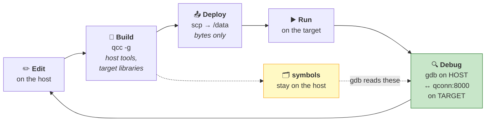

# Chapter 08 — The Toolchain: `qcc`, `q++` and Deployment ⭐

> **By the end of this chapter you will** have a development loop you can live in: edit, build,
> deploy, run and **debug a process on the target from a debugger on your host** — in seconds, not
> minutes.

> ⭐ **This chapter contains core lab L08**, and it is the one that changes how the rest of the course
> feels. Everything from Chapter 09 onwards assumes you have this loop.

---

## 🏃 Fast-Track Summary

> **🏃 Path C reads this box and does Lab 08.1**, then goes to
> [Chapter 09](Chapter09_MicrokernelArchitecture.md) — Part 2 begins.

**The loop:**

```bash
host$ qcc -Vgcc_ntox86_64 -g -O0 -o prog prog.c        # build (debuggable)
host$ scp prog qnxuser@$TGT:~/                      # deploy — ⚠️ `~`, not /data (D-015)
qnx$  ~/prog                                        # run
host$ ntox86_64-gdb prog                                # debug — symbols from the HOST copy
(gdb) target qnx $TGT:8000                              # ⚠️ the port is required
```

⚠️ **To `attach` to a *running* process, start `gdb` with the binary** — it reads symbols locally
([D-016](../meta/Doubts.md#d-016)).

**`qcc` essentials:**

| Flag | Does |
|------|------|
| `-V<target>` | Select the target. `gcc_ntox86_64` *(default)*, `_gpp`/`_cxx` for C++, `gcc_ntoaarch64le` for ARM64 |
| `-g` | Emit debug information — **required for useful debugging** |
| `-O0` · `-O2` | No optimisation *(debug)* · optimised *(release)* |
| `-Wall -Wextra` | Warnings. Use them |
| `-l<lib>` · `-L<dir>` · `-I<dir>` | Link a library · library path · include path |
| `-v` | Show the real `ntox86_64-gcc` command underneath |
| `-c` · `-o` | Compile only · output name |

**`q++` is `qcc` for C++**, or use `qcc -Vgcc_ntox86_64_gpp`.

**`qconn` is already running** on the target — `slm` starts it, port **8000**, since Chapter 06. There
is nothing to install.

**The debugging rule that matters:** run the **stripped/plain binary on the target**, point `gdb` at
the **unstripped copy on your host**. Symbols live on the host; only bytes go to the target.

**Deploy to `~`** — your home, `/data/home/qnxuser`, which is on the writable `/data` partition.
⚠️ **Not `/data` itself**: its root is owned by root ([D-015](../meta/Doubts.md#d-015)). `/tmp` works for
throwaways and vanishes on reboot.

**Build systems, in the order this course teaches them (ADR-007):** raw `qcc` → a plain Makefile →
QNX's **recursive Makefiles** (`common.mk`) → CMake if your project needs it.

**🏃 Skip to:** [Chapter 09](Chapter09_MicrokernelArchitecture.md). §3.4 is the half-page on remote
`gdb` that is worth reading properly even if you skip everything else here.

---

## 🎯 Learning Objectives

By the end of this chapter you will be able to:

- [ ] **Build** debuggable and release binaries with the right `qcc` flags, and say why they differ.
- [ ] **Deploy** to the target reliably, to a location that persists.
- [ ] **Attach** a host `gdb` to a target process through `qconn`, and set breakpoints by name.
- [ ] **Explain** where symbols live and why the target never needs them.
- [ ] **Automate** the loop with a Makefile so it costs one command.
- [ ] **Diagnose** the four classic loop failures: stale binary, mismatched symbols, wrong target, unwritable destination.
- [ ] **Choose** between raw `qcc`, a plain Makefile, QNX recursive Makefiles and CMake.

---

## 🧭 Prerequisites

| Need | Why |
|------|-----|
| [Chapter 05](Chapter05_InstallingQNXSDP.md) | `$QNX_HOST` / `$QNX_TARGET`, and what `qcc` is |
| [Chapter 06](Chapter06_FirstQNXVMOnQEMU.md) ⭐ | A booting VM, and **what persists** |
| [Chapter 07](Chapter07_FirstContactTheQNXShell.md) | `pidin` — you will use it to watch your own process |
| SSH to the target working | `ssh qnxuser@<ip>`. Ideally with a key (Setup Guide 03 §9.5) |

> 💡 **Set this now and use it throughout:**
>
> ```bash
> host$ export TGT=$(cd ~/qnx800/images/qemu/qemu && mkqnximage --getip)
> host$ echo $TGT
> ```
>
> | Command | Standard | Does |
> |---------|----------|------|
> | `export VAR=value` | POSIX shell | Set a variable **and** pass it to child processes |
> | `$(command)` | POSIX shell | *Command substitution* — replace with the command's output |

---

## 🗺️ Mental model

Cross-development is a loop with a network in the middle. Every stage can fail differently.



*Diagram: edit and build on the host, deploy only the binary to the target, run it there, and debug it
from a host-side gdb that talks to qconn over the network while reading symbols from the host's own
copy of the executable.*

> 💡 **Follow the dotted line, because it is the idea people miss.** The **symbols never leave your
> host.** `gdb` reads function names and line numbers from *your* copy; the target sends back raw
> addresses and memory. That is why a QNX target can ship a small stripped binary and still be fully
> debuggable — and it is the same split as the `.sym` files from Chapter 05 §3.4.

---

## 1. The Problem

### 1.1 The loop is where your time actually goes

You will run this cycle hundreds of times in the remaining chapters. Its cost is not the compile — it
is the friction:

| Friction | Cost over 200 iterations |
|----------|--------------------------|
| Typing a password for every `scp` | ~10 min |
| Forgetting `-V` and building a host binary | Minutes each, plus confusion |
| Copying to `/tmp`, rebooting, losing it | Repeated re-deploys |
| Debugging with `printf` because `gdb` "looked complicated" | **Hours** |

**The last row dominates**, and it is the one this chapter exists to remove. `printf` debugging on a
target you cannot see is slow and it changes timing — which, on a real-time system, changes the bug.

### 1.2 What is genuinely different from native development

| | Native | Cross |
|---|---|---|
| Build and run | Same machine | **Two machines** |
| Debugger and process | Same machine | **Debugger on host, process on target** |
| Symbols | Alongside the binary | **Only on the host** |
| A mistake gives you | An error | Sometimes **a working binary for the wrong OS** (Ch 05 §5.3) |

> ⚠️ **The last row is the one that bites.** Every other failure announces itself. Building for the
> wrong target succeeds silently and fails at deployment — or worse, at runtime.

### 1.3 What "productive" means here

By the end of this chapter, changing one line of C and seeing it run under a breakpoint on the target
should be **one command and a few seconds.** If it is not, something in the loop needs fixing, and
§4.3 lists the four things it usually is.

---

## 2. The Concept — four stages, four failure modes

### 2.1 Build

```bash
host$ qcc -Vgcc_ntox86_64 -g -O0 -Wall -Wextra -o prog prog.c
```

| Flag | Why |
|------|-----|
| `-Vgcc_ntox86_64` | **Never omit it.** Explicit beats default, and it shows in your build log |
| `-g` | Debug information. Without it `gdb` shows addresses, not names |
| `-O0` | No optimisation — variables stay where you expect while debugging |
| `-Wall -Wextra` | Catches the `getpid` class of mistake ([D-014](../meta/Doubts.md#d-014)) |

> ⚠️ **`-g` and `-O2` together are legal and often confusing.** Optimised code is reordered, inlined
> and has variables in registers, so a breakpoint may land somewhere surprising and a variable may
> read `<optimized out>`. **Debug with `-O0`; ship with `-O2`; profile with `-O2 -g`** and expect the
> confusion.

### 2.2 Deploy

```bash
host$ scp prog qnxuser@$TGT:~/
```

| Decision | Why |
|----------|-----|
| **`qnxuser`**, not `root` | `PermitRootLogin no` ([D-009](../meta/Doubts.md#d-009)). Affects `scp` identically |
| **Your home directory** — `~`, i.e. `/data/home/qnxuser` | On the writable `/data` partition, **and writable by you** |
| A **key**, not a password | Setup Guide 03 §9.5. You will do this hundreds of times |

> ⚠️ **Deploy to `~`, not to `/data`.** `/data` is the writable *partition*, but **its root is owned by
> root** — `qnxuser` cannot create files directly in it:
>
> ```text
> scp: dest open "/data/avg": Permission denied
> ```
>
> Your home lives **on** that partition (`/data/home/qnxuser`, per
> [D-011](../meta/Doubts.md#d-011)), so it is both writable and persistent. An earlier version of this
> chapter said `/data` — corrected, see [D-015](../meta/Doubts.md#d-015).

> 💡 **`/tmp` is fine for throwaways** — writable by anyone, and it disappears on reboot, which is
> occasionally exactly what you want.

### 2.3 Run

```bash
qnx$ chmod +x ~/prog
qnx$ ~/prog
```

| Command | Standard | Does |
|---------|----------|------|
| `chmod +x f` | POSIX | Add execute permission. `scp` does not always preserve it |

And, from Chapter 07, watch it while it runs:

```bash
qnx$ pidin | grep prog
```

### 2.4 Debug ⭐

This is the stage most people skip, and it is the one worth the effort.

```bash
qnx$  qconn                      # usually already running — slm starts it
host$ ntox86_64-gdb prog         # the HOST copy, with symbols
(gdb) target qnx 192.168.122.46:8000
(gdb) upload prog ~/prog
(gdb) break main
(gdb) run
```

> 📖 **`qconn`** — the QNX **remote agent** on the target. It lets a host-side debugger start, stop,
> inspect and control target processes. Listens on **port 8000**, and has been running since Chapter
> 06 because `slm` starts it.

### 🐧 In Linux this would be…

| | 🐧 Native Linux | 🔷 QNX cross |
|---|---|---|
| Compiler | `gcc` | **`qcc -V<target>`** |
| Debugger | `gdb ./prog` | **`ntox86_64-gdb prog`**, then `target qnx <ip>:8000` |
| Deployment | None — run it | **`scp` to the target** |
| Symbols | Alongside the binary | **On the host only** |
| Debug agent | None needed | **`qconn`** |

The closest Linux analogue is `gdbserver`:

```text
Linux:  target$ gdbserver :1234 ./prog     host$ gdb ./prog → target remote <ip>:1234
QNX:    target$ qconn                       host$ ntox86_64-gdb prog → target qnx <ip>:8000
```

> 💡 **`qconn` does more than `gdbserver`.** `gdbserver` debugs *one process you launch under it*.
> `qconn` is a general remote agent: it can **list processes, attach to a running one, and upload
> files**, which is why the IDE integrations (Momentics, the VS Code QNX Toolkit) can show you a live
> process list and attach with a click.

### 📦 Analogy — the surgeon and the theatre

> 🏥 **The patient is on the target; the surgeon is on your host.**
>
> `qconn` is the **theatre staff** — they hold the instruments, follow instructions, and report what
> they see. They do not decide anything.
>
> **The symbols are the surgeon's anatomy textbook, and it stays on the surgeon's desk.** The theatre
> reports *"bleeding at coordinates 0x4004f2"*; the surgeon looks it up and knows that is
> `calculate_dose`, line 47.
>
> That is why the patient does not need to carry a textbook — and why an embedded device ships a small
> stripped binary while remaining perfectly debuggable.

---

## 3. The Mechanism

### 3.1 `qcc` in earnest

`qcc` is a **driver** (Chapter 05 §5.2): it reads `-V`, finds the definition in `$QNX_HOST/etc/qcc/`,
and assembles the real `ntox86_64-gcc` command.

| Flag | Meaning |
|------|---------|
| `-V<target>` | Target selection. Verified list: `gcc_ntox86_64` *(default)*, `_gpp`, `_cxx`; `gcc_ntoaarch64le`, `_gpp`, `_cxx` |
| `-g` | Debug information |
| `-O0` `-O1` `-O2` `-O3` `-Os` | Optimisation level |
| `-Wall -Wextra` | Warnings |
| `-Werror` | Warnings become errors — good in CI |
| `-c` | Compile to `.o`, do not link |
| `-o <name>` | Output |
| `-I<dir>` `-L<dir>` `-l<name>` | Include path · library path · link a library |
| `-shared -fPIC` | Build a shared object |
| `-static` | Link statically |
| `-v` | Show the underlying command |
| `-E` `-S` | Stop after preprocessing · after assembly |

**C++:**

```bash
host$ q++ -Vgcc_ntox86_64_gpp -g -O0 -o prog prog.cpp
```

> 💡 **`_gpp` versus `_cxx`.** `_gpp` uses `libstdc++`, the GNU C++ library — that is what you want
> unless you have a specific reason. `_cxx` selects QNX's older C++ library, present for legacy code.
> **When in doubt, `_gpp`.**

### 3.2 Build systems — the progression this course follows

**ADR-007** deliberately teaches these in order, because each one hides the previous.

**① Raw `qcc`** — what you have used so far. Perfect for one file; unmanageable beyond three.

**② A plain Makefile** — explicit, portable, and you can read every line:

```makefile
CC     := qcc
TARGET := -Vgcc_ntox86_64
CFLAGS := -g -O0 -Wall -Wextra
TGT    ?= 192.168.122.46
USER   ?= qnxuser

prog: prog.c
	$(CC) $(TARGET) $(CFLAGS) -o $@ $<

deploy: prog
	scp prog $(USER)@$(TGT):$(DEST)/

clean:
	rm -f prog

.PHONY: deploy clean
```

| Makefile syntax | Means |
|-----------------|-------|
| `:=` | Assign **now** |
| `?=` | Assign **only if not already set** — so `make TGT=1.2.3.4 deploy` overrides it |
| `$@` · `$<` | The target being built · the first prerequisite |
| `.PHONY` | These names are commands, not files |

> 💡 **`make deploy` is the single command §1.3 promised.** One line of C changed, one command, and it
> is on the target. That is the difference between a loop you use and one you avoid.

**③ QNX recursive Makefiles (`common.mk`)** — QNX's own system, which builds for multiple
architectures and variants from one source tree, with a directory hierarchy encoding the variants. It
is genuinely useful on a real project and genuinely opaque on a first encounter, which is why it comes
third. QNX's *Programmer's Guide* documents it; this course uses it from Part 3, where multi-file
projects arrive.

**④ CMake** — supported, and the right answer if your project already uses it or is cross-platform.
Point it at `qcc` with a toolchain file. Not used in this course, because it would hide exactly what
Chapters 05 and 08 are trying to show.

### 3.3 Deployment, beyond `scp`

| Method | When |
|--------|------|
| **`scp`** | ⭐ Default. Simple, works, no setup |
| `gdb`'s `upload` | While already in a debug session |
| `rsync` | Many files, and only the changed ones — **if present on the target** |
| A shared folder | `mkqnximage` can configure one; avoids copying entirely |
| Into the **image** | Chapter 21 — for anything that must survive a rebuild |

> ⚠️ **Deployment is the stage that silently uses a stale binary.** You edit, forget to rebuild, `scp`
> the old file, and debug behaviour that no longer matches your source. §4.3 and the 💥 exercise are
> about exactly this.

### 3.4 Remote debugging, properly ⭐

This half-page is the most valuable in the chapter.

```mermaid
sequenceDiagram
    participant H as 🖥️ ntox86_64-gdb<br/>(host — has symbols)
    participant Q as 🔌 qconn :8000<br/>(target)
    participant P as ▶️ your process<br/>(target)
    H->>Q: target qnx <ip>:8000
    Q-->>H: connected
    H->>Q: upload prog ~/prog
    H->>Q: break main  →  "set a trap at 0x4004f2"
    Note over H: gdb translated<br/>"main" using the<br/>HOST copy's symbols
    H->>Q: run
    Q->>P: start, then stop at 0x4004f2
    P-->>Q: stopped; registers + memory
    Q-->>H: raw addresses and bytes
    Note over H: gdb translates back:<br/>"main() at prog.c:12"
```

*Diagram: gdb on the host translates names to addresses using its own copy of the binary, sends only
addresses to qconn, and translates the raw registers and memory that come back into source-level
information.*

**The full sequence:**

```bash
host$ ntox86_64-gdb prog
(gdb) target qnx 192.168.122.46:8000
(gdb) upload prog ~/prog
(gdb) break main
(gdb) run
(gdb) next
(gdb) print myvar
(gdb) backtrace
(gdb) continue
```

**Or attach to something already running.** ⚠️ **This needs one more step than it looks:**

```bash
host$ ntox86_64-gdb ./prog                    # ⭐ give gdb the HOST copy FIRST
(gdb) target qnx 192.168.122.46:8000
(gdb) info pidlist
(gdb) attach 14032920
```

> ⚠️ **`attach` alone is not enough — `gdb` needs a local copy of the binary to read symbols from.**
> Attach without one and you get:
>
> ```text
> (gdb) attach 1540128
> usr/bin/sleep: No such file or directory.
> ```
>
> That is **§3.4's design showing itself**, not a bug. `info pidlist` reports the path as it exists on
> the *target* — and `gdb` tries to open it on the *host*, where it either does not exist or (worse) is
> a Linux binary of the same name.
>
> **For your own programs** the host copy is right there — start `gdb` with it. **For a target
> utility**, look in the SDP's target tree (Chapter 05 §2.2) — ⚠️ **note the `x86_64/`**:
>
> ```bash
> host$ ls $QNX_TARGET/x86_64/usr/bin/sleep        # check it is actually there first
> host$ ntox86_64-gdb $QNX_TARGET/x86_64/usr/bin/sleep
> ```
>
> > ⚠️ **`$QNX_TARGET/usr/bin` does not exist, and that is not a mistake.** `$QNX_TARGET/usr` holds
> > the *architecture-independent* development side — `include/`, `lib/`, `help/`, `share/`. Every
> > file that actually **runs on QNX** lives one level down, under the architecture:
> > `$QNX_TARGET/x86_64/…` or `$QNX_TARGET/aarch64le/…` (Chapter 05 §2.1). Drop the `x86_64/` and you
> > land in the headers. See [D-017](../meta/Doubts.md#d-017).
>
> **And if the utility is not in the SDP at all**, take the binary from the machine that is running
> it — which is the one copy guaranteed to match:
>
> ```bash
> host$ scp qnxuser@$TGT:/usr/bin/sleep /tmp/sleep.qnx
> host$ ntox86_64-gdb /tmp/sleep.qnx
> ```
>
> Or point `gdb` at the whole tree once and let it resolve paths itself:
>
> ```bash
> host$ ntox86_64-gdb -ex "set sysroot $QNX_TARGET/x86_64"
> ```
>
> *(The **shell** expands `$QNX_TARGET` before `gdb` sees it — `gdb` does not expand shell variables.)*
> Full explanation: [D-016](../meta/Doubts.md#d-016).

> ⚠️ **The port is not optional.** `target qnx 192.168.122.46` — without `:8000` — **hangs** rather
> than erroring; you have to `Ctrl+C` out. Always give the port.

| `gdb` command | Does |
|---------------|------|
| `target qnx <ip>:8000` | Connect to `qconn` |
| `upload <host> <target>` | Copy a file across the debug connection |
| `info pidlist` | **List target processes** — `qconn` supplies this |
| `attach <pid>` | Attach to a running process |
| `break <fn>` · `break <file>:<line>` | Breakpoints |
| `run` · `continue` · `next` · `step` | Start · resume · over · into |
| `print <expr>` · `backtrace` · `info locals` | Inspect |
| `detach` · `quit` | Leave the process running · exit |

> ⚠️ **The symbols must match the binary exactly.** Rebuild without redeploying — or deploy without
> rebuilding your host copy — and `gdb` will confidently show you the **wrong function names**. That
> is worse than no symbols, because you will believe it. This is the same warning as Chapter 05's
> `.sym` files, and the 💥 exercise reproduces it.

### 🔬 Deep dive — why the symbols stay on the host

<details>
<summary>Optional. Explains a design choice you will otherwise just have to accept.</summary>

A debugger needs two things: the ability to **control** a process (stop it, read registers and memory,
set breakpoints), and the ability to **interpret** what it sees (this address is `main`, that word is
`int count`).

**Control must happen on the target.** Only the target's kernel can stop a target thread.

**Interpretation is pure computation over the debug information**, and debug information is *large* —
often several times the size of the code, which is why Chapter 05's `.sym` files are 12 MB for a 20 MB
kernel.

**So QNX splits them.** `qconn` does control and speaks in raw addresses. `gdb` does interpretation
and keeps the debug information on the host.

**Three consequences worth knowing:**

| Consequence | Why it matters |
|-------------|----------------|
| The target binary can be **stripped** | Production images stay small without losing debuggability |
| You can debug a program whose target copy has **no symbols at all** | As long as the host copy matches |
| **Mismatched builds produce confident nonsense** | Nothing checks that the two copies correspond |

> 💡 **The third is the price of the design.** There is no automatic verification that the binary on
> the target is the one `gdb` has symbols for. Keeping the build and the deploy in a **single `make`
> target** is the practical defence — which is why §3.2's Makefile has `deploy` depend on `prog`.

**And note the elegance of the split**: the same arrangement makes `.sym` files useful for post-mortem
analysis of a core dump from a device in the field. The device ships stripped; the symbols are in your
build archive; the two are reunited when needed. Chapter 25 covers core dumps.

</details>


---

## 4. The Toolchain Reference

> The section to come back to. Chapters that teach an API use §4 for signatures; this chapter's API is
> its command line.

### 4.1 Build

```bash
host$ qcc -Vgcc_ntox86_64 -g -O0 -Wall -Wextra -o prog prog.c    # debug
host$ qcc -Vgcc_ntox86_64 -O2 -Wall -o prog prog.c               # release
host$ q++ -Vgcc_ntox86_64_gpp -g -O0 -o prog prog.cpp            # C++
host$ qcc -Vgcc_ntoaarch64le -g -o prog prog.c                   # ARM64
```

| Targets | |
|---------|---|
| `gcc_ntox86_64` | C, x86_64 — **the default, and this course's** |
| `gcc_ntox86_64_gpp` · `_cxx` | C++ with `libstdc++` · legacy QNX C++ |
| `gcc_ntoaarch64le` *(+ `_gpp`, `_cxx`)* | ARM64 — Part 6 |

### 4.2 Deploy, run, debug

```bash
host$ export TGT=$(cd ~/qnx800/images/qemu/qemu && mkqnximage --getip)
host$ scp prog qnxuser@$TGT:~/
host$ ssh qnxuser@$TGT 'chmod +x ~/prog && ~/prog'
host$ ntox86_64-gdb prog
(gdb) target qnx $TGT:8000
```

| Command | Does |
|---------|------|
| `ssh user@host 'cmd'` | Run one command remotely and return — no interactive session |
| `a && b` | Run `b` only if `a` succeeded |

### 4.3 The four classic loop failures ⚠️

| Symptom | Cause | Fix |
|---------|-------|-----|
| Changes have no effect | **Stale binary** — you deployed without rebuilding | Make `deploy` depend on the build (§3.2) |
| `gdb` shows wrong function names, or nonsense | **Symbol mismatch** — host and target copies differ | Rebuild *and* redeploy from one command |
| `cannot execute: required file not found` **on the target** | Built for the **wrong architecture** | `file prog` — check `x86-64` and `ldqnx-64.so.2` |
| `Permission denied` on `scp` | Used **`root@`** | Use `qnxuser@` ([D-009](../meta/Doubts.md#d-009)) |
| `target qnx <ip>` **hangs** | Port omitted | Always `<ip>:8000` |
| `attach` says `…: No such file or directory` | **`gdb` has no local copy of the binary** | Start `gdb` with it, or `set sysroot $QNX_TARGET/x86_64` ([D-016](../meta/Doubts.md#d-016)) |
| `cd: bin: No such file or directory` under `$QNX_TARGET/usr` | Missing the architecture level | `$QNX_TARGET/**x86_64**/usr/bin` — `$QNX_TARGET/usr` is headers ([D-017](../meta/Doubts.md#d-017)) |
| `scp: dest open "/data/x": Permission denied` | **`/data`'s root is owned by root** | Deploy to **`~`** (`/data/home/qnxuser`) — [D-015](../meta/Doubts.md#d-015) |
| Deployed file gone after a reboot | Wrote to `/tmp` or `/etc` | Deploy to **`~`**, which is on the `/data` partition (Ch 06 §3.3) |
| `qcc: command not found` | Environment not loaded | `source ~/qnx800/qnxsdp-env.sh` |

> 💡 **The first two are the same bug**, and both are cured by never deploying by hand. One `make
> deploy` that depends on the build makes stale binaries structurally impossible.

### 4.4 `gdb` working set

| Command | Does |
|---------|------|
| `target qnx <ip>:8000` | Connect to `qconn` |
| `upload <host> <target>` | Copy a file over the debug link |
| `info pidlist` | List target processes, as `path - pid/tid` |
| `attach <pid>` · `detach` | Attach · leave it running. ⚠️ **`gdb` must already have a local copy of the binary** ([D-016](../meta/Doubts.md#d-016)) |
| `set sysroot <dir>` | Where to look for target binaries and libraries — e.g. `$QNX_TARGET/x86_64` |
| `break <fn>` · `break <file>:<line>` · `delete` | Set and remove breakpoints |
| `run` · `continue` · `next` · `step` · `finish` | Start · resume · over · into · out |
| `print <expr>` · `info locals` · `backtrace` | Inspect |
| `list` | Show source around the stop |

### 4.5 A Makefile worth copying

```makefile
CC     := qcc
TARGET := -Vgcc_ntox86_64
CFLAGS := -g -O0 -Wall -Wextra
TGT    ?= 192.168.122.46
USER   ?= qnxuser
DEST   ?= /data/home/$(USER)

prog: prog.c
	$(CC) $(TARGET) $(CFLAGS) -o $@ $<
	@file $@ | grep -q 'ldqnx' && echo "OK: QNX binary" || echo "WARNING: not a QNX binary!"

deploy: prog
	scp prog $(USER)@$(TGT):$(DEST)/
	ssh $(USER)@$(TGT) 'chmod +x $(DEST)/prog'

run: deploy
	ssh $(USER)@$(TGT) '$(DEST)/prog'

debug: deploy
	ntox86_64-gdb -ex "target qnx $(TGT):8000" prog

clean:
	rm -f prog

.PHONY: deploy run debug clean
```

> 💡 **Two details doing real work.** The `file | grep -q 'ldqnx'` check catches Chapter 05 §5.3's
> silent failure — a working binary for the wrong OS — **at build time**. And `run` and `debug`
> depending on `deploy`, which depends on `prog`, makes it impossible to run a stale binary.

---

## 5. Worked Example — find a bug you cannot see

A program that misbehaves on the target. We will find it with the debugger rather than with `printf`.

### 5.1 The program

```c
#include <stdio.h>
#include <string.h>

static int sum_readings(const int *r, int count)
{
    int total = 0;
    for (int i = 0; i <= count; i++)   /* the bug */
        total += r[i];
    return total;
}

int main(void)
{
    int readings[4] = { 10, 20, 30, 40 };
    printf("average = %d\n", sum_readings(readings, 4) / 4);
    return 0;
}
```

**It compiles cleanly and prints a plausible number**, which is exactly what makes it worth the
exercise.

> 🐣 **`strcmp`, `strlen` and friends live in `<string.h>`** — ISO C, like `printf`
> ([D-014](../meta/Doubts.md#d-014)). It is included here only to keep the example realistic.

### 5.2 Build, deploy, run

```bash
host$ qcc -Vgcc_ntox86_64 -g -O0 -Wall -Wextra -o avg avg.c
host$ file avg
host$ scp avg qnxuser@$TGT:~/
host$ ssh qnxuser@$TGT 'chmod +x ~/avg && ~/avg'
```

The output is *a* number. On a good day it is 25 and you never notice. On a bad day it is enormous,
or the program crashes — because `r[4]` is past the end of the array.

> ⚠️ **This is the archetypal embedded bug**: undefined behaviour that usually looks fine. `-Wall
> -Wextra` does **not** catch it, because the compiler cannot know `count`'s value at that call site.

### 5.3 Debug it

```bash
host$ ntox86_64-gdb avg
(gdb) target qnx 192.168.122.46:8000
(gdb) upload avg ~/avg
(gdb) break sum_readings
(gdb) run
```

At the breakpoint:

```text
(gdb) info args
r = 0x8047b30
count = 4

(gdb) next            # step through the loop
(gdb) print i
$1 = 0
(gdb) print total
$2 = 10
```

Keep going. The moment worth waiting for:

```text
(gdb) print i
$5 = 4
(gdb) print count
$6 = 4
(gdb) print r[4]
$7 = 32767          ← garbage. Past the end of the array
```

**There it is.** `i <= count` with a 4-element array reads `r[4]`, which does not exist. The fix is
`i < count`.

### 5.4 Why the debugger beat `printf`

| | `printf` | `gdb` |
|---|---|---|
| To inspect a new variable | Edit, rebuild, redeploy, rerun | **Type `print x`** |
| Effect on timing | Changes it — and on a real-time system, changes the bug | Only at breakpoints |
| Seeing memory *around* a pointer | Awkward | `x/8xw r` |
| Reading a value the program never prints | Impossible without editing | Routine |
| Attaching to something already misbehaving | Impossible | `attach <pid>` |

> 💡 **The timing row is not a nicety on QNX.** Chapter 01 taught that adding work changes the worst
> case. A `printf` inside a control loop can hide a race, create one, or move a deadline miss out of
> reach — and then it disappears when you remove the `printf`. That class of bug is why remote
> debugging is a `⭐ core` skill here rather than a convenience.

### 5.5 The loop, compressed

Once §4.5's Makefile is in place:

```bash
host$ make debug
```

Builds, checks it really is a QNX binary, deploys, sets execute permission, launches `gdb` and
connects. **One command, a few seconds.** That is what §1.3 promised, and it is the point of the
chapter.


---

## 🧪 Labs

> **The VM must be booted and reachable over SSH.**
>
> ```bash
> host$ source ~/qnx800/qnxsdp-env.sh
> host$ export TGT=$(cd ~/qnx800/images/qemu/qemu && mkqnximage --getip)
> host$ ssh qnxuser@$TGT 'echo ok'
> ```
>
> Lab code: **`labs/lab08_devloop/`**

### Lab 08.1 — The full loop, with a debugger  [🚶🏃] ⭐ **core lab L08**

> **Objective.** Build, deploy, run and **debug a target process from your host** — then find the bug
> in §5.1 without editing the source.
> **Time.** 40 minutes. 📌 `[UNVERIFIED]` — block **V13**.

**Step 1 — build and check.**

```bash
host$ cd ~/exercises/qnx-zero-to-hero/labs/lab08_devloop
host$ make
host$ file avg
```

✅ **Expected:** `interpreter /usr/lib/ldqnx-64.so.2`, and the Makefile's `OK: QNX binary` line.

**Step 2 — deploy and run.**

```bash
host$ make TGT=$TGT run
```

📋 **Paste what it prints.** It may be 25, or nonsense, or it may crash — **all three are interesting**
and the variability is the point (§5.2).

**Step 3 — debug it.** ⭐ *the part that matters*

```bash
host$ make TGT=$TGT debug
```

or by hand:

```bash
host$ ntox86_64-gdb avg
(gdb) target qnx <ip>:8000
(gdb) upload avg ~/avg
(gdb) break sum_readings
(gdb) run
(gdb) info args
(gdb) next
(gdb) print i
(gdb) print total
```

Keep stepping until `i` reaches `4`, then:

```text
(gdb) print count
(gdb) print r[4]
```

📋 **Paste the whole session**, especially `print r[4]`.

**Step 4 — fix and re-verify.**

Change `i <= count` to `i < count` in `skeleton/avg.c` (or `solution/`), then:

```bash
host$ make TGT=$TGT run
```

✅ **Expected:** a stable `average = 25`, every time.

**Step 5 — attach to something already running.**

⚠️ **Start `gdb` *with* the binary.** `attach` needs a local copy to read symbols from — see below.

**5a — attach to your own program** *(the realistic case)*:

```bash
qnx$  ~/avg &                                  # or any long-running program of yours
qnx$  pidin | grep avg
host$ ntox86_64-gdb avg                        # ⭐ the host copy, with symbols
(gdb) target qnx <ip>:8000                     # ⚠️ the port is required
(gdb) info pidlist
(gdb) attach <pid>
(gdb) backtrace
(gdb) detach
```

**5b — attach to a target utility** *(where do its symbols live?)*:

```bash
qnx$  sleep 600 &
qnx$  pidin | grep sleep

host$ ls $QNX_TARGET/x86_64/usr/bin/sleep      # ⚠️ note the x86_64/ — check it exists
host$ ntox86_64-gdb $QNX_TARGET/x86_64/usr/bin/sleep
(gdb) target qnx <ip>:8000
(gdb) info pidlist
(gdb) attach <the sleep pid>
(gdb) backtrace
(gdb) detach
```

> ⚠️ **`$QNX_TARGET/usr/bin` does not exist.** `$QNX_TARGET/usr/` is the architecture-*independent*
> development side — headers and docs. Everything that runs on QNX is under the architecture:
> `$QNX_TARGET/x86_64/`. ([D-017](../meta/Doubts.md#d-017))

**If `ls` says the file is not there**, the SDP does not ship that utility. Copy it off the target
instead — the running machine's own copy is by definition the right one:

```bash
host$ scp qnxuser@$TGT:/usr/bin/sleep /tmp/sleep.qnx
host$ ntox86_64-gdb /tmp/sleep.qnx
```

📋 **Report which of the two you needed.** The course does not know whether `sleep` is in the SDP's
target tree — [D-017](../meta/Doubts.md#d-017).

📋 **Report both**, including any error.

<details>
<summary>Why step 5 matters more than it looks</summary>

Steps 1–4 debug a process **you launched under the debugger**. Step 5 attaches to one that was
**already running** — which is the situation you will actually be in when something misbehaves on a
target you did not start.

**That capability is `qconn`, not `gdb`.** A plain `gdbserver` cannot do it; you must have started the
process under the server. `qconn` is a general agent, which is why the IDE integrations can show a
live process list and attach with a click.

**And note what you did not need:** no symbols on the target, no debug build deployed, no special
kernel. The target ran an ordinary binary; everything else happened on your host.

> ⚠️ **Which is exactly why 5b needs `$QNX_TARGET`.** `attach` gives `gdb` control of the process, but
> `gdb` still has to find the *symbols* somewhere — and it looks **locally**. `info pidlist` reports
> `usr/bin/sleep`, a path on the *target*; opening that on your host finds nothing (or, if you supply
> a leading slash, finds **Linux's** `sleep` — the wrong binary for the wrong OS).
>
> The SDP's target tree is the answer, and it is the payoff for Chapter 05 §2.2's observation that
> `$QNX_TARGET/x86_64/` is *a faithful image of a QNX filesystem*. **That is where a target
> utility's symbols live on your host.** [D-016](../meta/Doubts.md#d-016).

</details>

---

### Lab 08.2 — Automate the loop  [🚶🏃]

> **Objective.** Get the loop down to one command, and make stale binaries impossible.
> **Time.** 15 minutes. 📌 `[UNVERIFIED]`

Open `labs/lab08_devloop/Makefile` and read it. Then:

1. Change `prog.c`, run `make run`, and confirm the change appears **without** a manual `scp`.
2. Deliberately break the target selection — change `TARGET` to `-Vgcc_ntoaarch64le` and run `make`.
   **What does the `file` check say?**
3. Add a `stripped` target that produces a release build (`-O2`, no `-g`) and compare the sizes.

<details>
<summary>Answers</summary>

1. `run` depends on `deploy`, which depends on `avg` — so `make` rebuilds first. **That dependency
   chain is the whole defence against stale binaries** (§4.3).
2. The build **succeeds** — it is a perfectly valid ARM64 binary — and the `file` check prints
   `WARNING: not a QNX binary!`… or rather, it still finds `ldqnx`, because an ARM64 QNX binary also
   uses a QNX interpreter. 📋 **Report what actually happens.** If the check passes an ARM64 binary,
   it needs tightening to look for `x86-64` as well, and that is a genuine finding.
3. Something like:

   ```makefile
   stripped: avg.c
   	$(CC) $(TARGET) -O2 -Wall -o avg-rel $<
   	$(QNX_HOST)/usr/bin/ntox86_64-strip avg-rel
   ```

   The stripped release build should be substantially smaller. **That size difference is why Chapter
   05's `.sym` files exist** — production ships small, symbols stay behind.

</details>

---

### 💥 Break It — debug the wrong binary  [🚶🏃]

> **Objective.** Experience the failure mode §3.4 warns about, deliberately — because in the wild it
> is genuinely confusing.
> **Time.** 10 minutes. 📌 `[UNVERIFIED]`

**Step 1 — build and deploy version 1.**

```bash
host$ cd /tmp
host$ printf '#include <stdio.h>\nvoid alpha(void){printf("ALPHA\\n");}\nint main(void){alpha();return 0;}\n' > v.c
host$ qcc -Vgcc_ntox86_64 -g -O0 -o v v.c
host$ scp v qnxuser@$TGT:~/
```

**Step 2 — change the source substantially, rebuild the *host* copy only.** Do **not** redeploy.

```bash
host$ printf '#include <stdio.h>\nvoid beta(void){printf("BETA\\n");}\nvoid gamma(void){printf("GAMMA\\n");}\nint main(void){beta();gamma();return 0;}\n' > v.c
host$ qcc -Vgcc_ntox86_64 -g -O0 -o v v.c
```

Now the host copy has `beta` and `gamma`; the target still has `alpha`.

**Step 3 — debug, and watch it lie.**

```bash
host$ ntox86_64-gdb v
(gdb) target qnx <ip>:8000
(gdb) break beta
(gdb) attach <pid of a running /data/v>
```

*(Or simply `run` and observe what the target actually prints versus what `gdb` believes it is
running.)*

**Step 4 — clean up.**

```bash
host$ scp v qnxuser@$TGT:~/          # redeploy, restoring sanity
host$ rm -f /tmp/v /tmp/v.c
```

<details>
<summary>What you should see, and why it is worse than a crash</summary>

**`gdb` will not warn you.** Nothing in the protocol checks that the target binary is the one the
host has symbols for. Expect breakpoints in the wrong place, `backtrace` naming functions that are not
running, and variables reading nonsense — all delivered with complete confidence.

> ⚠️ **This is worse than a crash, because a crash tells you something is wrong.** Here the debugger
> gives you plausible, detailed, entirely fictional answers, and you will believe them for as long as
> it takes you to notice the target is printing `ALPHA` while `gdb` insists you are in `beta`.

**The defence is structural, not vigilance:** never deploy by hand. §4.5's Makefile makes `debug`
depend on `deploy`, which depends on the build — so the two copies cannot diverge.

**And the general lesson:** the same trap applies to Chapter 05's `.sym` files and to core-dump
analysis in Chapter 25. Whenever symbols are stored separately from the binary they describe,
**keeping them in step is your responsibility**, and nothing will check it for you.

</details>

📋 **Report what `gdb` did.** The course predicts confident nonsense; it has never watched it happen.

---

### 🐣 Path A Activity — read a debugging session  [🐣]

> **Objective.** Understand what a debugger gives you, without running one.
> **Time.** 15 minutes. **No VM, no compiler.**

Here is a real-shaped session. Read it and answer.

```text
(gdb) target qnx 192.168.122.46:8000
(gdb) break sum_readings
Breakpoint 1 at 0x4005a2: file avg.c, line 6.
(gdb) run
Breakpoint 1, sum_readings (r=0x8047b30, count=4) at avg.c:6
6           int total = 0;
(gdb) print count
$1 = 4
(gdb) next
7           for (int i = 0; i <= count; i++)
(gdb) print i
$2 = 0
... (stepping) ...
(gdb) print i
$5 = 4
(gdb) print r[4]
$6 = 32767
(gdb) print r[3]
$7 = 40
```

1. Where does the program stop, and how did `gdb` know where `sum_readings` was?
2. `count` is 4 and the array has 4 elements. Why is `i` reaching 4 a problem?
3. `r[3]` is 40 and `r[4]` is 32767. What is 32767?
4. `gdb` ran on the host and the program on the target. What crossed the network, and what did not?

<details>
<summary>Answers</summary>

1. At **`avg.c` line 6**, the first line of `sum_readings`. `gdb` translated the *name* to the
   address `0x4005a2` using **the host's copy of the binary and its debug information** — the target
   was only ever told an address (§3.4).
2. Valid indices are `0`–`3`. `i <= count` makes the loop run with `i == 4`, reading **past the end of
   the array** — undefined behaviour that usually looks fine.
3. **Whatever happened to be in that memory.** Not a meaningful value — it is the next thing on the
   stack. It could be anything, which is why the program's output is unpredictable rather than
   reliably wrong.
4. **Across the network:** addresses, register values, raw memory bytes, and "stop"/"continue"
   commands. **Not across:** any symbol, function name, line number or type. All of that stayed on
   the host, which is why the target can run a stripped binary and still be debugged fully.

</details>

> 💡 **You just read a bug out of a debugging session without touching a keyboard.** Being able to
> follow one is worth having even if you never drive one — it is how you will read a colleague's bug
> report, or an issue on a project's tracker.


---

## ✅ Mastery Check

**1.** *(Recall)* Where do the symbols live during a remote debugging session, and why?

<details><summary>Answer</summary>

**On the host, with `gdb`.** Only addresses, register values and raw memory cross the network.

**Why:** debug information is large — often several times the size of the code — and interpreting it
is pure computation that needs no access to the target. Only *control* (stopping threads, reading
memory) must happen on the target, which is `qconn`'s job.

**The consequence:** a production target can ship a small stripped binary and remain fully
debuggable.

</details>

**2.** *(Recall)* You build with `-O2 -g` and a breakpoint lands somewhere strange, with variables
showing `<optimized out>`. Is this a bug?

<details><summary>Answer</summary>

**No.** Optimised code is reordered, inlined and keeps variables in registers, so the mapping between
source lines and machine code is no longer one-to-one.

**Debug with `-O0`; ship with `-O2`.** When you must debug an optimised build — because the bug only
appears there — expect this and lean on `backtrace` and memory inspection rather than line stepping.

</details>

**3.** *(Apply)* Your change has no effect on the target no matter how many times you rerun. Give the
two most likely causes and the one structural fix.

<details><summary>Answer</summary>

**Causes:** you rebuilt but did not redeploy (**stale binary**), or you deployed but the target is
running a different copy — from `/tmp`, or an older one still in `/data`.

**The fix is not vigilance.** Make deployment depend on the build:

```makefile
deploy: prog
	scp prog $(USER)@$(TGT):$(DEST)/
run: deploy
	ssh $(USER)@$(TGT) '$(DEST)/prog'
```

Now `make run` cannot run a stale binary, because `make` will not let it.

</details>

**4.** *(Apply)* `gdb` reports you are stopped in `beta()`, but the target is printing `ALPHA`. What
has happened?

<details><summary>Answer</summary>

**The host binary and the target binary are different builds.** `gdb` is reading symbols from your
host copy — which has `beta` — while the target is running an older copy containing `alpha`.

Nothing checks this. `gdb` will give confident, detailed, entirely fictional answers.

**Fix:** redeploy so the two match, and then make the two steps inseparable (question 3).

**This is the same hazard as a stale `.sym` file** (Chapter 05 §3.4) and as core-dump analysis
(Chapter 25). Whenever symbols are stored apart from the binary they describe, keeping them in step is
**your** responsibility.

</details>

**5.** *(Design)* Your team will run QNX builds and target tests in CI, on a machine nobody logs into.
What does the pipeline need, and what would you assert to prove it built and deployed the right thing?

<details><summary>Answer</summary>

**Needs:**

| # | Requirement | Note |
|---|-------------|------|
| 1 | An SDP installation, and `source qnxsdp-env.sh` **inside each job's shell** | Every job is a fresh shell (Ch 05 §3.2) |
| 2 | An **appropriate licence** | ⚠️ **Ask first.** Automated builds for a product are development work; a non-commercial licence is unlikely to be right for a company build server (Ch 04) |
| 3 | A reachable target — hardware, or `mkqnximage` under QEMU on the runner | The VM route is what this course uses |
| 4 | **Key-based SSH**, never a password | Non-interactive by definition |
| 5 | Explicit `-V<target>` on every invocation | Visible in the log; never rely on the default |

**Assertions:**

```bash
file build/prog | grep -q 'ldqnx-64.so.2'   || exit 1   # it is a QNX binary
file build/prog | grep -q 'x86-64'          || exit 1   # …for the right architecture
ssh -o BatchMode=yes qnxuser@$TGT '~/prog' | grep -q 'expected output' || exit 1
```

**And the one worth arguing for:** the third assertion — **actually running it on a target** — is
what turns a build check into a test. A binary that compiles proves very little; one that runs
correctly on QNX proves the loop end to end.

**Requirement 2 is the answer the question is really testing.** The technical parts are
straightforward; the licensing question is the one that gets skipped and is genuinely consequential.

</details>

---

## 🧠 Concept Recap

- **The loop is edit → build → deploy → run → debug**, and its cost is friction, not compilation.
- **`qcc -V<target> -g -O0` for debugging; `-O2` for release.** Never omit `-V`.
- **`q++`** or `-Vgcc_ntox86_64_gpp` for C++. **`_gpp` unless you have a reason.**
- **Deploy to `/data`** — the only writable persistent area. Use **`qnxuser`**, not root.
- **`qconn` is already running** on port **8000**; `slm` starts it.
- ⭐ **Symbols stay on the host.** Only addresses and bytes cross the network — which is why a
  stripped target binary is still fully debuggable.
- **`gdb` can attach to an already-running process** via `info pidlist` / `attach` — `gdbserver`
  cannot. ⚠️ But `gdb` needs a **local copy of the binary** for symbols; for target utilities that is
  `$QNX_TARGET/x86_64/...` ([D-016](../meta/Doubts.md#d-016)). And **`target qnx` requires the port**.
- **Mismatched host and target copies produce confident nonsense**, and nothing warns you.
- **The structural fix for stale binaries and symbol mismatch is the same**: make `run` and `debug`
  depend on `deploy`, which depends on the build.
- **Build systems, in order (ADR-007):** raw `qcc` → plain Makefile → QNX recursive Makefiles →
  CMake.
- **`printf` debugging changes timing**, and on a real-time system that changes the bug.

---

## 📎 Cheat Sheet

**Build**

```bash
qcc -Vgcc_ntox86_64 -g -O0 -Wall -Wextra -o prog prog.c   # debug
qcc -Vgcc_ntox86_64 -O2 -Wall -o prog prog.c              # release
q++ -Vgcc_ntox86_64_gpp -g -O0 -o prog prog.cpp           # C++
```

**Deploy and run**

```bash
export TGT=$(cd ~/qnx800/images/qemu/qemu && mkqnximage --getip)
scp prog qnxuser@$TGT:~/
ssh qnxuser@$TGT 'chmod +x ~/prog && ~/prog'
```

**Debug**

```bash
ntox86_64-gdb prog
(gdb) target qnx $TGT:8000
(gdb) upload prog ~/prog
(gdb) break main
(gdb) run
```

| `gdb` | Does |
|-------|------|
| `target qnx <ip>:8000` | Connect to `qconn` |
| `info pidlist` | List target processes (`path - pid/tid`) |
| `attach <pid>` · `detach` | Attach · release. ⚠️ needs a **local** copy of the binary |
| `set sysroot $QNX_TARGET/x86_64` | Where to find target binaries and libraries — ⚠️ the `x86_64/` is required |
| `break` · `delete` · `run` · `continue` · `next` · `step` · `finish` | Control |
| `print` · `info locals` · `info args` · `backtrace` · `list` | Inspect |

**Four failures**

| Symptom | Fix |
|---------|-----|
| Change has no effect | Stale binary — make `deploy` depend on the build |
| Wrong function names in `gdb` | Symbol mismatch — rebuild **and** redeploy together |
| `cannot execute: required file not found` on target | Wrong architecture — `file prog` |
| `Permission denied` on `scp` | Use `qnxuser@`, not `root@` |

**Commands introduced**

| Command | Standard | Does |
|---------|----------|------|
| `export VAR=v` | POSIX shell | Set and pass to children |
| `$(cmd)` | POSIX shell | Command substitution |
| `a && b` | POSIX shell | Run `b` only if `a` succeeded |
| `ssh user@h 'cmd'` | — | Run one remote command and return |
| `chmod +x f` | POSIX | Add execute permission |
| `ntox86_64-gdb` | QNX | The cross-debugger |
| `ntox86_64-strip` | QNX | Remove symbols from a binary |

---

## 🔗 Further Reading

| Resource | Why |
|----------|-----|
| [QNX 8.0 Programmer's Guide](https://www.qnx.com/developers/docs/8.0/) | `qcc`, recursive Makefiles, and remote debugging in full |
| [QNX 8.0 Utilities Reference](https://www.qnx.com/developers/docs/8.0/) | Every flag of `qcc`, `qconn` and the binutils |
| [GDB documentation](https://sourceware.org/gdb/current/onlinedocs/gdb/) | Everything past the working set above |
| [Setup Guide 04 — IDE & Tooling](../guides/README.md) | VS Code + QNX Toolkit, and Momentics — the same loop with buttons |
| [D-009](../meta/Doubts.md#d-009) · [D-014](../meta/Doubts.md#d-014) | Why `scp` needs `qnxuser` · where library functions live |

---

## ➡️ What's Next

**🎉 That completes Part 1.** You have a licence, an SDP, a booting target, fluency in its shell, and
now a development loop with a debugger in it. **Everything the rest of the course needs is in place.**

**[Chapter 09 — Microkernel Architecture & `procnto`](Chapter09_MicrokernelArchitecture.md)**

Part 2 begins, and this is where QNX stops resembling Linux. What is actually *inside* `procnto`, why
a driver crash is survivable, and how a system assembled from cooperating processes stays fast enough
to be worth it.

From here on, every chapter has code you will build with `qcc` and debug with `gdb` — which is why
Chapter 08 came first.

> 🏃 **Path C:** Part 2 is where your remaining `⭐ core` labs are — **L13**, **L14**, then L17, L21,
> L25. Chapters 09–12 are background; read their Fast-Track boxes and go to Chapter 13.
> 🐣 **Path A:** Part 2 is conceptual and well suited to you; the observe-only activities continue.

---

## 📝 Chapter Changelog

| Version | Date | Change |
|---------|------|--------|
| 1.3 | 2026-09-01 | **Correction:** §3.4 and Lab 08.1 step 5b gave `$QNX_TARGET/x86_64/usr/bin/sleep` without saying that the **`x86_64/` is load-bearing** — `$QNX_TARGET/usr` is the architecture-independent headers-and-docs side and has no `bin`. Both places now flag it, check the file exists first, and give the always-works fallback of copying the binary off the running target. [D-017](../meta/Doubts.md#d-017). |
| 1.2 | 2026-08-26 | **Verified and corrected against a real `gdb` session.** ✅ `target qnx <ip>:8000` and `info pidlist` both work as documented (GDB 14.2, `x86_64-nto-qnx8.0.0`). ⚠️ Two corrections: **the port is required** — a bare IP *hangs* rather than erroring; and **`attach` needs a local copy of the binary**, because `gdb` reads symbols on the host. Lab step 5 split into 5a (your own program) and 5b (a target utility, via `$QNX_TARGET/x86_64/usr/bin/…`), which turns the failure into the payoff for Chapter 05 §2.2. See [D-016](../meta/Doubts.md#d-016). |
| 1.1 | 2026-08-26 | **Correction:** deployment target changed from `/data` to **`~`** (`/data/home/qnxuser`). `/data` is the writable *partition*, but its root is owned by root, so `scp` to it fails with `Permission denied` — found by the learner running Lab 08.1 ([D-015](../meta/Doubts.md#d-015)). Affects §2.2, §4.2, §4.3, §4.5, §5 and the cheat sheet. |
| 1.0 | 2026-08-26 | Created. ⭐ Contains core lab **L08**, closing Part 1. Covers `qcc`/`q++` in earnest, the ADR-007 build-system progression, deployment to `/data` as `qnxuser`, and — the centre of the chapter — **remote debugging through `qconn`**, with the symbols-stay-on-the-host split explained and its one hazard (confident nonsense from mismatched builds) demonstrated in the 💥 exercise. §5 finds an off-by-one buffer overrun with the debugger rather than `printf`, and argues why that matters on a real-time system. Ships `labs/lab08_devloop/`. All labs `[UNVERIFIED]` pending block **V13**. |
