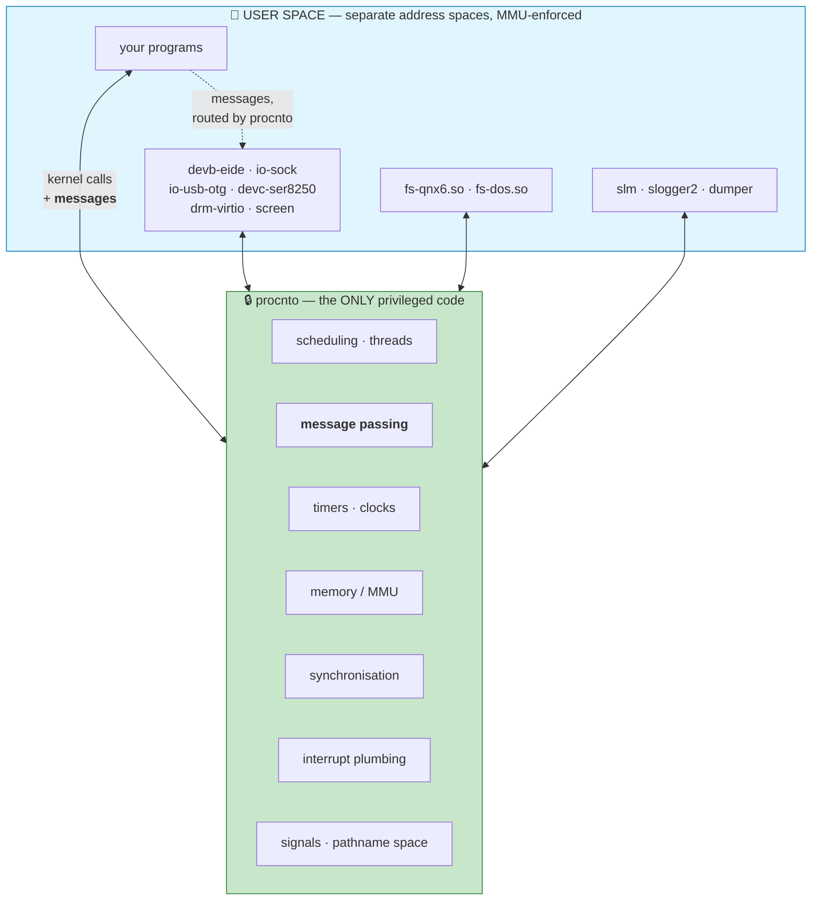
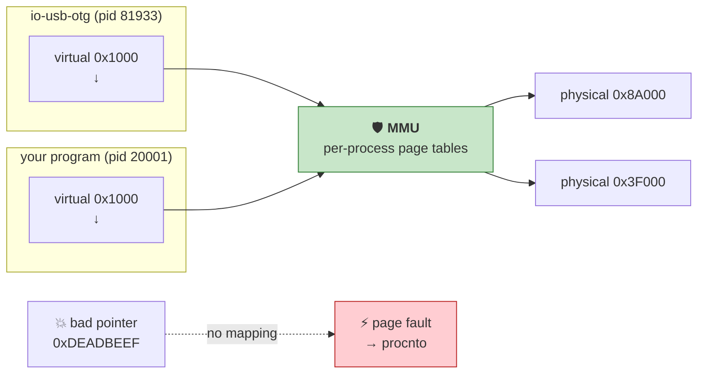

# Chapter 09 — Microkernel Architecture & `procnto`

> **By the end of this chapter you will** know what is actually inside the QNX kernel, what is
> deliberately outside, and — mechanically, not as a slogan — why a driver crash does not take the
> system with it.

> 🎉 **Part 2 begins here.** Chapters 00–08 got you a working environment. From now on the subject is
> QNX itself, and this is the chapter everything else in Part 2 rests on.

---

## 🏃 Fast-Track Summary

> **🏃 Path C reads only this box**, then skims Chapters 10–12's Fast-Track boxes and goes to
> [Chapter 13](Chapter13_MessagePassingI.md) — your next `⭐ core` lab, and the centre of the course.

**What is in `procnto`:** thread management and scheduling · **message passing** · timers and clocks ·
memory management (the MMU) · synchronisation primitives · interrupt plumbing · signals · the
pathname space. **That is the list.** No filesystems, no network stack, no drivers, no graphics.

**Kernel calls are CamelCase and grouped by prefix:**

| Family | Examples | Chapter |
|--------|----------|---------|
| `Msg*` · `Channel*` · `Connect*` | `MsgSend`, `MsgReceive`, `MsgReply`, `ChannelCreate`, `ConnectAttach` | **13, 14** |
| `Thread*` | `ThreadCreate`, `ThreadDestroy`, `ThreadJoin` | 10 |
| `Sched*` | `SchedGet`, `SchedSet`, `SchedYield` | 11 |
| `Sync*` | `SyncMutexLock`, `SyncCondvarWait`, `SyncSemPost` | 12 |
| `Timer*` · `Clock*` | `TimerCreate`, `ClockTime`, `ClockCycles` | 14 |
| `Interrupt*` | `InterruptAttach`, `InterruptAttachEvent`, `InterruptWait` | 19 |

**You will rarely call them directly.** `pthread_create` is a library wrapper over `ThreadCreate`;
`open`/`read`/`write` become **messages** to a server. That is the whole trick: **POSIX on top,
messages underneath.**

**Why a driver crash is survivable, mechanically:** each process has its own **MMU-enforced address
space**. A bad pointer in `io-usb-otg` faults *in its own address space*, `procnto` terminates that
process, releases its resources, and — critically — **wakes every client blocked on it with an error**
rather than leaving them stuck forever.

**The limits, stated honestly:** killing `procnto` ends the system; some servers are load-bearing
(kill `io-sock` and networking stops until it restarts); and a restarted driver does **not** restore
the client's session — clients must be written to reconnect.

**The cost:** a message costs more than a function call. QNX's answer is to make the IPC path the most
optimised code in the system, and to make it **bounded**, which is what Chapter 01 said actually
matters.

**🏃 Skip to:** [Chapter 13](Chapter13_MessagePassingI.md). §3.2 (kernel call vs message) is the
half-page worth reading first if you read nothing else here.

---

## 🎯 Learning Objectives

By the end of this chapter you will be able to:

- [ ] **List** what `procnto` provides and what it deliberately does not.
- [ ] **Distinguish** a kernel call from a message, and say which your code is making.
- [ ] **Explain** the MMU's role in making a driver fault survivable.
- [ ] **Trace** what happens to a client when the server it is blocked on dies.
- [ ] **State** the limits of restartability — which failures are recoverable and which are not.
- [ ] **Recognise** the cost of the design, and how QNX manages it.
- [ ] **Predict** the blast radius of a fault in any given component.

---

## 🧭 Prerequisites

| Need | Why |
|------|-----|
| [Chapter 02](Chapter02_WhatIsQNX.md) | The microkernel bet, stated architecturally. This chapter goes inside |
| [Chapter 07](Chapter07_FirstContactTheQNXShell.md) | `pidin` and **blocking states** — the evidence for everything here |
| [Chapter 08](Chapter08_ToolchainAndDeployment.md) ⭐ | The labs build and deploy code |

---

## 🗺️ Mental model

Two boxes, one boundary, and everything follows from where the boundary is.



*Diagram: every driver, filesystem and service runs in user space with its own MMU-protected address
space; procnto holds only scheduling, message passing, timers, memory, synchronisation, interrupts,
signals and the pathname space, and routes the messages that connect everything else.*

> 💡 **The dotted arrow is the one that matters.** Your program never touches `devb-eide` directly.
> It sends a **message**, which `procnto` routes. That indirection is what makes the driver
> replaceable, restartable, debuggable and — above all — **unable to corrupt you.**

---

## 1. The Problem

### 1.1 "A driver crash is survivable" is a claim, not an explanation

Chapter 02 made the argument. You have even seen it work: in Lab 02.2 you killed `vncserv` and the
system carried on.

But *killing* a process is not the same as one **crashing**, and "the system carried on" leaves the
interesting questions unanswered:

- What stopped the bad pointer from reaching **your** memory?
- What happened to processes that were **waiting on** the one that died?
- What cleaned up its memory, its file descriptors, its channels?
- **What would not have survived?**

The last one is the one that separates understanding from slogan. A course that only tells you QNX is
robust has not taught you where its limits are — and every real system has them.

### 1.2 Where the boundary actually is

The interesting question is not *"is this in the kernel?"* but **"what would break if it were not?"**

| Component | In `procnto`? | Because |
|-----------|---------------|---------|
| Scheduler | ✅ | Something must be the final authority on which thread runs |
| MMU management | ✅ | Only privileged code can program the MMU |
| Message passing | ✅ | Must move data across address spaces safely |
| Timers | ✅ | Tied to the hardware timer interrupt |
| Interrupt **plumbing** | ✅ | Only the kernel can install a vector |
| Interrupt **handling** | ❌ | Your driver's ISR is *your* code, in *your* process |
| Filesystems, network, USB, graphics | ❌ | Nothing about them requires privilege |

> 💡 **Read the last two rows together, because they are the design in miniature.** The kernel owns
> the *mechanism* — installing a vector, delivering an event. The driver owns the *policy* — what to
> do about it. That separation recurs everywhere in QNX, and Chapter 19 makes it concrete.

---

## 2. The Concept — what a microkernel actually holds

### 2.1 The eight things

| # | `procnto` provides | You meet it in |
|---|--------------------|----------------|
| 1 | **Thread creation, destruction, lifecycle** | Ch 10 |
| 2 | **Scheduling** — 256 priorities, FIFO/RR/sporadic | Ch 11 |
| 3 | **Synchronisation** — mutexes, condvars, semaphores, barriers | Ch 12 |
| 4 | ⭐ **Message passing** — the system's connective tissue | **Ch 13, 14** |
| 5 | **Timers and clocks** | Ch 14 |
| 6 | **Memory management** — address spaces, mapping, the MMU | Ch 15 |
| 7 | **Interrupt plumbing** — attaching handlers, delivering events | Ch 19 |
| 8 | **Signals and the pathname space** | Ch 16 |

**And that is the complete list.** Everything else you have seen — `devb-eide`, `io-sock`,
`fs-qnx6.so`, `screen`, `slm`, `slogger2`, `dumper` — is an ordinary process.

> ⚠️ **Item 8 deserves a note.** The *pathname space* is in the kernel, but the things it points at are
> not. `procnto` maintains the mapping from `/dev/ser1` to "process 81927"; the actual serial driver
> is `devc-ser8250`, out in user space. **The kernel is a directory, not a service provider.**

### 2.2 Kernel calls, and their naming

QNX's kernel calls are **CamelCase**, grouped by a prefix that tells you the family:

```c
#include <sys/neutrino.h>

int  ChannelCreate(unsigned flags);
int  ConnectAttach(uint32_t nd, pid_t pid, int chid, unsigned index, int flags);
int  MsgSend(int coid, const void *smsg, size_t sbytes, void *rmsg, size_t rbytes);
int  MsgReceive(int chid, void *msg, size_t bytes, struct _msg_info *info);
int  MsgReply(int rcvid, int status, const void *msg, size_t size);
int  ThreadCreate(pid_t pid, void *(*func)(void *), void *arg, const struct _thread_attr *attr);
int  SchedSet(pid_t pid, int tid, int algorithm, const struct sched_param *param);
int  InterruptAttachEvent(int intr, const struct sigevent *event, unsigned flags);
```

> 📖 **Kernel call.** A function that traps directly into `procnto`. Declared in `<sys/neutrino.h>` —
> the QNX-specific header from [D-014](../meta/Doubts.md#d-014). Contrast a **library call**
> (`printf`, `qsort`) which runs entirely in your process, and a **message**, which goes to another
> *process*.

> 💡 **The naming convention is genuinely useful.** `Msg*` is message passing, `Thread*` is threads,
> `Sync*` is synchronisation, `Timer*`/`Clock*` is time, `Interrupt*` is hardware. Seeing
> `SyncCondvarWait` in an unfamiliar codebase tells you what it is before you look it up.

> ⚠️ **The header is authoritative for your build.** As Chapter 05 §4.1 said:
> `grep -n "MsgSend" $QNX_TARGET/usr/include/sys/neutrino.h`.

### 2.3 The trick: POSIX on top, messages underneath

**You will rarely call a kernel function directly**, and that is deliberate.

| You write | What actually happens |
|-----------|-----------------------|
| `pthread_create(...)` | Library wrapper → **`ThreadCreate`** kernel call |
| `pthread_mutex_lock(...)` | Usually **no kernel call at all** — an atomic operation in user space; only contention enters the kernel |
| `printf("hi\n")` | Formats in your process, then **`write()` → a message to the console driver** |
| `open("/dev/ser1")` | Asks `procnto` who owns that path → **a connection to `devc-ser8250`** |
| `read(fd, buf, n)` | ⭐ **A message to that process**, not a kernel service |

> 💡 **This is the single most important idea in Part 2, and it is why your Linux code compiles.**
> POSIX is the *interface*; messages are the *implementation*. `read()` on Linux enters the kernel and
> comes back. `read()` on QNX becomes `MsgSend` to a user-space process — and your source is
> identical.
>
> **The consequence for you as a driver author:** you do not extend the kernel. You write a program
> that receives messages and answers them. That is Chapter 17, and it is a much smaller thing to learn
> than a kernel module.

### 🐧 In Linux this would be…

| | 🐧 Linux | 🔷 QNX |
|---|---|---|
| System calls | **~400**, and growing | A few dozen kernel calls; most OS services are **messages** |
| `read()` on a device | Traps to the kernel, dispatches to in-kernel driver | **Message to a user-space process** |
| Adding a service | New syscall (kernel patch) or `ioctl` | **Register a path.** No kernel change |
| A driver bug | Kernel panic, or a wedged subsystem | One process dies |
| Debugging a driver | `printk`, `kgdb` | **`gdb`, as in Chapter 08** |
| Kernel size | ~30M+ lines, all privileged | Microkernel, orders of magnitude smaller |

> 💡 **The syscall-count row is the structural difference.** Linux grows by adding syscalls, because
> that is how you reach kernel functionality. QNX's kernel call list is essentially *stable*, because
> new functionality arrives as **new servers** speaking the existing message protocol. That is why
> QNX's kernel API has changed remarkably little since 1995.

### 📦 Analogy — the switchboard

> ☎️ **`procnto` is a telephone exchange, not a company.**
>
> It connects calls, enforces who may call whom, and guarantees the lines are private. It does not
> answer questions about accounts, take orders, or fix your boiler — **the exchange has no
> departments.**
>
> Every department is a separate business with its own premises: the filesystem company, the
> networking company, the disk-driver company. You reach them **through** the exchange.
>
> **When one burns down**, the exchange notices, drops the connections to it, and tells anyone
> holding a line that their call ended. The other businesses never notice. And a new company can move
> into the same address and start answering the same number.
>
> **What the exchange cannot survive is losing itself.** That is §4.4.

---

## 3. The Mechanism — why a fault stays local

### 3.1 Address spaces, mechanically

> 📖 **Address space.** The mapping from the virtual addresses a process uses to the physical memory it
> may touch, enforced by the **MMU** in hardware.

Each QNX process gets its own. That single fact does the work:



*Diagram: the same virtual address in two processes maps to different physical memory through
per-process page tables, and an address with no mapping raises a fault that goes to procnto rather
than corrupting anything.*

| Step | What happens |
|------|--------------|
| 1 | The driver dereferences a wild pointer |
| 2 | The MMU finds **no valid mapping** for that address in *this* process |
| 3 | The hardware raises a **fault** — control goes to `procnto` |
| 4 | `procnto` sees an unrecoverable fault in a user process |
| 5 | It **terminates that process** |

> ⚠️ **Note what step 2 makes impossible.** The bad pointer cannot reach your program's memory,
> because your pages are **not mapped** in the driver's address space. Not "protected by convention" —
> *absent*. There is no address the driver could compute that would reach you.
>
> On a monolithic kernel that same pointer is in kernel space, where the scheduler, the other drivers
> and every process's kernel structures **are** mapped. That is the entire difference.

### 3.2 What `procnto` does when a process dies

Termination is not just "the process stops". `procnto` performs a defined cleanup:

| # | Action | Why it matters |
|---|--------|----------------|
| 1 | Free its memory | No leak, whatever state it was in |
| 2 | Close its file descriptors and **connections** | Servers it used are told |
| 3 | Destroy its **channels** | New clients cannot connect |
| 4 | Remove its registered **paths** | `/dev/whatever` disappears from the pathname space |
| 5 | Detach its interrupt handlers | The hardware stops calling into freed code |
| 6 | ⭐ **Unblock every client waiting on it, with an error** | **This is the one that saves you** |
| 7 | Notify anything watching it | `slm` can restart it (Ch 27) |

> 💡 **Step 6 is the difference between "isolated" and "survivable".** Isolation alone would leave
> every client stuck in `REPLY` forever, waiting on a process that will never answer — a live system
> full of permanently blocked threads.
>
> Instead, a client blocked in `MsgSend` gets **`-1` with `errno == ESRCH`** *(no such process)* — an
> ordinary, testable error. Chapter 13 covers the return values properly; the point here is that
> **the kernel converts another process's death into your error return.**

> ⚠️ **Which means the robustness is only as good as your error handling.** A client that ignores
> `MsgSend`'s return value inherits the crash it was supposedly protected from. Chapter 13's labs
> make this concrete.

### 3.3 What is *not* survivable

An honest account needs this section.

| Failure | Survivable? | Why |
|---------|-------------|-----|
| A driver segfaults | ✅ | Process dies, clients get errors, `slm` can restart it |
| A driver deadlocks | ⚠️ **Partly** | It does not die, so nothing detects it. Clients block forever (Ch 07's deadlock cycle) |
| A driver corrupts *its own* state | ⚠️ | Isolation does not make it correct |
| A driver writes garbage **to the hardware** | ❌ | The MMU protects memory, not the device. A disk driver can still destroy the disk |
| `procnto` faults | ❌ | **The system stops.** It is the scheduler |
| A load-bearing server dies | ⚠️ | The system lives, but that *function* stops until restart — kill `io-sock` and networking goes |
| Interrupts disabled too long | ❌ | Chapter 01's unbound ①. Isolation does not help |

> ⚠️ **The row people find most surprising is the fourth.** Process isolation protects **memory**. A
> driver with legitimate access to a device register can still command that device to do something
> catastrophic — and it *must* have that access to be a driver. QNX narrows this with **security
> policies** and **abilities** (the `libsecpol.so.1` and `ability` files from Chapter 03's Lab 03.2),
> which restrict *which* hardware a process may touch. Chapter 28 covers it.
>
> 💡 **The general shape:** the microkernel bounds the *blast radius* of a fault. It does not make
> components correct, and it cannot protect the physical world from a component that is doing its job
> wrongly.

### 3.4 The cost, and how QNX manages it

A message costs more than a function call. Every QNX design decision downstream is about making that
affordable.

| Cost | QNX's answer |
|------|--------------|
| Crossing address spaces | The IPC path is the most optimised code in the system; **it *is* the system call mechanism**, not an addition |
| Copying data | `MsgSend` can pass large buffers by mapping rather than copying; shared memory is available where it is genuinely needed (Ch 15) |
| Context switches | Kept small — and, crucially, **bounded**. Chapter 01: a known cost beats a small unpredictable one |
| Priority inversion across servers | ⭐ A server **inherits its client's priority** while handling that client's request — automatically, for every service in the system (Ch 13) |

> 💡 **The last row deserves more attention than it usually gets.** In Chapter 01 §5.3 you saw
> priority inversion break a control loop, and the fix was one mutex attribute. QNX applies the same
> principle to **every message**: while the filesystem is servicing your high-priority request, it
> *runs at your priority*. A low-priority client cannot make the filesystem slow for you.
>
> That is a property a monolithic kernel struggles to provide, because its kernel threads do not
> belong to any caller.

### 🔬 Deep dive — why did other microkernels lose and this one not?

<details>
<summary>Optional. Worth reading if you have heard "microkernels are slow".</summary>

The 1990s microkernel debate was largely settled against them on performance, and the reputation has
outlived the evidence.

**What actually went wrong with first-generation microkernels** (Mach being the famous case): IPC was
treated as *one service among many* and was correspondingly slow. Since every OS operation became
several IPCs, everything was slow. Systems responded by moving components **back into the kernel** —
which is why macOS's XNU is a hybrid, and why the design got its reputation.

**What QNX did differently**, from 1980 and reaffirmed in Neutrino (1995):

| Decision | Effect |
|----------|--------|
| **Synchronous** message passing | No queues to manage, no buffering, no async bookkeeping. The common path is short |
| IPC **is** the system call mechanism | It is not an add-on to be optimised later; it is the thing everything uses, so it gets all the attention |
| **Priority inheritance** built into messaging | Removes the pathology that would otherwise make server-based designs unpredictable |
| **Send/Receive/Reply** rather than send-and-forget | Maps onto a function call, so the fast path is one round trip and the scheduler can hand the CPU straight to the server |

**And the requirement was different.** Mach was chasing general-purpose throughput, where a
monolithic kernel genuinely wins. QNX was chasing a **bounded worst case** — where, as Chapter 01
argued, a slightly higher but *predictable* cost is the better trade.

> 💡 **The honest summary:** microkernels did lose the throughput argument, and QNX does pay for its
> structure. It won the argument it was actually in — and forty-five years later it is running in
> 255 million vehicles while Mach survives as a hybrid.

</details>


---

## 4. The Kernel API Surface

> Chapters from here on use §4 for real APIs. This one maps the whole surface, so you know where every
> later chapter fits.

### 4.1 The families

All declared in **`<sys/neutrino.h>`**.

| Family | Representative calls | Taught in |
|--------|----------------------|-----------|
| **Message passing** ⭐ | `ChannelCreate`, `ChannelDestroy`, `ConnectAttach`, `ConnectDetach`, `MsgSend`, `MsgReceive`, `MsgReply`, `MsgError`, `MsgRead`, `MsgWrite` | **13** |
| **Pulses & events** | `MsgSendPulse`, `MsgDeliverEvent`, `MsgReceivePulse` | **14** |
| **Threads** | `ThreadCreate`, `ThreadDestroy`, `ThreadDetach`, `ThreadJoin` | 10 |
| **Scheduling** | `SchedGet`, `SchedSet`, `SchedYield`, `SchedInfo` | 11 |
| **Synchronisation** | `SyncTypeCreate`, `SyncMutexLock`, `SyncMutexUnlock`, `SyncCondvarWait`, `SyncCondvarSignal`, `SyncSemPost`, `SyncSemWait` | 12 |
| **Time** | `TimerCreate`, `TimerSettime`, `TimerDestroy`, `ClockTime`, `ClockPeriod`, `ClockCycles` | 14 |
| **Interrupts** | `InterruptAttach`, `InterruptAttachEvent`, `InterruptDetach`, `InterruptWait`, `InterruptMask`, `InterruptUnmask`, `InterruptDisable`, `InterruptEnable` | 19 |
| **Memory** | `mmap`, `munmap` *(POSIX)*; `mmap_device_memory`, `mmap_device_io` *(QNX)* | 15 |
| **Signals** | `SignalKill`, `SignalAction`, `SignalProcmask` | 10 |

> ⚠️ **This table is from QNX's documentation and headers, not from a verified run.** The
> authoritative source for **your** build is the header itself:
>
> ```bash
> host$ grep -n "^extern.*Msg" $QNX_TARGET/usr/include/sys/neutrino.h | head -20
> ```
>
> Lab 09.1 has you do exactly that. (Chapter 05 §4.1: read the header, not a web page.)

### 4.2 Which layer are you calling?

| You call | Layer | Cost |
|----------|-------|------|
| `printf`, `qsort`, `strlen` | **Library**, in your process | Cheap — a function call |
| `pthread_mutex_lock` *(uncontended)* | **Library**, atomic in user space | Very cheap — usually **no kernel entry** |
| `pthread_mutex_lock` *(contended)* | → **kernel call** | A trap; the thread blocks |
| `pthread_create` | → **`ThreadCreate`** kernel call | A trap |
| `MsgSend` | **Kernel call**, and a **context switch to the server** | The main cost of the design |
| `open`, `read`, `write` on a device | → **messages to a server process** | Same as `MsgSend` |

> 💡 **The second and third rows together explain a lot about QNX performance advice.** An
> *uncontended* mutex costs almost nothing because it never enters the kernel; a *contended* one costs
> a trap and a block. That is why Chapter 12 spends time on lock granularity — the cost is not the
> lock, it is the contention.

### 4.3 The blast-radius table ⭐

Keep this. It is the practical form of everything in §3.

| If this fails | Then |
|---------------|------|
| Your application | Its process dies. Nothing else is affected |
| A leaf driver *(e.g. `io-usb-otg`)* | That process dies; its clients get errors; USB stops until restart |
| A **load-bearing** server *(`io-sock`)* | The system lives; **that function stops** until restart. Anything using it gets errors |
| `slm` | Running services continue; **nothing new starts or restarts** |
| **`procnto`** | ❌ **The system stops.** It is the scheduler |
| A driver writing garbage to hardware | ❌ Memory is protected; **the device is not** |
| Any component **deadlocking** rather than dying | ⚠️ No fault, no detection. Clients block forever (Ch 07 §5.4) |

> 💡 **Read the last row twice.** Every entry above it is about a component that **fails loudly**.
> Deadlock is failure that is *silent*, and the microkernel's protections do nothing about it — which
> is precisely why Chapter 07 spent a chapter teaching you to read blocking states.

---

## 5. Worked Example — account for a crash, end to end

Lab 02.2 had you kill `vncserv` and observe that the system survived. Here is the same event with
every step named — and this time the process **crashes** rather than being killed politely.

### 5.1 The setup

A program that faults deliberately:

```c
#include <stdio.h>

int main(void)
{
    int *p = NULL;
    printf("about to fault\n");
    fflush(stdout);        /* make sure the message is out before we die */
    *p = 42;               /* 💥 write through a NULL pointer */
    printf("never reached\n");
    return 0;
}
```

> 📖 **`fflush(FILE *)`** — ISO C, `<stdio.h>`. Forces buffered output out immediately; returns `0`, or
> `EOF` on error. Needed here because `stdout` is normally buffered, and a process that dies with
> data still in its buffer never prints it. **That is a real debugging trap**, not just a detail of
> this example.

### 5.2 What happens, step by step

| # | Where | What |
|---|-------|------|
| 1 | Your process | Writes to virtual address `0` |
| 2 | **MMU** | No mapping at `0` — page 0 is deliberately left unmapped, which is *why* NULL dereferences fault rather than corrupting |
| 3 | **Hardware** | Raises a page fault; control transfers to `procnto` |
| 4 | **`procnto`** | Classifies it: unrecoverable fault, user process |
| 5 | **`procnto`** | Terminates the process with `SIGSEGV` |
| 6 | **`procnto`** | Frees its memory, closes its connections, destroys its channels, removes its paths |
| 7 | **`dumper`** | If configured, writes a **core dump** — `dumper` is in `slm`'s component list, so it is running (Ch 06 §2.3) |
| 8 | Clients | Anything blocked on it is **woken with an error** |
| 9 | Everything else | **Unaffected.** The scheduler never noticed |

> 💡 **Step 2 is worth pausing on.** NULL dereferences fault reliably *because someone deliberately
> left page 0 unmapped.* It is not a law of nature — it is a design decision, made so that the
> commonest C bug produces an immediate, localised, diagnosable failure instead of silently
> corrupting whatever happened to live at address 0.

### 5.3 What you can observe

**Before**, in a second session:

```bash
qnx$ pidin | grep faulter
```

**Run it.** The process disappears. Then:

```bash
qnx$ pidin | grep faulter          # gone
qnx$ pidin info                    # process count down by one; nothing else changed
qnx$ slog2info | tail -20          # the fault should be logged
qnx$ ls /var/dumps 2>/dev/null || ls / | grep -i dump
```

> ⚠️ **The core-dump location is `[UNVERIFIED]`.** `dumper` is running, but where it writes on this
> image has not been confirmed — block **V14** asks. Chapter 25 covers core dumps properly.

### 5.4 Now the interesting half — what the *client* sees

The isolation story is only half of it. Here is the other half:

| Client's state before | After the server dies |
|-----------------------|------------------------|
| Blocked in `MsgSend` — `pidin` shows **`REPLY`** with the server's PID | **Unblocked**, with `MsgSend` returning `-1` and `errno == ESRCH` |
| Holding an open descriptor | The descriptor becomes invalid; the next `read`/`write` fails |
| Not yet connected | `open()` on the server's path now fails — the path is gone (§3.2 step 4) |

**Which means the client's code decides whether the system survives:**

```c
if (MsgSend(coid, &req, sizeof req, &rep, sizeof rep) == -1) {
    /* the server died, or the request failed.
     * Reconnect? Retry? Enter a safe state? THIS is the design decision. */
}
```

> ⚠️ **A client that ignores that return value inherits the crash it was protected from.** The kernel
> did its job — it converted a remote process's death into a local, testable error. If you throw the
> error away, you have a process that continues with garbage, and the microkernel has bought you
> nothing.
>
> 💡 **This is the practical meaning of "QNX is robust".** Not *"nothing goes wrong"* — that
> *"everything that goes wrong arrives at your code as an error return, at a point where you can do
> something about it."* Chapter 13 covers `MsgSend`'s return values; Chapter 27 covers what a good
> "something" looks like.

### 5.5 The lesson in one line

> **The microkernel converts another process's catastrophe into your `errno`.**
>
> What you do with it is the part it cannot help you with.


---

## 🧪 Labs

> Setup, as in Chapter 08:
>
> ```bash
> host$ source ~/qnx800/qnxsdp-env.sh
> host$ export TGT=$(cd ~/qnx800/images/qemu/qemu && mkqnximage --getip)
> ```
>
> Lab code: **`labs/lab09_faultisolation/`**

### Lab 09.1 — Measure the kernel  [🐣🚶🏃]

> **Objective.** Put numbers on §2.1 — how much of this system is actually the kernel?
> **Time.** 15 minutes. **No coding.** 📌 `[UNVERIFIED]` — block **V14**.

**On the target:**

```bash
qnx# pidin mem | head -30
qnx# pidin | awk '{print $3}' | sort -u | wc -l
qnx# ls -l /proc/boot/procnto-smp-instr
```

**On the host** — read the kernel's own API surface:

```bash
host$ grep -c "^extern" $QNX_TARGET/usr/include/sys/neutrino.h
host$ grep -oE '\b(Msg|Thread|Sched|Sync|Timer|Clock|Interrupt|Channel|Connect)[A-Za-z]+' \
        $QNX_TARGET/usr/include/sys/neutrino.h | sort -u | head -40
```

| Command | Does |
|---------|------|
| `grep -c` | **Count** matching lines rather than printing them |
| `grep -oE 'pat'` | Print **only** the matched text, using extended regular expressions |
| `sort -u` | Sort and deduplicate |

**Answer from your own output:**

1. How large is the `procnto` binary, and how does that compare with the whole boot image?
2. How many **distinct programs** are running?
3. Which kernel-call families does the header actually contain? Do they match §4.1?
4. Find three `Msg*` calls. Which chapter teaches them?

<details>
<summary>Answers</summary>

1. The kernel is **one file** among the ~80 in `/proc/boot` (Ch 06). Note that `procnto-smp-instr.sym`
   — its *debug symbols* — is 12 MB, comparable to the kernel itself. Symbols are large; that is why
   Chapter 05 §3.4 and Chapter 08 §3.4 keep them off the target.
2. Around 31 on an idle system (Ch 06). **Almost all of them are things a monolithic kernel would have
   inside itself.**
3. They should match: `Msg*`, `Channel*`, `Connect*`, `Thread*`, `Sched*`, `Sync*`, `Timer*`,
   `Clock*`, `Interrupt*`. 📋 **If the header shows families §4.1 omits, that is a finding** — report
   it.
4. `MsgSend`, `MsgReceive`, `MsgReply` — **Chapter 13**, the centre of the course.

</details>

📋 **Please paste the two `grep` outputs.** §4.1's table is drawn from QNX's documentation, not from
your header. The header is authoritative and the course has never read it.

---

### Lab 09.2 — Watch a fault stay local  [🚶🏃]

> **Objective.** Crash a process on purpose and account for every consequence in §5.2.
> **Time.** 20 minutes. 📌 `[UNVERIFIED]` — block **V14**.

```bash
host$ cd ~/exercises/qnx-zero-to-hero/labs/lab09_faultisolation
host$ make TGT=$TGT deploy
```

**Session 1 — take a baseline, then crash it.**

```bash
qnx$ pidin info
qnx$ pidin | wc -l
qnx$ ~/faulter
```

**Session 2 — immediately afterwards.**

```bash
qnx$ pidin info
qnx$ pidin | wc -l
qnx$ slog2info | tail -20
```

**Questions:**

1. What did `faulter` print before dying? What did it *not* print?
2. Did the process count return to its baseline?
3. Did anything else change in `pidin info`?
4. Does `slog2info` record the fault? With what severity?

<details>
<summary>Answers</summary>

1. `about to fault`, and **not** `never reached`. The `fflush` matters — without it the first message
   might be lost too, still sitting in a buffer when the process died (§5.1).
2. Yes. `procnto` freed everything (§3.2).
3. **Nothing meaningful.** Free memory returns; uptime continues; every other process is untouched.
   *That non-event is the entire result of the experiment.*
4. 📋 **Report what you find.** The course predicts the fault is logged; that is unverified.

</details>

> 💡 **The finding is the absence of a finding.** On a monolithic kernel the equivalent bug *in a
> driver* ends the machine. Here it ends a process, and the only trace is one fewer line in `pidin`.

---

### 💥 Break It — crash a *server* while a client waits  [🚶🏃]

> **Objective.** Observe §5.4 — the half of the story that is about the *client*.
> **Time.** 20 minutes. 📌 `[UNVERIFIED]` — block **V14**.

> ⚠️ **Use a harmless server.** `vncserv` again (Chapter 02's Lab 02.2), **not** `io-sock` — that
> would kill your SSH session.

**Step 1 — find a process blocked on another.** From Chapter 07's technique:

```bash
qnx$ pidin | grep REPLY
```

Note a pair: a client in `REPLY` and the PID it names.

**Step 2 — kill the server it is waiting on.**

```bash
qnx# slay -f vncserv
```

**Step 3 — look at the client immediately.**

```bash
qnx$ pidin | grep -E '<client-pid>|vncserv'
```

**Predict first:** does the client stay in `REPLY` forever, or change state?

<details>
<summary>What should happen, and why it is the whole point</summary>

**The client should be unblocked**, not left in `REPLY`. Per §3.2 step 6, `procnto` wakes every client
blocked on a dying process and returns an error — `MsgSend` gives `-1` with `errno == ESRCH`.

**What the client does next is entirely its own code:**

| The client… | Result |
|-------------|--------|
| Checks the return value and reconnects | Recovers cleanly |
| Checks it and enters a safe state | Degrades correctly |
| **Ignores it** | Continues with garbage — **and the microkernel bought you nothing** |

> ⚠️ **If instead you find the client stuck in `REPLY` on a PID that no longer exists**, that is a
> genuine finding and §3.2 needs correcting. 📋 **Report either way** — this is the chapter's central
> mechanical claim and it has never been observed.

**Then restart it** and watch the pathname reappear:

```bash
qnx# vncserv &
qnx# pidin | grep vncserv
```

A **new PID** ([D-013](../meta/Doubts.md#d-013)) — and any client that reconnects reaches the new
process, because it claimed the same path (Ch 07 §2.3).

</details>

---

### 🐣 Path A Activity — predict the blast radius  [🐣]

> **Objective.** Apply §4.3 without touching a machine.
> **Time.** 15 minutes. **No VM required.**

For each failure: **what stops working, what keeps working, and is it recoverable without a reboot?**

| # | Failure |
|---|---------|
| 1 | The USB driver dereferences a NULL pointer |
| 2 | The network stack (`io-sock`) is killed |
| 3 | `procnto` faults |
| 4 | A logging process enters an infinite loop at priority 10 |
| 5 | Two application processes deadlock waiting on each other |
| 6 | A disk driver, working correctly, is told to erase the wrong partition |

<details>
<summary>Answers</summary>

| # | Stops | Keeps working | Recoverable? |
|---|-------|---------------|--------------|
| 1 | USB, and anything using it | **Everything else** | ✅ Restart the driver |
| 2 | All networking; SSH sessions drop | The system, the console, local processes | ✅ Restart `io-sock` — from the **console** |
| 3 | **Everything** | Nothing | ❌ **Reboot.** It is the scheduler |
| 4 | Nothing, necessarily | Everything above priority 10 preempts it | ✅ `slay` it. On 8 CPUs you may barely notice |
| 5 | Just those two, plus anything waiting on *them* | Everything else | ✅ `slay` one — but the **design** is the bug (Ch 13) |
| 6 | The data on that partition | The system — it did what it was told | ❌ **Not a software failure at all** |

**The two that teach the most:**

**#4** — a runaway process is *not* the catastrophe intuition suggests. QNX's strict priority
scheduling means anything more important simply preempts it; on 8 CPUs it may consume one core and go
unnoticed. Chapter 27's adaptive partitioning bounds even this.

**#6** — the driver is **not faulty**. Memory protection is irrelevant, because the driver had
legitimate access and used it as instructed. **The microkernel bounds the blast radius of a *bug*; it
cannot bound the consequences of a correct component doing the wrong thing.** Restricting *which*
hardware a process may touch is a different mechanism — abilities and security policies, Chapter 28.

</details>

> 💡 **That distinction — a component failing versus a component being wrong — is the honest limit of
> everything in this chapter**, and it is why Part 5 exists.


---

## ✅ Mastery Check

**1.** *(Recall)* Name what `procnto` provides, and one thing people often assume is in a kernel that
is not in this one.

<details><summary>Answer</summary>

**Provides:** threads, scheduling, synchronisation, **message passing**, timers and clocks, memory
management, interrupt plumbing, signals, the pathname space.

**Not in it:** filesystems, the network stack, USB, graphics, and **every device driver** — all
ordinary user-space processes.

A good second answer is **interrupt *handling***: the kernel installs the vector and delivers an
event; the driver's own code, in its own process, decides what to do (Ch 19).

</details>

**2.** *(Recall)* You call `read(fd, buf, n)` on a serial port. Trace what actually happens.

<details><summary>Answer</summary>

The library turns it into a **message** to the process that owns that path — `devc-ser8250`, found via
the pathname space when you called `open()`. `procnto` routes the message and blocks your thread in
`REPLY`. The driver receives it, does the work, calls `MsgReply`, and your thread resumes.

**No kernel driver is involved at any point.** Your source is identical to Linux; the implementation
underneath is completely different.

</details>

**3.** *(Apply)* A driver you depend on segfaults. Your process was blocked in `MsgSend`. What does
your code see, and what determines whether your system survives?

<details><summary>Answer</summary>

`MsgSend` returns **`-1` with `errno == ESRCH`**. `procnto` woke you when it tore the driver down
(§3.2 step 6).

**What determines survival is your error handling.** The kernel converted another process's
catastrophe into an ordinary, testable error return. If you check it, you can reconnect, retry, or
enter a safe state. **If you ignore it, you continue with garbage — and the isolation bought you
nothing.**

</details>

**4.** *(Apply)* Two processes deadlock waiting on each other. Does the microkernel help?

<details><summary>Answer</summary>

**No — and this is the honest limit.** Neither process *faults*, so there is nothing for `procnto` to
detect or clean up. They sit in `REPLY` indefinitely, and so does anything waiting on them.

The microkernel protects against components that **fail loudly**. Deadlock fails **silently**.

**What does help:** reading blocking states (Ch 07 — `pidin` shows the cycle directly), designing to
avoid cycles of synchronous sends (Ch 13), and watchdogs or `slm` health monitoring (Ch 27).

</details>

**5.** *(Design)* You are architecting a system with a certified safety function and an uncertified
third-party protocol stack on one SoC. Using this chapter, say what the microkernel gives you, what it
does not, and what you add.

<details><summary>Answer</summary>

| | |
|---|---|
| **What it gives you** | MMU-enforced isolation — the stack **cannot reach** your memory. Ordinary priorities, so it cannot outrank your safety thread. Failure delivered to you as an **error return**, not a hang. A structural freedom-from-interference argument for the assessor (Ch 03 §2.2) |
| **What it does *not*** | Stop the stack **deadlocking** (silent). Stop it from misusing hardware it legitimately controls. Make it correct. Bound its CPU use if it runs *above* your priority |
| **What you add** | **Adaptive partitioning** — guarantee your CPU budget regardless (Ch 27). **Security policies / abilities** — restrict which hardware it may touch (Ch 28). **A watchdog** — detect the silent failures. **Rigorous error handling** on every `MsgSend` to it. Possibly the **hypervisor** — put the whole stack in a separate guest (Ch 30) |

**The reasoning to state out loud:** the microkernel bounds the blast radius of a **fault**. It does
nothing about a component that is *slow*, *stuck*, or *wrong*. Those need partitioning, watchdogs and
policy — which is exactly why Part 5 exists and why "we use QNX" is not by itself a safety argument.

</details>

---

## 🧠 Concept Recap

- **`procnto` holds eight things:** threads · scheduling · synchronisation · **message passing** ·
  time · memory · interrupt plumbing · signals and the pathname space. **Nothing else.**
- **Kernel calls are CamelCase, grouped by prefix** — `Msg*`, `Thread*`, `Sched*`, `Sync*`, `Timer*`,
  `Interrupt*` — and declared in `<sys/neutrino.h>`.
- ⭐ **POSIX on top, messages underneath.** `read()` becomes `MsgSend` to a user-space process, and
  your source is unchanged. That is why your Linux code compiles.
- **You extend QNX by writing a process that registers a path**, not by patching a kernel.
- **The MMU makes a fault local**: your pages are not *mapped* in the driver's address space, so there
  is no address it could compute to reach you.
- ⭐ **`procnto` converts a process's death into your `errno`** — clients blocked on it are woken with
  `ESRCH` rather than left stuck. **Robustness is then your error handling's job.**
- **Not survivable:** `procnto` faulting · a driver misusing hardware it legitimately controls ·
  **deadlock**, because nothing fails loudly.
- **The cost is a message instead of a call.** QNX pays it by making IPC the system call mechanism,
  and by giving servers **priority inheritance** from their clients.
- **Microkernels lost the throughput argument and QNX won the one it was in** — a bounded worst case.

---

## 📎 Cheat Sheet

**In `procnto`**

threads · scheduling · synchronisation · **message passing** · timers/clocks · memory & MMU ·
interrupt plumbing · signals · pathname space

**Not in `procnto`**

filesystems · network stack · USB · graphics · **every driver** · logging · service management

**Kernel-call families** *(all in `<sys/neutrino.h>`)*

| Prefix | Domain | Ch |
|--------|--------|----|
| `Msg*` `Channel*` `Connect*` | ⭐ message passing | **13, 14** |
| `Thread*` | threads | 10 |
| `Sched*` | scheduling | 11 |
| `Sync*` | mutexes, condvars, semaphores | 12 |
| `Timer*` `Clock*` | time | 14 |
| `Interrupt*` | hardware | 19 |
| `Signal*` | signals | 10 |

**Which layer?**

| Call | Where it runs |
|------|---------------|
| `printf`, `qsort` | Your process |
| `pthread_mutex_lock` *(uncontended)* | Your process — **no kernel entry** |
| `pthread_create` | → `ThreadCreate` kernel call |
| `read`/`write` on a device | → **message to a server process** |

**Blast radius** ⭐

| Fails | Effect |
|-------|--------|
| Your app | Its process only |
| A leaf driver | That function stops; clients get errors; restartable |
| A load-bearing server | That function stops system-wide; restartable |
| **`procnto`** | ❌ System stops |
| Driver misusing hardware | ❌ Memory protected, **device not** |
| **Deadlock** | ⚠️ Silent — nothing detects it |

**When a server dies, `procnto`** frees memory · closes connections · destroys channels · removes
paths · detaches interrupts · ⭐ **wakes clients with `ESRCH`** · notifies watchers.

---

## 🔗 Further Reading

| Resource | Why |
|----------|-----|
| [QNX 8.0 System Architecture](https://www.qnx.com/developers/docs/8.0/com.qnx.doc.neutrino.sys_arch/topic/about.html) | ⭐ **The authoritative account of this chapter.** The best single QNX document |
| `$QNX_TARGET/usr/include/sys/neutrino.h` | ⭐ The kernel API surface for **your** build (Ch 05 §4.1) |
| [QNX 8.0 Library Reference](https://www.qnx.com/developers/docs/8.0/) | Every kernel call, with signatures and errors |
| [Chapter 02](Chapter02_WhatIsQNX.md) · [Chapter 07](Chapter07_FirstContactTheQNXShell.md) | The architectural claim · the evidence in `pidin` |

---

## ➡️ What's Next

**[Chapter 10 — Processes and Threads](Chapter10_ProcessesAndThreads.md)**

You know what the kernel provides. Chapter 10 covers the first item on its list properly: the QNX
process model, address spaces, thread lifecycle, and how `pthread_*` maps onto `ThreadCreate` — plus
why QNX schedules **threads** rather than processes, which is the fact behind every `pidin` listing
you have read.

> 🏃 **Path C:** skim 10, 11 and 12's Fast-Track boxes and go to **Chapter 13** — `⭐ L13`, message
> passing, and the single most QNX-specific skill in the course.
> 🐣 **Path A:** Part 2 is conceptual and suits you; the observe-only activities continue throughout.

---

## 📝 Chapter Changelog

| Version | Date | Change |
|---------|------|--------|
| 1.1 | 2026-08-26 | Lab deploy path corrected to `~` ([D-015](../meta/Doubts.md#d-015)). |
| 1.0 | 2026-08-26 | Created. Opens Part 2. Enumerates what `procnto` provides and what it deliberately does not; introduces the kernel-call families and their naming; establishes **POSIX on top, messages underneath** as the central mechanism. §3 explains fault isolation **mechanically** — page tables, the fault path, and the seven-step teardown — and gives equal weight to what is *not* survivable, including the blast-radius table and the honest note that deadlock fails silently. §5 traces a NULL dereference end to end and argues that the kernel's real contribution is converting another process's death into the client's `errno`. Ships `labs/lab09_faultisolation/`. All labs `[UNVERIFIED]` pending block **V14**. |
