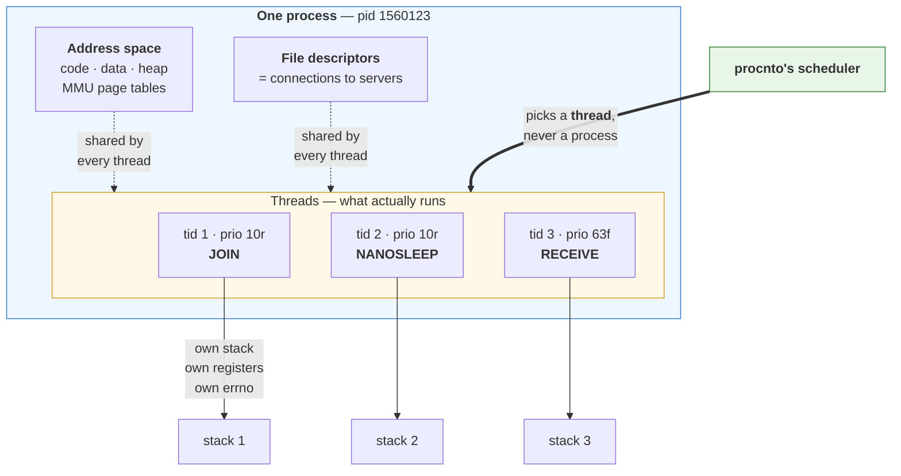

# Chapter 10 — Processes and Threads

> **By the end of this chapter you will** be able to say exactly what a process is on QNX, what a
> thread is, which one the scheduler actually schedules — and read a `pidin` listing as a description
> of *threads* rather than a list of programs.

---

## 🏃 Fast-Track Summary

> **🏃 Path C reads only this box**, then Chapters 11 and 12's Fast-Track boxes, and goes to
> [Chapter 13](Chapter13_MessagePassingI.md).

**A process does not run. A thread runs.**

| A **process** owns | A **thread** owns |
|--------------------|-------------------|
| The address space (MMU page tables) | Its **stack** |
| File descriptors, and so its connections to servers | Its **registers**, including the program counter |
| Its place in the pathname space | Its **priority and scheduling policy** |
| Credentials (uid/gid), signal *dispositions* | Its **signal mask**, and its own **`errno`** |
| The pid | The tid — small, and numbered from 1 **within** the process |

Every process starts life with **exactly one thread**, tid 1. `pidin`'s output is **one line per
thread**, which is why `procnto` — pid 1 — occupies a dozen lines.

**`pthread_create` is a thin wrapper over the `ThreadCreate` kernel call** (Ch 09 §2.3). There is no
separate `-lpthread` on QNX 8; the pthread functions are in libc.

**QNX schedules threads, and priority is a property of a thread** — not of a process. One process can
hold a 10-priority worker and a 63-priority deadline thread at once. That single fact is what makes a
QNX resource manager work, and Chapter 11 is built on it.

**Creating a *process*: use `posix_spawn()`, not `fork()`.** `fork()` in a multi-threaded process has
no good answer to the question *"what happens to the other threads?"*, and POSIX's answer restricts
the child to async-signal-safe functions — a list that excludes `printf` and `malloc`. `spawn()` and
`posix_spawn()` never duplicate anything, so the question never arises.

**Ending a thread:** `return` from its function, or `pthread_exit`. **Someone must then either
`pthread_join` it or have `pthread_detach`ed it**, or its exit status is kept forever. When the thread
that ran `main` returns, **the whole process exits** — every other thread dies with it.

**The `pthread_*` return convention:** they return the error **as the return value** and leave `errno`
untouched. `strerror(rc)`, never `perror()`.

---

## 🎯 Learning Objectives

- [ ] **State** what belongs to a process and what belongs to a thread, without hedging.
- [ ] **Explain** why `pidin` shows more lines than there are programs running.
- [ ] **Create** threads with `pthread_create` and account for every one of them.
- [ ] **Choose** correctly between `pthread_join` and `pthread_detach`, and say what leaks if you do
      neither.
- [ ] **Create a process** with `posix_spawn`, and explain why QNX prefers it to `fork`.
- [ ] **Read** a five-thread `pidin` listing and name what each thread is waiting for **and who
      owns it**.

---

## 🧭 Prerequisites

| You need | From |
|----------|------|
| A booting VM and a shell on it | [Chapter 06](Chapter06_FirstQNXVMOnQEMU.md) |
| `pidin`, and the blocking-state table | [Chapter 07 §3.2](Chapter07_FirstContactTheQNXShell.md) ⭐ |
| The build-deploy-run loop | [Chapter 08](Chapter08_ToolchainAndDeployment.md) |
| *"POSIX on top, messages underneath"*, and the kernel-call families | [Chapter 09](Chapter09_MicrokernelArchitecture.md) |

---

## 🗺️ Mental model



*The container is the process. The workers are the threads. The scheduler only ever looks at the
workers — and each one can carry a different priority.*

---

## 1. The Problem

### 1.1 There is a column in `pidin` you have been reading past

Here is the listing from [Chapter 07 §3.1](Chapter07_FirstContactTheQNXShell.md) again:

```text
     pid tid name                         prio STATE          Blocked
       1   1 /proc/boot/procnto-smp-instr   0f RUNNING
       1  11 /proc/boot/procnto-smp-instr 255i INTR
   32773   1 proc/boot/devb-eide           10r SIGWAITINFO
   32773   3 proc/boot/devb-eide          254i INTR
```

**Four lines. Two programs.** `procnto` appears twice and `devb-eide` appears twice, and the only
thing distinguishing the duplicates is the second column.

Chapter 07 told you that column was the thread id and moved on, because you needed the blocking
states more. Chapter 09 told you the kernel provides "thread management" and moved on, because you
needed the architecture more. **This chapter is where that debt comes due**, and it matters more than
it looks, because three facts you are about to depend on all live in that column:

1. **`prio` is on the same line as `tid`, not the same line as `pid`.** Priority belongs to the
   thread. `devb-eide` is running one thread at 10 and another at 254 — *the same program, two
   completely different urgencies*.
2. **`STATE` is on the same line as `tid`.** "Blocked" is never a property of a process. One thread
   can be stuck in `REPLY` while its neighbours run.
3. **The `Blocked` column names a pid** for `REPLY`... **and a tid** for some other states. Reading it
   correctly requires knowing which is which.

### 1.2 "Process" and "thread" are not two sizes of the same thing

The common mental model — *"a thread is a lightweight process"* — is wrong in the way that matters,
and it is wrong because it implies they are the same kind of object with different costs.

They are different kinds of object entirely:

> **A process is a *container*. A thread is a *worker*.**
>
> A process is a **noun**: an address space, a set of descriptors, an identity. It has no program
> counter. It cannot be scheduled, blocked, or made to run, because there is nothing there to run.
>
> A thread is a **verb**: a register set, a stack, and a place in the scheduler's queues.

Asking *"what is that process doing?"* is a category error on QNX. **Processes do not do things.** The
question is always *"what is each of its threads doing?"* — and `pidin` answers exactly that question,
one line at a time.

---

## 2. The Concept

### 2.1 What each one actually owns

This is the table to know cold. Everything else in the chapter follows from it.

| Resource | Per **process** | Per **thread** |
|----------|:---------------:|:--------------:|
| Address space — code, data, heap, page tables | ✅ | — |
| File descriptors, and the connections behind them | ✅ | — |
| Position in the pathname space | ✅ | — |
| uid / gid, and other credentials | ✅ | — |
| Signal **dispositions** (*what a signal does*) | ✅ | — |
| Current working directory, umask, environment | ✅ | — |
| The pid | ✅ | — |
| **Stack** | — | ✅ |
| **Registers**, including the program counter | — | ✅ |
| **Priority and scheduling policy** | — | ✅ ⭐ |
| **Blocking state** | — | ✅ ⭐ |
| Signal **mask** (*which signals are blocked right now*) | — | ✅ |
| **`errno`** | — | ✅ ⭐ |
| Thread-specific data (`pthread_key_*`) | — | ✅ |
| The tid | — | ✅ |

Three of those rows carry a ⭐, and each one is a chapter's worth of consequence:

**Priority is per-thread.** So a single program can serve low-priority background requests *and*
guarantee a hard deadline, without splitting into two processes. Chapter 11 spends its whole length on
this, and Chapter 17's resource managers are built out of thread pools that rely on it.

**Blocking state is per-thread.** So *"the driver is hung"* is never a diagnosis. Which thread? Waiting
for what? `pidin` will tell you, and it can only tell you because the state lives at thread level.

**`errno` is per-thread.** Which is not a detail — it is the reason multi-threaded C works at all.

### 2.2 The `errno` trick, because it explains a lot of QNX headers

`errno` looks like a global variable. If it were one, this would be a disaster: two threads calling
`open()` at the same moment would overwrite each other's error codes, and neither could trust what it
read.

It is not a variable. **`errno` is a macro** that expands to a dereference of a per-thread pointer —
something along the lines of:

```c
#define errno   (*__get_errno_ptr())
```

Each thread gets its own storage, so `errno = ENOENT` in one thread is invisible to every other.

> 💡 **This is why you cannot write `extern int errno;`.** Code from the 1980s does, and it will not
> compile on QNX — or on Linux, for the same reason. If you meet it, `#include <errno.h>` is the fix.

And it is why the `pthread_*` functions **do not use `errno` at all**:

```c
int rc = pthread_create(&t, NULL, worker, NULL);
if (rc != 0)
    fprintf(stderr, "pthread_create: %s\n", strerror(rc));   /* ✅ */

if (pthread_create(&t, NULL, worker, NULL) != 0)
    perror("pthread_create");                                /* ❌ reads a stale errno */
```

> ⚠️ **Everyone gets this wrong once.** `pthread_*` returns the error **as its return value**. The
> POSIX committee's reasoning was that error reporting should not itself depend on thread-local
> storage working. The practical rule: **if the function name starts with `pthread_`, check the
> return value and pass it to `strerror`.**

### 🐧 In Linux this would be…

**Nearly identical at the source level, and quite different underneath.**

| | Linux | QNX |
|---|-------|-----|
| The schedulable object | A **task**. Processes and threads are both tasks; a thread is a task that shares more | A **thread**, inside a process. The two are different kinds of object |
| Creation primitive | `clone()` with flags choosing what to share | `ThreadCreate()` (a thread) or `spawn()` (a process) — **separate calls** |
| Thread id visible to you | `gettid()` — a system-wide number from the same space as pids | The tid — **small, and numbered per process**, starting at 1 |
| Linking | `-lpthread` historically; folded into glibc since 2.34 | Always in libc; **`-lpthread` is not a thing** |
| `ps` shows | Processes; threads need `ps -L` or `top -H` | **`pidin` shows threads by default** — there is no other mode |

**The philosophical difference is real.** Linux unified processes and threads into one concept and
chose what to share with flags. QNX kept them distinct: a container and the workers in it. Linux's
model is more flexible; QNX's is easier to reason about — which, in a system whose selling point is
predictable behaviour under fault, is the trade it wanted.

> 💡 **The tid numbering is the tell.** A QNX tid is small — 1, 2, 3 — and only unique *within* its
> process. Chapter 08's `gdb` session showed the kernel as `1/26`: process 1, thread 26. To name a
> thread on QNX you need **both** numbers, always.

### 📦 Analogy — the workshop

> A **process** is a **workshop**: four walls, a bench, a rack of tools, a key to the door.
>
> A **thread** is a **worker inside it**. Workers share the bench and the tools — that is the point of
> being in one workshop. Each carries their own clipboard (the stack), remembers their own place in
> the job (the registers), and has their own union grade (the priority).
>
> **The building does not do carpentry.** If nobody is inside, nothing happens no matter how good the
> tools are. And "the workshop is busy" is not a useful report: you want to know that *Ravi is waiting
> for the lathe, which Meena is using*.
>
> Now the three facts fall out:
>
> - Two workers can have **different grades**. The emergency call-out engineer and the apprentice work
>   in the same shop. → **priority is per-thread**
> - A worker's mistake with a shared tool **damages the shop**, because the tools are shared. → threads
>   have **no protection from each other**; only processes do
> - **Burn down the workshop and everyone inside dies**, whatever they were doing. → when the process
>   exits, every thread goes with it

**And the limit of the analogy, which is the important half:** Chapter 09's fault isolation is
*between* workshops. **Inside** one, there is none at all. A thread that writes through a bad pointer
corrupts its siblings' data with total freedom, because the MMU sees one address space and permits
everything within it.

> ⭐ **That is the design decision you are actually making** when you choose threads over processes:
> threads are cheap and share everything, including the blast radius. **Processes cost a message
> instead of a function call and give you Chapter 09's isolation.** Neither is the right answer; the
> question is which failure you are more afraid of.

---

## 3. The Mechanism

### 3.1 Creating a thread

```c
#include <pthread.h>

static void *worker(void *arg)
{
    /* ... */
    return NULL;
}

pthread_t t;
int rc = pthread_create(&t, NULL, worker, NULL);
```

> 📖 **`pthread_create(pthread_t *tid, const pthread_attr_t *attr, void *(*start)(void *), void *arg)`**
> — `<pthread.h>`.
> **Purpose:** start a new thread *inside the calling process*.
> **Arguments:** where to store the new thread's id · attributes, or `NULL` for the defaults ·
> the function the thread will run · the single `void *` handed to that function.
> **Returns:** `0`, or an **error number** — not `-1`, and it does not touch `errno`.

Four things are true of that call and worth stating plainly:

1. **No new address space, no new pid.** The new thread appears inside the same process, with a new
   tid, and can immediately see every global variable the creator can.
2. **`arg` is one pointer.** To pass more, pass a pointer to a struct — and make sure that struct
   outlives the thread. A pointer to a local in the creating function is a classic bug: the creator
   returns, the stack frame is reused, and the thread reads someone else's data.
3. **It returns immediately.** The new thread may already have run, or may not have started; you have
   no ordering guarantee at all until you create one (Chapter 12).
4. **Underneath it is `ThreadCreate()`** — the `Thread*` kernel-call family from
   [Chapter 09 §4.1](Chapter09_MicrokernelArchitecture.md). `pthread_create` allocates the stack,
   fills in a `struct _thread_attr`, and makes one kernel call.

> 📌 `[UNVERIFIED]` — the course has not read `ThreadCreate`'s exact prototype out of a real header.
> **Block V15** asks you to: `grep -A5 "ThreadCreate" $QNX_TARGET/usr/include/sys/neutrino.h`.

**You will almost never call `ThreadCreate` yourself**, and that is the intended outcome: POSIX on
top, kernel calls underneath. Knowing it is there matters when you are reading a stack trace or a
kernel trace (Chapter 26) and the frame is not called `pthread_create`.

### 3.2 The stack, which is the thread's real cost

Every thread needs its own stack, because every thread has its own call chain. `pthread_create`
allocates it as part of process memory.

**That allocation is what a thread costs.** It is orders of magnitude cheaper than a process — no page
tables, no address space, no descriptor table — but it is not free, and on an embedded target the
stack is usually the binding constraint:

```c
pthread_attr_t attr;
pthread_attr_init(&attr);                       /* fill with the defaults    */
pthread_attr_setstacksize(&attr, 16 * 1024);    /* 16 KB instead             */
pthread_create(&t, &attr, worker, NULL);
pthread_attr_destroy(&attr);                    /* release the attr object   */
```

> 📖 **`pthread_attr_init` / `pthread_attr_setstacksize` / `pthread_attr_destroy`** — `<pthread.h>`.
> An attributes object is a *description* of a thread you have not created yet. Fill it in, pass it to
> `pthread_create`, then destroy it — the created thread does not keep a reference, so you can reuse
> or destroy the attributes immediately.
> **All return** `0` or an error number.

**Two hundred threads at the default stack size is a lot of memory.** This is the honest argument for
thread *pools*: create a bounded number of workers at startup and hand them work, rather than creating
a thread per request. Chapter 17's resource-manager framework does exactly that, and lets you set the
pool's bounds.

> 📋 **What *is* the default stack size on QNX 8?** The course does not know. **Block V15** asks you
> to print `pthread_attr_getstacksize()`'s answer on a default-initialised attributes object. It is
> a two-line program, and it is the kind of number you want measured rather than remembered.

### 3.3 The lifecycle

```mermaid
stateDiagram-v2
    [*] --> READY: pthread_create()<br/>→ ThreadCreate()
    READY --> RUNNING: scheduler picks it<br/>(Ch 11)
    RUNNING --> READY: preempted, or SchedYield()
    RUNNING --> BLOCKED: needs something<br/>it cannot have yet
    BLOCKED --> READY: what it waited for arrived
    RUNNING --> DEAD: return, or pthread_exit()
    DEAD --> [*]: pthread_join(), or it was detached

    note right of BLOCKED
        <b>This is the interesting state,</b>
        and pidin names WHICH kind:
        RECEIVE · REPLY · SEND
        MUTEX · CONDVAR · SEM
        NANOSLEEP · SIGWAITINFO
        JOIN · INTR
    end note
```



Two observations that are easy to miss:

**"Blocked" is a family, not a state.** [Chapter 07 §3.2](Chapter07_FirstContactTheQNXShell.md)'s
table is the expansion of that one box, and this is why the table earned half a page: a general-purpose
OS would tell you a thread is "sleeping" and stop there. QNX distinguishes a dozen reasons, and **the
distinction is the diagnosis**.

**A thread in `DEAD` has not finished.** It has stopped running, but its exit status is still held for
whoever might ask. That brings us to the one piece of thread bookkeeping people actually get wrong.

### 3.4 Join or detach — and you must pick one ⭐

When a thread finishes, its exit status is kept. **Something has to consume it.** There are exactly two
ways:

```c
/* Option 1 — JOIN. The caller waits, and collects the return value. */
void *result;
pthread_join(t, &result);

/* Option 2 — DETACH. Nobody will ever ask; clean up automatically. */
pthread_detach(t);
```

> 📖 **`pthread_join(pthread_t tid, void **value_ptr)`** — `<pthread.h>`.
> **Purpose:** block until that thread ends, then release its resources.
> **Arguments:** the thread to wait for · where to store its return value, or `NULL` to discard it.
> **Returns:** `0`, or an error number (`ESRCH` if there is no such thread, `EINVAL` if it is already
> detached).
> **The caller's state while waiting is `JOIN`** — which is how you spot this in `pidin`.

> 📖 **`pthread_detach(pthread_t tid)`** — `<pthread.h>`.
> **Purpose:** declare that nobody will join this thread, so the system may reclaim it the moment it
> exits. **Returns:** `0`, or an error number. A thread can detach *itself*:
> `pthread_detach(pthread_self())`.

**Do neither and you leak** — a little bit of kernel and library bookkeeping per thread, forever. On a
desktop program that runs for ten minutes, nobody notices. **On a device that runs for four years,
that is the bug you are eventually paged about**, and it will present as "the system slows down after
a few months", which is the hardest class of bug there is.

> ⭐ **The rule, and it is short.** *Every thread you create is either joined or detached. Decide which
> at the moment you create it, not later.*

**Which to choose:**

| Use | When |
|-----|------|
| **`pthread_join`** | You need the result, or you need to know it finished before you continue. Shutdown sequences almost always join |
| **`pthread_detach`** | Fire-and-forget workers whose completion nobody waits for. Detach it *immediately* after creating it, in the next line, so the decision is visible |

### 3.5 Ending a thread, and ending a process

| To end | Do | Effect |
|--------|-----|--------|
| **This thread** | `return` from its start function | Cleanest. The return value goes to whoever joins |
| **This thread, from deep in a call chain** | `pthread_exit(value)` | Same, but usable anywhere |
| **The whole process** | `exit(status)` | ⚠️ **Every thread dies immediately**, wherever it was |
| **The whole process, from `main`** | `return` from `main` | ⚠️ **Identical to `exit()`** — this is the one that surprises people |
| **Another process** | `kill(pid, SIGTERM)`, or `slay <name>` from the shell | Normal signal delivery |

> ⚠️ **`return` from `main` kills every other thread.** `main` is not special to the scheduler — it is
> just tid 1 — but it *is* special to the C runtime, which calls `exit()` when it returns. Threads
> still running are terminated mid-instruction: no cleanup handlers, no destructors, no unlocking of
> mutexes.
>
> **This is why so many multi-threaded programs end with `pthread_join`.** It is not ceremony; it is
> the only thing keeping the process alive. `threadzoo` in the lab does exactly this, deliberately.

**A cleaner alternative when `main` has nothing left to do:**

```c
int main(void)
{
    /* ... start the workers ... */
    pthread_exit(NULL);     /* tid 1 ends; the PROCESS lives while others run */
}
```

`pthread_exit` from `main` ends **that thread only**. The process stays alive until the last thread
finishes, then exits with status 0.

### 🔬 Deep dive — why is a QNX `pthread_t` just a small integer?

On Linux, `pthread_t` is an opaque `unsigned long` that is really a pointer into the C library's own
bookkeeping. You cannot print it meaningfully; POSIX says compare them with `pthread_equal()` and
nothing else.

On QNX, `pthread_t` is an `int`, and it **is** the tid — the same number `pidin` prints.

> 📌 `[UNVERIFIED]` — asserted from the architecture, not read out of a header. **Block V15**:
> `grep -n "pthread_t" $QNX_TARGET/usr/include/sys/target_nto.h` and the lab prints
> `(int)pthread_self()` for you to compare against `pidin`.

**Why the difference is not arbitrary.** Linux's threading grew inside the C library, so the library
owns the identity and the kernel's task id is a separate thing you fetch with `gettid()`. On QNX,
threads are a **kernel** concept: `ThreadCreate` returns a tid, the scheduler indexes by it, `pidin`
prints it, and the library has no reason to invent a second identity on top.

**The practical payoff is a debugging one.** A number your program prints is a number you can find in
`pidin`, in a `gdb` thread list, and in a kernel trace (Chapter 26) — **with no translation step**.
When a log line says *"tid 4 timed out"*, `pidin` tells you what tid 4 was waiting for. That is worth
more than the abstraction Linux is protecting.

---

## 4. Making a *process*

Threads live inside a process. Sooner or later you need another process — for Chapter 09's isolation,
or because you are starting a driver, or because the thing you want to run is a separate program.

### 4.1 `fork()`, and why QNX would rather you did not

`fork()` duplicates the calling process. It returns **twice**: `0` in the child, the child's pid in
the parent.

```c
pid_t kid = fork();
if (kid == 0)        { /* child  */ }
else if (kid > 0)    { /* parent */ }
else                 { /* failed; errno is set */ }
```

It exists on QNX. **It is also a bad fit for the systems QNX is used in**, for three separate reasons.

**Reason 1 — it has no good answer for the other threads.** Duplicate them and you duplicate them
*mid-operation*: a thread that held a mutex is not copied, but the **locked mutex is**, so the child
inherits a lock that nothing will ever release. Drop them and the child wakes up in a process whose
data structures assumed they existed. POSIX chose *drop them*, and then had to add the restriction
that follows:

> ⚠️ **After `fork()` in a multi-threaded process, the child may call only async-signal-safe
> functions** until it `exec`s. That list does not include `printf`, `malloc`, or anything that takes
> a lock. In practice the child can do almost nothing except `exec` — which raises the obvious
> question of why it was duplicated at all.

**Reason 2 — duplicating an address space is the expensive operation on the system.** Copy-on-write
makes it cheaper but not cheap, and its cost is *unpredictable*, because it depends on how much the
two processes touch afterwards. Unpredictable cost is precisely what a real-time system is trying to
avoid (Chapter 01).

**Reason 3 — `fork()` needs an MMU to be efficient.** QNX runs on configurations where copy-on-write
is not available, and a primitive that quietly becomes catastrophic on some targets is not a primitive
you want in portable code.

> 📌 `[UNVERIFIED]` — **what QNX 8 actually does** when you `fork()` from a multi-threaded process:
> fail with an error, succeed with only the calling thread, or something else. The course does not
> know, and it is not willing to guess. The lab's 💥 **Break It** finds out. **Block V15.**

### 4.2 The `spawn` family ⭐

QNX's answer, and the one to use:

```c
#include <spawn.h>

extern char **environ;

pid_t kid;
char *argv[] = { "myprog", "--fast", NULL };

int err = posix_spawn(&kid, "/data/home/qnxuser/myprog",
                      NULL,      /* file actions: fd redirection, or NULL   */
                      NULL,      /* spawn attributes: priority etc, or NULL */
                      argv, environ);
if (err != 0)
    fprintf(stderr, "posix_spawn: %s\n", strerror(err));
```

> 📖 **`posix_spawn(pid_t *pid, const char *path, const posix_spawn_file_actions_t *acts,
> const posix_spawnattr_t *attr, char *const argv[], char *const envp[])`** — `<spawn.h>`.
> **Purpose:** create a new process running a named program — in **one** step, with no duplication.
> **Arguments:** where to store the new pid · the program's path · optional file actions (open, close
> or `dup2` descriptors in the child — this is how you build a pipeline) · optional attributes
> (scheduling policy, priority, signal mask) · the child's `argv`, **`argv[0]` included** · its
> environment.
> **Returns:** `0`, or an **error number** — the same convention as `pthread_*`, not `errno`.
> **`posix_spawnp`** is identical except it searches `$PATH` for the program.

**Nothing is ever duplicated.** There is no window in which two copies of your address space exist, no
question about the other threads, and no async-signal-safety restriction — because there is no child
running your code, ever.

**QNX also has its own, older `spawn()`** with variants named on the C pattern (`spawnl`, `spawnv`,
`spawnlp`, `spawnvp`, `spawnve`…) and QNX-specific flags such as `SPAWN_SETSID` and
`SPAWN_NOZOMBIE`. Use `posix_spawn` for new code — it is portable, it does everything most programs
need, and Linux has it too.

> 💡 **One genuinely QNX-only capability worth knowing exists:** the native `spawn()` can start a
> process **on another node** across Qnet, QNX's transparent network layer — the same call, a
> different node descriptor. [Chapter 23](Chapter23_Networking.md) covers it. It is the clearest
> illustration of what "the network is just more pathname space" means in practice.

### 4.3 Choosing, in one table

| You want | Use | Why |
|----------|-----|-----|
| Concurrency inside one program, sharing data | **`pthread_create`** | Cheap. Shared memory is the point |
| To run a different program | **`posix_spawn`** | One step, no duplication |
| Isolation — a component whose crash must not touch you | **`posix_spawn`** ⭐ | Chapter 09's whole argument. A separate address space |
| A child that is a copy of you, with your state | `fork()` | ⚠️ Legacy shell-like patterns. Avoid in multi-threaded code |
| Ten thousand short-lived jobs | **A thread pool** | Neither creation primitive is free; do it once |

> ⭐ **The design question underneath.** Threads share everything, including the ability to corrupt
> each other. Processes share nothing and pay a message per interaction. **Chapter 09 said a fault
> stays inside a process — so the boundary you draw with `posix_spawn` is exactly the boundary a
> crash cannot cross.** Draw it around anything you do not trust: a third-party stack, a parser
> handling untrusted input, a driver still in bring-up.

---

## 5. Worked Example — reading a thread listing properly

### 5.1 The listing

This is `threadzoo`, the chapter's lab, seen from a second session:

```text
qnx$ pidin -p threadzoo
     pid tid name               prio STATE       Blocked
 1560123   1 threadzoo           10r JOIN        2
 1560123   2 threadzoo           10r NANOSLEEP
 1560123   3 threadzoo           10r CONDVAR
 1560123   4 threadzoo           10r NANOSLEEP
 1560123   5 threadzoo           10r MUTEX       4
```

> 📌 `[UNVERIFIED]` — predicted from the source. **Block V15.**

### 5.2 Line by line

**One pid. Five tids.** Five lines, one program, one address space, one entry in the pathname space.
If you ran `pidin -p threadzoo mem` you would see a single set of memory mappings — because there is a
single set.

| tid | State | What it means |
|-----|-------|---------------|
| **1** | `JOIN`, blocked on **2** | This is `main`. It called `pthread_join` on tid 2 and will wait forever, because tid 2 never returns. **This is the only reason the process is still alive** (§3.5) |
| **2** | `NANOSLEEP` | Sleeping on a timer. Consuming no CPU |
| **3** | `CONDVAR` | Waiting on a condition variable nothing will ever signal. Also consuming no CPU — and **indistinguishable from correct behaviour**, which is what makes condvar bugs unpleasant |
| **4** | `NANOSLEEP` | Also sleeping — **and holding a mutex the whole time** |
| **5** | `MUTEX`, blocked on **4** | Wants the mutex tid 4 owns. Will never get it |

### 5.3 The `Blocked` column names two different things ⭐

Look at the two non-empty `Blocked` values. **They are not the same kind of number:**

| Line | `Blocked` | Refers to |
|------|-----------|-----------|
| tid 1, `JOIN` | `2` | A **tid** in this process |
| tid 5, `MUTEX` | `4` | A **tid** in this process |
| *(Chapter 07's listing)* tid 13, `REPLY` | `184343` | A **pid** — another *process* entirely |

**The rule that makes this readable:** the `Blocked` column names *whatever is capable of releasing
you*.

- For `REPLY`, that is the **server process** you sent to — so a pid.
- For `MUTEX`, that is the **thread holding the lock** — so a tid.
- For `JOIN`, that is the **thread you are waiting to finish** — so a tid.
- For `RECEIVE`, it is the **channel id** you are receiving on, which is neither.

Sizes give it away in practice: pids on QNX are large and non-sequential
([D-013](../meta/Doubts.md#d-013)), tids are small.

### 5.4 The finding

> ⭐ **`pidin` names the *owner* of a contended mutex.**

Sit with that for a second, because it is the payoff of the whole chapter. On a general-purpose system,
"deadlocked on a mutex" means attaching a debugger, dumping every thread's stack, and reasoning about
which one took the lock. Here it is **one line of output**: tid 5 is blocked on tid 4; go and look at
what tid 4 is doing; tid 4 is asleep holding it.

The two-thread deadlock reads the same way:

```text
 1560123   3 server              10r MUTEX       4      ← 3 waits for 4's lock
 1560123   4 server              10r MUTEX       3      ← 4 waits for 3's lock
```

**A cycle, visible directly.** Chapter 09 §4 was honest that the microkernel does *nothing* to detect
deadlock, because nothing fails loudly. This is the compensation: QNX cannot detect it for you, but it
makes it **trivially visible** the moment you look — provided you know that the number in that column
is a tid.

📋 **This is the chapter's most useful unverified claim.** Please confirm from the lab that `MUTEX`
really names the owning tid.

---

## 🧪 Labs

> Setup, as in Chapter 08:
>
> ```bash
> host$ source ~/qnx800/qnxsdp-env.sh
> host$ export TGT=$(cd ~/qnx800/images/qemu/qemu && mkqnximage --getip)
> ```
>
> Lab code: **`labs/lab10_threads/`**

### Lab 10.1 — The thread zoo  [🚶🏃]

> **Objective.** Put five threads of one process into five different blocking states, then read the
> whole thing out of `pidin`.
> **Time.** 35 minutes. 📌 `[UNVERIFIED]` — block **V15**.

```bash
host$ cd ~/exercises/qnx-zero-to-hero/labs/lab10_threads
host$ make TGT=$TGT run
```

`threadzoo` **does not exit** — it must stay alive for you to look at it. In a **second** target
session:

```bash
qnx$ pidin -p threadzoo
qnx$ pidin -p threadzoo mem
```

Stop it with `Ctrl-C` in the first session, or `slay threadzoo` from the second.

**Build your own instead of the reference version** — `skeleton/threadzoo.c` has four TODOs, each two
or three lines:

```bash
host$ make SRC=skeleton/threadzoo.c TGT=$TGT run
```

**Answer from your own output:**

1. How many pids? How many tids?
2. Do the tid numbers the program printed match `pidin`'s `tid` column? *(§🔬 predicts they will.)*
3. What does `main`'s `JOIN` name in `Blocked`? What does `contender`'s `MUTEX` name? *(§5.4.)*
4. How many address spaces does `pidin -p threadzoo mem` show?
5. `arrivals` is incremented by four threads with **no lock at all**, and it almost certainly printed
   `4`. Why is that not evidence the code is correct?

<details>
<summary>Answers</summary>

1. **One pid, five tids.** §1.2 — processes are containers, threads are workers.
2. They should: on QNX a `pthread_t` **is** the tid (§🔬). 📋 **Report it if they differ** — the
   course asserts this and has not run it.
3. Prediction: `JOIN` names **2**, `MUTEX` names **4** — both tids, per §5.3. **This is the claim
   worth checking**, because §5.4 depends on it.
4. **One.** That is the definition of a thread.
5. **A race that does not fire is still a race.** `arrivals++` is three operations — load, add,
   store — and two threads can interleave between them. With four threads a second apart it
   essentially never happens, which is exactly why concurrency bugs reach production. Chapter 12
   fixes it properly.

</details>

📋 **Please paste `pidin -p threadzoo`.** Every prediction in §5 rests on it.

---

### Lab 10.2 — Read the headers  [🚶🏃]

> **Objective.** Settle three of this chapter's `[UNVERIFIED]` claims from the authoritative source —
> the headers on your own machine.
> **Time.** 10 minutes. **No target needed.**

```bash
host$ grep -A5 -w "ThreadCreate" $QNX_TARGET/usr/include/sys/neutrino.h
host$ grep -rn "typedef.*pthread_t" $QNX_TARGET/usr/include/
host$ grep -rn "define errno" $QNX_TARGET/usr/include/errno.h
```

| Command | Does |
|---------|------|
| `grep -A5` | Print five lines **after** each match, so you see a whole prototype |
| `grep -w` | Match **whole words** only — no `ThreadCreateSomething` |
| `grep -rn` | **Recurse** into directories, and show **line numbers** |

**Answer from your own output:**

1. What is `ThreadCreate`'s real prototype? Does it match §3.1's description?
2. What is `pthread_t` actually typedef'd to?
3. Is `errno` a macro? What does it expand to?

📋 **Paste all three.** §2.2, §3.1 and §🔬 are written from architecture and reasoning; your headers
are the authority.

---

### Lab 10.3 — Measure the default stack  [🏃]

> **Objective.** Replace a guess with a number.
> **Time.** 10 minutes. 📌 `[UNVERIFIED]` — block **V15**.

```c
#include <stdio.h>
#include <pthread.h>

int main(void) {
    pthread_attr_t a;
    size_t sz = 0;
    pthread_attr_init(&a);
    pthread_attr_getstacksize(&a, &sz);
    printf("default thread stack: %zu bytes (%zu KB)\n", sz, sz / 1024);
    pthread_attr_destroy(&a);
    return 0;
}
```

> 📖 **`pthread_attr_getstacksize(const pthread_attr_t *attr, size_t *size)`** — `<pthread.h>`.
> Reads the stack size an attributes object would give a thread. Returns `0` or an error number.
> Note `%zu` — the `printf` conversion for `size_t`, which is not the same width everywhere.

```bash
host$ make SRC=solution/stacksize.c BIN=stacksize TGT=$TGT run
```

📋 **Report the number.** §3.2 says the stack is what a thread costs and then declines to say how
much — because the course does not know. Now it will.

---

### 💥 Break It — `fork()` from a multi-threaded process  [🚶🏃]

> **Objective.** Answer §4.1's open question by experiment.
> **Time.** 10 minutes. 📌 `[UNVERIFIED]` — block **V15**.

```bash
host$ make SRC=solution/forktest.c BIN=forktest TGT=$TGT run
```

`forktest` runs three experiments and reports each:

| # | What | Expectation |
|---|------|-------------|
| 1 | `fork()` while single-threaded | Should work |
| 2 | `fork()` after creating a thread | **Unknown — this is the experiment** |
| 3 | `posix_spawn()` while multi-threaded | Should work |

**There is no correct output.** The course states in §4.1 that `fork()` from a multi-threaded process
is at best restricted, and explicitly refuses to guess what QNX 8 does. 📋 **Paste all three
results**; whatever they are, §4.1 gets rewritten around them.

<details>
<summary>What the possible outcomes would mean</summary>

- **It fails with an error** — QNX has decided the semantics are not worth supporting. The strongest
  possible endorsement of §4.2's advice, and a one-line fix for anyone porting from Linux.
- **It succeeds with only the calling thread** — standard POSIX behaviour, and the async-signal-safety
  restriction is fully in force. The child's `write()` is safe; a `printf` there would not have been.
- **It succeeds and the child seems fine** — do not conclude it is safe. §4.1's reasons stand
  regardless; the danger is a mutex held by a thread that no longer exists, which does not show up in
  a test this small.

</details>

---

## ✅ Mastery Check

**1.** *(Recall)* A process has three threads. Where does each of these live — process or thread?
The heap · the priority · an open file descriptor · `errno` · the current working directory · the
blocking state.

<details><summary>Answer</summary>

**Process:** the heap, the file descriptor, the working directory.
**Thread:** the priority, `errno`, the blocking state.

The three thread-level ones are the ⭐ rows of §2.1, and each one is load-bearing: per-thread priority
is what Chapter 11 schedules, per-thread `errno` is what makes threaded C work at all, and per-thread
blocking state is what `pidin` shows you.

</details>

**2.** *(Recall)* Why does `pidin` show eleven lines for `procnto`?

<details><summary>Answer</summary>

Because `pidin` prints **one line per thread**, and `procnto` is one process with many threads —
interrupt handlers, per-CPU idle threads, and internal workers. One pid, many tids.

Note the priorities differ per line: `0f` for an idle thread, `255i` for interrupt work. That is
per-thread priority, visible in the wild.

</details>

**3.** *(Apply)* This code compiles and runs and is wrong. Why?

```c
void *worker(void *arg) { printf("%d\n", *(int *)arg); return NULL; }

void start_ten(void) {
    for (int i = 0; i < 10; i++) {
        pthread_t t;
        pthread_create(&t, NULL, worker, &i);
    }
}
```

<details><summary>Answer</summary>

**Three bugs, and they compound.**

1. **`&i` is a pointer to the loop variable.** All ten threads receive the *same* address, read it
   whenever they happen to run, and see whatever `i` is at that moment — probably 10, or garbage once
   `start_ten` returns and the stack frame is reused (§3.1 point 2).
2. **Nothing is joined or detached.** Ten leaked thread records (§3.4).
3. **The return value of `pthread_create` is ignored**, so a failure is silent (§2.2).

**The fix for the first one** is to pass a value the thread owns — `malloc` a small struct per thread
and have the thread free it, or pass the integer by value through the pointer if it fits. The fix for
the second is `pthread_detach(t)` on the very next line.

</details>

**4.** *(Apply)* `pidin` shows this. What is wrong, and what do you do next?

```text
  8210   2 dataserver   10r  MUTEX      3
  8210   3 dataserver   10r  REPLY      45067
 45067   1 io-sock      21r  RECEIVE
```

<details><summary>Answer</summary>

**Read it as a chain, right to left.** Thread 3 of `dataserver` sent a message to process 45067
(`io-sock`) and is waiting for the reply. **It is holding a mutex while it does so**, and thread 2 is
blocked waiting for that mutex.

`io-sock` itself is in `RECEIVE` — idle, waiting for work. So either the message was never delivered,
or `io-sock` has already replied and this is a stale reading.

**What you do next:** look at why thread 3 is holding a lock across a blocking `MsgSend`. That is the
design error. Holding a mutex across an operation that can block for an unbounded time serialises
everything behind it — Chapter 12's central warning, and Chapter 13 will show you how to structure a
client so it does not need to.

**What made this readable in seconds** was §5.3: `MUTEX`'s `3` is a **tid**, `REPLY`'s `45067` is a
**pid**. Read both as pids and the listing is nonsense.

</details>

**5.** *(Design)* You are writing a service that accepts requests from a network, parses them with a
third-party library you do not trust, and writes results to a safety-critical actuator. Where do the
process boundaries go, and where do you use threads?

<details><summary>Answer</summary>

**Three processes**, and the reasoning matters more than the answer:

| Process | Why a separate one |
|---------|--------------------|
| **Network front end** | Handles untrusted input. If it is exploited or crashes, §4.3 and Chapter 09 mean the blast radius stops at its address space |
| **The parser** | ⭐ **The one you least trust runs in its own process.** A memory-safety bug in third-party code cannot reach the actuator's memory, because that memory is not mapped in the parser's address space (Ch 09 §3.1) |
| **Actuator control** | Small, auditable, high priority, and isolated from both |

**Threads within each**, because inside one process they are cheap and share data freely:

- The front end wants a **thread pool** — bounded, created at startup (§3.2), so a request storm
  cannot exhaust memory by creating threads.
- The actuator process wants a **high-priority deadline thread** plus an ordinary-priority housekeeping
  thread. Per-thread priority (§2.1 ⭐) is exactly what makes that one process rather than two.

**And the thing to say out loud:** the process boundary is the only real protection you have. Threads
inside a process have **none** from each other — the workshop analogy's limit. So the boundary goes
around the thing whose failure you cannot tolerate, and the threads go where the sharing is wanted.

**What you still have to do yourself:** check the return of every `MsgSend` to the parser
(Ch 09 §5.4 — a dead server becomes your `ESRCH`), and restart it when it dies. The isolation buys you
the *option* to recover; it does not recover for you.

</details>

---

## 🧠 Concept Recap

- ⭐ **A process is a container; a thread is a worker.** Processes do not run. Asking what a process is
  doing is a category error — ask what each of its threads is doing.
- **`pidin` prints one line per thread.** That is why `procnto` fills a dozen lines and why the `tid`
  column is not decoration.
- ⭐ **Priority, blocking state and `errno` are per-thread.** Everything else in §2.1 — address space,
  descriptors, credentials, working directory — is per-process.
- **`errno` is a macro over per-thread storage**, which is why `extern int errno;` does not compile
  and why `pthread_*` returns errors as return values instead.
- **`pthread_create` wraps `ThreadCreate`.** No new address space, no new pid, one `void *` argument,
  and no ordering guarantee at all.
- ⭐ **Every thread is joined or detached.** Decide when you create it. Neither leaks, quietly, for
  years.
- ⚠️ **`return` from `main` calls `exit()`** and kills every other thread mid-instruction.
  `pthread_exit(NULL)` from `main` ends only that thread.
- ⭐ **Use `posix_spawn`, not `fork`.** `fork` has no good answer for the other threads, its cost is
  unpredictable, and it wants an MMU. `posix_spawn` duplicates nothing.
- ⭐ **The process boundary is the blast-radius boundary** (Ch 09). Threads inside it have no
  protection from one another at all. Choosing threads is choosing shared failure for shared memory.
- ⭐ **`pidin`'s `Blocked` column names a tid for `MUTEX` and `JOIN`, a pid for `REPLY`** — whatever
  can release you. That is how a deadlock becomes visible in one line.

---

## 📎 Cheat Sheet

**Process vs thread**

| Per process | Per thread |
|-------------|------------|
| address space · fds · pathname space · uid/gid · cwd · env · signal *dispositions* · pid | **stack · registers · priority · state · signal *mask* · `errno`** · tid |

**Threads**

```c
#include <pthread.h>
pthread_create(&t, NULL, fn, arg);   /* 0 or an error NUMBER    */
pthread_join(t, &result);            /* state while waiting: JOIN */
pthread_detach(t);                   /* or: nobody will join     */
pthread_self();                      /* == the tid, on QNX       */
pthread_exit(NULL);                  /* end THIS thread only     */
```

| Sizing a stack | |
|---|---|
| `pthread_attr_init(&a)` | Defaults |
| `pthread_attr_setstacksize(&a, n)` | Smaller, for embedded |
| `pthread_attr_getstacksize(&a, &n)` | Read it back |
| `pthread_attr_destroy(&a)` | Release |

**Processes**

```c
#include <spawn.h>
posix_spawn(&pid, path, NULL, NULL, argv, environ);   /* ⭐ use this  */
posix_spawnp(&pid, name, NULL, NULL, argv, environ);  /* searches PATH */
fork();                                               /* ⚠️ avoid      */
waitpid(pid, &status, 0);
```

**Ending things**

| | |
|---|---|
| `return` from a thread fn · `pthread_exit()` | That thread |
| `exit()` · **`return` from `main`** | ⚠️ **The whole process, every thread** |
| `kill(pid, SIGTERM)` · `slay <name>` | Another process |

**Reading `pidin`** ⭐

| Column | Is |
|--------|-----|
| `pid` | Large, non-sequential. A **process** |
| `tid` | Small, from 1, **within** that process |
| `prio` | The **thread's** priority + policy (`f` FIFO, `r` round-robin, `i` interrupt) |
| `STATE` | The **thread's** blocking state (Ch 07 §3.2) |
| `Blocked` | **`MUTEX`/`JOIN` → a tid** · **`REPLY` → a pid** · `RECEIVE` → a channel id |

| Command | Shows |
|---------|-------|
| `pidin -p <name>` | One process, every thread |
| `pidin -p <name> mem` | Its memory — **one address space** |
| `pidin times` | CPU time per thread |
| `slay <name>` | Terminate it |

**The `pthread_*` convention** — returns the error, does **not** set `errno`:

```c
int rc = pthread_create(...);
if (rc != 0) fprintf(stderr, "%s\n", strerror(rc));   /* ✅ not perror() */
```

---

## 🔗 Further Reading

| Resource | Why |
|----------|-----|
| [QNX 8.0 System Architecture — *The Instruction Set*](https://www.qnx.com/developers/docs/8.0/com.qnx.doc.neutrino.sys_arch/topic/about.html) | ⭐ The authoritative account of the process/thread model |
| [QNX 8.0 Library Reference](https://www.qnx.com/developers/docs/8.0/) | `pthread_create`, `posix_spawn`, `ThreadCreate` — signatures and every error |
| `$QNX_TARGET/usr/include/pthread.h` · `sys/neutrino.h` · `spawn.h` | ⭐ **The authority for your build** — Lab 10.2 reads them |
| [Chapter 07 §3.2](Chapter07_FirstContactTheQNXShell.md) | The blocking-state table this chapter expands |
| [Chapter 09 §3](Chapter09_MicrokernelArchitecture.md) | Why the *process* boundary is the one that contains a fault |

---

## ➡️ What's Next

**[Chapter 11 — Scheduling & Real-Time Priorities](Chapter11_SchedulingAndPriorities.md)**

You now know that priority is a property of a **thread**, and you have seen `10r`, `21r`, `255i` and
`0f` in `pidin` without being told what they mean. Chapter 11 is that: 256 priorities, three
scheduling policies, and — the part that makes QNX a real-time system rather than a fast one —
**priority inheritance**, which is the mechanism that stops a low-priority thread from blocking a
high-priority one indefinitely.

> 🏃 **Path C:** skim 11 and 12's Fast-Track boxes and go to **Chapter 13** — `⭐ L13`, message
> passing, and the single most QNX-specific skill in the course.

---

## 📝 Chapter Changelog

| Version | Date | Change |
|---------|------|--------|
| 1.0 | 2026-09-01 | Created. Establishes the container/worker distinction and the per-process vs per-thread table, with priority, blocking state and `errno` marked as the three consequential rows. §2.2 explains `errno` as a per-thread macro and derives the `pthread_*` return convention from it. §3 covers creation, stack cost, the lifecycle, and **join-or-detach** as a rule; §3.5 warns that `return` from `main` kills every thread. §4 argues for `posix_spawn` over `fork` from three independent directions and **refuses to guess** what QNX 8 does with `fork` in a multi-threaded process — the 💥 lab finds out. §5 reads a five-thread listing and establishes that `pidin`'s `Blocked` column names a **tid** for `MUTEX`/`JOIN` and a **pid** for `REPLY`, which makes a deadlock visible in one line. Ships `labs/lab10_threads/`. All labs `[UNVERIFIED]` pending block **V15**. |
