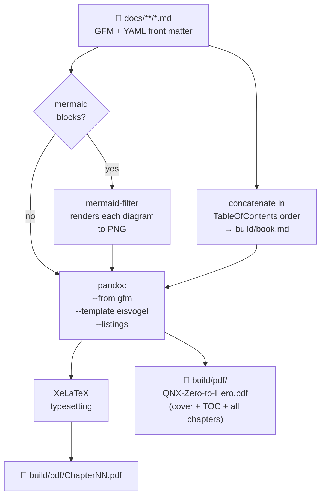

# 📄 PDF_Export.md — Turning the Course into PDFs

> **Goal.** One command produces a per-chapter PDF *and* a single bound book with a cover, table of
> contents, page numbers and syntax-highlighted code.
>
> ⚠️ **`[UNVERIFIED]`** — This pipeline is written but not yet run end to end (there are no chapters
> yet). Every command will be executed and corrected before this notice is removed. Tracked as
> **T-203** in [`ToDos.md`](../meta/ToDos.md).

---

## Contents

1. [Do you need this?](#1-do-you-need-this)
2. [How the pipeline works](#2-how-the-pipeline-works)
3. [Installing the dependencies](#3-installing-the-dependencies)
4. [Getting the Eisvogel template](#4-getting-the-eisvogel-template)
5. [Building the PDFs](#5-building-the-pdfs)
6. [Options and flags](#6-options-and-flags)
7. [Troubleshooting](#7-troubleshooting)
8. [Why the Markdown rules exist](#8-why-the-markdown-rules-exist)
9. [Lightweight alternatives](#9-lightweight-alternatives)

---

## 1. Do you need this?

**Probably not yet.** The course is fully readable as Markdown on GitHub or in VS Code, and the
PDF toolchain pulls in **2–4 GB** of TeX Live.

Install it when you want to:

- read offline (on a flight, on a tablet, in a lab with no network),
- print chapters and annotate them by hand,
- archive a snapshot of the course at a point in time,
- share the course with someone who doesn't use GitHub.

> 💡 **Insight.** You can install this at any point. Nothing in the course depends on it.

---

## 2. How the pipeline works



*Diagram: Markdown files pass through a Mermaid renderer, then Pandoc with the Eisvogel LaTeX
template, then XeLaTeX, producing per-chapter PDFs and one combined book.*

**Why these tools (ADR-011):**

| Tool | Why not something else |
|------|------------------------|
| **Pandoc** | The only Markdown converter with genuinely good LaTeX output. `md-to-pdf`/Chrome-based tools produce web-page-shaped PDFs, not book-shaped ones. |
| **XeLaTeX** (not pdfLaTeX) | We use emoji (🐣🚶🏃) as semantic path markers. Only Xe/LuaLaTeX can use system fonts that contain them. |
| **Eisvogel** | A well-maintained Pandoc LaTeX template that already handles code blocks, callouts, title pages and headers/footers properly. |
| **mermaid-filter** | Renders Mermaid at build time so diagrams survive into the PDF. |

---

## 3. Installing the dependencies

> 🐣 **Beginner note.** Run these in your Ubuntu/WSL2 terminal, one block at a time. Wait for each to
> finish. `sudo` will ask for your password.

### Step 3.1 — Update the package index

```bash
host$ sudo apt update
```

### Step 3.2 — Install Pandoc

```bash
host$ sudo apt install -y pandoc
```

Verify:

```bash
host$ pandoc --version | head -1
```

Expected output (version may differ; **3.x or newer required**):

```text
pandoc 3.1.11
```

> ⚠️ **Warning.** Ubuntu's packaged Pandoc is sometimes old. If `pandoc --version` shows **2.x**,
> install the latest `.deb` from https://github.com/jgm/pandoc/releases instead:
>
> ```bash
> host$ curl -LO https://github.com/jgm/pandoc/releases/download/3.1.11/pandoc-3.1.11-1-amd64.deb
> host$ sudo dpkg -i pandoc-3.1.11-1-amd64.deb
> ```
>
> *(Check the releases page for the current version number before running this.)*

### Step 3.3 — Install XeLaTeX and fonts

This is the big one — **~2–4 GB**, several minutes.

```bash
host$ sudo apt install -y \
    texlive-xetex \
    texlive-fonts-recommended \
    texlive-fonts-extra \
    texlive-latex-extra \
    lmodern \
    fonts-dejavu \
    fonts-noto-color-emoji
```

| Package | Why it's needed |
|---------|-----------------|
| `texlive-xetex` | The XeLaTeX engine itself |
| `texlive-latex-extra` | Provides `mdframed`, `titling`, `footmisc`, etc. that Eisvogel requires |
| `texlive-fonts-*`, `lmodern` | Base typefaces |
| `fonts-dejavu` | Fallback for box-drawing and symbols in code blocks |
| `fonts-noto-color-emoji` | **Renders 🐣🚶🏃⭐ path markers.** Without this they become blank boxes. |

Verify:

```bash
host$ xelatex --version | head -1
```

Expected output:

```text
XeTeX 3.141592653-2.6-0.999995 (TeX Live 2023/Debian)
```

### Step 3.4 — Install Node.js and the Mermaid renderer

Needed only if you want diagrams in the PDF. Skip with `--no-mermaid` (see §6).

```bash
host$ sudo apt install -y nodejs npm
host$ sudo npm install -g @mermaid-js/mermaid-cli mermaid-filter
```

Verify:

```bash
host$ mmdc --version
host$ which mermaid-filter
```

Expected output:

```text
11.4.2
/usr/local/bin/mermaid-filter
```

> ⚠️ **Warning — headless Chromium.** `mmdc` drives a headless Chromium. Under WSL2 this usually
> works out of the box, but if you see `Failed to launch the browser process`, install its
> libraries:
>
> ```bash
> host$ sudo apt install -y chromium-browser libgbm1 libasound2t64
> ```
>
> and see §7 for the `--no-sandbox` workaround.

### Step 3.5 — Verify everything at once

```bash
host$ ./tools/build-pdf.sh --check
```

Expected output:

```text
QNX Zero to Hero — PDF toolchain check
  pandoc          ✅ 3.1.11
  xelatex         ✅ TeX Live 2023
  eisvogel.latex  ✅ tools/pdf/eisvogel.latex
  mmdc            ✅ 11.4.2
  mermaid-filter  ✅ /usr/local/bin/mermaid-filter
  emoji font      ✅ Noto Color Emoji
All dependencies present. Run ./tools/build-pdf.sh to build.
```

---

## 4. Getting the Eisvogel template

The build script downloads it automatically on first run. To do it manually:

```bash
host$ mkdir -p tools/pdf
host$ curl -L -o tools/pdf/eisvogel.latex \
    https://raw.githubusercontent.com/Wandmalfarbe/pandoc-latex-template/master/template/eisvogel.latex
```

Verify it's a real file (should be tens of KB, not an HTML error page):

```bash
host$ wc -l tools/pdf/eisvogel.latex
```

Expected output:

```text
1200 tools/pdf/eisvogel.latex
```

---

## 5. Building the PDFs

### Everything

```bash
host$ ./tools/build-pdf.sh
```

### One chapter

```bash
host$ ./tools/build-pdf.sh docs/chapters/Chapter01_WhatIsARealTimeSystem.md
```

### Output layout

```text
build/
├── book.md                      intermediate concatenation
├── mermaid-images/              rendered diagrams
└── pdf/
    ├── QNX-Zero-to-Hero.pdf     📕 the whole book
    ├── PLAN.pdf
    ├── TableOfContents.pdf
    ├── Chapter00_....pdf
    ├── Chapter01_....pdf
    ├── Setup_01_....pdf
    └── ...
```

> 💡 `build/` is in `.gitignore` — PDFs are build artefacts, never committed.

---

## 6. Options and flags

| Flag | Effect |
|------|--------|
| *(none)* | Build everything: per-file PDFs + the combined book |
| `--check` | Verify dependencies only; build nothing |
| `--book-only` | Build only `QNX-Zero-to-Hero.pdf` |
| `--chapters-only` | Build only per-chapter PDFs |
| `--no-mermaid` | Skip diagram rendering (much faster; diagrams appear as code blocks) |
| `--no-toc` | Omit the generated table of contents |
| `--paper a4` \| `letter` | Page size (default `a4`) |
| `--open` | Open the resulting book PDF when done |
| `<file.md>` | Build just that one file |

---

## 7. Troubleshooting

| Symptom | Cause | Fix |
|---------|-------|-----|
| `pandoc: LaTeX Error: File 'mdframed.sty' not found` | Incomplete TeX install | `sudo apt install -y texlive-latex-extra` |
| Emoji render as empty boxes (□□□) | Missing colour emoji font | `sudo apt install -y fonts-noto-color-emoji`, then rebuild |
| `xelatex not found` | XeTeX missing | `sudo apt install -y texlive-xetex` |
| `Failed to launch the browser process` (from `mmdc`) | Chromium sandbox blocked under WSL2 | Create `.puppeteer.json` with `{"args": ["--no-sandbox"]}` and export `MERMAID_FILTER_PUPPETEER_CONFIG_FILE=$PWD/.puppeteer.json`, or just use `--no-mermaid` |
| `Error producing PDF` with no detail | Pandoc hides LaTeX errors by default | Re-run with `--verbose`; add `--pdf-engine-opt=-interaction=nonstopmode` |
| Very long code lines run off the page | No line-breaking in `listings` | Already handled by `listings: true` + `breaklines` in `tools/pdf/metadata.yaml` |
| Build takes many minutes | Mermaid launches a browser per diagram | Use `--no-mermaid` during drafting; full build only when publishing |
| `Could not convert image ... .png` | Mermaid render failed silently | Check `build/mermaid-images/`; run `mmdc -i test.mmd -o test.png` to isolate |
| `! TeX capacity exceeded` on the full book | Very large document | Build with `--chapters-only`, or split the book by part |

> 📌 Any new failure you hit gets added here **and** to
> [`Setup_05_Troubleshooting.md`](Setup_05_Troubleshooting.md).

---

## 8. Why the Markdown rules exist

Several rules in [`PLAN.md` §10](../PLAN.md#10-formatting--style-rules) exist *purely* to keep this
pipeline working. Now you can see why:

| Rule | What breaks without it |
|------|------------------------|
| No `> [!NOTE]` GitHub alerts | Pandoc renders them as literal text: `[!NOTE]` appears in your PDF |
| No raw HTML (except `<details>`) | HTML is dropped or errors out in LaTeX output |
| Relative links only | Absolute `https://github.com/...` links break offline reading and page cross-references |
| YAML front matter on every file | Pandoc uses it for the title, author and date on each PDF |
| One `#` H1 per file | Multiple H1s produce a broken document hierarchy and a wrong TOC |
| Language tags on every code fence | No language tag → no syntax highlighting |
| A text description under every Mermaid block | If diagram rendering is skipped or fails, the reader still gets the meaning |

> 💡 **Insight.** This is a general lesson worth carrying into your engineering work: *decide your
> output format before you write 34 documents.* Retrofitting is always more expensive.

---

## 9. Lightweight alternatives

Don't want a 4 GB TeX install? These work, with lower fidelity.

| Method | Command / how | Quality | Notes |
|--------|---------------|---------|-------|
| **VS Code** *Markdown PDF* extension | Install `yzane.markdown-pdf`, right-click → *Export (pdf)* | ⭐⭐⭐ | Easiest. No TOC, no page numbers, weaker code styling. |
| **VS Code print-to-PDF** | Open preview → Ctrl+P → Print → Save as PDF | ⭐⭐ | Zero install. Ugly but functional. |
| **Pandoc → HTML → browser print** | `pandoc -s --toc -c tools/pdf/style.css f.md -o f.html` then print from the browser | ⭐⭐⭐⭐ | No LaTeX needed; Mermaid can render client-side via JS. Good middle ground. |
| **`md-to-pdf`** (Node) | `npm i -g md-to-pdf && md-to-pdf docs/**/*.md` | ⭐⭐⭐ | Chromium-based. Fast, decent, web-page-shaped. |
| **GitHub's own print** | Open the file on GitHub → browser print | ⭐⭐ | Includes GitHub chrome. Emergency use only. |
| **`grip`** | `pip install grip && grip docs/PLAN.md` then print | ⭐⭐⭐ | Renders exactly like GitHub, including alerts. |

---

## 📝 Changelog

| Version | Date | Change |
|---------|------|--------|
| 1.0 | 2026-08-25 | Created. Pipeline designed, dependencies documented, marked `[UNVERIFIED]` pending first real build. |
