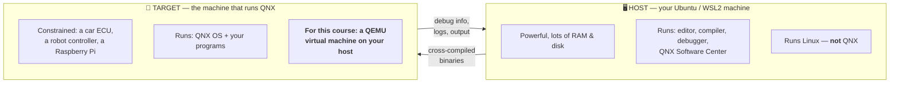
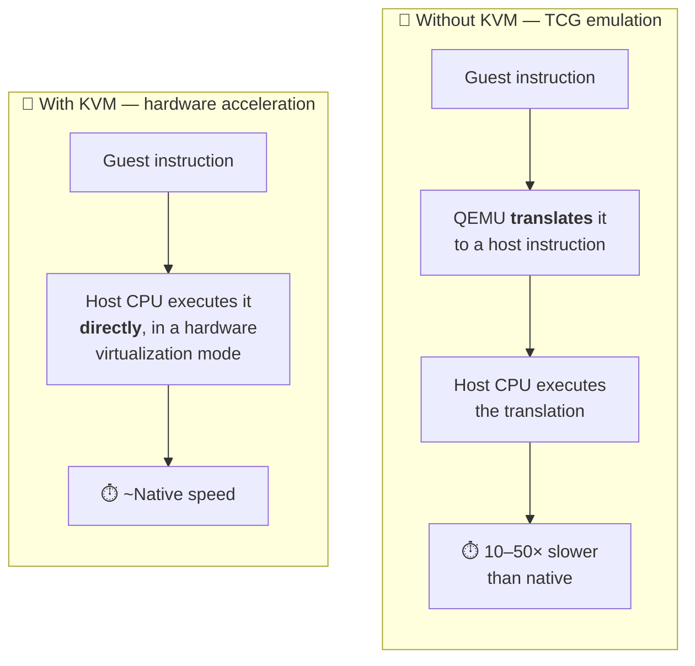

# 🛠️ Setup Guide 01 — Prerequisites & Host Preparation

> **What this guide gets you.** A Linux host that is fully ready to install QNX SDP 8.0 and run a
> QNX virtual machine at near-native speed.
>
> **What it does *not* do.** It does not install QNX. That is [Setup Guide 02](Setup_02_QNX_Account_And_License.md).
> Nothing here requires a QNX account, so **you can do this right now.**

> ✅ **Verified.** Every step in this guide has been executed end to end on **Ubuntu 26.04 LTS under
> WSL2** (Intel i7-11850H, 16 threads, 23 GiB RAM) on **2026-08-25**. The version numbers shown in
> the expected-output blocks are the real ones observed on that run, not illustrations.
>
> 💡 **Good news about Ubuntu 26.04.** QNX documents its QEMU workflow for Ubuntu 22.04 / 24.04, so
> there was a real risk that package names had changed by 26.04. **They had not** — every package in
> this guide installed under its documented name, with no substitutions. *(Risk R9 did not
> materialise.)*

---

## Contents

1. [Before you start](#1-before-you-start)
2. [Understanding host vs. target](#2-understanding-host-vs-target)
3. [Step 1 — Check your host meets the requirements](#3-step-1--check-your-host-meets-the-requirements)
4. [Step 2 — Update your package index](#4-step-2--update-your-package-index)
5. [Step 3 — Install build tools and utilities](#5-step-3--install-build-tools-and-utilities)
6. [Step 4 — Install a Java runtime](#6-step-4--install-a-java-runtime)
7. [Step 5 — Install QEMU](#7-step-5--install-qemu)
8. [Step 6 — Enable KVM hardware acceleration ⚡](#8-step-6--enable-kvm-hardware-acceleration-)
9. [Step 7 — Verify KVM actually works](#9-step-7--verify-kvm-actually-works)
10. [Step 8 — Prepare your working directories](#10-step-8--prepare-your-working-directories)
11. [Step 9 — Final verification](#11-step-9--final-verification)
12. [WSL2-specific notes](#12-wsl2-specific-notes)
13. [Troubleshooting](#13-troubleshooting)
14. [What you just installed, and why](#14-what-you-just-installed-and-why)
15. [Next step](#15-next-step)

---

## 1. Before you start

### 1.1 Conventions used in this guide

| Symbol | Meaning |
|--------|---------|
| `host$` | Type this in **your Ubuntu / WSL2 terminal**. Don't type the `host$` part. |
| `qnx#` | Type this in the **QNX target shell** (later guides). |
| ✅ **Expected output** | What you should see. If yours differs materially, go to [§13 Troubleshooting](#13-troubleshooting). |
| ⚠️ | Something that will bite you if you skip it. |
| 💡 | Worth understanding, not just doing. |
| 🐣 | Extra explanation for absolute beginners. |

> 🐣 **Beginner note — what is a terminal?**
> On Windows with WSL2, open the **Start menu** → type **"Ubuntu"** → press Enter. A black window
> with a text prompt appears. That is your terminal. Everything marked `host$` goes there.
> You paste with **Ctrl+Shift+V** (not Ctrl+V) in most Linux terminals.

### 1.2 What `sudo` is, and why you'll type your password

Several commands begin with `sudo`. This means *"run this as the system administrator"*. Installing
software changes system-wide directories, which ordinary users can't write to.

- The first `sudo` in a session asks for **your Linux password** (the one you set when you installed
  Ubuntu/WSL — **not** your Windows password).
- **Nothing is echoed while you type it.** No dots, no asterisks. That is normal. Type it and press
  Enter.

> ⚠️ **Warning.** Only ever run `sudo` on commands you understand. Every `sudo` command in this
> course is explained before you run it.

### 1.3 Time and disk budget

| Item | Cost |
|------|------|
| Time for this guide | 30–45 minutes (mostly downloading) |
| Disk used by this guide | ~1.5 GB |
| Disk needed for the whole course | **~85 GB** ⚠️ *(measured — see below)* |
| Internet needed | ~1 GB for this guide; ~10 GB in Setup Guide 02 |

---

## 2. Understanding host vs. target

Before installing anything, you need one concept. It is the concept that makes all of QNX
development make sense.



*Diagram: the host is your powerful Linux development machine running the tools; the target is the
constrained machine running QNX. For this course, the target is a virtual machine living inside your
host.*

**Three consequences you must internalise now:**

1. **QNX never gets installed on your Ubuntu machine.** What you install on Ubuntu is the QNX
   *SDP* — the **tools** for building QNX software. Your host stays Linux forever.
2. **You compile on the host, but the binary cannot run there.** A QNX binary won't run on Linux, and
   a Linux binary won't run on QNX. This is called **cross-compilation**.
3. **The target needs to be somewhere.** Real hardware, or — for this whole course — a virtual
   machine. That is why you are installing QEMU now.

> 💡 **Insight.** This host/target split is universal in embedded development, not a QNX quirk. Once
> you understand it here, it transfers to Yocto, Zephyr, FreeRTOS, Android, and everything else.

> 🐧 **In Linux this would be…** Building a Raspberry Pi image on your laptop with an
> `arm-linux-gnueabihf-gcc` cross-toolchain, then copying it to an SD card. Same idea, different
> tools.

---

## 3. Step 1 — Check your host meets the requirements

### 3.1 The requirements

QNX SDP 8.0 has hard host requirements. These are not negotiable.

| Requirement | Needed | Why |
|-------------|--------|-----|
| **CPU architecture** | **x86-64 (Intel/AMD)** | ⚠️ QNX SDP is **not supported on ARM hosts**. An Apple Silicon Mac or ARM Windows laptop cannot host QNX SDP. |
| **Host OS** | **Linux or Windows** | ⚠️ QNX SDP 8.0 **does not support macOS**. |
| **RAM** | 8 GB minimum, 16 GB comfortable | The VM wants 2–4 GB; the tools want the rest |
| **Free disk** | **~85 GB** | ⚠️ Measured, not estimated: SDP ~26 GB, **unpacked VM image ~53 GB**, working space. QNX's own 8–12 GB figure covers only part of the SDP ([D-008](../meta/Doubts.md#d-008)) |
| **Virtualization** | VT-x (Intel) or AMD-V | Without it the VM runs 10–50× slower |

> 📎 The authoritative, always-current list of supported host OS versions is in the
> **QNX SDP 8.0 Release Notes**:
> https://support.qnx.com/developers/docs/relnotes8.0/com.qnx.doc.release_notes/topic/sdp8_rn.html

> ⚠️ **Note on Ubuntu 26.04.** QNX documents the QEMU workflow on **Ubuntu 22.04 / 24.04**. Your host
> is **Ubuntu 26.04**, which is *newer* than what QNX has documented. In practice this means some
> package names differ. This guide handles those differences explicitly. Anything that does break
> gets recorded in [Setup Guide 05](Setup_05_Troubleshooting.md). *(This is risk **R9** in the
> [course plan](../PLAN.md#16-risks--mitigations).)*

### 3.2 Run the automated check

The course ships a read-only script that checks all of this for you. It installs nothing and changes
nothing.

```bash
host$ cd ~/exercises/qnx-zero-to-hero
host$ ./tools/check-environment.sh
```

✅ **Expected output** (abbreviated — yours will differ in the details):

```text
1. Host system
────────────────────────────────────────────────────────────────
  ✅ OS                     Ubuntu 26.04 LTS
  ✅ Kernel                 6.18.33.2-microsoft-standard-WSL2
  ✅ Environment            WSL2 (Windows Subsystem for Linux)
  ✅ Architecture           x86_64

2. CPU & virtualization
────────────────────────────────────────────────────────────────
  ✅ CPU cores              16 logical
  ✅ HW virtualization      supported (VT-x / AMD-V)
  ⚠️  /dev/kvm               present but not accessible by your user
```

**Right now, before you install anything, several things will show ❌ or ⚠️.** That is expected —
this guide fixes them. Run the script again at the end to confirm.

### 3.3 Manual checks (if you'd rather not run a script)

```bash
host$ uname -m
```

✅ **Expected output** — must be exactly this:

```text
x86_64
```

> ⚠️ If you see `aarch64` or `arm64`, **stop**. QNX SDP cannot run on this machine. See
> [§13.1](#131-my-cpu-is-arm-aarch64) for your options.

```bash
host$ grep -cE '(vmx|svm)' /proc/cpuinfo
```

✅ **Expected output** — any number greater than `0`:

```text
16
```

> 💡 `vmx` is Intel's virtualization instruction set (VT-x); `svm` is AMD's (AMD-V). The number is
> how many CPU threads report it. `0` means virtualization is disabled in your BIOS/UEFI — see
> [§13.2](#132-virtualization-shows-0).

```bash
host$ df -h ~ | tail -1
```

✅ **Expected output** — the 4th column (Avail) must be at least `25G`:

```text
/dev/sdd       1007G  4.2G  952G   1% /
```

---

## 4. Step 2 — Update your package index

Ubuntu keeps a local catalogue of available software. Refresh it before installing anything, or you
may get "package not found" errors for packages that exist.

```bash
host$ sudo apt update
```

✅ **Expected output** (ends with something like):

```text
Hit:1 http://archive.ubuntu.com/ubuntu resolute InRelease
Get:2 http://security.ubuntu.com/ubuntu resolute-security InRelease [126 kB]
...
Reading package lists... Done
Building dependency tree... Done
All packages are up to date.
```

> 💡 `apt update` refreshes the *catalogue*. It does **not** upgrade anything. The command that
> actually upgrades installed packages is `apt upgrade`, which we are deliberately **not** running —
> a large system upgrade mid-course is an unnecessary risk.

---

## 5. Step 3 — Install build tools and utilities

```bash
host$ sudo apt install -y \
    build-essential \
    git \
    curl \
    wget \
    unzip \
    tar \
    xz-utils \
    file \
    openssh-client \
    net-tools \
    iproute2 \
    pkg-config
```

**What each package is for:**

| Package | Provides | Why the course needs it |
|---------|----------|-------------------------|
| `build-essential` | `gcc`, `g++`, `make`, `libc` headers | QNX's `qcc` is a wrapper around GCC and needs a working host toolchain. `make` drives every lab. |
| `git` | Version control | This repository; also cloning QNX open-source ports later |
| `curl`, `wget` | Downloaders | Fetching the QNX Software Center installer and target images |
| `unzip`, `tar`, `xz-utils` | Archive extraction | QNX ships `.tar.xz`, `.zip` and `.run` archives |
| `file` | Identifies file types | **Genuinely useful in Chapter 08** — `file` tells you whether a binary is for Linux or QNX |
| `openssh-client` | `ssh`, `scp` | Logging into the QNX VM and copying programs to it |
| `net-tools`, `iproute2` | `ifconfig`, `ip` | Diagnosing VM networking |
| `pkg-config` | Build-time library discovery | Needed by some QNX tooling and by ports |

✅ **Expected output** ends with something like:

```text
Setting up build-essential (12.10ubuntu1) ...
Processing triggers for man-db (2.13.1-1) ...
```

**Verify:**

```bash
host$ gcc --version | head -1 && make --version | head -1 && git --version
```

✅ **Expected output** — real values observed on Ubuntu 26.04 (yours may be newer):

```text
gcc (Ubuntu 15.2.0-16ubuntu1) 15.2.0
GNU Make 4.4.1
git version 2.53.0
```

> 💡 Ubuntu 26.04 ships **GCC 15**. Nothing in this course depends on the host compiler version —
> your QNX code is built by `qcc` from the QNX SDP, not by this GCC. Host GCC is here only to build
> ordinary Linux helper tools.

---

## 6. Step 4 — Install a Java runtime

The **QNX Software Center** — the application that downloads and installs QNX SDP — is built on
Eclipse, which needs Java.

```bash
host$ sudo apt install -y default-jre
```

**Verify:**

```bash
host$ java -version
```

✅ **Expected output** — real value observed on Ubuntu 26.04 (**17 or newer** is safe):

```text
openjdk version "25.0.4" 2026-07-21
```

> 🐣 **Beginner note.** `java -version` prints to **stderr**, not stdout. That is normal and not an
> error — it is a long-standing quirk of the JDK. If you pipe this command somewhere and see
> nothing, that is why.

> 💡 **Why this is here and not in Setup Guide 02.** QNX Software Center *bundles* its own JRE in most
> builds, so this may be redundant. It is installed anyway because when the bundled JRE fails, the
> error message is cryptic (`A Java Runtime Environment (JRE) or Java Development Kit (JDK) must be
> available`), and diagnosing it mid-install is far more annoying than a 200 MB precaution.

---

## 7. Step 5 — Install QEMU

**QEMU** (Quick EMUlator) is the virtual machine software that will run QNX.

### 7.1 The command

```bash
host$ sudo apt install -y \
    qemu-system-x86 \
    qemu-utils \
    qemu-system-gui \
    bridge-utils \
    libvirt-daemon-system \
    libvirt-clients
```

**What each package is for:**

| Package | Provides | Why |
|---------|----------|-----|
| `qemu-system-x86` | `qemu-system-x86_64` | **The core.** Emulates an x86-64 PC for QNX to run on. |
| `qemu-utils` | `qemu-img` | Creates, converts and inspects virtual disk images |
| `qemu-system-gui` | SDL/GTK display backends | Lets the VM open a graphical console window. Optional if you use serial-only. |
| `bridge-utils` | `brctl` | Bridged networking, so the VM gets its own address on your network |
| `libvirt-daemon-system`, `libvirt-clients` | `virsh`, `virbr0` | VM management and the default NAT network. Not strictly required, but QNX's own instructions assume it and it makes networking far easier. |

> ⚠️ **Package names differ between Ubuntu versions.** QNX's official documentation lists:
>
> | Ubuntu | QNX's documented package list |
> |--------|-------------------------------|
> | 22.04 | `qemu qemu-system-x86 qemu-kvm libvirt-daemon-system libvirt-clients bridge-utils` |
> | 24.04 | `qemu-system qemu-utils qemu-user qemu-user-binfmt qemu-block-extra libvirt-daemon-system libvirt-clients libguestfs-tools bridge-utils` |
>
> On **Ubuntu 26.04** the metapackage `qemu` no longer exists and `qemu-kvm` is a transitional
> stub. The list in §7.1 is the 26.04 equivalent. If a package name is rejected, see
> [§13.4](#134-package-not-found).

### 7.2 Verify

```bash
host$ qemu-system-x86_64 --version
```

✅ **Expected output** — real value observed on Ubuntu 26.04 (**6.0 or newer** is fine):

```text
QEMU emulator version 10.2.1 (Debian 1:10.2.1+ds-1ubuntu3)
Copyright (c) 2003-2025 Fabrice Bellard and the QEMU Project developers
```

```bash
host$ qemu-img --version
```

✅ **Expected output:**

```text
qemu-img version 10.2.1 (Debian 1:10.2.1+ds-1ubuntu3)
Copyright (c) 2003-2025 Fabrice Bellard and the QEMU Project developers
```

---

## 8. Step 6 — Enable KVM hardware acceleration ⚡

> ⚠️ **Do not skip this step.** It is the single biggest performance factor in the entire course.

### 8.1 What KVM is and why it matters enormously

QEMU can run a virtual machine in two completely different ways:



*Diagram: without KVM, QEMU translates every guest instruction in software, costing 10–50× in speed.
With KVM, the physical CPU runs guest instructions directly using VT-x/AMD-V.*

**In practice:** a QNX boot that takes **3 seconds** with KVM takes **2–4 minutes** without it. Over
a course with hundreds of boot cycles, that is the difference between enjoyable and unbearable.

### 8.2 Check the current state

```bash
host$ ls -l /dev/kvm
```

There are three possible outcomes:

| What you see | Meaning | What to do |
|--------------|---------|-----------|
| `crw-rw---- 1 root kvm ...` | Device exists but is owned by the `kvm` group | ➡️ Do §8.3 — **this is the most common case** |
| `crw-rw-rw- 1 root kvm ...` or you're already in `kvm` | Fully accessible | ✅ Skip to §9 |
| `No such file or directory` | KVM is not available at all | ➡️ See [§13.3](#133-devkvm-does-not-exist) |

### 8.3 Add yourself to the `kvm` group

If the device exists but you can't use it, you are not a member of the `kvm` group.

```bash
host$ sudo usermod -aG kvm $USER
```

**What this does, flag by flag:**

| Part | Meaning |
|------|---------|
| `usermod` | Modify a user account |
| `-a` | **Append** — add to groups, don't replace existing ones |
| `-G kvm` | The group to add: `kvm` |
| `$USER` | Your username, expanded automatically by the shell |

> ⚠️ **Critical: `-a` is not optional.** `usermod -G kvm $USER` *without* `-a` would **remove you from
> every other group**, including `sudo`. That can lock you out of administration. Always use `-aG`.

### 8.4 Apply the change — you must restart your session

Group membership is read when your session starts. It does **not** take effect in your current
terminal.

**On WSL2 (your setup):** open **Windows PowerShell** or **Command Prompt** and run:

```powershell
wsl --shutdown
```

Then open your Ubuntu terminal again. *(This fully restarts the WSL virtual machine — it takes a few
seconds. Any running WSL processes are terminated, so save your work first.)*

**On native Linux:** log out and log back in, or reboot.

### 8.5 Confirm the group took effect

```bash
host$ groups
```

✅ **Expected output** — `kvm` must appear in the list:

```text
tyrostir adm cdrom sudo dip plugdev kvm
```

> ⚠️ If `kvm` is **not** listed, the session did not actually restart. On WSL2, make sure
> `wsl --shutdown` ran from **Windows**, not from inside the Ubuntu terminal.

---

## 9. Step 7 — Verify KVM actually works

Being in the group is not proof. Test it.

### 9.1 Check you can read and write the device

```bash
host$ test -r /dev/kvm && test -w /dev/kvm && echo "KVM accessible ✅" || echo "KVM NOT accessible ❌"
```

✅ **Expected output:**

```text
KVM accessible ✅
```

### 9.2 Prove QEMU can actually use it

This starts QEMU with KVM, using a deliberately empty machine, and immediately quits. It boots
nothing — it only proves acceleration initialises.

```bash
host$ qemu-system-x86_64 -enable-kvm -machine q35 -m 128 -nographic -no-reboot
```

> 🚪 **How to quit.** Press **`Ctrl+A`**, release both keys, then press **`X`**. This is QEMU's
> escape sequence in `-nographic` mode; plain `Ctrl+C` goes to the *guest*, not to QEMU.

✅ **Expected output** — QEMU boots its firmware, finds no disk, and gives up. **That failure is the
pass.** It proves KVM initialised and the virtual machine actually started. Real output from Ubuntu
26.04 / WSL2, abridged:

```text
SeaBIOS (version 1.17.0-debian-1.17.0-1ubuntu1)
iPXE (https://ipxe.org) 00:02.0 CA00 PCI2.10 PnP PMM+06FC8B60+06F08B60 CA00

Booting from Hard Disk...
Boot failed: could not read the boot disk

Booting from DVD/CD...
Boot failed: Could not read from CDROM (code 0003)
Booting from ROM...
iPXE (PCI 00:02.0) starting execution...ok
net0: 52:54:00:12:34:56 using 82574l on 0000:00:02.0 (Ethernet) [open]
Configuring (net0 52:54:00:12:34:56)...... ok
net0: 10.0.2.15/255.255.255.0 gw 10.0.2.2
Nothing to boot: No such file or directory (https://ipxe.org/2d03e13b)
No more network devices

Booting from Floppy...
Boot failed: could not read the boot disk

No bootable device.
```

> 💡 **Read that output again — it is a preview of the whole course.** `SeaBIOS` is the virtual
> firmware. It tried the hard disk, the CD, the network (via **iPXE**, which even picked up a
> DHCP address of `10.0.2.15` from QEMU's built-in NAT), then the floppy, and found nothing
> bootable. In Setup Guide 03 you will hand this same machine a QNX image, and instead of
> *"No bootable device"* you will get a `qnx#` prompt.

❌ **Bad output** — this means KVM did **not** initialise:

```text
qemu-system-x86_64: failed to initialize kvm: Permission denied
```
or
```text
qemu-system-x86_64: -enable-kvm: Could not access KVM kernel module: No such file or directory
```

If you see either, go to [§13.3](#133-devkvm-does-not-exist).

> 💡 **Why the "error" is a pass.** We are testing one thing only: does `-enable-kvm` succeed? QEMU
> processes flags in order. Reaching the "can't load kernel" stage proves it got past KVM
> initialisation. Using `/dev/null` as the kernel is a deliberate way to make QEMU stop immediately
> after that point.

---

## 10. Step 8 — Prepare your working directories

A predictable layout that every later guide assumes.

```bash
host$ mkdir -p ~/qnx-workspace/{images,vms,shared,downloads}
host$ ls -la ~/qnx-workspace
```

✅ **Expected output:**

```text
total 24
drwxr-xr-x 6 tyrostir tyrostir 4096 Aug 25 13:10 .
drwxr-x--- 8 tyrostir tyrostir 4096 Aug 25 13:10 ..
drwxr-xr-x 2 tyrostir tyrostir 4096 Aug 25 13:10 downloads
drwxr-xr-x 2 tyrostir tyrostir 4096 Aug 25 13:10 images
drwxr-xr-x 2 tyrostir tyrostir 4096 Aug 25 13:10 shared
drwxr-xr-x 2 tyrostir tyrostir 4096 Aug 25 13:10 vms
```

**What each directory is for:**

| Directory | Contents |
|-----------|----------|
| `~/qnx-workspace/downloads` | QNX Software Center installer, target image archives |
| `~/qnx-workspace/images` | Downloaded QNX target images (QSTI) — read-only originals |
| `~/qnx-workspace/vms` | Working VM disks. **These are the ones you can safely delete and rebuild.** |
| `~/qnx-workspace/shared` | A folder shared between your host and the QNX VM — how you'll move programs across |

> 💡 **Why not put these in the course repo?** VM disk images are gigabytes of binary data. They must
> never be committed to git. Keeping them entirely outside the repository makes that mistake
> impossible. (The repo's `.gitignore` also blocks `*.qcow2`, `*.img` and friends as a second line of
> defence.)

> ⚠️ **WSL2 users: keep these on the Linux filesystem.** `~/qnx-workspace` lives inside the WSL2
> virtual disk, which is what you want. Do **not** put VM images under `/mnt/c/...` (your Windows
> drive) — disk I/O across the WSL/Windows boundary is dramatically slower and will make your VM
> crawl even with KVM enabled.

---

## 11. Step 9 — Final verification

Run the environment check again.

```bash
host$ cd ~/exercises/qnx-zero-to-hero
host$ ./tools/check-environment.sh
```

✅ **Expected output** — sections 1–5 should now be all green. This is the **real report** from a
completed Setup Guide 01 run on Ubuntu 26.04 / WSL2:

```text
1. Host system
────────────────────────────────────────────────────────────────
  ✅ OS                     Ubuntu 26.04 LTS
  ✅ Kernel                 6.18.33.2-microsoft-standard-WSL2
  ✅ Environment            WSL2 (Windows Subsystem for Linux)
  ✅ Architecture           x86_64

2. CPU & virtualization
────────────────────────────────────────────────────────────────
  ✅ CPU cores              16 logical
  ✅ CPU model              11th Gen Intel(R) Core(TM) i7-11850H @ 2.50GHz
  ✅ HW virtualization      supported (VT-x / AMD-V)
  ✅ /dev/kvm               present and accessible — KVM acceleration available 🚀

3. Memory & disk
────────────────────────────────────────────────────────────────
  ✅ RAM                    23 GiB total
  ✅ Free disk ($HOME)      951 GB — plenty (need ~85 GB)

4. Required host tools
────────────────────────────────────────────────────────────────
  ✅ git                    git version 2.53.0
  ✅ curl                   curl 8.18.0 (x86_64-pc-linux-gnu) libcurl/8.18.0 Ope
  ✅ make                   GNU Make 4.4.1
  ✅ gcc                    gcc (Ubuntu 15.2.0-16ubuntu1) 15.2.0
  ✅ tar                    tar (GNU tar) 1.35
  ✅ ssh                    OpenSSH_10.2p1 Ubuntu-2ubuntu3.5, OpenSSL 3.5.5 27 J
  ✅ java                   openjdk version "25.0.4" 2026-07-21

5. QEMU (lab environment)
────────────────────────────────────────────────────────────────
  ✅ qemu-system-x86_64     QEMU emulator version 10.2.1 (Debian 1:10.2.1+ds-1ub
  ✅ qemu-img               qemu-img version 10.2.1 (Debian 1:10.2.1+ds-1ubuntu3
```

The summary line should read:

```text
  19 passed   6 warnings   0 failed

  👍 Ready to proceed. Warnings above are for optional or not-yet-installed items.
```

> 💡 **Compare with where you started.** Before Setup Guide 01, this same script reported
> **13 passed · 9 warnings · 3 failed**. The three failures were `gcc`, `make` and
> `qemu-system-x86_64`; one of the warnings was `/dev/kvm` present but **not writable**. All four
> are now resolved. **Zero failures is the bar for moving on.**

**Still expected to be ⚠️ at this point** — these are Setup Guide 02's job:

```text
6. QNX SDP
────────────────────────────────────────────────────────────────
  ⚠️  QNX SDP                not found — install it via Setup Guide 02
  ⚠️  $QNX_HOST              unset
  ⚠️  QNX licence            not found
```

Section 7 (PDF toolchain) is optional and can stay ⚠️ indefinitely.

### ✅ Completion checklist

- [ ] `uname -m` prints `x86_64`
- [ ] `gcc`, `make`, `git`, `curl`, `ssh` all present
- [ ] `java -version` works
- [ ] `qemu-system-x86_64 --version` works
- [ ] `groups` includes `kvm`
- [ ] The KVM test in §9.2 gets past KVM initialisation
- [ ] `~/qnx-workspace/` exists with four subdirectories
- [ ] At least **85 GB** free on `~`

---

## 12. WSL2-specific notes

Your host is WSL2, which is well supported but has a few sharp edges worth knowing before they cut
you.

### 12.1 Nested virtualization

Running QEMU/KVM *inside* WSL2 means running a VM inside a VM — **nested virtualization**. It is
enabled by default on recent Windows builds, which is why `/dev/kvm` exists on your machine.

If it were ever disabled, you would enable it by editing `C:\Users\<YourName>\.wslconfig` in Windows:

```ini
[wsl2]
nestedVirtualization=true
```

Then run `wsl --shutdown` from Windows and reopen Ubuntu.

### 12.2 Controlling WSL2's memory

WSL2 grabs memory dynamically and can starve Windows. Since we'll run a VM inside it, capping it is
sensible. In `C:\Users\<YourName>\.wslconfig`:

```ini
[wsl2]
memory=12GB
processors=8
swap=4GB
nestedVirtualization=true
```

With 23 GB of RAM, giving WSL2 12 GB leaves plenty for Windows while comfortably hosting a 4 GB QNX
VM. Apply with `wsl --shutdown`.

### 12.3 GUI applications (needed in Setup Guide 02)

QNX Software Center is a graphical application. Modern WSL2 includes **WSLg**, which runs Linux GUI
apps on your Windows desktop with no extra setup.

Test it now, so you find out before you need it:

```bash
host$ sudo apt install -y x11-apps
host$ xeyes
```

✅ **Expected result:** a small window with a pair of eyes following your mouse pointer. Close it with
Ctrl+C in the terminal.

❌ **If nothing appears**, WSLg isn't working. See [§13.5](#135-gui-apps-dont-open-on-wsl2). Setup
Guide 02 also documents a **command-line-only** installation route that avoids the GUI entirely.

### 12.4 Where your Linux files actually are

| From | Path |
|------|------|
| Inside WSL | `~/qnx-workspace` |
| From Windows Explorer | `\\wsl$\Ubuntu\home\tyrostir\qnx-workspace` |

> ⚠️ **Reminder.** Keep VM images on the Linux side (`~/...`). Files under `/mnt/c/` are on the
> Windows filesystem and are *much* slower.

---

## 13. Troubleshooting

### 13.1 My CPU is ARM (aarch64)

```text
host$ uname -m
aarch64
```

QNX SDP 8.0 **cannot** run on an ARM host — this includes Apple Silicon Macs and ARM-based Windows
laptops. Your options:

| Option | Notes |
|--------|-------|
| Use a different x86-64 machine | Simplest. Any Intel/AMD PC from the last decade. |
| A cloud x86-64 VM | AWS/Azure/GCP. QNX also publishes official cloud guidance. Costs money. |
| x86 emulation | Technically possible, practically unusable — you'd be emulating x86 to then emulate a VM. |

### 13.2 Virtualization shows `0`

```text
host$ grep -cE '(vmx|svm)' /proc/cpuinfo
0
```

VT-x/AMD-V is disabled in firmware. Fix:

1. Reboot and enter BIOS/UEFI (usually **F2**, **F10**, **Del** or **Esc** at power-on).
2. Find **Intel Virtualization Technology** / **Intel VT-x** / **SVM Mode** / **AMD-V**.
   Often under *Advanced*, *CPU Configuration*, or *Security*.
3. **Enable** it. Save and exit.

On Windows hosts, also ensure Hyper-V/virtualization features are enabled (they are required by WSL2
anyway, so if WSL2 runs, this is almost certainly fine).

### 13.3 `/dev/kvm` does not exist

| Cause | Fix |
|-------|-----|
| Nested virtualization disabled in WSL2 | Add `nestedVirtualization=true` to `.wslconfig` (§12.1), then `wsl --shutdown` |
| VT-x/AMD-V disabled in BIOS | See §13.2 |
| `kvm_intel` / `kvm_amd` module not loaded | `sudo modprobe kvm_intel` (or `kvm_amd`), then re-check |
| Running inside another hypervisor without nested virt | Enable nested virtualization in the *outer* hypervisor's VM settings |

**Not fixable?** You can still complete the course — everything works under TCG emulation, just
slowly. Setup Guide 03 documents the TCG fallback. Reduce the VM's RAM and CPU count to compensate.

### 13.4 "Package not found"

```text
E: Unable to locate package qemu-system-gui
```

Package names change between Ubuntu releases. Find the real name:

```bash
host$ apt-cache search qemu | grep -i system
host$ apt-cache search --names-only '^qemu'
```

Install what actually exists. The **only** truly mandatory package is `qemu-system-x86`; everything
else is convenience.

### 13.5 GUI apps don't open on WSL2

| Check | Command / action |
|-------|------------------|
| Is WSLg present? | `ls /mnt/wslg` — should list files |
| Is `DISPLAY` set? | `echo $DISPLAY` — should print `:0` |
| Is WSL up to date? | In Windows PowerShell: `wsl --update`, then `wsl --shutdown` |
| Are GPU drivers current? | Update your graphics driver from the vendor (Intel/NVIDIA/AMD) |

**Fallback:** Setup Guide 02 documents a headless, command-line-only install of QNX SDP using
`qnxsoftwarecenter_clt`. You do not strictly need a GUI at any point in this course.

### 13.6 `sudo: command not found` or password rejected

- The password is your **Linux** password, not your Windows one.
- Nothing is displayed while typing — that's normal.
- Forgot it? On WSL2, from Windows PowerShell:
  ```powershell
  wsl -u root passwd tyrostir
  ```

### 13.7 Something else broke

Record it. Every failure encountered becomes a permanent entry in
[Setup Guide 05 — Troubleshooting](Setup_05_Troubleshooting.md), and every question you ask becomes a
`D-NNN` entry in [Doubts.md](../meta/Doubts.md). Include:

```bash
host$ ./tools/check-environment.sh > /tmp/envcheck.txt 2>&1
host$ cat /tmp/envcheck.txt
```

---

## 14. What you just installed, and why

A summary you can revisit later — or show to a colleague asking "what does this need?"

| Layer | What | Role in the course |
|-------|------|-------------------|
| **Host toolchain** | `build-essential`, `pkg-config` | Underpins `qcc`; builds host-side helper tools |
| **Runtime** | `default-jre` | Runs QNX Software Center (Eclipse-based) |
| **Virtualization** | `qemu-system-x86`, `qemu-utils` | **Is the target machine.** Runs QNX. |
| **Acceleration** | KVM (kernel) + `kvm` group | Makes the target run at ~native speed |
| **Networking** | `bridge-utils`, `libvirt-*`, `net-tools`, `iproute2` | Host ↔ target networking; `ssh`, `scp`, `qconn`, remote gdb |
| **Transfer** | `openssh-client` | Copying your programs to the target |
| **Archives** | `tar`, `xz-utils`, `unzip` | Unpacking QNX images and packages |
| **Inspection** | `file` | Telling a QNX binary from a Linux one — used from Chapter 08 onward |

**Total disk consumed:** roughly 1.5 GB.
**Still to come in Setup Guide 02:** ~10 GB for QNX SDP 8.0.

---

## 15. Next step

Your host is ready. 🎉

➡️ **[Setup Guide 02 — QNX Account, Licence & SDP 8.0 Install](Setup_02_QNX_Account_And_License.md)**

> ⚠️ **Start Setup Guide 02 today, even if you don't plan to study today.** It begins with requesting
> your free QNX licence, and licence processing takes time. Submit the request, then read
> [Chapter 00](../chapters/Chapter00_HowToUseThisCourse.md) and Part 0 while you wait — none of Part 0
> needs any software.

---

## 📝 Changelog

| Version | Date | Change |
|---------|------|--------|
| 2.1 | 2026-08-26 | Disk requirement corrected from ~25 GB to **~85 GB**, measured with `du` rather than estimated. The unpacked VM image alone is 53 GB ([D-008](../meta/Doubts.md#d-008)). |
| 2.0 | 2026-08-26 | **Verified end to end on the real host.** All `[UNVERIFIED]` markers cleared. Expected-output blocks replaced with real observed output: GCC 15.2.0, Make 4.4.1, OpenJDK 25.0.4, QEMU 10.2.1. §9.2 KVM proof rewritten around the command actually run (SeaBIOS → iPXE → *No bootable device*), with an explanation of why that failure is the pass. §11 now shows the real 19/6/0 report. Repo path corrected to `~/exercises/qnx-zero-to-hero`. Risk R9 recorded as not materialised — every documented package name still exists on 26.04. |
| 1.1 | 2026-08-26 | Corrected the `verified_on` claim: only the host readiness check was ever run, not the install steps. Added the `[UNVERIFIED]` notice (ADR-024). |
| 1.0 | 2026-08-25 | Created. Verified against Ubuntu 26.04 / WSL2 / i7-11850H. Documents the Ubuntu 26.04 package-name divergence from QNX's documented 22.04/24.04 lists (risk R9). |
