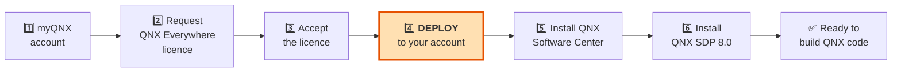
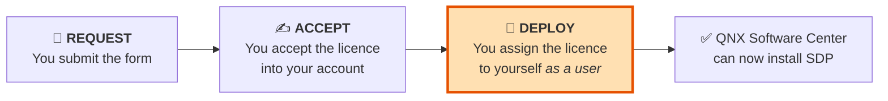
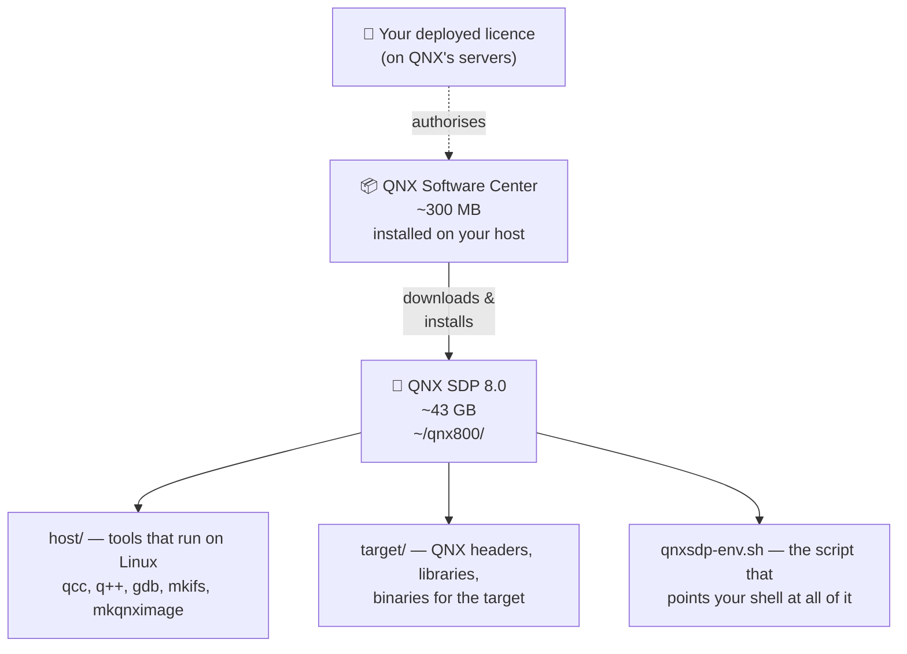

# 🔑 Setup Guide 02 — QNX Account, Licence & SDP 8.0 Install

> **What this guide gets you.** A legal, free QNX licence and a complete QNX SDP 8.0 installation on
> your Linux host.
>
> ⚠️ **Do Part A of this guide TODAY, before anything else.** Licence approval is not instant. Submit
> the request, then read Part 0 of the course (Chapters 00–03) while you wait — none of it needs
> software.

> ✅ **Verified end to end.** This entire guide — account, licence request, accept, **deploy**,
> QNX Software Center, SDP 8.0 install, environment setup and the cross-compile proof — has been
> executed on **Ubuntu 26.04 LTS under WSL2** and ends with `24 passed · 3 warnings · 0 failed`.
> The version numbers, paths and command output shown below are real, not illustrations.
>
> 💡 **Two figures worth knowing before you start:** the install consumes roughly **43 GB**, and once
> the QEMU image is unpacked `~/qnx800` reaches **79 GB** — **budget ~85 GB** (see §12.1 — more than QNX's own materials suggest), and the cross-compiler is **GCC 12.2.0**, entirely
> separate from your host's GCC.

---

## Contents

**Part A — Get the licence (do this first)**
1. [What you're getting, and what it costs](#1-what-youre-getting-and-what-it-costs)
2. [⚠️ What "non-commercial" legally means](#2-️-what-non-commercial-legally-means)
3. [Step 1 — Create a myQNX account](#3-step-1--create-a-myqnx-account)
4. [Step 2 — Request the QNX Everywhere licence](#4-step-2--request-the-qnx-everywhere-licence)
5. [Step 3 — Accept and DEPLOY the licence](#5-step-3--accept-and-deploy-the-licence-)

**Part B — Install the software**

6. [The install chain, explained](#6-the-install-chain-explained)
7. [Step 4 — Download QNX Software Center](#7-step-4--download-qnx-software-center)
8. [Step 5 — Install QNX Software Center](#8-step-5--install-qnx-software-center)
9. [Step 6 — Install QNX SDP 8.0](#9-step-6--install-qnx-sdp-80)
10. [Step 7 — Set up your environment](#10-step-7--set-up-your-environment)
11. [Step 8 — Verify the installation](#11-step-8--verify-the-installation)
12. [What you now have on disk](#12-what-you-now-have-on-disk)
13. [Troubleshooting](#13-troubleshooting)
14. [Next step](#14-next-step)

---

# Part A — Get the licence

## 1. What you're getting, and what it costs

**Cost: ₹0 / $0.**

QNX is proprietary commercial software. Since 2024, BlackBerry runs **QNX Everywhere** — a programme
giving students, hobbyists and prototypers free access under a **non-commercial** licence.

| Included free | What it is |
|---------------|-----------|
| **QNX SDP 8.0** | The OS, cross-compilers, IDE, tools, and target images. The main event. |
| **QNX Developer Desktop** | A self-hosted QNX 8.0 XFCE desktop — build *on* QNX, no cross-compiling |
| **QNX Hypervisor** | Type-1 hypervisor (Chapter 30) |
| **QSTI images** | Pre-built QNX images for QEMU and Raspberry Pi 4/5 |
| **Official training** | Free online QNX courses |
| **All documentation** | No account needed for docs, but useful to have one |



*Diagram: the six-step chain from creating an account to a working QNX SDP. Step 4 — deploying the
licence — is highlighted because it is the step most people miss.*

> ⚠️ **The single most common failure in this whole process** is stopping after step 3. A licence
> that has been *requested* and *accepted* but never **deployed to your account** leaves QNX Software
> Center unable to install anything — and the error message does not tell you why. Read
> [§5](#5-step-3--accept-and-deploy-the-licence-) carefully.

---

## 2. ⚠️ What "non-commercial" legally means

Read this section. It is short, and getting it wrong has real consequences.

### ✅ You ARE allowed to

| Permitted | Notes |
|-----------|-------|
| Learn QNX, for your own development | This course |
| Academic coursework, teaching and research | Including paid academic research/instruction |
| **Hobbyist and maker projects — including *building a product or system*** | On Raspberry Pi or **any** QNX-provided BSP. *"provided you do not make a commercial product or put the resulting software or system into production use"* |
| **Write training material or books about QNX — even commercially** | This is why this public course repository is legitimate |
| Develop open-source software interoperable with QNX | ⚠️ *"provided you make the resulting OSS publicly available **at no charge**"* |
| **Demonstrate a product or system to existing or potential customers** | *"e.g. as part of a product roadmap"* — **explicitly permitted** |
| Certain research prototypes, even inside a company | ⚠️ Conditional — confirm eligibility with `licensing@qnx.com` first |

### ❌ You are NOT allowed to

| Forbidden | Why it matters |
|-----------|----------------|
| Build or develop a **commercial product** | The thing you intend to sell |
| Put software into **production use** | "It works, let's ship it" — no. ⚠️ **Including internal, unpaid deployments** |
| **Distribute** the resulting software | Distribution needs a *separate* distribution licence, even for commercial licence holders. **Even one pilot unit** |
| Any activity in exchange for a fee | Or *"consideration of any kind"* — beyond the exceptions listed above |

> ✏️ **Corrected 2026-08-26.** An earlier version of this guide listed *"demo to existing or potential
> customers"* as **forbidden**. It is **explicitly permitted** — see the row added above. The error
> was found while writing [Chapter 04](../chapters/Chapter04_LicensingAndQNXEverywhere.md) by checking QNX's licensing
> page directly.
>
> 💡 **The boundary is `production` and `distribution`, not whether money is involved.** Chapter 04
> §1.2 explains why that trips people in both directions.

### ⚠️ Do not mix licence types

> **From QNX's licensing page:** *"Do not simultaneously deploy both commercial and non-commercial
> licenses to the same user account."*

If your employer holds a commercial QNX licence, keep this learning installation **separate** —
ideally on a personal machine and a personal myQNX account. Mixing them creates a compliance mess
that is genuinely hard to unwind.

### 📎 Authoritative sources

| Source | URL |
|--------|-----|
| Licence comparison (readable) | https://qnx.software/en/developers/get-started/qnx-everywhere/licensing |
| **Official licence matrix PDF (authoritative)** | https://www.qnx.com/legal/licensing/document_archive/current_matrix.pdf |
| QNX Development Licence terms | https://licensing.qnx.com/ |
| Licensing questions | `licensing@qnx.com` |

> 💡 **In case of conflict, the licence document wins** — not this course, not the marketing page.

---

## 3. Step 1 — Create a myQNX account

✅ **Confirmed by a real run (2026-08-26).** A learner completed this step successfully at
`qnx.com/getqnx`. The flow documented here is accurate. Exact on-screen wording is not transcribed —
QNX changes portal copy without notice, so follow the *meaning* of each step rather than hunting for
an exact button label.

### 3.1 Go to the licence portal

Open in your browser:

> **https://www.qnx.com/getqnx**

This is the canonical entry point stated in QNX's own QNX Everywhere documentation.

### 3.2 Sign in or create an account

- **Have a myQNX account?** Sign in.
- **New to QNX?** Choose **create an account** (direct link:
  https://www.qnx.com/account/login.html).

### 3.3 What you'll be asked for

| Field | Guidance |
|-------|----------|
| **Email address** | Use one you check. Everything — licence approval, download links, password resets — goes here. |
| **Name** | Your real name |
| **Company / Organization** | 🐣 If you're an individual learner, put your own name, "Individual", or "Self / Student". This is fine. |
| **Country** | Your actual country |
| **Job role / Industry** | Pick the closest match. "Student" and "Hobbyist" are valid answers. |
| **Password** | Use a password manager |

> ⚠️ **Be honest about your intended use.** If you select a commercial intent, you may be routed to a
> sales conversation instead of the free non-commercial licence. For this course you want the
> **non-commercial / QNX Everywhere** path.

### 3.4 Confirm your email

Check your inbox for a verification email and click the link. **Check spam** — it's a common place
for it to land.

✅ **Checkpoint:** you can log in at https://www.qnx.com/account/dashboard and see the **myQNX
License Manager** dashboard.

---

## 4. Step 2 — Request the QNX Everywhere licence

✅ **Confirmed by a real run (2026-08-26).** A learner completed this step successfully at
`qnx.com/getqnx`. The flow documented here is accurate. Exact on-screen wording is not transcribed —
QNX changes portal copy without notice, so follow the *meaning* of each step rather than hunting for
an exact button label.

Logged in, at https://www.qnx.com/getqnx, complete the **QNX Everywhere licence form**.

### 4.1 What the form asks

Per QNX's documentation, you provide *"license data to initiate your request"* — typically your
intended use, your organisation/affiliation, and acceptance of the licence terms.

### 4.2 Answering honestly and correctly

| Question type | Your answer |
|---------------|-------------|
| Intended use | Learning / education / personal development |
| Commercial? | **No** |
| Organization | Individual / Student / Self-learner |
| Project description | *"Self-directed learning of QNX OS fundamentals: microkernel architecture, IPC, resource managers and system building, using QEMU virtual targets."* |

> 💡 **Why the honest answer is also the strategically right one.** Non-commercial is *exactly* what
> the programme is for. Overstating a commercial angle doesn't get you more — it routes you to sales.

### 4.3 Submit and wait

QNX's documented step 3 is: *"After we've successfully processed your request, you will receive your
QNX software license for non-commercial use."*

> ⏳ **This is not always instant.** It may be minutes, or it may be a business day or more.
>
> **Do not sit and wait.** Go read:
> - [Chapter 00 — How To Use This Course](../chapters/Chapter00_HowToUseThisCourse.md)
> - [Chapter 01 — What Is a Real-Time System?](../chapters/Chapter01_WhatIsARealTimeSystem.md)
> - [Chapter 02 — What Is QNX?](../chapters/Chapter02_WhatIsQNX.md)
> - [Chapter 03 — Why & Where QNX Is Used](../chapters/Chapter03_WhyAndWhereQNXIsUsed.md)
>
> Part 0 requires **no software at all**. By design, you lose nothing while waiting.

✅ **Checkpoint:** you receive an email confirming your QNX Everywhere licence.

---

## 5. Step 3 — Accept and DEPLOY the licence ⚠️

✅ **Confirmed by a real run (2026-08-26).** A learner completed this step successfully at
`qnx.com/getqnx`. The flow documented here is accurate. Exact on-screen wording is not transcribed —
QNX changes portal copy without notice, so follow the *meaning* of each step rather than hunting for
an exact button label.

> ⚠️ **This is the step everyone misses.** Please read it properly.

QNX's documentation is explicit that there are **three verbs**, not one:



*Diagram: a licence must be requested, then accepted into your account, then deployed to you as a
user. Only after deployment can the Software Center install anything.*

### 5.1 Why there are three steps

QNX's licensing model is built for companies. A company's **licence administrator** accepts licences
into the company account, then **deploys** individual seats to individual engineers.

When you are an individual, **you are both roles**. QNX's own words:

> *"If you are both the owner and the user of the license (such as when you have requested an
> evaluation or non-commercial license through the web site…), then you need to use the myQNX License
> Manager to accept the software license into your account and then deploy the license to your own
> account as a user."*

So you must play administrator, then play user. Two clicks, one concept.

### 5.2 Do it

1. Go to the **myQNX License Manager**: https://www.qnx.com/account/dashboard
2. Find your **QNX SDP 8.0** non-commercial licence.
3. **Accept** it into your account.
4. **Deploy** it — assign it to your own user account.

> 💡 **Tip.** The License Manager has a built-in tour: **Features → Take a Tour**. If the UI has
> changed since this was written, use it.

📎 QNX's own step-by-step: ["Manage Your Product
Licenses"](https://www.qnx.com/developers/docs/qsc/com.qnx.doc.qsc.user_guide/topic/manage_licenses.html)

### 5.3 Confirm before moving on

✅ **Checkpoint — do not proceed until this is true:** in the myQNX License Manager, your QNX SDP 8.0
licence shows as **deployed to you as a user**, not merely "available" or "accepted".

> ⚠️ **If you skip this**, QNX Software Center will start, log you in successfully, and then show you
> **no installable products** — or fail with a licence error that never mentions deployment. You will
> waste an hour. Don't.

---

# Part B — Install the software

## 6. The install chain, explained

Before clicking anything, understand what these three things are and how they relate. They are
easy to confuse.

| Thing | What it is | Analogy |
|-------|-----------|---------|
| **myQNX account + licence** | Your identity and your right to use the software | Your library card |
| **QNX Software Center (QSC)** | A small application that logs in, sees what you're licensed for, and downloads/installs/updates QNX products | The library's self-service kiosk |
| **QNX SDP 8.0** | The actual product: OS images, cross-compilers, headers, libraries, tools, BSPs | The books you borrow |



*Diagram: your deployed licence authorises the QNX Software Center, which downloads and installs QNX
SDP 8.0 into ~/qnx800, containing host tools, target files, and an environment script.*

> 💡 **Key insight for later.** `~/qnx800/host/` contains programs that run **on Linux**.
> `~/qnx800/target/` contains headers, libraries and binaries **for QNX**. Understanding this split
> makes Chapter 08 (the toolchain) almost trivial. You'll see `$QNX_HOST` and `$QNX_TARGET` point at
> exactly these two directories.

---

## 7. Step 4 — Download QNX Software Center


### 7.1 Get the Linux installer

1. Log in at https://www.qnx.com/account/
2. Navigate to the **downloads** area (the myQNX dashboard links to it; the QNX Everywhere page also
   provides a QSC download link).
3. Choose **QNX Software Center for Linux (x86_64)**.
4. You'll get a self-extracting installer, named something like:

   ```text
   qnx-setup-<version>-<date>-linux.run
   ```

5. Save it to `~/qnx-workspace/downloads/` (created in Setup Guide 01).

> ⚠️ **If the download page asks for a "Product Serial Number and Password"**, you are on the wrong
> download route — that's the flow for older commercial products. Go back to
> https://www.qnx.com/getqnx and use the QNX Everywhere download link. QNX's own FAQ documents this
> exact confusion.

### 7.2 Confirm the file arrived

```bash
host$ cd ~/qnx-workspace/downloads
host$ ls -lh *.run
```

✅ **Expected output** (name and size will differ):

```text
-rw-r--r-- 1 tyrostir tyrostir 287M Aug 25 14:02 qnx-setup-2.0.4-202601151030-linux.run
```

> 🐣 **Downloaded via Windows instead?** If your browser saved it to your Windows Downloads folder,
> copy it across:
>
> ```bash
> host$ cp /mnt/c/Users/<YourWindowsName>/Downloads/qnx-setup-*.run ~/qnx-workspace/downloads/
> ```

---

## 8. Step 5 — Install QNX Software Center


### 8.1 Make the installer executable

Downloaded files are not executable by default — a Unix safety feature.

```bash
host$ cd ~/qnx-workspace/downloads
host$ chmod +x qnx-setup-*.run
host$ ls -l qnx-setup-*.run
```

✅ **Expected output** — note the `x` characters in the permissions:

```text
-rwxr-xr-x 1 tyrostir tyrostir 300000000 Aug 25 14:02 qnx-setup-2.0.4-202601151030-linux.run
```

> 🐣 **What `chmod +x` does.** `chmod` = *change mode*; `+x` = *add the execute permission*. Without
> it, Linux refuses to run the file and reports `Permission denied`.

### 8.2 Route A — Graphical install (recommended)

```bash
host$ ./qnx-setup-*.run
```

A graphical installer opens. Work through it:

| Step | What to do |
|------|-----------|
| Welcome | Next |
| Licence agreement | Read it (genuinely — you now know what non-commercial means), accept |
| Install location | Accept the default, typically `~/qnx/qnxsoftwarecenter` |
| Install | Wait a few minutes |
| Finish | Optionally let it launch QSC |

> ⚠️ **On WSL2, this needs WSLg.** You tested this in
> [Setup Guide 01 §12.3](Setup_01_Prerequisites.md#123-gui-applications-needed-in-setup-guide-02)
> with `xeyes`. If no window appears, use Route B below.

### 8.3 Route B — Command-line install (no GUI)

If the GUI won't work, install unattended:

```bash
host$ ./qnx-setup-*.run -- --unattended
```

or ask the installer what it supports:

```bash
host$ ./qnx-setup-*.run --help
```

> 💡 Most QNX `.run` installers are Bitrock/InstallBuilder-based and accept `--mode unattended`,
> `--mode text`, or `--prefix <dir>`. If `--unattended` is rejected, try:
>
> ```bash
> host$ ./qnx-setup-*.run --mode text
> ```

### 8.4 Verify QSC installed

```bash
host$ ls -d ~/qnx/qnxsoftwarecenter 2>/dev/null || find ~ -maxdepth 3 -name "qnxsoftwarecenter*" -type d 2>/dev/null
```

✅ **Expected output:**

```text
/home/tyrostir/qnx/qnxsoftwarecenter
```

Two executables matter:

| Executable | Use |
|------------|-----|
| `qnxsoftwarecenter` | The GUI |
| `qnxsoftwarecenter_clt` | The **command-line tool** — works headless, and is scriptable |

```bash
host$ ls ~/qnx/qnxsoftwarecenter/qnxsoftwarecenter*
```

✅ **Expected output:**

```text
/home/tyrostir/qnx/qnxsoftwarecenter/qnxsoftwarecenter
/home/tyrostir/qnx/qnxsoftwarecenter/qnxsoftwarecenter_clt
```

📎 Official reference: ["Install and launch the QNX Software
Center"](https://www.qnx.com/developers/docs/qsc/com.qnx.doc.qsc.user_guide/topic/install_and_launch.html)

---

## 9. Step 6 — Install QNX SDP 8.0


This is the big download. QNX quotes **8–12 GB**; measured, the install consumes about **43 GB**,
and `~/qnx800` reaches **79 GB** once the QEMU image is unpacked (§12.1). Use a good connection and
don't interrupt it.

### 9.1 Route A — Graphical

```bash
host$ ~/qnx/qnxsoftwarecenter/qnxsoftwarecenter &
```

> 🐣 The trailing `&` runs it in the background so your terminal stays usable.

Then:

| Step | Action |
|------|--------|
| 1 | **Log in** with your myQNX credentials (QSC will prompt) |
| 2 | Go to **Available** products |
| 3 | Find **QNX Software Development Platform 8.0** |
| 4 | Click **Install** |
| 5 | Confirm the install directory — default `~/qnx800` |
| 6 | Select packages. **Take the default/recommended set.** You can add more later. |
| 7 | Accept licences, start, and wait |

> ⚠️ **"No products available"?** Your licence is not *deployed*. Go back to
> [§5.2](#52-do-it). This is the #1 cause.

**Optional packages worth adding now** (they cost disk but save a re-run later):

| Package | Why | Needed by |
|---------|-----|-----------|
| **QNX SDP 8.0 for x86_64 target** | The architecture all our labs use | Everything |
| **QNX SDP 8.0 for aarch64 target** | ARM targets | Raspberry Pi track (Ch 31) |
| **Source packages** | Reading real QNX code is the fastest way to learn | Ch 17, 20, 22 |
| **BSPs** | Board Support Packages | Ch 22, 31, 32 |

### 9.2 Route B — Command line

```bash
host$ cd ~/qnx/qnxsoftwarecenter
host$ ./qnxsoftwarecenter_clt -listAccessible
```

> ⚠️ **Verified correction (2026-08-26).** An earlier version of this guide used
> `-listAvailablePackages`. **That option does not exist** — the tool answers
> `Error: Unknown argument`. The real listing options are `-list`, `-listAccessible`,
> `-listQuery <query>`, `-listInstalled`, `-listInstalledRoots` and `-listUpdates`.
> `./qnxsoftwarecenter_clt -help` is authoritative. *(QNX Software Center CLT `2.0.4:v202501021438`.)*

Then install (exact package ID comes from the listing above):

```bash
host$ ./qnxsoftwarecenter_clt \
    -installBaseline com.qnx.qnx800 \
    -destination ~/qnx800 \
    -myqnx.user <your-email> \
    -myqnx.password <your-password>
```

> ⚠️ **Security.** Putting a password on a command line leaks it into your shell history and to
> anyone running `ps`. Prefer the GUI, or use `-myqnx.passwordFile <file>` if your QSC version
> supports it, or let the tool prompt you interactively. **Never** commit such a command to git.

📎 Official reference: ["Install the QNX Software Development
Platform"](https://www.qnx.com/developers/docs/qsc/com.qnx.doc.qsc.user_guide/topic/install_qnx_sdp.html)

### 9.3 Verify SDP installed

```bash
host$ ls ~/qnx800
```

✅ **Expected output:**

```text
host  qnxsdp-env.sh  target
```

```bash
host$ du -sh ~/qnx800
```

✅ **Expected output** (size varies with selected packages):

```text
9.4G    /home/tyrostir/qnx800
```

---

## 10. Step 7 — Set up your environment


### 10.1 The problem this solves

QNX's tools live in `~/qnx800/host/linux/x86_64/usr/bin` — not on your `PATH`. And `qcc` needs to
know where the target headers and libraries are. Without setup:

```bash
host$ qcc --version
```

```text
qcc: command not found
```

### 10.2 Source the environment script

```bash
host$ source ~/qnx800/qnxsdp-env.sh
```

✅ **Expected output:**

```text
QNX_HOST=/home/tyrostir/qnx800/host/linux/x86_64
QNX_TARGET=/home/tyrostir/qnx800/target/qnx
MAKEFLAGS=-I/home/tyrostir/qnx800/target/qnx/usr/include
```

### 10.3 What it actually did

| Variable | Points at | Why it exists |
|----------|-----------|---------------|
| `QNX_HOST` | `~/qnx800/host/linux/x86_64` | Tools that run **on Linux**: `qcc`, `q++`, `gdb`, `mkifs`, `mkqnximage` |
| `QNX_TARGET` | `~/qnx800/target/qnx` | Headers, libraries and binaries **for QNX** |
| `MAKEFLAGS` | Include path | Lets QNX Makefiles find target headers |
| `PATH` | `+= $QNX_HOST/usr/bin` | Makes `qcc` callable |

> 💡 **This is the host/target split from Setup Guide 01, made concrete.** `QNX_HOST` = your side.
> `QNX_TARGET` = QNX's side. Almost every confusing QNX build error traces back to one of these two
> being wrong or unset.

### 10.4 ⚠️ It only applies to the current terminal

`source` modifies **this shell only**. Open a new terminal and `qcc` is gone again.

Prove it:

```bash
host$ echo $QNX_HOST
```

✅ **Expected output:**

```text
/home/tyrostir/qnx800/host/linux/x86_64
```

Now open a *new* terminal and run the same command — you'll get an empty line.

### 10.5 Make it automatic (recommended)

```bash
host$ echo '' >> ~/.bashrc
host$ echo '# QNX SDP 8.0 environment' >> ~/.bashrc
host$ echo '[ -f "$HOME/qnx800/qnxsdp-env.sh" ] && source "$HOME/qnx800/qnxsdp-env.sh" > /dev/null' >> ~/.bashrc
```

**What the line does:**

| Part | Meaning |
|------|---------|
| `[ -f "$HOME/qnx800/qnxsdp-env.sh" ]` | Only if the file exists — so `.bashrc` doesn't error if you move/remove the SDP |
| `&&` | Run the next part only if the test passed |
| `source ...` | Load the environment |
| `> /dev/null` | Discard the banner, so new terminals stay quiet |

Apply it to your current shell:

```bash
host$ source ~/.bashrc
host$ echo $QNX_HOST
```

✅ **Expected output:**

```text
/home/tyrostir/qnx800/host/linux/x86_64
```

> 🔬 **Deep dive — should you really auto-source it?**
>
> <details>
> <summary>Click to expand</summary>
>
> **Arguments for:** you never hit `qcc: command not found` again; one less ritual to remember.
>
> **Arguments against:** it puts QNX's `PATH` entries into *every* shell. QNX ships its own `gdb`,
> `make` and other GNU tools, which shadow your system ones. If you later work on unrelated Linux
> projects in the same terminal, subtle version differences can confuse you.
>
> **Middle ground** — define an alias instead, so it's one short word when you want it:
>
> ```bash
> echo "alias qnxenv='source \$HOME/qnx800/qnxsdp-env.sh'" >> ~/.bashrc
> ```
>
> Then type `qnxenv` when you start QNX work.
>
> **This course's recommendation:** auto-source it. You are here to learn QNX; the convenience is
> worth more than the theoretical conflict. Switch to the alias if it ever bites you.
> </details>

---

## 11. Step 8 — Verify the installation


### 11.1 Is the compiler there?

```bash
host$ qcc -V
```

✅ **Expected output** — a list of available target compilers:

```text
cc: targets available in /home/tyrostir/qnx800/host/linux/x86_64/etc/qcc:
        12.2.0,gcc_ntoaarch64le
        12.2.0,gcc_ntox86_64_gpp
        12.2.0,gcc_ntox86_64    (default)
        12.2.0,gcc_ntoaarch64le_gpp
        12.2.0,gcc_ntox86_64_cxx
        12.2.0,gcc_ntoaarch64le_cxx
```

> 💡 **Read those target names — there is a lot packed into them.**
>
> | Part | Meaning |
> |------|---------|
> | `12.2.0` | The GCC version QNX SDP 8.0 ships. **Not** your host's GCC (15.2.0) — a completely separate compiler. |
> | `gcc_nto…` | GCC for **N**eu**t**rin**o**, QNX's kernel. |
> | `…x86_64` / `…aarch64le` | The two architectures SDP 8.0 targets: 64-bit Intel/AMD, and 64-bit ARM little-endian. |
> | *(no suffix)* | Plain **C**. This course's default. |
> | `_gpp` / `_cxx` | **C++** front ends — `_gpp` uses `libstdc++`, `_cxx` is the older QNX C++ library. Chapter 08 covers when each matters. |
> | `(default)` | What you get if you omit `-V` entirely. Conveniently, it is exactly what this course wants. |
>
> **Only two architectures exist here** — that is the whole world of QNX 8.0 targets. `x86_64` is what
> your QEMU VM runs (ADR-005); `aarch64le` is what a Raspberry Pi or an automotive SoC runs, and it is
> covered in the hardware track.

### 11.2 Compile something for QNX

The real test: does the toolchain actually produce a QNX binary?

```bash
host$ cd /tmp
host$ cat > hello_qnx.c <<'EOF'
#include <stdio.h>
#include <unistd.h>
#include <sys/neutrino.h>

int main(void) {
    printf("Hello from QNX!\n");
    printf("My process ID is %d\n", getpid());
    return 0;
}
EOF
host$ qcc -Vgcc_ntox86_64 -o hello_qnx hello_qnx.c
```

✅ **Expected output:** *nothing at all.* Silence means success — the Unix convention.

> ⚠️ **If you see `warning: implicit declaration of function 'getpid'`**, you are missing
> `#include <unistd.h>`. The binary still builds and still runs, which is exactly why this warning is
> worth understanding rather than ignoring.
>
> `getpid()` is declared in `<unistd.h>`, not in `<sys/neutrino.h>`. Without the declaration, C
> falls back to an ancient rule and *assumes* the function returns `int`. Here that assumption
> happens to be harmless — `pid_t` is an `int` on QNX x86_64. On a platform where it is not, or for a
> function returning a pointer, the same assumption silently corrupts the value.
>
> 💡 **The lesson, which recurs throughout this course:** `<sys/neutrino.h>` is the *QNX-specific*
> header — `MsgSend`, `ChannelCreate`, `InterruptAttach`. Ordinary POSIX calls like `getpid`,
> `read`, `write` and `sleep` live in the *standard* POSIX headers, exactly where they would on
> Linux. QNX is POSIX-compliant; reach for `<sys/neutrino.h>` only when you want something Linux
> does not have.

> 🐣 **`<<'EOF'` explained.** That's a *heredoc*: everything up to the line containing `EOF` is fed
> into the command. Here it writes a file. The quotes around `'EOF'` stop the shell from expanding
> `$` inside — important when the text contains variables.

### 11.3 Prove it's a QNX binary, not a Linux one

This is where the `file` utility from Setup Guide 01 earns its place:

```bash
host$ file hello_qnx
```

✅ **Expected output** — real output from a verified run, wrapped here for readability:

```text
hello_qnx: ELF 64-bit LSB pie executable, x86-64, version 1 (SYSV), dynamically linked,
interpreter /usr/lib/ldqnx-64.so.2, BuildID[md5/uuid]=3651f8703ae9390046c0df0e23d4c262,
with debug_info, not stripped
```

> ⚠️ **Notice what is *not* there: the word "QNX".** `file` never says "QNX". It reports `SYSV`,
> because QNX uses the System V ELF ABI — the same one Linux uses. If you are looking for the word
> QNX to confirm success, you will not find it.
>
> **The giveaway is the interpreter: `/usr/lib/ldqnx-64.so.2`.** `ldqnx` is QNX's dynamic linker. A
> Linux binary would name `/lib64/ld-linux-x86-64.so.2` instead. That one path is the entire
> difference `file` can see.

Two other details worth reading:

| Field | Meaning |
|-------|---------|
| `pie executable` | **P**osition-**I**ndependent **E**xecutable — it can be loaded at any address. This is what makes **ASLR** possible, and it comes up again in Chapter 28 (Security). |
| `with debug_info, not stripped` | `qcc` kept the debug symbols. That is why you will be able to set breakpoints by function name in Chapter 08 without rebuilding. |

### 11.4 Confirm it will NOT run on Linux

```bash
host$ ./hello_qnx
```

✅ **Expected output** — this failure is the *proof of success*:

```text
bash: ./hello_qnx: cannot execute: required file not found
```

> 💡 **This is the most important moment in the setup.** You just built a program your own computer
> cannot run. That is cross-compilation working exactly as intended. To run it, you need a QNX
> target — which is [Setup Guide 03](Setup_03_QEMU_VM.md).

Clean up:

```bash
host$ rm -f /tmp/hello_qnx /tmp/hello_qnx.c
```

### 11.5 Run the full environment check

```bash
host$ cd ~/exercises/qnx-zero-to-hero
host$ ./tools/check-environment.sh
```

✅ **Expected output** — section 6 should now be green. Real output from a verified run:

```text
6. QNX SDP
────────────────────────────────────────────────────────────────
  ✅ QNX SDP directory      /home/tyrostir/qnx800
  ✅ $QNX_HOST              /home/tyrostir/qnx800/host/linux/x86_64
  ✅ $QNX_TARGET            /home/tyrostir/qnx800/target/qnx
  ✅ qcc                    cc: targets available in /home/tyrostir/qnx800/host/
  ✅ QNX licence file       ~/.qnx/license/licenses
```

And the summary line:

```text
  24 passed   3 warnings   0 failed

  👍 Ready to proceed. Warnings above are for optional or not-yet-installed items.
```

> 🎉 **That is the whole toolchain, green.** The three remaining warnings are the optional PDF
> toolchain (`pandoc`, `xelatex`, `mmdc`) — needed only if you want to build PDFs of this course, and
> safe to ignore indefinitely.
>
> **Where you started:** `13 passed · 9 warnings · 3 failed` before Setup Guide 01.
> **After Setup Guide 01:** `19 · 6 · 0`. **Now:** `24 · 3 · 0`.

### ✅ Completion checklist

- [ ] myQNX account created and email verified
- [ ] QNX Everywhere licence **requested**
- [ ] Licence **accepted**
- [ ] Licence **deployed to me as a user** ⚠️
- [ ] QNX Software Center installed
- [ ] QNX SDP 8.0 installed to `~/qnx800`
- [ ] `qnxsdp-env.sh` sources cleanly and is in `~/.bashrc`
- [ ] `qcc -V` lists target compilers
- [ ] A QNX binary compiles and `file` identifies it as QNX
- [ ] The QNX binary refuses to run on Linux (correct!)

---

## 12. What you now have on disk

```text
~/qnx800/
├── host/linux/x86_64/           ← programs that run on YOUR LINUX MACHINE
│   ├── usr/bin/
│   │   ├── qcc, q++             ← the cross-compilers
│   │   ├── ntox86_64-gcc        ← the underlying GCC
│   │   ├── ntox86_64-gdb        ← the cross-debugger
│   │   ├── mkifs                ← builds boot images        (Chapter 21)
│   │   ├── mkqnximage           ← builds VM images          (Chapter 06)
│   │   └── ...
│   └── etc/qcc/                 ← compiler target definitions
│
├── target/qnx/                  ← files FOR THE QNX TARGET
│   ├── usr/include/             ← QNX headers (sys/neutrino.h lives here)
│   ├── x86_64/                  ← x86_64 libraries & binaries
│   │   ├── lib/, usr/lib/
│   │   ├── bin/, usr/bin/       ← QNX utilities: pidin, slay, ...
│   │   └── boot/                ← procnto and boot components
│   └── aarch64le/               ← ARM64 equivalents (if installed)
│
└── qnxsdp-env.sh                ← the environment script

~/qnx/qnxsoftwarecenter/         ← the installer/updater application
~/.qnx/license/                  ← your licence files
~/qnx-workspace/                 ← your working area (from Setup Guide 01)
```

> 💡 **Worth 60 seconds of browsing.** Run `ls $QNX_TARGET/x86_64/usr/bin | head -40`. Those are the
> actual QNX commands you'll be using on the target from Chapter 07 onwards. Seeing them sitting on
> your Linux disk makes the host/target relationship click.
>
> On a verified install this listing starts: `aac-enc`, `addr2line`, `amixer`, `aomdec`, `aplay`,
> `arecord`, `audio-decode`, `awk`, `bc`, `bunzip2`, `bzip2`, `calib-touch`, `callgrind_annotate`,
> `camera_example1_callback`… — audio codecs, a touchscreen calibrator, camera samples and
> **Valgrind's callgrind tools**. Every second entry ends in `.sym`: those are the separated debug
> symbol files, which is how you get symbolic backtraces from a stripped target binary (Chapter 25).

### 12.1 ⚠️ How much disk this really takes

**Budget ~85 GB, not the 8–12 GB you may have read.**

Measured on a verified install: free space on `$HOME` went from **951 GB to 908 GB** — about
**43 GB consumed** by QNX Software Center, its downloads, and SDP 8.0 with its target images. That is
well above the figure QNX's own materials suggest, because a full SDP install pulls both `x86_64` and
`aarch64le` targets plus debug symbols for everything.

✅ **Measured 2026-08-26**, after the QEMU image was also unpacked:

```text
$ du -sh ~/qnx800
79G

$ du -sh ~/qnx800/*
53G  images/    23G  target/    2.7G  host/    1.1G  bsp/    315M  custom/
```

> ⚠️ **Why 43 GB and 79 GB are both correct.** The 43 GB above is a **`df` delta** — everything
> written anywhere during the install, including QNX Software Center's own download cache, which
> lives outside `~/qnx800`. The 79 GB is **`du` on one directory**, measured later, and includes the
> unpacked VM image. `df` measures the filesystem over time; `du` measures a directory now.

Check your own:

```bash
host$ du -sh ~/qnx800
host$ du -sh ~/qnx800/*
host$ df -h ~
```

> 💡 **Not a problem, just a number to plan around.** If you are tight on space, QNX Software Center
> lets you deselect target architectures you will not use — but keep `x86_64` (every lab in this
> course) and think twice before dropping `aarch64le` (the hardware track in Part 6).

---

## 13. Troubleshooting

### 13.1 "No products available" in QNX Software Center

**By far the most common problem.**

| Check | Action |
|-------|--------|
| Is the licence **deployed**, not just accepted? | [§5.2](#52-do-it) — this is almost always it |
| Logged into QSC with the *same* myQNX account? | Check the account shown in QSC's preferences |
| Licence still processing? | Check email; wait |
| Mixing commercial + non-commercial licences? | Use a clean account/installation |

### 13.2 QNX Software Center won't start

| Symptom | Cause | Fix |
|---------|-------|-----|
| No window appears (WSL2) | WSLg not working | [Setup 01 §13.5](Setup_01_Prerequisites.md#135-gui-apps-dont-open-on-wsl2), or use `qnxsoftwarecenter_clt` |
| `A Java Runtime Environment ... must be available` | JRE missing/not found | `sudo apt install -y default-jre` |
| `Permission denied` | Not executable | `chmod +x` the installer |
| Crashes at startup | Corrupt workspace | Remove `~/.qnxsoftwarecenter` and retry |

### 13.3 Download page asks for "Product Serial Number and Password"

You're on the legacy commercial download flow. Return to https://www.qnx.com/getqnx and use the QNX
Everywhere links. QNX's own FAQ documents this.

### 13.4 `qcc: command not found`

```bash
host$ source ~/qnx800/qnxsdp-env.sh
host$ echo $QNX_HOST
```

If `QNX_HOST` is empty, the SDP isn't installed where you think. Find it:

```bash
host$ find ~ -maxdepth 3 -name "qnxsdp-env.sh" 2>/dev/null
```

### 13.5 Compile fails: `sys/neutrino.h: No such file or directory`

`QNX_TARGET` is unset or wrong.

```bash
host$ echo $QNX_TARGET
host$ ls $QNX_TARGET/usr/include/sys/neutrino.h
```

If the header isn't there, the target packages weren't installed — reopen QSC and add the x86_64
target package.

### 13.6 `cannot execute: required file not found` when running a QNX binary on Linux

**This is not an error.** See [§11.4](#114-confirm-it-will-not-run-on-linux). It is proof that
cross-compilation worked.

### 13.7 Licence request not answered

| Wait time | Action |
|-----------|--------|
| < 1 business day | Normal. Read Part 0. |
| 1–2 business days | Check spam; confirm your email was verified |
| > 2 business days | Email **myqnx@blackberry.com** — the documented escalation path for account/licence issues |
| Also | Ask on the QNX Everywhere Discord: https://discord.com/invite/nF3UE97RND |

### 13.8 Out of disk space mid-install

```bash
host$ df -h ~
```

Need ~12 GB free for SDP alone. On WSL2, the virtual disk may need expanding — see Microsoft's WSL
documentation on `wsl --manage <distro> --resize`.

---

## 14. Next step

You now have a legal QNX licence and a working cross-compiler. You have even built a QNX binary. 🎉

But you have **nowhere to run it**. That's next.

➡️ **[Setup Guide 03 — Building & Running the QNX VM on QEMU](Setup_03_QEMU_VM.md)** ⭐

> 💬 **Hit a problem anywhere in this guide?** Tell me. It gets logged as a `D-NNN` entry in
> [Doubts.md](../meta/Doubts.md) with a full answer, added to
> [Setup Guide 05](Setup_05_Troubleshooting.md), and this guide gets patched — so the next reader
> doesn't hit it.

---

## 📎 Reference summary

| What | Where |
|------|-------|
| Get the licence | https://www.qnx.com/getqnx |
| myQNX login | https://www.qnx.com/account/login.html |
| License Manager dashboard | https://www.qnx.com/account/dashboard |
| Licence terms comparison | https://qnx.software/en/developers/get-started/qnx-everywhere/licensing |
| Authoritative licence matrix | https://www.qnx.com/legal/licensing/document_archive/current_matrix.pdf |
| QSC User's Guide | https://www.qnx.com/developers/docs/qsc/com.qnx.doc.qsc.user_guide/topic/install_and_launch.html |
| SDP 8.0 Quick Start | https://www.qnx.com/developers/docs/8.0/com.qnx.doc.qnxsdp.quickstart/topic/about.html |
| SDP 8.0 Release Notes (supported hosts) | https://support.qnx.com/developers/docs/relnotes8.0/com.qnx.doc.release_notes/topic/sdp8_rn.html |
| Account help | `myqnx@blackberry.com` |
| Licensing questions | `licensing@qnx.com` |
| QNX Everywhere Discord | https://discord.com/invite/nF3UE97RND |

---

## 📝 Changelog

| Version | Date | Change |
|---------|------|--------|
| 2.3 | 2026-08-26 | Disk figures corrected with real `du` output: `~/qnx800` reaches **79 GB** once the QEMU image is unpacked; budget **~85 GB**. The 43 GB `df` delta and the 79 GB `du` total are reconciled rather than left contradicting each other ([D-008](../meta/Doubts.md#d-008)). |
| 2.2 | 2026-08-26 | **Licence correction.** §2 listed *"demo to existing or potential customers"* as forbidden; QNX's licensing page lists it as **permitted** (*"e.g. as part of a product roadmap"*). Corrected, and the permitted list expanded with the exact conditions QNX attaches to hobby/maker use and to OSS (*"publicly available at no charge"*). The forbidden list now stresses that production use includes **internal, unpaid** deployments and that distribution includes **a single pilot unit**. Full treatment in [Chapter 04](../chapters/Chapter04_LicensingAndQNXEverywhere.md). |
| 2.1 | 2026-08-26 | **Correction:** §9.2 used `-listAvailablePackages`, which does not exist — replaced with `-listAccessible` and the real option list, verified against CLT `2.0.4:v202501021438`. |
| 2.0 | 2026-08-26 | **Verified end to end.** All `[UNVERIFIED]` markers cleared. Real output throughout: `qcc -V` target list (GCC **12.2.0**, `x86_64` + `aarch64le`, C/`_gpp`/`_cxx`), `$QNX_HOST`/`$QNX_TARGET`, `file` output, and the `24 · 3 · 0` environment report. **Two corrections:** §11.2's sample program was missing `#include <unistd.h>` and emitted an implicit-declaration warning for `getpid()` — fixed, and turned into a lesson on POSIX vs. QNX-specific headers; §11.3 claimed `file` would print "QNX", which it never does — the real tell is the `ldqnx-64.so.2` interpreter. **New §12.1:** the install costs ~43 GB, not the 8–12 GB previously stated. |
| 1.1 | 2026-08-26 | **Part A confirmed by a real run** — the account → request → accept → deploy flow works as documented; `[UNVERIFIED]` cleared from §§3–5 and now scoped to Part B only. Repo path corrected to `~/exercises/qnx-zero-to-hero`. |
| 1.0 | 2026-08-25 | Created. Documents the request → accept → **deploy** licence flow (ADR-021) and the host/target split. Install steps marked `[UNVERIFIED]` pending first real run. |
