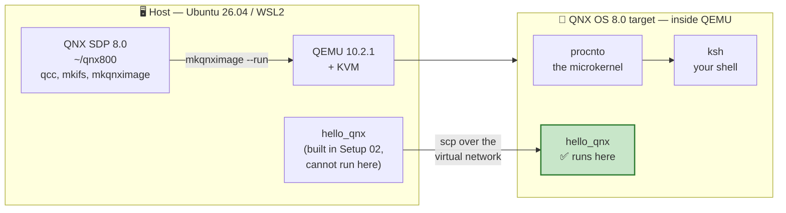
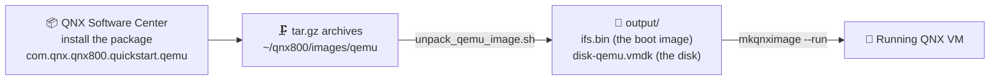

# 🖥️ Setup Guide 03 — Your First QNX VM on QEMU

> **What this guide gets you.** A running QNX OS 8.0 system on your own machine, a `#` prompt inside
> it, and — the moment that matters — **the binary you cross-compiled in Setup Guide 02 actually
> running.**
>
> ⭐ **This is the most important setup guide in the course.** Everything from Chapter 06 onwards
> assumes you can boot this VM.

> 📌 **`[UNVERIFIED]` markers.** Steps carrying this marker are written from QNX's official *QSTI for
> QEMU* documentation (read 2026-08-26) but have not yet been executed on your machine. As you run
> them, paste the output back and each marker is replaced with the real result — or corrected, if
> reality disagrees. *(ADR-024; verification block **V5** in the project's tracker.)*
>
> ⚠️ **Expect at least one thing here to be wrong.** Running Setup Guide 02 turned up three real
> errors in a guide that looked perfectly reasonable on paper. This guide involves networking,
> graphics and virtualization on a host newer than QNX documents — it is the most likely place in
> the whole course to diverge.

---

## Contents

1. [What you are about to build](#1-what-you-are-about-to-build)
2. [Before you start](#2-before-you-start)
3. [Two words you need: QSTI and mkqnximage](#3-two-words-you-need-qsti-and-mkqnximage)
4. [Step 1 — Install the QEMU Quick Start image](#4-step-1--install-the-qemu-quick-start-image-)
5. [Step 2 — Unpack the image](#5-step-2--unpack-the-image-)
6. [Step 3 — Understand the launch command before you run it](#6-step-3--understand-the-launch-command-before-you-run-it)
7. [Step 4 — Boot QNX](#7-step-4--boot-qnx-)
8. [Step 5 — First contact: look around](#8-step-5--first-contact-look-around-)
9. [Step 6 — Networking and SSH](#9-step-6--networking-and-ssh-)
10. [Step 7 — Run your binary 🎉](#10-step-7--run-your-binary-)
11. [Step 8 — Shut down cleanly](#11-step-8--shut-down-cleanly-)
12. [WSL2: the three things most likely to bite](#12-wsl2-the-three-things-most-likely-to-bite)
13. [Troubleshooting](#13-troubleshooting)
14. [What you now have](#14-what-you-now-have)
15. [Next step](#15-next-step)

---

## 1. What you are about to build



*Diagram: the SDP on your host launches a QEMU virtual machine running QNX; the binary you built in
Setup Guide 02 is copied across the virtual network and finally runs on the target.*

**The loop this closes.** At the end of Setup Guide 02 you built a program and your own computer
refused to run it:

```text
bash: ./hello_qnx: cannot execute: required file not found
```

That was correct behaviour — the binary needs `/usr/lib/ldqnx-64.so.2`, QNX's dynamic linker, which
does not exist on Linux. By the end of this guide that same binary prints `Hello from QNX!`.

---

## 2. Before you start

### 2.1 Requirements

| Requirement | Check | Where it came from |
|-------------|-------|--------------------|
| QNX SDP 8.0 installed | `ls ~/qnx800` | Setup Guide 02 |
| Licence deployed | `ls ~/.qnx/license/licenses` | Setup Guide 02 |
| QEMU installed | `qemu-system-x86_64 --version` | Setup Guide 01 |
| **KVM accessible** | `test -w /dev/kvm && echo ok` | Setup Guide 01 §8 |
| ~5 GB free disk | `df -h ~` | — |

Run the project's own check if you would rather not do it by hand:

```bash
host$ cd ~/exercises/qnx-zero-to-hero
host$ ./tools/check-environment.sh
```

Sections 1–6 must be green. If section 6 (QNX SDP) is not, go back to
[Setup Guide 02](Setup_02_QNX_Account_And_License.md).

### 2.2 One piece of good news about your host

QNX documents this workflow for **Ubuntu 22.04 and 24.04**, and tells users of those releases to
**build QEMU 10 from source** because their distributions ship something older.

You are on **Ubuntu 26.04 with QEMU 10.2.1 straight from `apt`**. You skip that entire ordeal — the
version QNX wants is already installed.

> 💡 **This is Risk R9 turning into an advantage.** Being ahead of the documented platform was
> logged as a project risk. For QEMU specifically it works in your favour.

### 2.3 Conventions

| Prompt | Means |
|--------|-------|
| `host$` | Your Ubuntu / WSL2 shell |
| `qnx#` | The shell **inside** the QNX VM (you are root there) |

---

## 3. Two words you need: QSTI and mkqnximage

Two names appear throughout this guide and QNX's documentation, and they are easy to confuse.

| Name | Full name | What it is |
|------|-----------|------------|
| **QSTI** | *Quick Start Target Image* | A **pre-built QNX system** — kernel, drivers, shell, utilities — packaged and ready to boot. You install it as a package through QNX Software Center. |
| **`mkqnximage`** | *make QNX image* | A **command-line tool** from the SDP that builds, configures, launches and stops QNX VM images. It is the launcher, not the image. |

**The relationship:** QSTI gives you the image; `mkqnximage` runs it.



*Diagram: the Software Center installs an archive, a script unpacks it into a boot image and a disk,
and `mkqnximage --run` boots them under QEMU.*

> 💡 **Why a pre-built image first (ADR-004).** You could build an image from scratch today. You
> should not. Booting somebody else's known-good system proves your *host* works. If you built your
> own image and it failed to boot, you would not know whether the fault was in the image, QEMU, KVM,
> or the SDP. Get a `#` prompt first, then take away the magic one layer at a time — **CTI** in
> Chapter 21, then raw **`mkifs`**.

---

## 4. Step 1 — Install the QEMU Quick Start image ⚠️

`[UNVERIFIED]`

The image is **not** part of the base SDP install. It is a separate package you add through QNX
Software Center — the same tool you used in Setup Guide 02.

**Package name:** `com.qnx.qnx800.quickstart.qemu`

### 4.1 Route A — Graphical

```bash
host$ ~/qnx/qnxsoftwarecenter/qnxsoftwarecenter &
```

1. Go to the **Available** tab.
2. Find **QNX SDP 8.0 QEMU Quick Start Image** (or search for `quickstart`).
3. Select it and click **Install**.

### 4.2 Route B — Command line

```bash
host$ cd ~/qnx/qnxsoftwarecenter
host$ ./qnxsoftwarecenter_clt -listAvailablePackages
```

Find the QEMU quick-start entry in the list, then install it:

```bash
host$ ./qnxsoftwarecenter_clt \
      -installBaseline com.qnx.qnx800.quickstart.qemu \
      -destination ~/qnx800
```

> 📋 **Please report the exact package name and version string** that `-listAvailablePackages`
> shows. That is also the **SDP build number** every chapter's front matter needs (project item
> T-202) — one command, two problems solved.

### 4.3 Verify the download arrived

```bash
host$ ls -lh ~/qnx800/images/qemu
```

✅ **Expected:** one or more archives named like
`qnx_sdp8.0_qemu_quickstart__xxxxxxxx_.tar.gz._xx`, plus a script called `unpack_qemu_image.sh`.

> 🐣 **Why is it split into `._00`, `._01`, … pieces?** Large files are chunked so that an
> interrupted download does not cost you the whole transfer. The unpack script stitches them back
> together. This is normal, not a sign something went wrong.

---

## 5. Step 2 — Unpack the image ⚠️

`[UNVERIFIED]`

```bash
host$ cd ~/qnx800/images/qemu
host$ ls unpack_qemu_image.sh
host$ chmod +x unpack_qemu_image.sh
host$ ./unpack_qemu_image.sh
```

✅ **Expected:** the archives are joined and extracted, producing an `output/` directory.

```bash
host$ ls -lh output/
```

✅ **Expected** — two files matter:

| File | What it is |
|------|-----------|
| `ifs.bin` | The **IFS — Image File System**. QNX's bootable image: the microkernel `procnto`, the startup code, drivers, and a small root filesystem, all in one file. QEMU loads this the way a PC loads a kernel. |
| `disk-qemu.vmdk` | A virtual hard disk holding the larger filesystem — utilities, libraries, your home directory. |

> 💡 **`ifs.bin` is the single most important file in QNX.** Chapter 21 is devoted to building your
> own with `mkifs`, and by then you will be able to say exactly what is inside this one. For now:
> it is the thing that boots.

> ⚠️ **Disk space.** Unpacking roughly doubles the space used, because the archives and the extracted
> image coexist. Once the VM boots successfully you can delete the `.tar.gz._xx` pieces — but not
> before.

---

## 6. Step 3 — Understand the launch command before you run it

You are about to type one short command that hides a very long one. Course rule #4 says nothing is a
black box, so here is what is underneath.

**What you will type:**

```bash
host$ mkqnximage --run
```

**What QNX's documentation says that actually starts:** a `qemu-system-x86_64` invocation configured
roughly like this —

| QEMU setting | Value | What it means |
|--------------|-------|---------------|
| Kernel | `output/ifs.bin` | Boot this QNX image directly, skipping a bootloader |
| Disk | `output/disk-qemu.vmdk`, IDE interface | The virtual hard disk. IDE because it is universally supported and needs no special driver |
| CPUs | `-smp 8` | 8 virtual cores (you have 16 logical) |
| RAM | `-m 4G` | 4 GB for the guest (you have 23 GB) |
| Network | `bridge,br=virbr0`, MAC `52:54:00:91:01:ea` | A **bridged** network via libvirt's `virbr0` bridge ⚠️ *see §12* |
| Display | `sdl,gl=on`, `vga none` | An SDL window with OpenGL acceleration ⚠️ *see §12* |
| Serial | `mon:stdio` | The QNX serial console appears **in the terminal you launched from** |
| Entropy | `virtio-rng-pci` | A random-number source for the guest |

> 💡 **`mon:stdio` is why `Ctrl+A` then `X` quits.** That flag multiplexes QEMU's *monitor* onto the
> same terminal as the guest's serial console. `Ctrl+A` is the escape prefix that says "the next key
> is for QEMU, not for QNX". You met this in Setup Guide 01 §9.2.

### 6.1 Defaults you may need to change

| Want | Option | Note |
|------|--------|------|
| More/fewer cores | `-smp N` | Default 8 |
| More RAM | `-m 16G` | ⚠️ QNX warns that **above 16 GB may cause unexpected behaviour** |
| A specific resolution | `xres=1920,yres=1080` on the GPU device | Default is `1280 x 768 @ 60` |
| Fix a graphics failure on a big-RAM host | `host-phys-bits-limit=39` (Intel) or `40` (AMD) | Needed on hosts with **more than 32 GB RAM**. You have 23 GB, so you should not need it. |

---

## 7. Step 4 — Boot QNX ⚠️

`[UNVERIFIED]`

Every terminal needs the SDP environment before `mkqnximage` exists. If you added the line to
`~/.bashrc` in Setup Guide 02 §10.5, this is already done for you:

```bash
host$ echo $QNX_HOST
```

If that prints nothing:

```bash
host$ source ~/qnx800/qnxsdp-env.sh
```

Now boot:

```bash
host$ cd ~/qnx800/images/qemu
host$ mkqnximage --run
```

✅ **Expected:** the terminal fills with boot messages, an SDL window may open, and after a few
seconds you reach a login prompt.

### 7.1 Log in

| | |
|---|---|
| **Username** | `root` |
| **Password** | `root` |

```text
QNX Neutrino (localhost) (ttyp0)

login: root
Password:
#
```

> 🎉 **That `#` is the milestone.** You are looking at a shell running on a real QNX microkernel
> system. Milestone **M2 — "It boots"**.

> ⚠️ **`root`/`root` is fine here and nowhere else.** This is a disposable development VM on a
> private virtual network. Chapter 28 covers QNX security properly; for now, never reuse this
> pattern on anything that leaves your machine.

> 📋 **Please paste the whole boot log.** It is the single most useful thing you can send back: it
> names the drivers that start, the memory layout, and the exact QNX build. Chapters 09 and 21 will
> dissect it line by line.

### 7.2 A shortcut, once the long way works

The repository ships a thin wrapper that remembers the image directory, loads the SDP environment if
you forgot, and fails with a useful message instead of `command not found`:

```bash
host$ ~/exercises/qnx-zero-to-hero/tools/qemu/qnx-vm.sh status
host$ ~/exercises/qnx-zero-to-hero/tools/qemu/qnx-vm.sh run
host$ ~/exercises/qnx-zero-to-hero/tools/qemu/qnx-vm.sh ip
host$ ~/exercises/qnx-zero-to-hero/tools/qemu/qnx-vm.sh ssh
host$ ~/exercises/qnx-zero-to-hero/tools/qemu/qnx-vm.sh stop
```

> ⚠️ **Use the real commands first.** The wrapper does nothing `mkqnximage` cannot; it only saves
> typing. Course rule #4 — nothing is a black box — means you should see the underlying command work
> before you hide it behind a convenience. Read the script; it is short and commented.

---

## 8. Step 5 — First contact: look around ⚠️

`[UNVERIFIED]`

Five commands. Type them in the VM, at the `qnx#` prompt.

### 8.1 What am I running?

```bash
qnx# uname -a
```

✅ **Expected:** something like `QNX localhost 8.0.0 <build> x86_64`.

### 8.2 What is running? — `pidin`

```bash
qnx# pidin
```

**`pidin`** — *process information* — is QNX's `ps`, and you will use it constantly. Expect to see
`procnto` as process 1, plus drivers and services.

> 🐧 **In Linux this would be…** `ps aux`. But `pidin` shows something `ps` cannot: each thread's
> **blocking state** — `REPLY`, `RECEIVE`, `SEND`, `NANOSLEEP`. From Chapter 13 onwards that column
> is how you debug message passing, and it is the reason `pidin` has no real Linux equivalent.

### 8.3 The proof that this is a microkernel

```bash
qnx# pidin | head -20
```

> 💡 **Look at what is a *process* here.** On Linux, filesystem and network drivers live *inside*
> the kernel. On QNX they are ordinary user-space processes sitting in that list. That is the
> microkernel bet in one screenful: a driver crash kills a process, not the machine. Chapter 09
> takes this apart properly.

### 8.4 The pathname space

```bash
qnx# ls /
qnx# ls /proc
qnx# ls /dev
```

> 💡 **`/proc/boot` is worth a look.** It contains the files that came out of `ifs.bin` — the image
> you booted, visible as a filesystem. Chapter 16 explains why *everything* in QNX is a path.

### 8.5 How much memory?

```bash
qnx# pidin info
```

Shows the QNX version, boot time and free memory.

---

## 9. Step 6 — Networking and SSH ⚠️

`[UNVERIFIED]`

The serial console works, but it is a single terminal with no scrollback worth having. SSH is how you
will actually work.

### 9.1 Find the VM's IP address

Inside the VM:

```bash
qnx# ifconfig
```

Or, from **another host terminal** (leave the VM running):

```bash
host$ cd ~/qnx800/images/qemu
host$ mkqnximage --getip
```

### 9.2 SSH in

```bash
host$ ssh root@<the-ip-address>
```

Password: `root`.

> ⚠️ **If the IP is missing or unreachable, do not fight it here** — go to
> [§12.1](#121-networking-the-virbr0-bridge). Bridged networking is the single most likely thing to
> fail on a WSL2 host, and it has a specific cause and fix.

---

## 10. Step 7 — Run your binary 🎉 ⚠️

`[UNVERIFIED]`

This is the payoff. Rebuild the program from Setup Guide 02 and run it **on QNX**.

### 10.1 Build it again on the host

```bash
host$ cd /tmp
host$ printf '#include <stdio.h>\n#include <unistd.h>\nint main(void){printf("Hello from QNX!\\n");printf("My process ID is %%d\\n",getpid());return 0;}\n' > hello_qnx.c
host$ qcc -Vgcc_ntox86_64 -o hello_qnx hello_qnx.c
host$ ./hello_qnx
```

✅ **Expected:** it still fails on Linux — `cannot execute: required file not found`. Good.

### 10.2 Copy it to the target

```bash
host$ scp hello_qnx root@<the-ip-address>:/tmp/
```

### 10.3 Run it

```bash
qnx# cd /tmp
qnx# chmod +x hello_qnx
qnx# ./hello_qnx
```

✅ **Expected output:**

```text
Hello from QNX!
My process ID is 12345
```

> 🎉 **Stop and appreciate this.** You wrote C on Linux, compiled it with a cross-compiler into a
> binary your own machine physically cannot execute, moved it across a virtual network into a
> different operating system, and ran it there. That is the complete embedded development loop —
> **edit → cross-compile → deploy → run** — and every lab in this course is a variation on it.
>
> The one piece still missing is **debugging** across that boundary, which is Chapter 08:
> `qconn` on the target, `ntox86_64-gdb` on the host, breakpoints in your editor.

> 📋 **Please paste the output**, including the PID. If this works, the entire toolchain is proven
> end to end and the course can move to writing chapters.

---

## 11. Step 8 — Shut down cleanly ⚠️

`[UNVERIFIED]`

Two ways:

| Method | How | When |
|--------|-----|------|
| From the console | `Ctrl+A`, release, then `X` | You are sitting at the serial console |
| From another terminal | `host$ mkqnximage --stop` *(run from the same image directory)* | The console is busy, or the VM is unresponsive |

> 🐣 **`Ctrl+A` then `X` explained.** Press and hold `Ctrl`, tap `A`, release both, then tap `X`. It
> is not a three-key chord. This talks to **QEMU**, not to QNX — which is why it works even when the
> guest is wedged.

---

## 12. WSL2: the three things most likely to bite

QNX documents this workflow on desktop Ubuntu with a real display and a normal init system. WSL2 is
neither. These three are predicted problems, not observed ones — but they are where I would bet the
trouble is.

### 12.1 Networking: the `virbr0` bridge

**The problem.** The default launch uses `bridge,br=virbr0`. That bridge is created by **libvirt**,
which runs as a **systemd** service. WSL2 does not enable systemd by default, so `libvirtd` may never
start and `virbr0` may not exist. QEMU then fails to attach a network, and the VM boots with no IP.

**Check:**

```bash
host$ ip link show virbr0
host$ systemctl is-active libvirtd
```

**If `virbr0` is missing, in order of preference:**

1. **Enable systemd in WSL2** (the clean fix). Edit `/etc/wsl.conf`:

   ```ini
   [boot]
   systemd=true
   ```

   Then from **Windows PowerShell**: `wsl --shutdown`, and reopen your terminal. Confirm with
   `systemctl is-active libvirtd`; start it with `sudo systemctl enable --now libvirtd` if needed.

2. **Start libvirt's default network by hand:**

   ```bash
   host$ sudo virsh net-start default
   host$ sudo virsh net-autostart default
   ```

3. **Fall back to user-mode networking.** QEMU's built-in NAT needs no bridge and no privileges. You
   saw it working already in Setup Guide 01 §9.2 — that is where `10.0.2.15` came from. It costs you
   inbound connections unless you forward ports:

   ```text
   -netdev user,id=net0,hostfwd=tcp::2222-:22,hostfwd=tcp::8000-:8000
   -device virtio-net-pci,netdev=net0
   ```

   You would then reach the VM at `ssh -p 2222 root@localhost`. Port **8000** matters later: it is
   `qconn`, the remote-debug agent used in Chapter 08.

> 📋 **This is the single most valuable thing to report back.** Whichever route works becomes the
> documented one, and the others become the troubleshooting section.

### 12.2 Graphics: `sdl,gl=on`

**The problem.** The default display is an SDL window with OpenGL. Under **WSLg** that may work, may
fall back to software rendering, or may fail outright.

**It does not matter for this course.** Every lab is text — shell, `pidin`, `gdb`, message passing.
The serial console on `mon:stdio` is all you need. If the graphical window misbehaves, ignore it and
work in the terminal.

QNX's own troubleshooting page notes a related desktop-Linux issue: under **Wayland**, the QEMU
window swallows keystrokes, especially `ALT`. Their fix is to switch the session to X11. On WSL2 the
equivalent lever is WSLg's own display mode.

### 12.3 Host RAM and the graphics driver

QNX documents that on hosts with **more than 32 GB of RAM**, the QNX graphics subsystem (*Screen*)
can fail to start, because of how PCI memory is emulated. The fix is to cap the CPU's reported
physical address bits:

```text
host-phys-bits-limit=39    (Intel)
host-phys-bits-limit=40    (AMD)
```

**Your host has 23 GB, so this should not apply.** It is here because it is a genuinely obscure
failure with a non-obvious fix, and because a future reader may have a 64 GB machine.

---

## 13. Troubleshooting

### 13.1 `mkqnximage: command not found`

The SDP environment is not loaded in this terminal.

```bash
host$ source ~/qnx800/qnxsdp-env.sh
host$ echo $QNX_HOST
```

To make it permanent, see [Setup Guide 02 §10.5](Setup_02_QNX_Account_And_License.md#105-make-it-automatic-recommended).

### 13.2 No QEMU quick-start package appears in the Software Center

The same cause as the classic Setup Guide 02 failure: the licence was requested and accepted but
never **deployed**. Go to the myQNX License Manager and check.
See [Setup Guide 02 §13.1](Setup_02_QNX_Account_And_License.md#131-no-products-available-in-qnx-software-center).

### 13.3 `Could not access KVM kernel module` / the VM is glacially slow

KVM is not available to your user. Setup Guide 01 §8 fixes it:

```bash
host$ sudo usermod -aG kvm $USER
```

then `wsl --shutdown` from Windows PowerShell. Without KVM the VM still runs — 10–50× slower.

### 13.4 The VM boots but has no IP address

See [§12.1](#121-networking-the-virbr0-bridge). Almost certainly the `virbr0` bridge.

### 13.5 The VM has an IP but cannot reach the internet

QNX's documented cause is a **bridge subnet clash**. Their fix is to move the bridge to the
`192.168.122.x` range using `virt-manager`, then update netplan for the new subnet and relaunch.

Verify from inside the VM:

```bash
qnx# curl https://www.google.com
```

> 💡 **You do not need internet access in the VM for this course.** The labs cross-compile on the
> host and copy binaries across. Internet in the guest only matters if you want to install extra
> packages with `apk`.

### 13.6 The QEMU window ignores keystrokes

The Wayland issue from §12.2. Use the serial console in your terminal instead — everything in this
course works there.

### 13.7 `Ctrl+A X` does nothing

You may be in the graphical window rather than the terminal. Click on the **terminal you launched
from**, then try again. Or from a second terminal:

```bash
host$ cd ~/qnx800/images/qemu
host$ mkqnximage --stop
```

### 13.8 Something else broke

Send it: the exact command, the complete output, and what you expected. It becomes a permanent
`D-NNN` entry with a full answer, and this section grows.

The official QNX troubleshooting page is
[here](https://www.qnx.com/developers/docs/qnxeverywhere/com.qnx.doc.target_images/topic/qsti_qemu/troubleshooting.html).

---

## 14. What you now have

```text
~/qnx800/
├── host/linux/x86_64/          ← host tools: qcc, mkifs, mkqnximage
├── target/qnx/                 ← headers and libraries for QNX
└── images/qemu/                ← NEW
    ├── unpack_qemu_image.sh
    ├── qnx_sdp8.0_qemu_quickstart__*.tar.gz._*   ← deletable once booting works
    └── output/
        ├── ifs.bin             ← the bootable QNX image  (Chapter 21 builds one)
        └── disk-qemu.vmdk      ← the virtual hard disk
```

### ✅ Completion checklist

- [ ] QEMU quick-start package installed through QNX Software Center
- [ ] `unpack_qemu_image.sh` produced `output/ifs.bin` and `output/disk-qemu.vmdk`
- [ ] `mkqnximage --run` boots to a login prompt
- [ ] Logged in as `root` / `root` and reached a `#` prompt
- [ ] `pidin` lists processes, including `procnto`
- [ ] The VM has an IP address
- [ ] `ssh root@<ip>` works
- [ ] **`hello_qnx` copied across and printed `Hello from QNX!`** 🎉
- [ ] `Ctrl+A X` (or `mkqnximage --stop`) shuts it down cleanly

---

## 15. Next step

You now have a complete QNX development environment: a toolchain that builds QNX binaries, a target
that runs them, and a network between them.

| | |
|---|---|
| 📕 **[Chapter 00 — How To Use This Course](../chapters/Chapter00_HowToUseThisCourse.md)** | Conventions, symbols, how the labs work, how to choose your path |
| 📕 **Chapter 07 — First Contact: The QNX Shell** | Turns §8's five commands into real fluency |
| 📕 **Chapter 08 — The Toolchain & Deployment** ⭐ | Makes §10's copy-and-run loop into a proper workflow, with remote `gdb` over `qconn` |
| 🛠️ **Setup Guide 04 — IDE & Tooling** | VS Code + QNX Toolkit, so you stop typing `scp` by hand |

---

## 📎 Reference summary

| What | Value |
|------|-------|
| QSTI package | `com.qnx.qnx800.quickstart.qemu` |
| Image location | `~/qnx800/images/qemu` |
| Unpack script | `./unpack_qemu_image.sh` |
| Boot image | `output/ifs.bin` |
| Virtual disk | `output/disk-qemu.vmdk` |
| Launch | `mkqnximage --run` |
| Find the IP | `mkqnximage --getip` |
| Stop | `mkqnximage --stop`, or `Ctrl+A` then `X` |
| Credentials | `root` / `root` |
| Defaults | 8 CPUs · 4 GB RAM · 1280×768 @ 60 |
| RAM ceiling | ⚠️ above **16 GB** may misbehave |
| Official guide | [QSTI for QEMU](https://www.qnx.com/developers/docs/qnxeverywhere/com.qnx.doc.target_images/topic/qsti_qemu/about.html) |

---

## 📝 Changelog

| Version | Date | Change |
|---------|------|--------|
| 1.0 | 2026-08-26 | Created from QNX's official *QSTI for QEMU* documentation (read 2026-08-26). Documents the QSTI → `unpack_qemu_image.sh` → `mkqnximage --run` flow, the underlying QEMU configuration, first-contact commands, SSH, the cross-compile-and-run payoff, and three predicted WSL2 failure modes. All steps `[UNVERIFIED]` pending block V5. |
