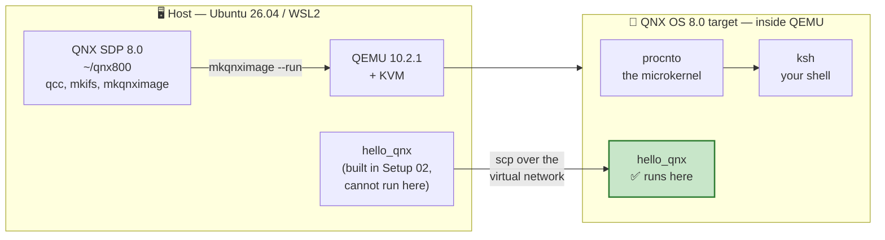
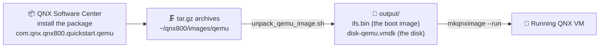

# 🖥️ Setup Guide 03 — Your First QNX VM on QEMU

> **What this guide gets you.** A running QNX OS 8.0 system on your own machine, a `#` prompt inside
> it, and — the moment that matters — **the binary you cross-compiled in Setup Guide 02 actually
> running.**
>
> ⭐ **This is the most important setup guide in the course.** Everything from Chapter 06 onwards
> assumes you can boot this VM.

> 📌 **`[UNVERIFIED]` markers.** Steps carrying this marker are written from QNX's official *QSTI for
> QEMU* documentation (read 2026-08-26) but have not yet been executed on your machine. As you run
> them, paste the output back and each marker is replaced with the real result — or corrected, if
> reality disagrees. *(ADR-024; verification block **V5** in the project's tracker.)*
>
> ✅ **Verified end to end.** Every step in this guide has been executed on **Ubuntu 26.04 LTS under
> WSL2** against **QNX 8.0.0** (kernel build `2026/02/27-11:02:56EST`), ending with a
> cross-compiled binary running on the target. All output shown is real.
>
> ⚠️ **It cost five bugs to get here**, every one of which looked perfectly reasonable on paper:
> the nested `qemu/` directory ([D-006](../meta/Doubts.md#d-006)), a QNX Software Center option that
> does not exist ([D-007](../meta/Doubts.md#d-007)), an undocumented 47 GB disk image
> ([D-008](../meta/Doubts.md#d-008)), `sshd` refusing root ([D-009](../meta/Doubts.md#d-009)), and
> four boot warnings that look like failures and are not
> ([D-010](../meta/Doubts.md#d-010)). Two predictions in §12 turned out to be **wrong in your
> favour** — the `virbr0` bridge worked, and Ubuntu 26.04 needed no QEMU build from source.

---

## Contents

1. [What you are about to build](#1-what-you-are-about-to-build)
2. [Before you start](#2-before-you-start)
3. [Two words you need: QSTI and mkqnximage](#3-two-words-you-need-qsti-and-mkqnximage)
4. [Step 1 — Install the QEMU Quick Start image](#4-step-1--install-the-qemu-quick-start-image-)
5. [Step 2 — Unpack the image](#5-step-2--unpack-the-image-)
6. [Step 3 — Understand the launch command before you run it](#6-step-3--understand-the-launch-command-before-you-run-it)
7. [Step 4 — Boot QNX](#7-step-4--boot-qnx-)
8. [Step 5 — First contact: look around](#8-step-5--first-contact-look-around-)
9. [Step 6 — Networking and SSH](#9-step-6--networking-and-ssh-)
10. [Step 7 — Run your binary 🎉](#10-step-7--run-your-binary-)
11. [Step 8 — Shut down cleanly](#11-step-8--shut-down-cleanly-)
12. [WSL2: the three things most likely to bite](#12-wsl2-the-three-things-most-likely-to-bite)
13. [Troubleshooting](#13-troubleshooting)
14. [What you now have](#14-what-you-now-have)
15. [Next step](#15-next-step)

---

## 1. What you are about to build



*Diagram: the SDP on your host launches a QEMU virtual machine running QNX; the binary you built in
Setup Guide 02 is copied across the virtual network and finally runs on the target.*

**The loop this closes.** At the end of Setup Guide 02 you built a program and your own computer
refused to run it:

```text
bash: ./hello_qnx: cannot execute: required file not found
```

That was correct behaviour — the binary needs `/usr/lib/ldqnx-64.so.2`, QNX's dynamic linker, which
does not exist on Linux. By the end of this guide that same binary prints `Hello from QNX!`.

---

## 2. Before you start

### 2.1 Requirements

| Requirement | Check | Where it came from |
|-------------|-------|--------------------|
| QNX SDP 8.0 installed | `ls ~/qnx800` | Setup Guide 02 |
| Licence deployed | `ls ~/.qnx/license/licenses` | Setup Guide 02 |
| QEMU installed | `qemu-system-x86_64 --version` | Setup Guide 01 |
| **KVM accessible** | `test -w /dev/kvm && echo ok` | Setup Guide 01 §8 |
| ~5 GB free disk | `df -h ~` | — |

Run the project's own check if you would rather not do it by hand:

```bash
host$ cd ~/exercises/qnx-zero-to-hero
host$ ./tools/check-environment.sh
```

Sections 1–6 must be green. If section 6 (QNX SDP) is not, go back to
[Setup Guide 02](Setup_02_QNX_Account_And_License.md).

### 2.2 One piece of good news about your host

QNX documents this workflow for **Ubuntu 22.04 and 24.04**, and tells users of those releases to
**build QEMU 10 from source** because their distributions ship something older.

You are on **Ubuntu 26.04 with QEMU 10.2.1 straight from `apt`**. You skip that entire ordeal — the
version QNX wants is already installed.

> 💡 **This is Risk R9 turning into an advantage.** Being ahead of the documented platform was
> logged as a project risk. For QEMU specifically it works in your favour.

### 2.3 Conventions

| Prompt | Means |
|--------|-------|
| `host$` | Your Ubuntu / WSL2 shell |
| `qnx#` | The shell **inside** the QNX VM (you are root there) |

---

## 3. Two words you need: QSTI and mkqnximage

Two names appear throughout this guide and QNX's documentation, and they are easy to confuse.

| Name | Full name | What it is |
|------|-----------|------------|
| **QSTI** | *Quick Start Target Image* | A **pre-built QNX system** — kernel, drivers, shell, utilities — packaged and ready to boot. You install it as a package through QNX Software Center. |
| **`mkqnximage`** | *make QNX image* | A **command-line tool** from the SDP that builds, configures, launches and stops QNX VM images. It is the launcher, not the image. |

**The relationship:** QSTI gives you the image; `mkqnximage` runs it.



*Diagram: the Software Center installs an archive, a script unpacks it into a boot image and a disk,
and `mkqnximage --run` boots them under QEMU.*

> 💡 **Why a pre-built image first (ADR-004).** You could build an image from scratch today. You
> should not. Booting somebody else's known-good system proves your *host* works. If you built your
> own image and it failed to boot, you would not know whether the fault was in the image, QEMU, KVM,
> or the SDP. Get a `#` prompt first, then take away the magic one layer at a time — **CTI** in
> Chapter 21, then raw **`mkifs`**.

---

## 4. Step 1 — Install the QEMU Quick Start image ✅

> ✅ **Verified 2026-08-26.**

The image is **not** part of the base SDP install. It is a separate package you add through QNX
Software Center — the same tool you used in Setup Guide 02.

**Package name:** `com.qnx.qnx800.quickstart.qemu`

### 4.1 Route A — Graphical

```bash
host$ ~/qnx/qnxsoftwarecenter/qnxsoftwarecenter &
```

1. Go to the **Available** tab.
2. Find **QNX SDP 8.0 QEMU Quick Start Image** (or search for `quickstart`).
3. Select it and click **Install**.

### 4.2 Route B — Command line

```bash
host$ cd ~/qnx/qnxsoftwarecenter
host$ ./qnxsoftwarecenter_clt -listAccessible
```

> ⚠️ **There is no `-listAvailablePackages` option.** Earlier drafts of this course used that name;
> it does not exist and the tool answers `Error: Unknown argument`. The real listing options are:
>
> | Option | Lists |
> |--------|-------|
> | `-list` | Every package, accessible or not |
> | `-listAccessible` | Packages your licence entitles you to |
> | `-listQuery <query>` | Packages matching a query |
> | `-listInstalled` | What is already installed |
> | `-listInstalledRoots` | Installed top-level packages only |
> | `-listUpdates` | Available updates |
>
> `./qnxsoftwarecenter_clt -help` prints the authoritative list. *(Verified 2026-08-26 against QNX
> Software Center CLT `2.0.4:v202501021438`.)*

Then install it — note **`-installPackage`** for a single package; `-installBaseline` is for a whole
SDP baseline:

```bash
host$ ./qnxsoftwarecenter_clt \
      -installPackage com.qnx.qnx800.quickstart.qemu \
      -destination ~/qnx800
```

> 💡 **You may already have it.** If you installed SDP 8.0 with its default package selection, the
> QEMU quick-start image came along with it. Check `~/qnx800/images/qemu` before downloading
> anything — that is exactly what happened on the verified run.

### 4.3 Verify the download arrived

```bash
host$ ls -lh ~/qnx800/images/qemu
```

✅ **Expected output** — real listing from a verified run:

```text
total 1.9G
-rw-r--r-- 1 user user   394 Aug 26 00:07 README.md
-rw-r--r-- 1 user user 1000M Aug 26 00:08 qnx_sdp8.0_qemu_quickstart_20260606.tar.gz.0
-rw-r--r-- 1 user user  903M Aug 26 00:07 qnx_sdp8.0_qemu_quickstart_20260606.tar.gz.1
-rwxr-xr-x 1 user user   127 Aug 26 00:07 unpack_qemu_image.sh
```

> 🐣 **Why is it split into `.0` and `.1`?** Large files are chunked so that an interrupted download
> does not cost you the whole transfer. `unpack_qemu_image.sh` — all 127 bytes of it — concatenates
> the pieces and pipes them into `tar`. Read it; it is a two-line script and there is nothing magic
> in it.
>
> 💡 **`20260606` is a date stamp: 6 June 2026.** That is the image build, and it is worth recording
> in your notes — a future QNX image with a different stamp may behave differently.

**Read the README while you are here:**

```bash
host$ cat ~/qnx800/images/qemu/README.md
```

---

## 5. Step 2 — Unpack the image ✅

> ✅ **Verified 2026-08-26.**

```bash
host$ cd ~/qnx800/images/qemu
host$ ls unpack_qemu_image.sh
host$ chmod +x unpack_qemu_image.sh
host$ ./unpack_qemu_image.sh
```

✅ **Expected:** a long list of extracted paths scrolls past, all beginning `qemu/`.

> ⚠️ **The script extracts into a `qemu/` SUBDIRECTORY, not into the current directory.** This is
> the single most confusing thing in this guide, and it is what breaks the next step if you miss it.
> After unpacking you have:
>
> ```text
> ~/qnx800/images/qemu/          ← where you ran the script
> ├── README.md
> ├── unpack_qemu_image.sh
> ├── qnx_sdp8.0_qemu_quickstart_20260606.tar.gz.0
> ├── qnx_sdp8.0_qemu_quickstart_20260606.tar.gz.1
> └── qemu/                      ← ✅ THE IMAGE DIRECTORY — everything below lives here
>     ├── local/                 ← configuration: options, snippets, keys
>     └── output/                ← the built image
> ```
>
> So the path you want is **`~/qnx800/images/qemu/qemu`** — yes, `qemu` twice. Everything from §7
> onwards runs from there.

```bash
host$ ls -lh qemu/output/
```

✅ **Expected output** — real listing from a verified run:

```text
total 47G
drwxr-xr-x 2 user user 4.0K Jun  6 20:30 build
-rw-r--r-- 1 user user  275 Jun  6 20:30 di.params
-rw-r--r-- 1 user user  47G Jun  6 20:31 disk-qemu
-rw-r--r-- 1 user user  171 Jun  6 20:31 disk-qemu.vmdk
-rw-r--r-- 1 user user    0 Jun  6 20:30 diskimage.out
-rw-r--r-- 1 user user  20M Jun  6 20:30 ifs.bin
drwxr-xr-x 2 user user 4.0K Jun  6 20:29 inc
drwxr-xr-x 2 user user 4.0K Jun  6 20:29 option_files
-rw-r--r-- 1 user user 2.8K Jun  6 20:28 options
-rwxr-xr-x 1 user user  12M Jun  6 20:30 procnto-smp-instr.sym
```

> ⚠️ **`disk-qemu` is 47 GB.** Check your free space before and after:
>
> ```bash
> host$ df -h ~
> ```
>
> ✅ **Measured 2026-08-26: it is *not* sparse.** `du -sh ~/qnx800/*` reports **53 GB** for `images/`,
> which is essentially the full apparent size. **Plan for the space.**
>
> The whole SDP directory measures **79 GB**, of which this image is the largest single item
> ([D-008](../meta/Doubts.md#d-008)). Do not copy this file around casually.

✅ **The files that matter:**

| File | What it is |
|------|-----------|
| `ifs.bin` | **20 MB.** The **IFS — Image File System**. QNX's bootable image: the microkernel `procnto`, the startup code, drivers, and a small root filesystem, all in one file. QEMU loads this the way a PC loads a kernel. |
| `disk-qemu` / `disk-qemu.vmdk` | The virtual hard disk holding the larger filesystem. The `.vmdk` is a tiny 171-byte *descriptor* pointing at the 47 GB raw `disk-qemu`. |
| `procnto-smp-instr.sym` | **12 MB of debug symbols for the kernel itself.** The name tells you which kernel this image runs: **SMP** (multi-core) and **instrumented** — the variant that supports kernel event tracing. That is what makes Chapter 26's System Analysis Toolkit work. |
| `build/` | ⭐ The **`mkifs` build files** that produced this image: `ifs.build`, `system.build`, `disk.layout`, `startup.sh`. **This is Chapter 21's source material**, sitting on your disk right now. |
| `option_files/`, `local/snippets/` | The feature switches that composed the image — `opt_valgrind`, `opt_secpol`, `opt_python`, `opt_graphics`, and dozens more. This is the CTI (Custom Target Image) machinery ADR-004 promises for Chapter 21. |

> 💡 **Take one look inside `build/` now, even though it will mean little yet.**
>
> ```bash
> host$ ls qemu/output/build/
> ```
>
> Those files are the complete recipe for the system you are about to boot. In Chapter 21 you will
> write one yourself. Knowing they exist — and that this image was built the same way yours will
> be — is the point.

> 💡 **`ifs.bin` is the single most important file in QNX.** Chapter 21 is devoted to building your
> own with `mkifs`, and by then you will be able to say exactly what is inside this one. For now:
> it is the thing that boots.

> ⚠️ **Disk space.** Unpacking roughly doubles the space used, because the archives and the extracted
> image coexist. Once the VM boots successfully you can delete the `.tar.gz._xx` pieces — but not
> before.

---

## 6. Step 3 — Understand the launch command before you run it

You are about to type one short command that hides a very long one. Course rule #4 says nothing is a
black box, so here is what is underneath.

**What you will type:**

```bash
host$ mkqnximage --run
```

**What QNX's documentation says that actually starts:** a `qemu-system-x86_64` invocation configured
roughly like this —

| QEMU setting | Value | What it means |
|--------------|-------|---------------|
| Kernel | `output/ifs.bin` | Boot this QNX image directly, skipping a bootloader |
| Disk | `output/disk-qemu.vmdk`, IDE interface | The virtual hard disk. IDE because it is universally supported and needs no special driver |
| CPUs | `-smp 8` | 8 virtual cores (you have 16 logical) |
| RAM | `-m 4G` | 4 GB for the guest (you have 23 GB) |
| Network | `bridge,br=virbr0`, MAC `52:54:00:91:01:ea` | A **bridged** network via libvirt's `virbr0` bridge ⚠️ *see §12* |
| Display | `sdl,gl=on`, `vga none` | An SDL window with OpenGL acceleration ⚠️ *see §12* |
| Serial | `mon:stdio` | The QNX serial console appears **in the terminal you launched from** |
| Entropy | `virtio-rng-pci` | A random-number source for the guest |

> 💡 **`mon:stdio` is why `Ctrl+A` then `X` quits.** That flag multiplexes QEMU's *monitor* onto the
> same terminal as the guest's serial console. `Ctrl+A` is the escape prefix that says "the next key
> is for QEMU, not for QNX". You met this in Setup Guide 01 §9.2.

### 6.1 Defaults you may need to change

| Want | Option | Note |
|------|--------|------|
| More/fewer cores | `-smp N` | Default 8 |
| More RAM | `-m 16G` | ⚠️ QNX warns that **above 16 GB may cause unexpected behaviour** |
| A specific resolution | `xres=1920,yres=1080` on the GPU device | Default is `1280 x 768 @ 60` |
| Fix a graphics failure on a big-RAM host | `host-phys-bits-limit=39` (Intel) or `40` (AMD) | Needed on hosts with **more than 32 GB RAM**. You have 23 GB, so you should not need it. |

---

## 7. Step 4 — Boot QNX ✅

> ✅ **Verified 2026-08-26** — this is where milestone **M2 "It boots"** is reached.

Every terminal needs the SDP environment before `mkqnximage` exists. If you added the line to
`~/.bashrc` in Setup Guide 02 §10.5, this is already done for you:

```bash
host$ echo $QNX_HOST
```

If that prints nothing:

```bash
host$ source ~/qnx800/qnxsdp-env.sh
```

Now boot — **from the inner `qemu/` directory**:

```bash
host$ cd ~/qnx800/images/qemu/qemu
host$ ls
```

✅ You must see `local` and `output` here. If you do not, you are in the wrong directory — go back
to §5.

```bash
host$ mkqnximage --run
```

> ⚠️ **If you see this, you are one directory too high:**
>
> ```text
> The current directory is neither that of an existing mkqnximage virtual image nor is it
> an empty directory. This might be OK but as creating virtual images in random locations
> is often not what is intended, you have to include the --force option to enable it.
> ```
>
> 🚨 **Do NOT add `--force`, even though the message suggests it.** `mkqnximage` identifies an image
> directory by the presence of `local/` and `output/`. From `~/qnx800/images/qemu` it sees neither —
> only archives and a script — so it assumes you want to **create a brand-new image here**.
> `--force` would grant that request: it would start building a fresh image in the wrong place,
> ignoring the 47 GB one you just unpacked.
>
> **The fix is `cd qemu`, not `--force`.**
>
> 💡 **A general lesson worth carrying.** An error message tells you what the program *believes*,
> and offers the escape hatch for the case where the program is wrong. Here the program is right
> and you are in the wrong directory. Reach for the suggested flag only once you understand why the
> tool objected.

✅ **Expected:** the terminal fills with boot messages, an SDL window may open, and after a few
seconds you reach a login prompt.

✅ **Real boot output**, abridged — this is what a healthy boot looks like:

```text
SeaBIOS (version 1.17.0-debian-1.17.0-1ubuntu1)
iPXE (https://ipxe.org) 00:02.0 ...
Booting from ROM..
non UEFI or UEFI+CSM boot
ACPI table not found (0x4746434d)
overriding mask for controller 2, vector_base 0
Startup complete
Unable to start "uname" (2)
slog2_api: cannot connect to slogger2 server...errno=No such file or directory
qh: slogger2 does not appear to be running.  Registration will be attempted when it is running.
slm: [COMMAND] startup 'all'
slm: Component 'slog2': Mark active
slm: Component 'pci-server': Mark active
slm: Component 'devb': Mark active
slm: Component 'io-sock': Mark active
slm: Component 'ssh': Mark active
slm: Component 'qconn': Mark active
   ... 22 components in all ...
slm: [START] Component 'slog2'
slm: Component 'slog2': Spawned process with pid 20483
Path=0 - Intel 82371SB
 target=0 lun=0     Direct-Access(0) -          QEMU HARDDISK    Rev: 2.5+
---> Mounting file systems
---> Starting io-hid
rm: /etc/ca-certificates/extracted: No such file or directory
---> Starting Screen...
---> Starting Window Manager...
---> Starting sensor framework...

To exit QEMU, type <ctrl>a x

Generating VNC server password file
Process count:31
---> Starting Demolauncher...
---> Configuring PAM
login:
```

> ⚠️ **Four alarming-looking lines that are all harmless.** Do not chase these.
>
> | Message | Why it is fine |
> |---------|----------------|
> | `ACPI table not found` | QEMU's minimal firmware does not present the ACPI table QNX looks for. QNX falls back to other discovery and carries on. |
> | `Unable to start "uname" (2)` | Error 2 is `ENOENT`. A startup script called `uname` before the disk holding it was mounted. Cosmetic — `uname` works fine once you are logged in (§8.1). |
> | `slog2_api: cannot connect to slogger2 server` | The system logger had not started **yet**. Note the very next line: *"Registration will be attempted when it is running."* This is a startup-ordering artefact, not a failure. |
> | `rm: /etc/ca-certificates/extracted: No such file...` | A cleanup script removing something that was not there on a first boot. |
>
> 💡 **A useful habit.** On an unfamiliar embedded system, early-boot errors about services that
> start *later* are almost always ordering noise. The ones worth chasing appear **after** the
> subsystem in question has started.

> 💡 **Read the `slm:` lines — that is the whole system being assembled.** **`slm`** is QNX's
> *System Launch and Monitor*: the process that starts everything else and can restart it if it
> dies. Its 22 components on this image are, in order: `slog2`, `pci-server`, `pci-server-patchup`,
> `devb`, `root-fs`, `random`, `fsevmgr`, `devc`, `pipe`, `dumper`, `devc-pty`, `io-sock`,
> `network-init`, `ssh`, `qconn`, `console`, `mqueue`, `post_start`, `iousb`, `set-host`,
> `ca-trust-init`, `pam`, `apk_start`.
>
> 🐧 **In Linux this would be…** `systemd`. But `slm` is a few hundred KB, its configuration is a
> single readable `slm.cfg` in `/proc/boot`, and restarting a dead driver is its core job rather
> than a feature. Chapter 27 covers this properly under high availability.

> 💡 **`qconn` is in that list.** That is the remote-debug agent, already running and listening on
> port 8000. Chapter 08 attaches `gdb` to it — nothing extra to install.

### 7.1 Log in

| | |
|---|---|
| **Username** | `root` |
| **Password** | `root` |

✅ **Real output** — the image greets you with ASCII art, a list of sample applications, and some
important notes:

```text
login: root
Password:

 ██████╗           ██╗  ██╗
██╔═══██╗          ╚██╗██╔╝     Welcome to QNX 8.0 Non-Commercial!
██║   ██║███╗   ██╗ ╚███╔╝
 ...

Here's how to run some of the bundled samples:
  $ gles2-gears                 Displays hardware-rendered content using OpenGL ES 2.x.
  $ gles2-maze                  Shows how to use texture, vertex, and fragment shaders.
  $ camera_example3_viewfinder  Displays a simulated camera signal or live camera feed.
  $ st                          The default terminal. Run it to open a new instance.

The apk package manager is now available to further customize your target software.
  # sudo apk update
  # apk list --available
  # sudo apk add [PACKAGE]

Note: The VNC server is now run by default.  It is setup with a default password=qnxuser.

[root@qnxqemu ~]#
```

> 💡 **Three things in that banner matter later.**
>
> 1. **`apk`** — QNX 8.0 ships Alpine Linux's package manager. You can install extra software on the
>    target, if the VM has internet (§13.5).
> 2. **The VNC server runs by default**, password `qnxuser`. So the graphical desktop is reachable
>    from a VNC client even if the SDL window misbehaves under WSLg.
> 3. **`sudo`** appears in the instructions — which tells you there is a **non-root user** on this
>    image. Remember that; it is the answer to §9.3.

> 🎉 **That `#` is the milestone.** You are looking at a shell running on a real QNX microkernel
> system. Milestone **M2 — "It boots"**.

> ⚠️ **`root`/`root` is fine here and nowhere else.** This is a disposable development VM on a
> private virtual network. Chapter 28 covers QNX security properly; for now, never reuse this
> pattern on anything that leaves your machine.

> 📋 **Please paste the whole boot log.** It is the single most useful thing you can send back: it
> names the drivers that start, the memory layout, and the exact QNX build. Chapters 09 and 21 will
> dissect it line by line.

### 7.2 A shortcut, once the long way works

The repository ships a thin wrapper that remembers the image directory, loads the SDP environment if
you forgot, and fails with a useful message instead of `command not found`:

```bash
host$ ~/exercises/qnx-zero-to-hero/tools/qemu/qnx-vm.sh status
host$ ~/exercises/qnx-zero-to-hero/tools/qemu/qnx-vm.sh run
host$ ~/exercises/qnx-zero-to-hero/tools/qemu/qnx-vm.sh ip
host$ ~/exercises/qnx-zero-to-hero/tools/qemu/qnx-vm.sh ssh
host$ ~/exercises/qnx-zero-to-hero/tools/qemu/qnx-vm.sh stop
```

> ⚠️ **Use the real commands first.** The wrapper does nothing `mkqnximage` cannot; it only saves
> typing. Course rule #4 — nothing is a black box — means you should see the underlying command work
> before you hide it behind a convenience. Read the script; it is short and commented.

---

## 8. Step 5 — First contact: look around ✅

> ✅ **Verified 2026-08-26.** Every output below is real, from a QNX 8.0.0 QSTI image on
> Ubuntu 26.04 / WSL2.

Five commands. Type them in the VM, at the `qnx#` prompt.

### 8.1 What am I running?

```bash
qnx# uname -a
```

✅ **Real output:**

```text
QNX qnxqemu 8.0.0 2026/02/27-11:02:56EST x86pc x86_64
```

| Field | Meaning |
|-------|---------|
| `QNX` | The OS name — `procnto` reporting itself |
| `qnxqemu` | The hostname the image ships with |
| `8.0.0` | QNX OS version |
| `2026/02/27-11:02:56EST` | **The exact kernel build timestamp.** This is the version identity that matters — chapters record it, and a different one may behave differently |
| `x86pc` | The machine class |
| `x86_64` | The architecture — matching your `gcc_ntox86_64` toolchain |

### 8.2 What is running? — `pidin`

```bash
qnx# pidin
```

**`pidin`** — *process information* — is QNX's `ps`, and you will use it constantly.

✅ **Real output**, heavily abridged — the full listing is about 200 lines:

```text
     pid tid name                         prio STATE          Blocked
       1   1 /proc/boot/procnto-smp-instr   0f RUNNING
       1   9 /proc/boot/procnto-smp-instr 255i RUNNING
       1  11 /proc/boot/procnto-smp-instr 255i INTR
       1  25 /proc/boot/procnto-smp-instr   1f NANOSLEEP
       1  26 /proc/boot/procnto-smp-instr  10r RECEIVE        1
   16386   1 proc/boot/slm                 30r RECEIVE        2
   20483   1 proc/boot/slogger2            10r RECEIVE        1
   20484   1 proc/boot/pci-server          10r RECEIVE        1
   32773   1 proc/boot/devb-eide           10r SIGWAITINFO
   32773   3 proc/boot/devb-eide          254i INTR
   81927   1 proc/boot/devc-ser8250        25r RUNNING
   81931   1 system/bin/io-sock            21r SIGWAITINFO
   81933   1 system/bin/io-usb-otg         10r SIGWAITINFO
  155663   1 system/bin/qconn              10r SIGWAITINFO
  249881   1 system/bin/screen             10r SIGWAITINFO
  249881  13 system/bin/screen             10r REPLY          184343
  282650   1 system/bin/drm-virtio         10r SIGWAITINFO
  397328   1 system/bin/fullscreen-winmgr  10r REPLY          249881
 13529107   1 system/bin/login             10r REPLY          1
 13651992   1 usr/bin/pidin                10r RUNNING        1
```

**How to read a line.** `pid` `tid` `name` `prio` `STATE` `Blocked`. QNX schedules **threads**, not
processes, so one process appears once per thread.

**The `prio` column** is a number plus a letter for the scheduling policy — `f` FIFO, `r`
round-robin. QNX has **256 priorities** (Chapter 11). Note the range already in use here: `0f` idle,
`1f`, `10r` ordinary services, `21r`/`25r` drivers, and `254i`/`255i` on the kernel's
interrupt-handling threads at the very top.

> 🐧 **In Linux this would be…** `ps aux`. But look at the **STATE** column — that is what `ps`
> cannot give you:
>
> | State | The thread is… |
> |-------|----------------|
> | `RUNNING` | executing on a CPU right now |
> | `READY` | runnable, waiting for a CPU |
> | `RECEIVE` | **blocked waiting for a message** — the number in `Blocked` is the channel |
> | `REPLY` | **blocked waiting for a reply** — the number is the **PID it is waiting on** |
> | `INTR` | waiting for an interrupt |
> | `NANOSLEEP`, `CONDVAR`, `SEM`, `SIGWAITINFO` | sleeping, on a condvar, on a semaphore, waiting for a signal |
>
> From Chapter 13 onwards this column is how you debug message passing, and it is why `pidin` has no
> real Linux equivalent.

> 💡 **You are already looking at live message passing.** `fullscreen-winmgr` is in `REPLY 249881` —
> blocked waiting for process `249881`, which is `screen`. And `screen` thread 13 is in
> `REPLY 184343`, waiting on `io-hid`. That is a chain of synchronous `MsgSend` calls, visible in a
> single column, on a system nobody instrumented. Chapter 13 makes this the centre of the course.

### 8.3 The proof that this is a microkernel

Read the *names* in that listing:

| Process | On Linux this would be… |
|---------|-------------------------|
| `devb-eide` | the IDE/SATA block driver — **kernel code** |
| `io-sock` | the entire TCP/IP stack — **kernel code** |
| `io-usb-otg` | the USB stack — **kernel code** |
| `devc-ser8250` | the serial driver — **kernel code** |
| `drm-virtio` | the graphics driver — **kernel code** |
| `fs-qnx6.so`, `fs-dos.so` | filesystems — **kernel code** |

On QNX every one of them is an **ordinary user-space process** with a PID you can see, stop, and
restart. Only `procnto` (pid 1) is the kernel.

> 💡 **That is the microkernel bet, in one screenful.** A bug in the USB stack kills PID 81933. It
> does not panic the machine. Chapter 09 takes this apart properly; Chapter 27 shows how a driver
> can be restarted automatically after it dies.

### 8.4 The pathname space

```bash
qnx# ls /
qnx# ls /proc/boot
```

✅ **Real output:**

```text
bin   data  etc   lib  proc  sbin  system  usr  x86_64
boot  dev   home  opt  root  sys   tmp     var
```

```text
ability           libqcrypto.so.1.0       pci_hw-Intel_x86.so.3.1
build             libqh.so.1              pci_hw.cfg
cat               libregex.so.1           pci_patchup
devb-eide         libsecpol.so.1          pidin
devc-ser8250      libslog2.so             procnto-smp-instr
fs-dos.so         libsocket.so            sh
fs-qnx6.so        ldqnx-64.so.2           slm
io-blk.so         libc.so.6               slogger2
ksh               mount                   startup-script
                  pci-server              toybox
```
*(abridged — the real listing is about 80 entries)*

> 🎉 **Look what is sitting in `/proc/boot`: `ldqnx-64.so.2`.**
>
> That is the exact file your Linux machine could not find in Setup Guide 02, when it refused to run
> your binary with `cannot execute: required file not found`. It was never missing — it was just on
> the wrong computer. It lives here, inside the boot image, and it is why your program will run in
> §10.

> 💡 **`/proc/boot` *is* `ifs.bin`, unpacked.** Everything the system needed before it could mount a
> disk: the kernel, the C library, the dynamic linker, a shell, the disk driver, the serial driver,
> and `slm` — the launcher that started everything else. Roughly 80 files, 20 MB. Chapter 21 has you
> choose that list yourself.

### 8.5 How much memory, and how many CPUs?

```bash
qnx# pidin info
```

✅ **Real output:**

```text
CPU:X86_64 Release:8.0.0  FreeMem:3659MB/4095MB BootTime:Aug 26 07:57:24 UTC 2026
Processes: 31, Threads: 207
Processor1: 524974 Intel 686 F6M141S1 2495MHz FPU
... (8 processors)
```

> 💡 **31 processes, 207 threads, and 3.6 GB of 4 GB still free.** A complete real-time OS —
> networking, USB, graphics, a window manager, SSH, a VNC server and a debug agent — in under
> 450 MB. Note also that **QEMU gave the guest all 8 virtual CPUs**, and QNX is using them:
> `procnto-smp-instr` is the **SMP** kernel.

### 8.6 Optional: the sample applications

The image ships with demos, listed in the login banner:

```bash
qnx# gles2-gears     # hardware-rendered OpenGL ES
qnx# gles2-maze      # texture, vertex and fragment shaders
qnx# st              # a new terminal window
```

These need the graphical window (§12.2). **Nothing in this course requires them** — every lab is
text — but they are a quick way to see that the graphics stack is alive.

---

## 9. Step 6 — Networking and SSH ✅

> ✅ **Verified 2026-08-26** — including one failure that needs a fix. Read §9.3 before you reach for
> `scp`.

The serial console works, but it is a single terminal with no scrollback worth having. SSH is how you
will actually work.

### 9.1 Find the VM's IP address

Inside the VM:

```bash
qnx# ifconfig
```

✅ **Real output**, abridged to the interface that matters:

```text
vtnet0: flags=8863<UP,BROADCAST,RUNNING,SIMPLEX,MULTICAST> metric 0 mtu 1500
        ether 52:54:00:e1:bb:9d
        inet 192.168.122.46 netmask 0xffffff00 broadcast 192.168.122.255
        media: Ethernet autoselect (10Gbase-T <full-duplex>)
        status: active
```

| Interface | What it is |
|-----------|-----------|
| **`vtnet0`** | ⭐ Your network. A **virtio** network device — a paravirtualised NIC, so the guest talks to QEMU directly instead of pretending to be real hardware. That is why it reports 10 Gb/s. |
| `lo0` | Loopback, `127.0.0.1` |
| `enc0` | IPsec encapsulation — unused |
| `pflog0`, `pfsync0` | The **pf** packet filter's logging and state-sync interfaces. QNX inherits `pf` from NetBSD. Unused here, relevant in Chapter 28. |

Or, from **another host terminal** (leave the VM running):

```bash
host$ cd ~/qnx800/images/qemu/qemu
host$ mkqnximage --getip
```

```text
192.168.122.46
```

> ⚠️ **Run it from the inner `qemu/` directory.** From one level up you get
> `There's no virtual machine in this directory` — the same nested-directory trap as §7,
> with a different message. See [D-006](../meta/Doubts.md#d-006).

> 🎉 **Bridged networking works on WSL2.** This was flagged as the most likely failure in the whole
> guide — the `virbr0` bridge needs libvirt, which needs systemd, which WSL2 does not enable by
> default. **It worked anyway**, on the `192.168.122.x` subnet libvirt uses by default. §12.1 keeps
> the fallbacks documented in case your machine is less lucky.

### 9.2 Check you can reach it

```bash
host$ ping -c3 192.168.122.46
```

### 9.3 ⚠️ SSH as `root` will be refused — use `qnxuser`

```bash
host$ ssh root@192.168.122.46
```

> 🐣 **A warning you will see on every SSH connection, and can ignore:**
>
> ```text
> ** WARNING: connection is not using a post-quantum key exchange algorithm.
> ** This session may be vulnerable to "store now, decrypt later" attacks.
> ```
>
> That is your **host's** OpenSSH 10.2 noting that the target's older `sshd` does not offer
> post-quantum key exchange. It is a real concern for long-lived secrets crossing the public
> internet; it is meaningless for a VM on a virtual network on your own machine.

❌ **What actually happens:**

```text
root@192.168.122.46's password:
Permission denied, please try again.
root@192.168.122.46: Permission denied (publickey,password).
```

**The password is not wrong.** `root`/`root` logs in perfectly on the serial console. What is
refusing you is **`sshd`**, not the password database.

> 💡 **Why.** The image's `/etc/ssh/sshd_config` contains:
>
> ```text
> PermitRootLogin no
> PasswordAuthentication yes
> ```
>
> **Root cannot log in over SSH at all** — not with a password, and not with a key either.
> `PasswordAuthentication yes` applies to *every other* account, which is why `qnxuser` works.
> Remote root login is the single most brute-forced door on the internet, so shipping it off is a
> sensible default.
>
> The clue is in the error: `(publickey,password)` lists the methods the *server* offered. Both were
> on offer — just not **for root**.

**✅ Use the unprivileged account instead:**

```bash
host$ ssh qnxuser@192.168.122.46
```

✅ **Password: `qnxuser`.** Verified 2026-08-26.

Then become root — the `sudo` password is `qnxuser` too:

```text
[qnxuser@qnxqemu ~]$ sudo -i
[sudo] password for qnxuser:
[root@qnxqemu ~]#
```

### 9.3.1 Who else lives on this image?

```bash
qnx# cat /etc/passwd
```

✅ **Real output:**

```text
root:x:0:0:root:/data/home/root:/bin/bash
sshd:x:15:15:sshd:/data/var/chroot/sshd:/bin/false
qnxuser:x:1000:1000:qnxuser:/data/home/qnxuser:/bin/bash
user1:x:1001:1001:user1:/data/home/user1:/bin/bash
...through user6
```

Three things worth reading out of that:

| Observation | What it tells you |
|-------------|-------------------|
| Home directories are under **`/data/home/`** | `/data` is the **writable partition** on `disk-qemu`. The rest of the system comes from the read-only boot image. This is why edits to `/etc` may not survive a reboot (§9.4) — and it is the shape of most embedded systems. |
| `sshd` has shell `/bin/false`, home `/data/var/chroot/sshd` | **Privilege separation.** `sshd` drops into an unprivileged, chrooted account to handle untrusted network data before anyone authenticates. It is a service account, not a login. |
| `user1`…`user6` exist | Spare accounts for multi-user experiments. Nothing in this course needs them. |

> 🐧 **In Linux this would be…** identical. `/etc/passwd` is POSIX: the `x` means the real hash lives
> in `/etc/shadow`, and the seven fields are the same seven. QNX being POSIX-compliant is not a
> slogan — this is the same file.

> ⚠️ **Every password on this image is a published default.** `root`/`root`, `qnxuser`/`qnxuser`,
> VNC `qnxuser`. And `qnxuser` has full `sudo`, so `PermitRootLogin no` buys less than it looks:
> anyone who reaches port 22 with the default password has root anyway. Fine for a disposable lab VM
> on a private virtual network; **completely unacceptable** anywhere else. Chapter 28 covers QNX
> security properly.

### 9.4 Alternative — allow root over SSH

Reasonable on a disposable VM on a private virtual network; **never** on anything reachable from
outside. At the serial console:

The image ships `PermitRootLogin no`, so change that line rather than appending a duplicate:

```bash
qnx# sed -i 's/^PermitRootLogin no/PermitRootLogin yes/' /etc/ssh/sshd_config
qnx# grep -i permitrootlogin /etc/ssh/sshd_config
qnx# slay -f sshd && sshd
```

> ⚠️ **This may not survive a reboot.** Most of a QSTI system is rebuilt from the image at boot. If
> the change vanishes, that is why — and it is a preview of Chapter 21, where you put changes into
> the *image* rather than patching a running system.

### 9.5 Better — use a key, and stop typing passwords

The cleanest answer, and the one you will want by Chapter 08:

```bash
host$ ssh-keygen -t ed25519 -C qnx-lab          # if you have no key yet
host$ ssh-copy-id qnxuser@192.168.122.46
host$ ssh qnxuser@192.168.122.46                # no password
```

> ⚠️ **A key does not get *root* in.** `PermitRootLogin no` blocks root by **every** method, keys
> included. This works for `qnxuser`. (If you have met `PermitRootLogin prohibit-password` elsewhere,
> that setting *does* let root in with a key — this image uses the stricter `no`.)

> 💡 **Worth doing now rather than later.** Chapter 08 has you running `gdb` across this link and
> redeploying binaries constantly. A password prompt in that loop gets old within minutes.

## 10. Step 7 — Run your binary 🎉 ✅

> ✅ **Verified 2026-08-26.** This is where the course's first complete loop closes.

This is the payoff. Rebuild the program from Setup Guide 02 and run it **on QNX**.

### 10.1 Build it again on the host

```bash
host$ cd /tmp
host$ printf '#include <stdio.h>\n#include <unistd.h>\nint main(void){printf("Hello from QNX!\\n");printf("My process ID is %%d\\n",getpid());return 0;}\n' > hello_qnx.c
host$ qcc -Vgcc_ntox86_64 -o hello_qnx hello_qnx.c
host$ ./hello_qnx
```

✅ **Expected:** it still fails on Linux — `cannot execute: required file not found`. Good.

### 10.2 Copy it to the target

```bash
host$ scp hello_qnx qnxuser@<the-ip-address>:/tmp/
```

> ⚠️ **`qnxuser`, not `root`** — `scp` runs over SSH, so it hits the same refusal as §9.3. If you
> enabled `PermitRootLogin` in §9.4, `root@` works too.

### 10.3 Run it

```bash
qnx# cd /tmp
qnx# chmod +x hello_qnx
qnx# ./hello_qnx
```

✅ **Real output:**

```text
Hello from QNX!
My process ID is 14032920
```

> 💡 **That process ID is not a typo.** On Linux you would expect a small number that counts up from
> 1. QNX process IDs are **32-bit values that are neither small nor sequential** — look back at your
> `pidin` output and you will see `16386`, `32773`, `81926`, `1458208`, `13520913`.
>
> **Why it works that way.** In QNX a process ID is not just a label for `kill` — it is an
> **addressable endpoint for message passing**. When your client calls `MsgSend`, the identity on the
> other end has to be unambiguous. If PIDs were small and recycled quickly, a message aimed at a
> dead process could reach a *different, newly created* one occupying the same number. Spreading IDs
> across a large space makes that vanishingly unlikely. Chapter 10 covers the process model, and
> Chapter 13 shows why the guarantee matters.

> 🎉 **Stop and appreciate this.** You wrote C on Linux, compiled it with a cross-compiler into a
> binary your own machine physically cannot execute, moved it across a virtual network into a
> different operating system, and ran it there. That is the complete embedded development loop —
> **edit → cross-compile → deploy → run** — and every lab in this course is a variation on it.
>
> The one piece still missing is **debugging** across that boundary, which is Chapter 08:
> `qconn` on the target, `ntox86_64-gdb` on the host, breakpoints in your editor.

> 📋 **Please paste the output**, including the PID. If this works, the entire toolchain is proven
> end to end and the course can move to writing chapters.

---

## 11. Step 8 — Shut down cleanly ✅

> ✅ **Verified 2026-08-26.**

Two ways:

| Method | How | When |
|--------|-----|------|
| From the console | `Ctrl+A`, release, then `X` | You are sitting at the serial console |
| From another terminal | `host$ mkqnximage --stop` *(run from the same image directory)* | The console is busy, or the VM is unresponsive |

> 🐣 **`Ctrl+A` then `X` explained.** Press and hold `Ctrl`, tap `A`, release both, then tap `X`. It
> is not a three-key chord. This talks to **QEMU**, not to QNX — which is why it works even when the
> guest is wedged.

---

## 12. WSL2: the three things most likely to bite

QNX documents this workflow on desktop Ubuntu with a real display and a normal init system. WSL2 is
neither. These three are predicted problems, not observed ones — but they are where I would bet the
trouble is.

### 12.1 Networking: the `virbr0` bridge

> ✅ **Verified 2026-08-26: this did NOT happen.** On Ubuntu 26.04 / WSL2 the bridge worked out of
> the box and the VM came up on `192.168.122.46` — libvirt's default subnet. **You can most likely
> skip this section.** It stays because the concern is real on other setups, and because if your VM
> boots with no IP, this is still the first place to look.

**The theory.** The default launch uses `bridge,br=virbr0`. That bridge is created by **libvirt**,
which runs as a **systemd** service. WSL2 does not enable systemd by default, so `libvirtd` might
never start and `virbr0` might not exist. QEMU would then fail to attach a network, and the VM would
boot with no IP.

**Check:**

```bash
host$ ip link show virbr0
host$ systemctl is-active libvirtd
```

**If `virbr0` is missing, in order of preference:**

1. **Enable systemd in WSL2** (the clean fix). Edit `/etc/wsl.conf`:

   ```ini
   [boot]
   systemd=true
   ```

   Then from **Windows PowerShell**: `wsl --shutdown`, and reopen your terminal. Confirm with
   `systemctl is-active libvirtd`; start it with `sudo systemctl enable --now libvirtd` if needed.

2. **Start libvirt's default network by hand:**

   ```bash
   host$ sudo virsh net-start default
   host$ sudo virsh net-autostart default
   ```

3. **Fall back to user-mode networking.** QEMU's built-in NAT needs no bridge and no privileges. You
   saw it working already in Setup Guide 01 §9.2 — that is where `10.0.2.15` came from. It costs you
   inbound connections unless you forward ports:

   ```text
   -netdev user,id=net0,hostfwd=tcp::2222-:22,hostfwd=tcp::8000-:8000
   -device virtio-net-pci,netdev=net0
   ```

   You would then reach the VM at `ssh -p 2222 root@localhost`. Port **8000** matters later: it is
   `qconn`, the remote-debug agent used in Chapter 08.

> 💡 **Why it worked anyway.** Installing `libvirt-daemon-system` in Setup Guide 01 was enough:
> the package sets up `virbr0` and the default `192.168.122.0/24` network, and WSL2's networking
> stack carried it without systemd having to supervise anything. A pleasant surprise, and evidence
> that Setup Guide 01's package list was right.

### 12.2 Graphics: `sdl,gl=on`

**The problem.** The default display is an SDL window with OpenGL. Under **WSLg** that may work, may
fall back to software rendering, or may fail outright.

**It does not matter for this course.** Every lab is text — shell, `pidin`, `gdb`, message passing.
The serial console on `mon:stdio` is all you need. If the graphical window misbehaves, ignore it and
work in the terminal.

QNX's own troubleshooting page notes a related desktop-Linux issue: under **Wayland**, the QEMU
window swallows keystrokes, especially `ALT`. Their fix is to switch the session to X11. On WSL2 the
equivalent lever is WSLg's own display mode.

### 12.3 Host RAM and the graphics driver

QNX documents that on hosts with **more than 32 GB of RAM**, the QNX graphics subsystem (*Screen*)
can fail to start, because of how PCI memory is emulated. The fix is to cap the CPU's reported
physical address bits:

```text
host-phys-bits-limit=39    (Intel)
host-phys-bits-limit=40    (AMD)
```

**Your host has 23 GB, so this should not apply.** It is here because it is a genuinely obscure
failure with a non-obvious fix, and because a future reader may have a 64 GB machine.

---

## 13. Troubleshooting

### 13.1 `mkqnximage: command not found`

The SDP environment is not loaded in this terminal.

```bash
host$ source ~/qnx800/qnxsdp-env.sh
host$ echo $QNX_HOST
```

To make it permanent, see [Setup Guide 02 §10.5](Setup_02_QNX_Account_And_License.md#105-make-it-automatic-recommended).

### 13.2 No QEMU quick-start package appears in the Software Center

The same cause as the classic Setup Guide 02 failure: the licence was requested and accepted but
never **deployed**. Go to the myQNX License Manager and check.
See [Setup Guide 02 §13.1](Setup_02_QNX_Account_And_License.md#131-no-products-available-in-qnx-software-center).

### 13.3 `Could not access KVM kernel module` / the VM is glacially slow

KVM is not available to your user. Setup Guide 01 §8 fixes it:

```bash
host$ sudo usermod -aG kvm $USER
```

then `wsl --shutdown` from Windows PowerShell. Without KVM the VM still runs — 10–50× slower.

### 13.4 The VM boots but has no IP address

See [§12.1](#121-networking-the-virbr0-bridge). Almost certainly the `virbr0` bridge.

### 13.4a SSH says `Permission denied` for `root`, but the console accepts `root`/`root`

Not a password problem — `sshd` refuses **password** authentication for root by design
(`PermitRootLogin prohibit-password`). Use **`ssh qnxuser@<ip>`** and `sudo -i`, or enable root
login. Full explanation and all three options in [§9.3](#93--ssh-as-root-will-be-refused--use-qnxuser)
and [D-009](../meta/Doubts.md#d-009).

### 13.5 The VM has an IP but cannot reach the internet

QNX's documented cause is a **bridge subnet clash**. Their fix is to move the bridge to the
`192.168.122.x` range using `virt-manager`, then update netplan for the new subnet and relaunch.

Verify from inside the VM:

```bash
qnx# curl https://www.google.com
```

> 💡 **You do not need internet access in the VM for this course.** The labs cross-compile on the
> host and copy binaries across. Internet in the guest only matters if you want to install extra
> packages with `apk`.

### 13.6 The QEMU window ignores keystrokes

The Wayland issue from §12.2. Use the serial console in your terminal instead — everything in this
course works there.

### 13.7 `Ctrl+A X` does nothing

You may be in the graphical window rather than the terminal. Click on the **terminal you launched
from**, then try again. Or from a second terminal:

```bash
host$ cd ~/qnx800/images/qemu/qemu
host$ mkqnximage --stop
```

### 13.8 Something else broke

Send it: the exact command, the complete output, and what you expected. It becomes a permanent
`D-NNN` entry with a full answer, and this section grows.

The official QNX troubleshooting page is
[here](https://www.qnx.com/developers/docs/qnxeverywhere/com.qnx.doc.target_images/topic/qsti_qemu/troubleshooting.html).

---

## 14. What you now have

```text
~/qnx800/
├── host/linux/x86_64/          ← host tools: qcc, mkifs, mkqnximage
├── target/qnx/                 ← headers and libraries for QNX
└── images/qemu/                ← NEW
    ├── unpack_qemu_image.sh
    ├── qnx_sdp8.0_qemu_quickstart__*.tar.gz._*   ← deletable once booting works
    └── output/
        ├── ifs.bin             ← the bootable QNX image  (Chapter 21 builds one)
        └── disk-qemu.vmdk      ← the virtual hard disk
```

### ✅ Completion checklist

- [ ] QEMU quick-start package installed through QNX Software Center
- [ ] `unpack_qemu_image.sh` produced `output/ifs.bin` and `output/disk-qemu.vmdk`
- [ ] `mkqnximage --run` boots to a login prompt
- [ ] Logged in as `root` / `root` and reached a `#` prompt
- [ ] `pidin` lists processes, including `procnto` and user-space drivers
- [ ] `ls /proc/boot` shows `ldqnx-64.so.2` — the linker Linux could not find
- [ ] The VM has an IP address
- [ ] `ssh qnxuser@<ip>` works with password `qnxuser` *(root is refused — `PermitRootLogin no`, §9.3)*
- [ ] **`hello_qnx` copied across and printed `Hello from QNX!`** 🎉
- [ ] `Ctrl+A X` (or `mkqnximage --stop`) shuts it down cleanly

---

## 15. Next step

You now have a complete QNX development environment: a toolchain that builds QNX binaries, a target
that runs them, and a network between them.

| | |
|---|---|
| 📕 **[Chapter 00 — How To Use This Course](../chapters/Chapter00_HowToUseThisCourse.md)** | Conventions, symbols, how the labs work, how to choose your path |
| 📕 **Chapter 07 — First Contact: The QNX Shell** | Turns §8's five commands into real fluency |
| 📕 **Chapter 08 — The Toolchain & Deployment** ⭐ | Makes §10's copy-and-run loop into a proper workflow, with remote `gdb` over `qconn` |
| 🛠️ **Setup Guide 04 — IDE & Tooling** | VS Code + QNX Toolkit, so you stop typing `scp` by hand |

---

## 📎 Reference summary

| What | Value |
|------|-------|
| QSTI package | `com.qnx.qnx800.quickstart.qemu` |
| Image location | `~/qnx800/images/qemu` (archives) → **`~/qnx800/images/qemu/qemu`** (the image itself) ⚠️ |
| Unpack script | `./unpack_qemu_image.sh` |
| Boot image | `output/ifs.bin` |
| Virtual disk | `output/disk-qemu.vmdk` |
| Launch | `mkqnximage --run` |
| Find the IP | `mkqnximage --getip` |
| Stop | `mkqnximage --stop`, or `Ctrl+A` then `X` |
| Console credentials | `root` / `root` |
| **SSH** | **`qnxuser`** / `qnxuser` — root refused (`PermitRootLogin no`), keys included ([§9.3](#93--ssh-as-root-will-be-refused--use-qnxuser)) |
| VNC password | `qnxuser` |
| Defaults | 8 CPUs · 4 GB RAM · 1280×768 @ 60 |
| RAM ceiling | ⚠️ above **16 GB** may misbehave |
| Official guide | [QSTI for QEMU](https://www.qnx.com/developers/docs/qnxeverywhere/com.qnx.doc.target_images/topic/qsti_qemu/about.html) |

---

## 📝 Changelog

| Version | Date | Change |
|---------|------|--------|
| 2.1 | 2026-08-26 | Disk figures corrected: the virtual disk is **not sparse** — `images/` occupies **53 GB**, and `~/qnx800` totals **79 GB** ([D-008](../meta/Doubts.md#d-008)). |
| 2.0 | 2026-08-26 | **✅ Verified end to end.** All `[UNVERIFIED]` markers cleared. §10 shows the real `Hello from QNX!` with an explanation of why QNX process IDs are large and non-sequential (they are message-passing endpoints — D-011). **Correction:** §9.3 attributed the SSH refusal to `PermitRootLogin prohibit-password`; the image actually ships **`PermitRootLogin no`**, which blocks root by *every* method including keys — §9.5's claim that a key would let root in was wrong and is fixed. New §9.3.1 reads the real `/etc/passwd`: `/data/home` as the writable partition, `sshd`'s privilege separation, and a warning that every password on the image is a published default while `qnxuser` holds full `sudo`. Added a note on the benign OpenSSH post-quantum warning. |
| 1.2 | 2026-08-26 | **§§7–9 verified — the VM boots.** Real boot log added with the four benign startup warnings explained and `slm`'s 22 components listed. §7.1 shows the real login banner (`apk`, the VNC server, and the `sudo` hint). §8 rewritten around real `uname`/`pidin`/`pidin info`/`ls /proc/boot` output — including live message passing visible in the `REPLY` column, and `ldqnx-64.so.2` sitting in `/proc/boot`. §9 rewritten: real `ifconfig`, and **the one real failure — `sshd` refuses password login for root** (`PermitRootLogin prohibit-password`); use `qnxuser`, or enable root login, or use a key (**D-009**). §12.1 downgraded: the `virbr0` bridge **worked** on WSL2. |
| 1.1 | 2026-08-26 | **§§4–5 verified; three corrections.** (a) `unpack_qemu_image.sh` extracts into a nested **`qemu/`** subdirectory, so the image is at `~/qnx800/images/qemu/qemu` — §5 now shows the tree and §7 `cd`s into it, with the `mkqnximage` error quoted and an explicit warning **not** to use the `--force` it suggests (**D-006**). (b) `-listAvailablePackages` does not exist; replaced with `-listAccessible` and the real option table (**D-007**). (c) Real file listings added, including the 47 GB `disk-qemu` and what `procnto-smp-instr.sym`, `build/` and `option_files/` are for (**D-008**). Also: the QSTI package may already be installed with SDP — check before downloading. |
| 1.0 | 2026-08-26 | Created from QNX's official *QSTI for QEMU* documentation (read 2026-08-26). Documents the QSTI → `unpack_qemu_image.sh` → `mkqnximage --run` flow, the underlying QEMU configuration, first-contact commands, SSH, the cross-compile-and-run payoff, and three predicted WSL2 failure modes. All steps `[UNVERIFIED]` pending block V5. |
