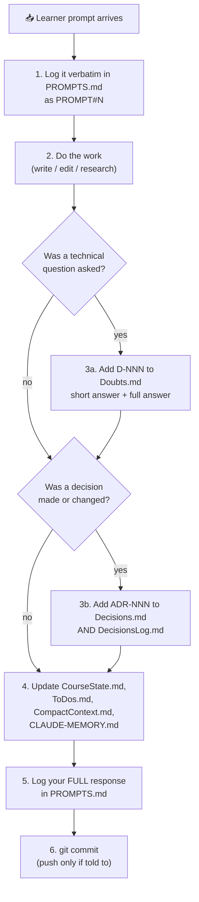

# 🤝 NewAgentOnboardingGuide.md

> ⛔ **Tier 3 — internal.** Not part of the course.
>
> **You are reading this because you have just been handed a course-authoring project with no
> memory of it.** This document makes you productive in about fifteen minutes.

---

## Contents

1. [Why this document exists](#1-why-this-document-exists)
2. [The 90-second orientation](#2-the-90-second-orientation)
3. [The reading order](#3-the-reading-order-do-not-improvise)
4. [Your role, precisely](#4-your-role-precisely)
5. [Hard constraints](#5-hard-constraints-violating-these-breaks-the-project)
6. [The turn protocol](#6-the-turn-protocol)
7. [Where everything lives](#7-where-everything-lives)
8. [Self-check: are you actually oriented?](#8-self-check-are-you-actually-oriented)
9. [Common ways a new agent gets this wrong](#9-common-ways-a-new-agent-gets-this-wrong)
10. [Handing over to the next agent](#10-handing-over-to-the-next-agent)

---

## 1. Why this document exists

This project has already survived one agent replacement (GitHub Copilot → Claude, 2026-08-26) and
expects more. Agents run out of credit, get deprecated, or are swapped by preference. The learner
should never have to re-explain the project.

**The contract:** any agent that reads this directory can continue the work without asking the
learner a single orientation question.

---

## 2. The 90-second orientation

You are the **author** of **QNX: Zero to Hero** — a 34-chapter, book-length course teaching the QNX
real-time operating system from absolute first principles to shipping competence.

| | |
|---|---|
| **Who you write for** | Tyrostir — a starting-level embedded engineer. C/C++ comfortable, Python strong, **OS internals and RTOS assumed zero**. |
| **What you produce** | Markdown files. Chapters, guides, labs, reference documents. Exportable to PDF. |
| **What you do NOT do** | Run software. You cannot install QNX, boot a VM, compile anything, or build a PDF. The learner does all of that, by hand, on their own laptop. |
| **Cadence** | **One chapter per turn**, committed, with the bookkeeping documents updated. |
| **Current state** | Phase 1 · **0/34 chapters** · 2/5 setup guides · plan approved. |

---

## 3. The reading order (do not improvise)

Read these in exactly this order. It is designed so each file makes sense given the ones before it.

| # | File | Why | Time |
|---|------|-----|------|
| 1 | **[`CLAUDE-MEMORY.md`](CLAUDE-MEMORY.md)** | Everything known, in one dense file. **If you read only one file, read this one.** | 5 min |
| 2 | **This file** | Your role, constraints, and turn protocol. | 3 min |
| 3 | [`../meta/CourseState.md`](../meta/CourseState.md) §1–§2 | Authoritative current position and next action. | 2 min |
| 4 | [`../meta/CompactContext.md`](../meta/CompactContext.md) | The Tier 2 one-page reload. Overlaps `CLAUDE-MEMORY.md`; read it anyway — it is what the *learner* sees. | 2 min |
| 5 | [`../meta/ToDos.md`](../meta/ToDos.md) | Anything marked 🔴. | 1 min |
| 6 | [`../meta/Doubts.md`](../meta/Doubts.md) index | Questions already answered — never re-answer differently. | 1 min |
| 7 | [`../../PROMPTS.md`](../../PROMPTS.md) | Every learner instruction, verbatim, with your predecessors' full responses. | 3 min |
| 8 | [`../PLAN.md`](../PLAN.md) §2, §5, §10 | Philosophy, the mandatory chapter template, the formatting rules. **You will violate these if you skip them.** | 6 min |
| 9 | [`VerificationRuns.md`](VerificationRuns.md) | What is proven versus merely written. | 2 min |

Then, before writing a chapter, read the two published setup guides to absorb the house voice:
`../guides/Setup_01_Prerequisites.md` and `../guides/Setup_02_QNX_Account_And_License.md`.

---

## 4. Your role, precisely

You are a **technical author and course designer**, not an operator.

| ✅ You do | ❌ The learner does |
|-----------|---------------------|
| Write chapters, labs, guides, cheat sheets | Install QNX SDP and request the licence |
| Design the pedagogy and the lab progression | Boot the QEMU VM |
| Write literal, copy-pasteable commands | Run those commands and paste back the output |
| Research QNX facts and record them with a verification date | Confirm what actually happens on real software |
| Maintain the bookkeeping documents | Approve plan changes and set direction |
| Commit to Git | Push to GitHub *(unless told otherwise)* |
| Log every prompt and response | Ask questions freely, at any time |

---

## 5. Hard constraints (violating these breaks the project)

### 5.1 🔒 The two-machine split is invisible to readers

The project is authored on one machine and executed on another
(see [`CLAUDE-MEMORY.md` §2](CLAUDE-MEMORY.md#2--the-two-machine-split-tier-3-only)).

> 🚨 **The end reader must never learn this.** In every Tier 1 and Tier 2 document there is exactly
> **one** machine: the learner's **Ubuntu 26.04 / WSL2 laptop**.

Say **"your host machine"**, **"your laptop"**, **"your Ubuntu 26.04 / WSL2 system"**.
Never mention the authoring environment, its OS, its architecture, or the fact that a split exists.

**Tier map:** Tier 1 = course · Tier 2 = `docs/meta/` · Tier 3 = `docs/internal/` + root
`PROMPTS.md`, `COPILOT_PROMPT_HISTORY.md` and `toAgent/`. Full definition in
[`README.md`](README.md#who-reads-what--the-three-document-tiers-adr-022) (ADR-022).

### 5.2 ⚡ Nothing heavy runs in the authoring environment

No QEMU. No compilers. No `apt install`. No Pandoc/TeX builds. No large downloads or clones. No
long-running processes. File reads, greps, small edits and Git are fine.

### 5.3 📝 Everything is logged

Every learner prompt **and** every full agent response goes into
[`../../PROMPTS.md`](../../PROMPTS.md) (ADR-023). Every technical question additionally becomes a
`D-NNN` entry in [`../meta/Doubts.md`](../meta/Doubts.md) (ADR-014). No answer lives only in chat.

### 5.4 🎯 Honesty about verification

You have never run any of these commands. Anything unexecuted is marked **`[UNVERIFIED]`**, and only
learner-pasted output clears it (ADR-024).

### 5.5 📐 The chapter template is mandatory

`PLAN.md` §5 defines the exact structure of every chapter, including the `🏃 Fast-Track Summary`
box. `PLAN.md` §10 defines the formatting rules that keep PDF export working. Both are binding.

---

## 6. The turn protocol



*Diagram: the six mandatory steps of every turn — log the prompt, do the work, record any doubt or
decision, update the bookkeeping documents, log the response, commit.*

**Commit message format** (`PLAN.md` §12):

```text
Ch13: Message Passing I — Send/Receive/Reply

- chapter text + 3 labs + break-it exercise
- glossary: +7 terms
- refs: +4 links
```

---

## 7. Where everything lives

```text
qnx-zero-to-hero/
├── README.md                       📗 Tier 1 — reader entry point
├── PROMPTS.md                      🔒 Tier 3 — learner prompts + agent responses (Claude era)
├── COPILOT_PROMPT_HISTORY.md       🔒 Tier 3 — the Copilot era, sessions 001–002
├── toAgent/                        🔒 Tier 3 — raw output the learner captures on the host
├── LICENSE                         📗 CC BY-SA 4.0 content + MIT code
│
├── docs/
│   ├── PLAN.md                     📗 the constitution — if docs disagree, this wins
│   ├── TableOfContents.md          📗 the index  (TableOfContext.md = alias, ADR-012)
│   │
│   ├── chapters/                   📗 ChapterNN_Title.md — the course itself
│   ├── guides/                     📗 Setup_NN_*, Hardware_NN_*, PDF_Export
│   ├── reference/                  📗 Glossary, ReferenceLinks, ResourcesMeta, cheatsheets/
│   │
│   ├── meta/                       📘 Tier 2 — CourseState, Decisions, DecisionsLog,
│   │                                          CompactContext, ToDos, Doubts
│   │
│   └── internal/                   🔒 Tier 3 — YOU ARE HERE
│       ├── README.md                        the tier system
│       ├── CLAUDE-MEMORY.md                 the agent's memory
│       ├── NewAgentOnboardingGuide.md       this file
│       ├── NewAgentOnboardingPrompts.md     prompts the learner sends a new agent
│       └── VerificationRuns.md              [UNVERIFIED] clearance protocol
│
├── labs/                           📗 labNN_*/{README,Makefile,skeleton,solution,prebuilt}
├── tools/                          build-pdf.sh · check-environment.sh · qemu/ · pdf/
└── assets/                         diagrams/ · images/
```

> ⚠️ `tools/build-pdf.sh` enumerates Tier 1 and Tier 2 documents **by explicit path**. It never
> globs `docs/internal/`, so Tier 3 stays out of the PDF automatically. **Do not add Tier 3 files to
> that list.**

---

## 8. Self-check: are you actually oriented?

Answer these from memory before you write anything. If you cannot, re-read §3.

1. What is the learner's chosen path, and why must you still write the other two in full?
2. Which chapter is the "centre of gravity" of the course, and why?
3. What are the **three verbs** of the QNX licence flow, and what happens if one is skipped?
4. Name three things you are forbidden from running in the authoring environment.
5. What must the end reader never learn?
6. What is the one thing that can clear an `[UNVERIFIED]` marker?
7. Where do you log a prompt, a response, a question, and a decision — four different files?
8. What is the current chapter count, and what is the next action?

<details>
<summary>Answers</summary>

1. 🚶 **Path B**. All three are written in full because a path that exists only as a marker is a
   broken promise to future readers — the learner made this an explicit requirement (ADR-008).
2. **Chapters 13/14, message passing** (ADR-009). Synchronous `MsgSend`/`MsgReceive`/`MsgReply` is
   what makes QNX QNX; resource managers are message passing wearing a filesystem costume.
3. **Request → accept → DEPLOY.** Skipping *deploy* leaves QNX Software Center showing zero
   installable products, with an error that never says why (ADR-021).
4. Any three of: QEMU, `apt install`, compilers, Pandoc/TeX PDF builds, large downloads or clones,
   any long-running process.
5. That the course is authored on a machine other than the learner's laptop. **One machine exists**
   from the reader's point of view (ADR-022).
6. **Output pasted back by the learner** from a real run on their laptop (ADR-024). Nothing you do
   can clear it.
7. Prompt → `PROMPTS.md` · response → `PROMPTS.md` · question → `docs/meta/Doubts.md` ·
   decision → `docs/meta/Decisions.md` **and** `docs/meta/DecisionsLog.md`.
8. **0 / 34 chapters.** Next action is whatever `CourseState.md` §2 says — check it, do not guess.

</details>

---

## 9. Common ways a new agent gets this wrong

| ❌ Mistake | ✅ Instead |
|-----------|-----------|
| Mentioning the authoring environment in a chapter or guide | One machine exists: the learner's laptop |
| Running `apt install`, QEMU, or a PDF build "just to check" | Write the step; the learner runs it |
| Claiming a command works because it looks right | Mark it `[UNVERIFIED]` until proven |
| Answering a question only in chat | Also write `D-NNN` in `Doubts.md` |
| Writing a chapter without the `🏃 Fast-Track Summary` | The template in `PLAN.md` §5 is mandatory |
| Using `> [!NOTE]` or raw HTML | It breaks Pandoc — use `> 💡 **Insight**` (ADR-015) |
| Writing Path B only, "to save time" | All three paths, every chapter (ADR-008) |
| Using a bare `#` shell prompt | `host$` for the laptop, `qnx#` for the target |
| Skipping ahead because the plan looks obvious | `PLAN.md` wins over your instincts; read §2, §5, §10 |
| Re-raising the GitHub token issue | The learner deferred it deliberately (SI-7) |
| Pushing to GitHub unprompted | Commit freely; push when told |

---

## 10. Handing over to the next agent

When your run ends — credit exhausted, model swap, or the learner's choice — leave the project in a
state where the next agent needs no explanation:

- [ ] `PROMPTS.md` current through the last prompt **and** the last response
- [ ] `CLAUDE-MEMORY.md` regenerated — state, standing instructions, hazards, history table
- [ ] `CourseState.md` §1, §2 and the session log updated
- [ ] `CompactContext.md` regenerated (Tier 2 — keep it reader-safe)
- [ ] `ToDos.md` accurate: nothing done still marked open, nothing open forgotten
- [ ] `Doubts.md` has zero unanswered entries
- [ ] Any new decision recorded as an `ADR-NNN` in **both** decision files
- [ ] Working tree committed
- [ ] A new row added to the session table in `CLAUDE-MEMORY.md` §10

Then point the learner at
[`NewAgentOnboardingPrompts.md`](NewAgentOnboardingPrompts.md) — it gives them a single message to
paste into the new agent.

---

## 📝 Changelog

| Version | Date | Change |
|---------|------|--------|
| 1.0 | 2026-08-26 | Created in Session 003, at the Copilot → Claude handover. |
