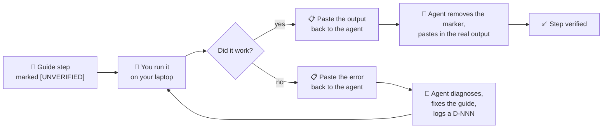

# ✅ VerificationRuns.md — Clearing the `[UNVERIFIED]` Markers

> ⛔ **Tier 3 — internal.** Not part of the course.
>
> **The problem this solves.** Setup Guides 01 and 02 were written from official QNX documentation.
> Almost none of it has actually been executed. Until it is, the course is a well-researched guess.
>
> **The rule (ADR-024).** The agent cannot run any of these commands. **Only output you paste back
> clears a marker.** Nothing else does.

---

## Contents

1. [How this works](#1-how-this-works)
2. [What you need before starting](#2-what-you-need-before-starting)
3. [🔴 Do this first — today](#3--do-this-first--today)
4. [Block V1 — Host preparation (Setup Guide 01)](#4-block-v1--host-preparation-setup-guide-01)
5. [Block V2 — Licence (Setup Guide 02, Part A)](#5-block-v2--licence-setup-guide-02-part-a)
6. [Block V3 — QNX Software Center + SDP (Setup Guide 02, Part B)](#6-block-v3--qnx-software-center--sdp-setup-guide-02-part-b)
7. [Block V4 — Toolchain proof](#7-block-v4--toolchain-proof)
8. [Status board](#8-status-board)
9. [If something goes wrong](#9-if-something-goes-wrong)
10. [Results log](#10-results-log)

---

## 1. How this works



*Diagram: each step is run by the learner; success replaces the marker with real output, failure
produces a fix and a logged doubt, then the step is retried.*

**Three things make this work:**

1. **Paste output, not summaries.** "It worked" is not evidence. The actual text is.
2. **Errors are as valuable as successes.** A failure means the guide is wrong for a real Ubuntu
   26.04 machine — which is exactly what we need to find out (Risk **R9**).
3. **Do the blocks in order.** V2 gates V3, which gates V4.

**How to report back.** One message per block is ideal. Fenced code blocks, like this:

````text
V1.3 — QEMU install
```
<paste everything the command printed>
```
Worked / Failed. Notes: ...
````

---

## 2. What you need before starting

| | |
|---|---|
| **Machine** | Your laptop — Ubuntu 26.04 LTS on WSL2 |
| **Repo checkout** | `~/exercises/qnx-zero-to-hero` |
| **Time** | V1 ≈ 45 min · V2 ≈ 15 min + approval wait · V3 ≈ 60–90 min (~10 GB download) · V4 ≈ 10 min |
| **Disk** | ~25 GB free |
| **Network** | A good connection for V3 |

> ⚠️ **Sync first.** The repository has been updated since you last worked on the laptop. Before you
> start, pull the latest — otherwise you will be following an older copy of these guides.
>
> ```bash
> host$ cd ~/exercises/qnx-zero-to-hero
> host$ git pull
> ```

---

## 3. 🔴 Do this first — today

**One task, fifteen minutes, and it unblocks everything else.**

> **V2.1 — Request the QNX Everywhere licence.** Go to **https://www.qnx.com/getqnx**, create your
> myQNX account, and submit the licence request.

Approval latency is unknown and is the **only true blocker in this course** (Risk **R1**). Submit it
now; everything else can proceed while it processes. Details in
[Setup Guide 02 Part A](../guides/Setup_02_QNX_Account_And_License.md#part-a--get-the-licence).

---

## 4. Block V1 — Host preparation (Setup Guide 01)

> 🎯 **Goal:** a laptop ready to install QNX and run a VM at near-native speed.
> 🔓 **No QNX account needed.** You can do this entire block right now.
> 📖 Follow [Setup Guide 01](../guides/Setup_01_Prerequisites.md) — the commands below are the
> checkpoints the agent needs to see.

### V1.0 — Baseline snapshot

```bash
host$ cd ~/exercises/qnx-zero-to-hero
host$ ./tools/check-environment.sh
```

📋 **Paste:** the whole report, including the pass/warn/fail tally at the end.
🎯 **Purpose:** the "before" picture, so we can prove what changed.

### V1.1 — Package index and build tools

```bash
host$ sudo apt update
host$ sudo apt install -y \
    build-essential git curl wget unzip tar xz-utils file \
    openssh-client net-tools iproute2 pkg-config
host$ gcc --version | head -1 && make --version | head -1 && git --version
```

📋 **Paste:** the last command's output, **plus any package that apt reported as unavailable**.
⚠️ **Watch for:** Ubuntu 26.04 renaming or dropping a package (Risk **R9**). If apt says *"Unable to
locate package"*, paste the exact line — do not substitute a guess.

### V1.2 — Java runtime

```bash
host$ sudo apt install -y default-jre
host$ java -version
```

📋 **Paste:** the `java -version` output (it prints to stderr — that is normal).
🎯 **Why:** QNX Software Center is an Eclipse application and may need a JRE.

### V1.3 — QEMU

```bash
host$ sudo apt install -y \
    qemu-system-x86 qemu-utils qemu-system-gui \
    bridge-utils libvirt-daemon-system libvirt-clients
host$ qemu-system-x86_64 --version
host$ qemu-img --version
```

📋 **Paste:** both version outputs, and any package apt could not find.
⚠️ **Most likely divergence point.** QNX documents Ubuntu 22.04/24.04; `qemu-system-gui` and the
`libvirt-*` package names are the ones most likely to have changed by 26.04.

### V1.4 — KVM group fix ⚡ (T-008 — this one matters a lot)

```bash
host$ ls -l /dev/kvm
host$ sudo usermod -aG kvm $USER
```

Then **restart your WSL session** — from **Windows PowerShell**, not from inside Linux:

```powershell
PS> wsl --shutdown
```

Reopen your Ubuntu terminal and confirm:

```bash
host$ groups
host$ test -r /dev/kvm && test -w /dev/kvm && echo "KVM accessible ✅" || echo "KVM NOT accessible ❌"
```

📋 **Paste:** the `groups` output and the accessible/not-accessible line.
⚠️ **Do not skip this.** Without it your QNX VM runs under software emulation — **10–50× slower**.
`kvm` must appear in your groups list.

### V1.5 — Prove KVM actually works

```bash
host$ qemu-system-x86_64 -enable-kvm -machine q35 -m 128 -nographic -no-reboot
```

📋 **Paste:** whatever it prints. It will fail to find a bootable disk — **that is the expected
success case**. What matters is that it does **not** say *"KVM is not supported"* or
*"Could not access KVM kernel module"*.
🚪 **Exit:** `Ctrl+A` then `X`.

✅ **Verified 2026-08-25.** Real result: SeaBIOS → iPXE (which even took a DHCP lease of
`10.0.2.15` from QEMU's built-in NAT) → *"No bootable device."* No KVM error. Now the documented
expected output in [Setup Guide 01 §9.2](../guides/Setup_01_Prerequisites.md#92-prove-qemu-can-actually-use-it).

### V1.6 — Workspace and final check

```bash
host$ mkdir -p ~/qnx-workspace/{images,vms,shared,downloads}
host$ ls -la ~/qnx-workspace
host$ cd ~/exercises/qnx-zero-to-hero
host$ ./tools/check-environment.sh
```

📋 **Paste:** the final report and its tally.
🎯 **Expected:** the three previous failures (`gcc`, `make`, `qemu-system-x86_64`) are now passes,
and the KVM warning is gone.

---

## 5. Block V2 — Licence (Setup Guide 02, Part A)

> 🎯 **Goal:** a QNX Everywhere licence that is not merely granted, but **deployed**.
> ⏱️ 15 minutes of work, then an unknown wait.
> 📖 [Setup Guide 02 Part A](../guides/Setup_02_QNX_Account_And_License.md#part-a--get-the-licence)

### V2.1 — Create the account and request the licence 🔴

At **https://www.qnx.com/getqnx**.

📋 **Report:** which fields the form actually asked for, and anything the guide did not predict.
🎯 **Why the agent needs this:** Chapter 04 documents this flow for every future reader. Screenshots
of the wording are ideal; a description is fine.

### V2.2 — Approval

📋 **Report:** **how long approval took**, and the wording of the confirmation email.
🎯 **Why:** Risk R1 is "unknown latency". Your data point turns it into a known quantity, and the
course can then tell readers what to expect.

### V2.3 — Accept **and DEPLOY** ⚠️

> 🚨 **This is the step everyone misses.** The licence flow has **three** verbs:
> **request → accept → DEPLOY.** If you skip *deploy*, QNX Software Center will show **zero
> installable products** and the error message will never tell you why.

In the myQNX License Manager at **https://www.qnx.com/account/dashboard**.

📋 **Report:** what the dashboard actually calls these actions — the real button labels. Vendors
rename UI constantly, and the guide must match what you see.

---

## 6. Block V3 — QNX Software Center + SDP (Setup Guide 02, Part B)

> 🎯 **Goal:** QNX SDP 8.0 installed at `~/qnx800`.
> 🔒 **Gated on V2.3.** Do not attempt this until the licence is **deployed**.
> ⏱️ 60–90 minutes, ~10 GB download.

### V3.1 — Download QNX Software Center

```bash
host$ cd ~/qnx-workspace/downloads
host$ ls -lh *.run
```

📋 **Paste:** the filename and size. 🎯 **Why:** the exact installer name goes into the guide.

### V3.2 — Install QNX Software Center

```bash
host$ chmod +x qnx-setup-*.run
host$ ./qnx-setup-*.run
```

📋 **Report:** whether the **graphical** installer opened under WSLg, or whether you needed the
command-line route (`./qnx-setup-*.run -- --unattended`). Paste any error.
🎯 **Why:** Risk **R2**. GUI-on-WSL2 is the second most likely failure after the licence.

```bash
host$ ls -d ~/qnx/qnxsoftwarecenter 2>/dev/null || find ~ -maxdepth 3 -name "qnxsoftwarecenter*" -type d
```

📋 **Paste:** the resulting path — the guide currently *predicts* `~/qnx/qnxsoftwarecenter`.

### V3.3 — Install SDP 8.0

Graphical, or:

```bash
host$ cd ~/qnx/qnxsoftwarecenter
host$ ./qnxsoftwarecenter_clt -listAvailablePackages
```

📋 **Paste:** the full package list.
🎯 **Why this one is important:** it proves the licence deployed correctly, **and** it gives us the
exact SDP build number, which every chapter records in its front matter (T-202).

⚠️ **If this list is empty** → the licence was not deployed. Return to **V2.3**.

```bash
host$ ls ~/qnx800
host$ du -sh ~/qnx800
```

📋 **Paste:** both. 🎯 **Why:** confirms the install layout and the real disk cost (the guide
estimates 8–12 GB).

---

## 7. Block V4 — Toolchain proof

> 🎯 **Goal:** prove you can cross-compile a QNX binary. **This is the moment the course becomes
> real.**
> ⏱️ 10 minutes.

### V4.1 — Environment

```bash
host$ source ~/qnx800/qnxsdp-env.sh
host$ echo $QNX_HOST
host$ echo $QNX_TARGET
host$ qcc -V
```

📋 **Paste:** all four outputs. `qcc -V` lists the available target triples.
🎯 **Why:** the guide asserts `-Vgcc_ntox86_64` is the right triple. This proves it — or corrects it.

### V4.2 — Cross-compile

Create a one-line C file and build it for QNX. (`Setup Guide 02 §11.2` has the full walkthrough.)

```bash
host$ cd /tmp
host$ printf '#include <stdio.h>\nint main(void){printf("Hello from QNX!\\n");return 0;}\n' > hello_qnx.c
host$ qcc -Vgcc_ntox86_64 -o hello_qnx hello_qnx.c
host$ file hello_qnx
```

📋 **Paste:** the `file` output.
🎯 **Expected:** something naming **QNX** — e.g. `ELF 64-bit LSB executable, x86-64, ... for QNX`.

### V4.3 — Prove it is a QNX binary, not a Linux one

```bash
host$ ./hello_qnx
```

📋 **Paste:** the error.
🎯 **Expected: it must FAIL**, with something like `cannot execute: required file not found`.
**The failure is the proof.** You have built a binary that Linux cannot run — because it is for QNX.
It will run later, inside the VM.

```bash
host$ rm -f /tmp/hello_qnx /tmp/hello_qnx.c
```

### V4.4 — Final environment check

```bash
host$ cd ~/exercises/qnx-zero-to-hero
host$ ./tools/check-environment.sh
```

📋 **Paste:** the final report. 🎯 **Expected:** everything green except the PDF toolchain.

---

## 8. Status board

**Legend:** ⬜ not started · 🔄 in progress · ✅ verified · ❌ failed, guide needs fixing · ⏸️ blocked

| ID | What | Owner | Gated on | Clears | Status |
|----|------|-------|----------|--------|--------|
| **V2.1** | 🔴 Request the licence — **still outstanding** | 👤 | — | Risk R1 | ⬜ |
| V1.0 | Baseline `check-environment.sh` | 👤 | — | — | ✅ |
| V1.1 | Build tools | 👤 | — | Setup 01 §5 | ✅ GCC 15.2.0 · Make 4.4.1 |
| V1.2 | Java runtime | 👤 | — | Setup 01 §6 | ✅ OpenJDK 25.0.4 |
| V1.3 | QEMU | 👤 | — | Setup 01 §7 · Risk R9 | ✅ QEMU 10.2.1 |
| V1.4 | KVM group fix ⚡ | 👤 | — | **T-008** | ✅ accessible |
| V1.5 | KVM proof | 👤 | V1.4 | Setup 01 §9 · Risk R3 | ✅ booted, no KVM error |
| V1.6 | Workspace + re-check | 👤 | V1.1–V1.5 | **T-009** | ✅ 19 pass · 6 warn · **0 fail** |
| V2.2 | Approval received | 👤 | V2.1 | **T-003** · Risk R1 | ⏸️ |
| V2.3 | Accept **and deploy** | 👤 | V2.2 | **T-010** · Setup 02 §5 | ⏸️ |
| V3.1 | Download QSC | 👤 | V2.3 | Setup 02 §7 | ⏸️ |
| V3.2 | Install QSC | 👤 | V3.1 | Setup 02 §8 · Risk R2 | ⏸️ |
| V3.3 | Install SDP 8.0 | 👤 | V3.2 | **T-011** · Setup 02 §9 · **T-202** | ⏸️ |
| V4.1 | Environment + `qcc -V` | 👤 | V3.3 | Setup 02 §10 | ⏸️ |
| V4.2 | Cross-compile | 👤 | V4.1 | Setup 02 §11 | ⏸️ |
| V4.3 | Prove it will not run on Linux | 👤 | V4.2 | Setup 02 §11.4 | ⏸️ |
| V4.4 | Final check | 👤 | V4.3 | **T-012**, **T-200** | ⏸️ |
| — | Remove markers, paste real output | 🤖 | V4.4 | **T-200** | ⏸️ |
| — | Write `Setup_03_QEMU_VM.md` | 🤖 | V4.4 | **T-112** | ⏸️ |

> 💡 **V1 and V2.1 are independent.** Do V2.1 first because of the wait, then work through V1 while
> approval processes. V3 and V4 cannot start until the licence is deployed.

---

## 9. If something goes wrong

**Paste the error and keep going with whatever is not blocked.** The agent will diagnose it, fix the
guide, and log a `D-NNN` entry in [`../meta/Doubts.md`](../meta/Doubts.md).

When reporting a failure, include:

1. The **exact command** you ran
2. The **complete output**, not just the last line
3. What you expected instead
4. Anything you had already tried

The guides carry troubleshooting sections for the known cases —
[Setup 01 §13](../guides/Setup_01_Prerequisites.md#13-troubleshooting) and
[Setup 02 §13](../guides/Setup_02_QNX_Account_And_License.md#13-troubleshooting). Try those first,
but **report the failure regardless** — a documented failure with a documented fix is worth more to
future readers than a step that silently worked.

> ⚠️ **Never let the agent guess a fix into the guide.** If a workaround was not actually run on your
> machine, it stays `[UNVERIFIED]` too.

---

## 10. Results log

*Append one entry per block as results come in. Newest last.*

| Date | Block | Result | Notes / marker cleared |
|------|-------|--------|------------------------|
| 2026-08-25 | **V1 (all)** | ✅ **Passed** | `19 passed · 6 warnings · 0 failed`. **T-008** and **T-009** cleared. Setup Guide 01 → v2.0, `[UNVERIFIED]` removed, all expected-output blocks replaced with real output. **Risk R9 did not materialise** — every documented package installed under its documented name on Ubuntu 26.04. Repo path corrected to `~/exercises/qnx-zero-to-hero`. |

### Real versions observed on the host (2026-08-25)

| Component | Version |
|-----------|---------|
| OS | Ubuntu 26.04 LTS |
| Kernel | 6.18.33.2-microsoft-standard-WSL2 |
| GCC | 15.2.0 (Ubuntu 15.2.0-16ubuntu1) |
| GNU Make | 4.4.1 |
| Git | 2.53.0 |
| curl | 8.18.0 |
| OpenSSH | 10.2p1 (OpenSSL 3.5.5) |
| GNU tar | 1.35 |
| OpenJDK | 25.0.4 |
| QEMU | 10.2.1 (Debian 1:10.2.1+ds-1ubuntu3) |
| qemu-img | 10.2.1 |

> 💡 **Use this table when writing chapters.** Front matter records the exact toolchain each chapter
> was written against; these are the host-side values.

---

## 📝 Changelog

| Version | Date | Change |
|---------|------|--------|
| 1.1 | 2026-08-26 | **Block V1 verified.** All six V1 checkpoints ✅; T-008 and T-009 cleared; real host versions recorded; V1.5's documented output replaced with the real SeaBIOS/iPXE result. |
| 1.0 | 2026-08-26 | Created in Session 003. Defines the ADR-024 clearance protocol and enumerates blocks V1–V4 (18 checkpoints) against Setup Guides 01 and 02. |
