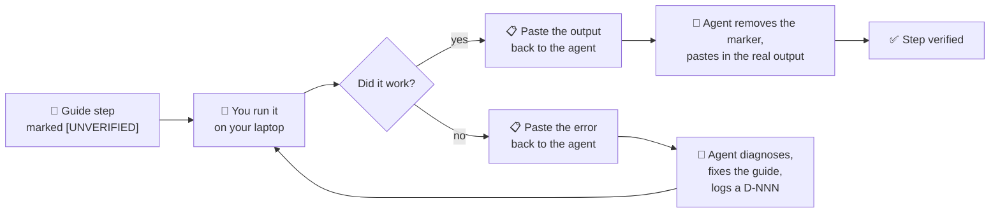

# ✅ VerificationRuns.md — Clearing the `[UNVERIFIED]` Markers

> ⛔ **Tier 3 — internal.** Not part of the course.
>
> **The problem this solves.** Setup Guides 01 and 02 were written from official QNX documentation.
> Almost none of it has actually been executed. Until it is, the course is a well-researched guess.
>
> **The rule (ADR-024).** The agent cannot run any of these commands. **Only output you paste back
> clears a marker.** Nothing else does.

---

## Contents

1. [How this works](#1-how-this-works)
2. [What you need before starting](#2-what-you-need-before-starting)
3. [🔴 Do this first — today](#3--do-this-first--today)
4. [Block V1 — Host preparation (Setup Guide 01)](#4-block-v1--host-preparation-setup-guide-01)
5. [Block V2 — Licence (Setup Guide 02, Part A)](#5-block-v2--licence-setup-guide-02-part-a)
6. [Block V3 — QNX Software Center + SDP (Setup Guide 02, Part B)](#6-block-v3--qnx-software-center--sdp-setup-guide-02-part-b)
7. [Block V4 — Toolchain proof](#7-block-v4--toolchain-proof)
8. [Status board](#8-status-board)
9. [If something goes wrong](#9-if-something-goes-wrong)
10. [Results log](#10-results-log)

---

## 1. How this works



*Diagram: each step is run by the learner; success replaces the marker with real output, failure
produces a fix and a logged doubt, then the step is retried.*

**Three things make this work:**

1. **Paste output, not summaries.** "It worked" is not evidence. The actual text is.
2. **Errors are as valuable as successes.** A failure means the guide is wrong for a real Ubuntu
   26.04 machine — which is exactly what we need to find out (Risk **R9**).
3. **Do the blocks in order.** V2 gates V3, which gates V4.

**How to report back.** One message per block is ideal. Fenced code blocks, like this:

````text
V1.3 — QEMU install
```
<paste everything the command printed>
```
Worked / Failed. Notes: ...
````

---

## 2. What you need before starting

| | |
|---|---|
| **Machine** | Your laptop — Ubuntu 26.04 LTS on WSL2 |
| **Repo checkout** | `~/exercises/qnx-zero-to-hero` |
| **Time** | V1 ≈ 45 min · V2 ≈ 15 min + approval wait · V3 ≈ 60–90 min (~10 GB download) · V4 ≈ 10 min |
| **Disk** | ~25 GB free |
| **Network** | A good connection for V3 |

> ⚠️ **Sync first.** The repository has been updated since you last worked on the laptop. Before you
> start, pull the latest — otherwise you will be following an older copy of these guides.
>
> ```bash
> host$ cd ~/exercises/qnx-zero-to-hero
> host$ git pull
> ```

---

## 3. ✅ Where you are now

| Block | State |
|-------|-------|
| **V1** — host preparation | ✅ **Verified 2026-08-25.** `19 passed · 6 warnings · 0 failed` |
| **V2** — licence | ✅ **Complete 2026-08-26.** Requested, accepted and **deployed** |
| **V3** — Software Center + SDP | ✅ **Complete 2026-08-26.** SDP 8.0 at `~/qnx800`, ~43 GB |
| **V4** — toolchain proof | ✅ **Complete 2026-08-26.** `24 passed · 3 warnings · 0 failed` |
| **V5** — the QEMU VM | ✅ 🎉 **Complete 2026-08-26.** Boots, networked, and runs a cross-compiled binary |
| **V6** — the first chapter lab | 👉 **Next.** Verifies the lab mechanism all remaining chapters use |
| **V7** — process isolation | ⬜ Chapter 02's labs. No compiler needed — can be done in any order with V6 |

> 🎉 **All four blocks are done.** Setup Guides 01 and 02 are verified end to end and carry no
> `[UNVERIFIED]` markers. Risks **R1**, **R2**, **R3** and **R9** are all closed.

### Two small things still wanted (non-blocking)

Neither gates anything; both improve the course.

| # | What | Why it matters |
|---|------|----------------|
| **T-202** | The exact **SDP build number** — `~/qnx/qnxsoftwarecenter/qnxsoftwarecenter_clt -listInstalled` | Every chapter's front matter must record the SDP build it was written against (`PLAN.md` §5, Risk R5). Right now no chapter can state it. |
| **R2 / T-014** | Did QNX Software Center install via the **graphical** installer under WSLg, or did you need the **headless** route (`-- --unattended`)? Plus the licence approval latency and the portal's real accept/deploy button labels. | Setup Guide 02 §8 currently offers two routes as equals. It should state which one actually works and keep the other as a fallback. |

### 👉 Next verification block: **V6 — the first chapter lab**

Chapter 01 ships `labs/lab01_timing/`, the course's **first compiled lab**. Its source is
syntax-clean under `gcc -Wall -Wextra`, but it has never been built with `qcc` or run on the target.
Block **V6** below verifies it — and with it, the whole lab mechanism that the remaining 33 chapters
depend on.

> 📌 **Evidence note, for the record (ADR-024).** V5.6's `scp` transfer and V5.7's shutdown command
> were not themselves captured in the drop — the binary was already on the target and the session
> ended with `exit`. The *outcomes* are confirmed (the program ran; the learner attested the block
> complete), and the transfer path is the same SSH channel proven in V5.5. Recorded so the standard
> of evidence stays visible rather than quietly relaxed.

---

## 4. Block V1 — Host preparation (Setup Guide 01)

> 🎯 **Goal:** a laptop ready to install QNX and run a VM at near-native speed.
> 🔓 **No QNX account needed.** You can do this entire block right now.
> 📖 Follow [Setup Guide 01](../guides/Setup_01_Prerequisites.md) — the commands below are the
> checkpoints the agent needs to see.

### V1.0 — Baseline snapshot

```bash
host$ cd ~/exercises/qnx-zero-to-hero
host$ ./tools/check-environment.sh
```

📋 **Paste:** the whole report, including the pass/warn/fail tally at the end.
🎯 **Purpose:** the "before" picture, so we can prove what changed.

### V1.1 — Package index and build tools

```bash
host$ sudo apt update
host$ sudo apt install -y \
    build-essential git curl wget unzip tar xz-utils file \
    openssh-client net-tools iproute2 pkg-config
host$ gcc --version | head -1 && make --version | head -1 && git --version
```

📋 **Paste:** the last command's output, **plus any package that apt reported as unavailable**.
⚠️ **Watch for:** Ubuntu 26.04 renaming or dropping a package (Risk **R9**). If apt says *"Unable to
locate package"*, paste the exact line — do not substitute a guess.

### V1.2 — Java runtime

```bash
host$ sudo apt install -y default-jre
host$ java -version
```

📋 **Paste:** the `java -version` output (it prints to stderr — that is normal).
🎯 **Why:** QNX Software Center is an Eclipse application and may need a JRE.

### V1.3 — QEMU

```bash
host$ sudo apt install -y \
    qemu-system-x86 qemu-utils qemu-system-gui \
    bridge-utils libvirt-daemon-system libvirt-clients
host$ qemu-system-x86_64 --version
host$ qemu-img --version
```

📋 **Paste:** both version outputs, and any package apt could not find.
⚠️ **Most likely divergence point.** QNX documents Ubuntu 22.04/24.04; `qemu-system-gui` and the
`libvirt-*` package names are the ones most likely to have changed by 26.04.

### V1.4 — KVM group fix ⚡ (T-008 — this one matters a lot)

```bash
host$ ls -l /dev/kvm
host$ sudo usermod -aG kvm $USER
```

Then **restart your WSL session** — from **Windows PowerShell**, not from inside Linux:

```powershell
PS> wsl --shutdown
```

Reopen your Ubuntu terminal and confirm:

```bash
host$ groups
host$ test -r /dev/kvm && test -w /dev/kvm && echo "KVM accessible ✅" || echo "KVM NOT accessible ❌"
```

📋 **Paste:** the `groups` output and the accessible/not-accessible line.
⚠️ **Do not skip this.** Without it your QNX VM runs under software emulation — **10–50× slower**.
`kvm` must appear in your groups list.

### V1.5 — Prove KVM actually works

```bash
host$ qemu-system-x86_64 -enable-kvm -machine q35 -m 128 -nographic -no-reboot
```

📋 **Paste:** whatever it prints. It will fail to find a bootable disk — **that is the expected
success case**. What matters is that it does **not** say *"KVM is not supported"* or
*"Could not access KVM kernel module"*.
🚪 **Exit:** `Ctrl+A` then `X`.

✅ **Verified 2026-08-25.** Real result: SeaBIOS → iPXE (which even took a DHCP lease of
`10.0.2.15` from QEMU's built-in NAT) → *"No bootable device."* No KVM error. Now the documented
expected output in [Setup Guide 01 §9.2](../guides/Setup_01_Prerequisites.md#92-prove-qemu-can-actually-use-it).

### V1.6 — Workspace and final check

```bash
host$ mkdir -p ~/qnx-workspace/{images,vms,shared,downloads}
host$ ls -la ~/qnx-workspace
host$ cd ~/exercises/qnx-zero-to-hero
host$ ./tools/check-environment.sh
```

📋 **Paste:** the final report and its tally.
🎯 **Expected:** the three previous failures (`gcc`, `make`, `qemu-system-x86_64`) are now passes,
and the KVM warning is gone.

---

## 5. Block V2 — Licence (Setup Guide 02, Part A)

> 🎯 **Goal:** a QNX Everywhere licence that is not merely granted, but **deployed**.
> ⏱️ 15 minutes of work, then an unknown wait.
> 📖 [Setup Guide 02 Part A](../guides/Setup_02_QNX_Account_And_License.md#part-a--get-the-licence)

> ✅ **Block V2 is complete (2026-08-26).** The licence was requested, accepted and **deployed**.
> The steps below are kept as the record of what was done, and as the instructions a future reader
> follows.

### V2.1 — Create the account and request the licence ✅

At **https://www.qnx.com/getqnx**. **Done.**

📋 *Optional, whenever convenient:* which fields the form actually asked for. Chapter 04 documents
this flow for every future reader, and real wording beats a paraphrase of the docs.

### V2.2 — Approval ✅

**Received.**

📋 *Optional, whenever convenient:* **how long approval took.** Risk R1 was "unknown latency"; your
data point is the only way the course can honestly tell a reader what to expect ("minutes", "a day",
"a week"). Right now Chapter 04 can only say *"we don't know"*.

### V2.3 — Accept **and DEPLOY** ⚠️

> 🚨 **This is the step everyone misses.** The licence flow has **three** verbs:
> **request → accept → DEPLOY.** If you skip *deploy*, QNX Software Center will show **zero
> installable products** and the error message will never tell you why.

In the myQNX License Manager at **https://www.qnx.com/account/dashboard**. ✅ **Deployed.**

📋 *Optional, whenever convenient:* what the dashboard actually calls these actions — the real button
labels. Vendors rename UI constantly, and this is the step that silently breaks everyone's install.
If §5 of Setup Guide 02 doesn't match what you saw, tell me and I'll fix the wording.

---

## 6. Block V3 — QNX Software Center + SDP (Setup Guide 02, Part B)

> 🎯 **Goal:** QNX SDP 8.0 installed at `~/qnx800`.
> ✅ **Unblocked** — the licence is deployed. Start here.
> ⏱️ 60–90 minutes, ~10 GB download.

### V3.1 — Download QNX Software Center

```bash
host$ cd ~/qnx-workspace/downloads
host$ ls -lh *.run
```

📋 **Paste:** the filename and size. 🎯 **Why:** the exact installer name goes into the guide.

### V3.2 — Install QNX Software Center

```bash
host$ chmod +x qnx-setup-*.run
host$ ./qnx-setup-*.run
```

📋 **Report:** whether the **graphical** installer opened under WSLg, or whether you needed the
command-line route (`./qnx-setup-*.run -- --unattended`). Paste any error.
🎯 **Why:** Risk **R2**. GUI-on-WSL2 is the second most likely failure after the licence.

```bash
host$ ls -d ~/qnx/qnxsoftwarecenter 2>/dev/null || find ~ -maxdepth 3 -name "qnxsoftwarecenter*" -type d
```

📋 **Paste:** the resulting path — the guide currently *predicts* `~/qnx/qnxsoftwarecenter`.

### V3.3 — Install SDP 8.0

Graphical, or:

```bash
host$ cd ~/qnx/qnxsoftwarecenter
host$ ./qnxsoftwarecenter_clt -listInstalled
```

📋 **Paste:** the full package list.
🎯 **Why this one is important:** it proves the licence deployed correctly, **and** it gives us the
exact SDP build number, which every chapter records in its front matter (T-202).

⚠️ **If this list is empty** → the licence was not deployed. Return to **V2.3**.

```bash
host$ ls ~/qnx800
host$ du -sh ~/qnx800
```

📋 **Paste:** both. 🎯 **Why:** confirms the install layout and the real disk cost (the guide
estimates 8–12 GB).

---

## 7. Block V4 — Toolchain proof

> 🎯 **Goal:** prove you can cross-compile a QNX binary. **This is the moment the course becomes
> real.**
> ⏱️ 10 minutes.

### V4.1 — Environment

```bash
host$ source ~/qnx800/qnxsdp-env.sh
host$ echo $QNX_HOST
host$ echo $QNX_TARGET
host$ qcc -V
```

📋 **Paste:** all four outputs. `qcc -V` lists the available target triples.
🎯 **Why:** the guide asserts `-Vgcc_ntox86_64` is the right triple. This proves it — or corrects it.

### V4.2 — Cross-compile

Create a one-line C file and build it for QNX. (`Setup Guide 02 §11.2` has the full walkthrough.)

```bash
host$ cd /tmp
host$ printf '#include <stdio.h>\nint main(void){printf("Hello from QNX!\\n");return 0;}\n' > hello_qnx.c
host$ qcc -Vgcc_ntox86_64 -o hello_qnx hello_qnx.c
host$ file hello_qnx
```

📋 **Paste:** the `file` output.
🎯 **Expected:** something naming **QNX** — e.g. `ELF 64-bit LSB executable, x86-64, ... for QNX`.

### V4.3 — Prove it is a QNX binary, not a Linux one

```bash
host$ ./hello_qnx
```

📋 **Paste:** the error.
🎯 **Expected: it must FAIL**, with something like `cannot execute: required file not found`.
**The failure is the proof.** You have built a binary that Linux cannot run — because it is for QNX.
It will run later, inside the VM.

```bash
host$ rm -f /tmp/hello_qnx /tmp/hello_qnx.c
```

### V4.4 — Final environment check

```bash
host$ cd ~/exercises/qnx-zero-to-hero
host$ ./tools/check-environment.sh
```

📋 **Paste:** the final report. 🎯 **Expected:** everything green except the PDF toolchain.

---

## 7a. Block V5 — The QEMU VM (Setup Guide 03)

> 🎯 **Goal:** a booting QNX system, reachable over SSH, running the binary you cross-compiled.
> ⏱️ 45–75 minutes plus a ~2–4 GB download.
> 📖 Follow [Setup Guide 03](../guides/Setup_03_QEMU_VM.md).
>
> ⚠️ **This is the block most likely to find bugs.** It involves networking, graphics and nested
> virtualization on a host newer than QNX documents. Setup Guide 02 yielded three real errors; expect
> at least one here.

### V5.1 — Install the QEMU quick-start package

```bash
host$ cd ~/qnx/qnxsoftwarecenter
host$ ./qnxsoftwarecenter_clt -listInstalled
```

📋 **Paste:** the full package list.
🎯 **Double duty:** it names the quick-start package *and* gives the **exact SDP build number**
(**T-202**), which every chapter's front matter must record. This is the one command that closes both.

### V5.2 — Unpack the image

```bash
host$ cd ~/qnx800/images/qemu
host$ ls -lh
host$ ./unpack_qemu_image.sh
host$ ls -lh output/
```

📋 **Paste:** both listings — the real archive names, and what `output/` contains.
🎯 **Why:** Setup Guide 03 §5 currently *predicts* `ifs.bin` and `disk-qemu.vmdk`.

### V5.3 — Boot 🎉

```bash
host$ cd ~/qnx800/images/qemu
host$ mkqnximage --run
```

📋 **Paste: the entire boot log**, from the first line to the login prompt.
🎯 **The most valuable single artefact in this block.** It names every driver that starts, the memory
layout, and the exact QNX build. Chapters 09 and 21 dissect it line by line, and it becomes the
documented expected output for every future reader.

Log in as `root` / `root`.

📋 **Confirm:** did you reach a `#` prompt? That is milestone **M2 — "It boots"**.

### V5.4 — First contact

```bash
qnx# uname -a
qnx# pidin
qnx# pidin info
qnx# ls /
qnx# ls /proc/boot
```

📋 **Paste:** all five.
🎯 **Why:** `pidin` output is course material — it shows drivers running as ordinary user-space
processes, which is the microkernel argument made concrete (Chapter 09). `/proc/boot` is the contents
of `ifs.bin` seen as a filesystem (Chapter 21).

### V5.5 — Networking ⚠️ *the predicted trouble spot*

```bash
qnx# ifconfig
```

and from a second host terminal:

```bash
host$ cd ~/qnx800/images/qemu
host$ mkqnximage --getip
host$ ssh root@<ip>
```

📋 **Report:** whether the VM got an IP, and **which networking route worked** — the default
`virbr0` bridge, systemd/libvirt enabled in WSL2, `virsh net-start default`, or a fallback to QEMU
user-mode NAT with port forwarding.
🎯 **Why this matters most:** WSL2 does not enable systemd by default, so libvirt's `virbr0` bridge
may never exist. Whichever route works becomes the documented one and the others become §13.
See [Setup Guide 03 §12.1](../guides/Setup_03_QEMU_VM.md#121-networking-the-virbr0-bridge).

### V5.6 — Run your binary 🎉

```bash
host$ scp /tmp/hello_qnx root@<ip>:/tmp/
qnx# cd /tmp && chmod +x hello_qnx && ./hello_qnx
```

📋 **Paste:** the output, including the PID.
🎯 **What this proves:** the complete embedded loop — edit, cross-compile, deploy, run — works end to
end. With this confirmed, every lab in the course is executable.

### V5.7 — Graphics and shutdown

📋 **Report:** did an SDL/graphical window open under WSLg, did it fall back to software rendering,
or did it fail? *(Not important for the course — every lab is text — but it should be documented.)*

```bash
host$ mkqnximage --stop
```

or `Ctrl+A` then `X`. 📋 **Report:** which one you used and whether it worked.

---

## 7b. Block V6 — The first chapter lab (Chapter 01)

> 🎯 **Goal:** prove the lab mechanism end to end — build with `qcc`, deploy, run, get numbers.
> ⏱️ 20 minutes.
> 📖 [`labs/lab01_timing/README.md`](../../labs/lab01_timing/README.md) ·
> [Chapter 01 Lab 01.2](../chapters/Chapter01_WhatIsARealTimeSystem.md)
>
> ⚠️ **This verifies more than one lab.** It is the first time a `Makefile`, a skeleton/solution
> pair and a deploy-and-run cycle have been exercised. Whatever breaks here breaks in every later
> chapter, so it is worth doing carefully.

### V6.1 — Build

```bash
host$ source ~/qnx800/qnxsdp-env.sh
host$ cd ~/exercises/qnx-zero-to-hero/labs/lab01_timing
host$ make
host$ file solution/jitter
```

📋 **Paste:** the full `make` output — **including any warnings** — and the `file` line.
🎯 **Why:** `qcc` is GCC **12.2.0** and may warn where the host's GCC 15 did not. Warnings on the
course's first lab need fixing, not tolerating.

### V6.2 — Deploy and run

```bash
host$ scp solution/jitter qnxuser@<ip>:/tmp/
host$ ssh qnxuser@<ip>
qnx$ /tmp/jitter
```

📋 **Paste:** the complete statistics block.
🎯 **Why:** it becomes the real `expected_output.txt`, replacing the illustrative numbers — and it is
the first real timing data in the course.

⚠️ **Sanity check before anything else:** is `min` **≥ 1000 µs**? If it is lower, the measurement is
wrong rather than the sleep being short, and `elapsed_us()` needs looking at.

### V6.3 — 💥 Break It: loaded, then prioritised

```bash
qnx$ /tmp/jitter                  # idle baseline
qnx$ while true; do :; done &     # x3
qnx$ /tmp/jitter                  # loaded
qnx$ on -p 63 /tmp/jitter         # loaded, but at priority 63
```

*(Clean up with `slay sh`, or reboot the VM.)*

📋 **Paste all three runs.**
🎯 **The claim being tested:** load moves `max` far more than `mean`, and running at priority 63
pushes `max` back down **even though the machine is still fully loaded**. That is the chapter's whole
argument, and if it does not reproduce, **the chapter is wrong and must be corrected.**

⚠️ **`on -p 63` is unverified.** If the syntax is wrong, `on --help` on the target will give the real
one — please paste that too.

### V6.4 — Optional: does jitter scale with the interval?

Change `INTERVAL_US` to `10000` in `solution/jitter.c`, rebuild, rerun.

📋 **Report:** does jitter grow tenfold, or stay roughly constant?
🎯 **Why it is interesting:** roughly constant jitter points at a fixed cost — the 1 ms clock tick and
scheduling overhead — rather than anything proportional to the sleep. That distinction is the start
of Chapter 14.

---

## 7c. Block V7 — Chapter 02's process-isolation labs

> 🎯 **Goal:** demonstrate on a real system that a service can die and be restarted, and find the one
> component that cannot.
> ⏱️ 20 minutes. **No compiler needed.**
> 📖 [Chapter 02 Labs 02.2 and 💥 Break It](../chapters/Chapter02_WhatIsQNX.md)

### V7.1 — Kill and restart a service

```bash
qnx# pidin | grep vncserv
qnx# slay vncserv
qnx# pidin | grep vncserv
qnx# pidin info
qnx# vncserv &
qnx# pidin | grep vncserv
```

📋 **Paste all six.**
🎯 **The claim:** the process disappears, the system is unaffected, and a restart produces a **new
PID**. This is Chapter 02's whole thesis, and the foundation Chapter 27 builds high availability on.

⚠️ **Unverified specifics:** whether `slay vncserv` is the right syntax, and whether `vncserv &`
restarts cleanly without arguments. If either differs, please paste what worked.

### V7.2 — 💥 Try to kill the kernel

```bash
qnx# slay procnto-smp-instr
```

📋 **Report which happened**, with the exact message:

1. **Refused** with an error — the predicted outcome
2. **The VM halted** — equally instructive; reboot with `mkqnximage --run`
3. **Nothing happened** — worth knowing

🎯 **Why it earns a checkpoint:** the chapter claims `procnto` is different *in kind* from every other
process. This is the only experiment that tests it, and the guide currently only predicts the result.

### V7.3 — Optional: the honest version of the same demo

```bash
qnx# slay io-sock
```

⚠️ **Only from the serial console — this will kill any SSH session**, since `io-sock` *is* the network
stack.

📋 **Report:** did the system survive? Could you restart networking, or did it need a reboot?
🎯 **Why:** killing the *TCP/IP stack* and having the machine shrug is the demonstration nobody
forgets — and it is impossible on a monolithic kernel. Mastery-check question 4 asserts this outcome
without having tested it.

---

## 8. Status board

**Legend:** ⬜ not started · 🔄 in progress · ✅ verified · ❌ failed, guide needs fixing · ⏸️ blocked

| ID | What | Owner | Gated on | Clears | Status |
|----|------|-------|----------|--------|--------|
| **V2.1** | Request the licence | 👤 | — | Risk R1 | ✅ |
| V1.0 | Baseline `check-environment.sh` | 👤 | — | — | ✅ |
| V1.1 | Build tools | 👤 | — | Setup 01 §5 | ✅ GCC 15.2.0 · Make 4.4.1 |
| V1.2 | Java runtime | 👤 | — | Setup 01 §6 | ✅ OpenJDK 25.0.4 |
| V1.3 | QEMU | 👤 | — | Setup 01 §7 · Risk R9 | ✅ QEMU 10.2.1 |
| V1.4 | KVM group fix ⚡ | 👤 | — | **T-008** | ✅ accessible |
| V1.5 | KVM proof | 👤 | V1.4 | Setup 01 §9 · Risk R3 | ✅ booted, no KVM error |
| V1.6 | Workspace + re-check | 👤 | V1.1–V1.5 | **T-009** | ✅ 19 pass · 6 warn · **0 fail** |
| V2.2 | Approval received | 👤 | V2.1 | **T-003** · Risk R1 | ✅ |
| V2.3 | Accept **and deploy** | 👤 | V2.2 | **T-010** · Setup 02 §5 | ✅ **deployed** |
| V3.1 | Download QSC | 👤 | V2.3 | Setup 02 §7 | ✅ |
| V3.2 | Install QSC | 👤 | V3.1 | Setup 02 §8 · Risk R2 | ✅ *(route not reported)* |
| V3.3 | Install SDP 8.0 | 👤 | V3.2 | **T-011** · Setup 02 §9 | ✅ `~/qnx800` · ~43 GB · **T-202 still open** |
| V4.1 | Environment + `qcc -V` | 👤 | V3.3 | Setup 02 §10 | ✅ GCC **12.2.0** · 6 targets |
| V4.2 | Cross-compile | 👤 | V4.1 | Setup 02 §11 | ✅ *(found a bug in the guide)* |
| V4.3 | Prove it will not run on Linux | 👤 | V4.2 | Setup 02 §11.4 | ✅ failed exactly as predicted |
| V4.4 | Final check | 👤 | V4.3 | **T-012**, **T-200** | ✅ **24 pass · 3 warn · 0 fail** |
| — | Remove Part B markers, paste real output | 🤖 | V4.4 | **T-200** | ✅ Setup 02 → v2.0 |
| — | Write `Setup_03_QEMU_VM.md` + `tools/qemu/` | 🤖 | V4.4 | **T-112** | ✅ done 2026-08-26 |
| **V6.1** | Build `lab01_timing` with `qcc` | 👤 | — | Lab 01.2 · the lab mechanism | ⬜ **next** |
| V6.2 | Deploy and run it | 👤 | V6.1 | `expected_output.txt` | ⬜ |
| V6.3 | 💥 Loaded, then at priority 63 | 👤 | V6.2 | **Ch 01 §2.3's central claim** | ⬜ |
| V6.4 | Optional: interval scaling | 👤 | V6.2 | Ch 14 preview | ⬜ |
| — | Clear Lab 01.2's markers | 🤖 | V6.3 | — | ⏸️ |
| **V7.1** | Kill and restart `vncserv` | 👤 | — | Lab 02.2 | ⬜ |
| V7.2 | 💥 Try to `slay procnto` | 👤 | — | Ch 02 Break It | ⬜ |
| V7.3 | Optional: `slay io-sock` from the console | 👤 | — | Ch 02 mastery Q4 | ⬜ |
| — | Clear Chapter 02's lab markers | 🤖 | V7.2 | — | ⏸️ |
| **V5.1** | Install the QSTI package | 👤 | — | Setup 03 §4 | ✅ *(was already installed with SDP)* — **found a bug** |
| V5.2 | Unpack the image | 👤 | V5.1 | Setup 03 §5 | ✅ — **found the nested `qemu/` trap** |
| V5.3 | **Boot to a `#` prompt** 🎉 | 👤 | V5.2 | Setup 03 §7 · **M2** | ✅ 🎉 **MILESTONE M2 REACHED** |
| V5.4 | First contact (`pidin`, `/proc/boot`) | 👤 | V5.3 | Setup 03 §8 | ✅ — excellent course material |
| V5.5 | Networking + SSH ⚠️ | 👤 | V5.3 | Setup 03 §9 | ✅ IP `192.168.122.46` · **SSH root refused → D-009** |
| V5.6 | **Run `hello_qnx` on the target** 🎉 | 👤 | V5.5 | Setup 03 §10 | ✅ 🎉 `Hello from QNX!` PID 14032920 |
| V5.7 | Graphics + clean shutdown | 👤 | V5.3 | Setup 03 §11 | ✅ *(learner-attested)* |
| — | Clear Setup Guide 03's markers | 🤖 | V5.7 | — | ✅ Setup 03 → **v2.0** |

> ✅ **V1–V4 complete.** Host prepared, licence deployed, SDP installed, cross-compile proven.
> 👉 **V5 is next** — boot the VM and run your binary on it.

---

## 9. If something goes wrong

**Paste the error and keep going with whatever is not blocked.** The agent will diagnose it, fix the
guide, and log a `D-NNN` entry in [`../meta/Doubts.md`](../meta/Doubts.md).

When reporting a failure, include:

1. The **exact command** you ran
2. The **complete output**, not just the last line
3. What you expected instead
4. Anything you had already tried

The guides carry troubleshooting sections for the known cases —
[Setup 01 §13](../guides/Setup_01_Prerequisites.md#13-troubleshooting) and
[Setup 02 §13](../guides/Setup_02_QNX_Account_And_License.md#13-troubleshooting). Try those first,
but **report the failure regardless** — a documented failure with a documented fix is worth more to
future readers than a step that silently worked.

> ⚠️ **Never let the agent guess a fix into the guide.** If a workaround was not actually run on your
> machine, it stays `[UNVERIFIED]` too.

---

## 10. Results log

*Append one entry per block as results come in. Newest last.*

| Date | Block | Result | Notes / marker cleared |
|------|-------|--------|------------------------|
| 2026-08-26 | **V5.6 – V5.7** | ✅ 🎉 **BLOCK V5 COMPLETE** | `./hello_qnx` on the target printed `Hello from QNX!` / `My process ID is 14032920` — **the full edit → cross-compile → deploy → run loop is closed.** SSH confirmed as `qnxuser`/`qnxuser`, `sudo` password the same. **Correction to D-009:** the image ships **`PermitRootLogin no`**, not `prohibit-password` — keys do not help root either; Setup Guide 03 §9.5 had said they would. `/etc/passwd` captured (9 accounts, homes on the writable `/data` partition, `sshd` privilege-separated). Setup Guide 03 → **v2.0**. +D-011, D-012, D-013. |
| 2026-08-26 | **V5.3 – V5.5** | ✅ 🎉 **M2 REACHED** | **QNX 8.0.0 boots** (kernel build `2026/02/27-11:02:56EST`, host `qnxqemu`). 31 processes, 207 threads, 8 CPUs, 3659/4095 MB free. **Bridged networking worked on WSL2** — `192.168.122.46` on `vtnet0` — so hazard **H-9** did not materialise. **One real failure:** `sshd` refuses password auth for root (`PermitRootLogin prohibit-password`) → **D-009**, use `qnxuser`. Four benign boot warnings explained → **D-010**. `pidin`, `pidin info`, `ls /proc/boot` captured as course material. Setup Guide 03 → **v1.2**, §§4–9 verified. |
| 2026-08-26 | **V5.1 – V5.2** | ✅ **Passed, with 3 bugs found** | QSTI was **already installed** with SDP (archives `qnx_sdp8.0_qemu_quickstart_20260606.tar.gz.{0,1}`, ~1.9 GB). Unpack produced `qemu/output/` with `ifs.bin` (20 MB), `disk-qemu` (47 GB apparent), `procnto-smp-instr.sym` (12 MB) and the **`mkifs` build files**. Bugs: **(a)** `unpack_qemu_image.sh` extracts into a nested `qemu/` — the guide assumed `output/` in place → **D-006**; **(b)** `-listAvailablePackages` does not exist → **D-007**; **(c)** the 47 GB disk is undocumented → **D-008**. |
| 2026-08-26 | **V5.3** | ❌ **Blocked → fixed** | `mkqnximage --run` refused: *"neither an existing mkqnximage virtual image nor an empty directory"*. Cause: run from `~/qnx800/images/qemu` instead of `~/qnx800/images/qemu/qemu`. Fix documented (**D-006**); `--force` explicitly warned against. **Awaiting retry.** |
| 2026-08-26 | **V3 + V4 (all)** | ✅ **Complete** | SDP 8.0 installed at `~/qnx800`; cross-compile proven; `24 passed · 3 warnings · 0 failed`. **T-011 and T-012 cleared; T-200 closed.** Setup Guide 02 → **v2.0**, all markers removed. **Risk R2 closed.** Two real bugs found in the guide — see below. **Still open:** T-202 (SDP build number) and the QSC install route. |
| 2026-08-26 | **V2 (all)** | ✅ **Complete** | Licence requested, accepted and **deployed** (learner-attested). **T-003 and T-010 cleared. Risk R1 closed.** Setup Guide 02 §§3–5 markers cleared; Part B (§§7–11) still `[UNVERIFIED]`. Approval latency and portal button labels not captured — still wanted for Chapter 04, but non-blocking. |
| 2026-08-25 | **V1 (all)** | ✅ **Passed** | `19 passed · 6 warnings · 0 failed`. **T-008** and **T-009** cleared. Setup Guide 01 → v2.0, `[UNVERIFIED]` removed, all expected-output blocks replaced with real output. **Risk R9 did not materialise** — every documented package installed under its documented name on Ubuntu 26.04. Repo path corrected to `~/exercises/qnx-zero-to-hero`. |

### Real versions observed on the host (2026-08-25)

| Component | Version |
|-----------|---------|
| OS | Ubuntu 26.04 LTS |
| Kernel | 6.18.33.2-microsoft-standard-WSL2 |
| GCC | 15.2.0 (Ubuntu 15.2.0-16ubuntu1) |
| GNU Make | 4.4.1 |
| Git | 2.53.0 |
| curl | 8.18.0 |
| OpenSSH | 10.2p1 (OpenSSL 3.5.5) |
| GNU tar | 1.35 |
| OpenJDK | 25.0.4 |
| QEMU | 10.2.1 (Debian 1:10.2.1+ds-1ubuntu3) |
| qemu-img | 10.2.1 |

> 💡 **Use this table when writing chapters.** Front matter records the exact toolchain each chapter
> was written against; these are the host-side values.

### QNX SDP toolchain observed (2026-08-26)

| Item | Value |
|------|-------|
| SDP root | `/home/tyrostir/qnx800` |
| `$QNX_HOST` | `/home/tyrostir/qnx800/host/linux/x86_64` |
| `$QNX_TARGET` | `/home/tyrostir/qnx800/target/qnx` |
| Licence file | `~/.qnx/license/licenses` |
| Cross-compiler | **GCC 12.2.0** (not the host's 15.2.0) |
| Targets | `gcc_ntox86_64` *(default)*, `gcc_ntox86_64_gpp`, `gcc_ntox86_64_cxx`,<br>`gcc_ntoaarch64le`, `gcc_ntoaarch64le_gpp`, `gcc_ntoaarch64le_cxx` |
| Dynamic linker | `/usr/lib/ldqnx-64.so.2` |
| Disk consumed | **~43 GB** (951 GB free → 908 GB) |
| SDP build number | ⬜ **not captured — T-202** |

### QNX target observed (2026-08-26) — verified, for chapter front matter

| Item | Value |
|------|-------|
| `uname -a` | `QNX qnxqemu 8.0.0 2026/02/27-11:02:56EST x86pc x86_64` |
| **Kernel build** | **`2026/02/27-11:02:56EST`** ⭐ this is the version identity chapters record |
| Kernel binary | `procnto-smp-instr` — SMP, instrumented (supports kernel tracing → Ch 26) |
| QSTI image stamp | `qnx_sdp8.0_qemu_quickstart_20260606` (6 June 2026) |
| Hostname | `qnxqemu` |
| Guest resources | 8 CPUs · 4095 MB RAM (3659 MB free at idle) |
| At idle | **31 processes, 207 threads** |
| Network | `vtnet0` (virtio) · `192.168.122.46/24` via libvirt's `virbr0` |
| Console login | `root` / `root` |
| **SSH login** | **`qnxuser`** / `qnxuser` — `sudo` password the same. Root refused: **`PermitRootLogin no`** (D-009) |
| VNC | runs by default, password `qnxuser` |
| `slm` components | 22, from `slog2` through `apk_start` |
| Package manager | `apk` (Alpine's), on the target |

### Bugs this block found in Setup Guide 02

| # | Bug | Fix |
|---|-----|-----|
| 1 | §11.2's sample program called `getpid()` with no `#include <unistd.h>`, producing `warning: implicit declaration of function 'getpid'` — while the guide claimed the expected output was "nothing at all". | Include added. The warning is now documented as a teaching moment: `<sys/neutrino.h>` is for QNX-specific calls; ordinary POSIX calls live in the standard POSIX headers. |
| 2 | §11.3 told the reader to look for the word **"QNX"** in `file` output. `file` never prints it — QNX uses the System V ELF ABI, so it reports `SYSV`. | Corrected. The real tell is the interpreter `/usr/lib/ldqnx-64.so.2`; the section now also explains `pie executable` and `with debug_info`. |
| 3 | The install was documented as ~8–12 GB (~25 GB total budget). Measured: **~43 GB** (~50 GB total). | New §12.1; `PLAN.md` §7.1 corrected. |

> 💡 **This is why the protocol exists.** All three were plausible, well-researched, and wrong. No
> amount of reading the documentation would have caught them — only running the commands did.

---

## 📝 Changelog

| Version | Date | Change |
|---------|------|--------|
| 1.9 | 2026-08-26 | **Block V7 added** for Chapter 02 — kill/restart a service, and try to kill the kernel. Needs no compiler, so it is independent of V6. |
| 1.8 | 2026-08-26 | **Block V6 added** for Chapter 01's `lab01_timing` — 4 checkpoints. V6.3 tests the chapter's central claim directly. |
| 1.7 | 2026-08-26 | **Block V5 complete — all verification done.** Setup Guide 03 → v2.0; D-009 corrected (`PermitRootLogin no`); target account facts recorded. |
| 1.6 | 2026-08-26 | **V5.3–V5.5 passed — M2 reached.** QNX target facts recorded. H-9 (the `virbr0` prediction) did not materialise. New blocker D-009: SSH refuses root. |
| 1.5 | 2026-08-26 | **V5.1–V5.2 passed; V5.3 blocked and fixed.** Three bugs found in Setup Guide 03 → D-006/D-007/D-008. Retry pending. |
| 1.4 | 2026-08-26 | **Block V5 added** for Setup Guide 03 — 7 checkpoints ending at a booting QNX VM running the learner's own binary. V5.1 also closes T-202. |
| 1.3 | 2026-08-26 | **Blocks V3 and V4 complete — all verification done.** SDP toolchain table added; three guide bugs recorded; R2 closed; T-202 and the QSC install route flagged as the only open detail. |
| 1.2 | 2026-08-26 | **Block V2 complete.** Licence deployed; Risk R1 closed; V3 unblocked and is now the next action. §3 rewritten as a status board. |
| 1.1 | 2026-08-26 | **Block V1 verified.** All six V1 checkpoints ✅; T-008 and T-009 cleared; real host versions recorded; V1.5's documented output replaced with the real SeaBIOS/iPXE result. |
| 1.0 | 2026-08-26 | Created in Session 003. Defines the ADR-024 clearance protocol and enumerates blocks V1–V4 (18 checkpoints) against Setup Guides 01 and 02. |
