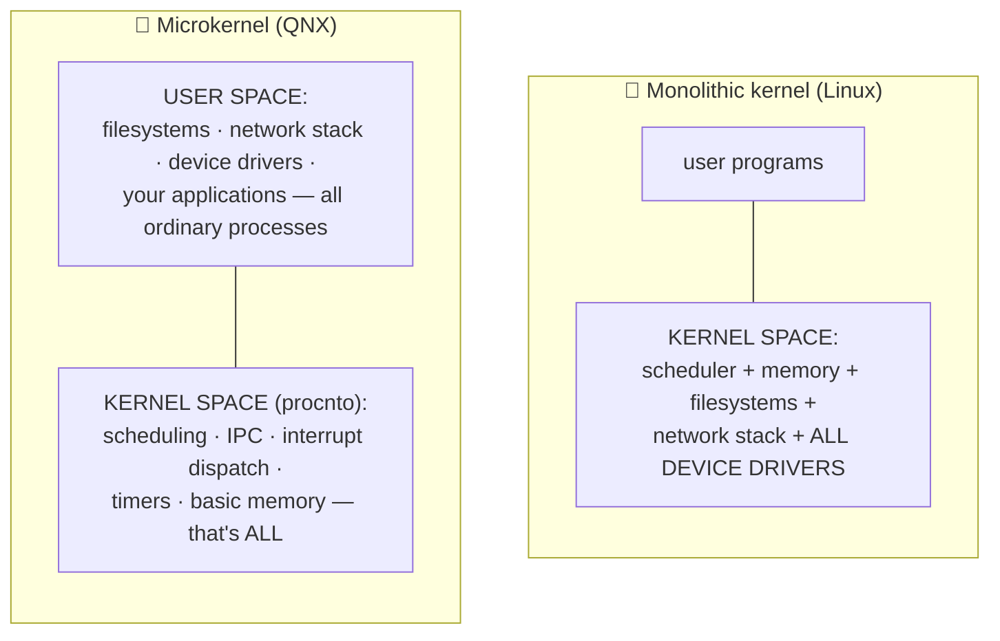
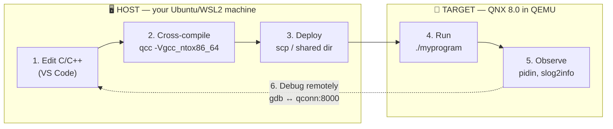

# ❓ Doubts.md

> **The rule:** no question is ever answered only in conversation. Every question you ask — at any
> time, about anything, however small — gets a permanent, dated entry here with a short answer and a
> full answer.
>
> Over time this becomes the course's FAQ, and it drives improvements to the chapters themselves.

---

## How an entry works

| Field | Meaning |
|-------|---------|
| **ID** | `D-NNN`, assigned in order, never reused |
| **Date** | When you asked |
| **Context** | What we were doing when you asked |
| **Category** | For the index below |
| **Question** | Your words, verbatim |
| **Short answer** | 2–3 sentences — enough to unblock you |
| **Full answer** | As deep as the question deserves |
| **Related** | Chapters, guides, external links |
| **Status** | ✅ Answered · 🔍 Needs verification (on real hardware/software) · ⬜ Open |
| **Action taken** | Any chapter edit / ADR / ToDo that resulted |

**Categories:** `Concept` · `Setup/Install` · `Toolchain` · `Kernel/IPC` · `Drivers` ·
`Build/Image` · `Debug` · `Hardware` · `Licensing` · `Career` · `Course logistics`

### 💬 The `/btw` convention

Prefix any aside with **`/btw`** and it becomes a `D-NNN` entry here — no matter how small, how
tangential, or how mid-task it arrives.

```text
/btw why is the disk image 47 GB?
/btw what does the "instr" in procnto-smp-instr mean?
```

**Why have a marker at all?** Questions asked in passing are exactly the ones that get answered in
conversation and then lost. The marker makes the intent unambiguous: *this is a question, and I want
it in the record.*

You do not have to use it — any question gets logged (ADR-014). The prefix just guarantees nothing
is read as a rhetorical aside. Questions may also arrive inside a file dropped in `toAgent/`; put
`/btw` on its own line there too.

---

## Index

| ID | Category | Question (short) | Status |
|----|----------|------------------|--------|
| [D-001](#d-001) | Concept | What is QNX? | ✅ |
| [D-002](#d-002) | Concept | Why is QNX used? | ✅ |
| [D-003](#d-003) | Concept | Where is QNX used? | ✅ |
| [D-004](#d-004) | Course logistics | How is QNX used / how will I learn it? | ✅ |
| [D-005](#d-005) | Licensing | Is QNX free? Can I really do this at zero cost? | ✅ |
| [D-006](#d-006) | Setup/Install | Why does `mkqnximage --run` say my directory "is neither that of an existing mkqnximage virtual image nor an empty directory"? | ✅ |
| [D-007](#d-007) | Toolchain | Why does `qnxsoftwarecenter_clt -listAvailablePackages` fail with "Unknown argument"? | ✅ |
| [D-008](#d-008) | Setup/Install | Why is `disk-qemu` 47 GB, and do I really need that much disk? | ✅ |
| [D-009](#d-009) | Setup/Install | Why does SSH refuse `root`/`root` when the console accepts it? | ✅ |
| [D-010](#d-010) | Debug | The boot log has errors in it — `ACPI table not found`, `Unable to start "uname"`, `slogger2` not connecting. Is my system broken? | ✅ |

**Open questions: 0** · **Needs verification: 1** *(D-009's `qnxuser` account name)* · **Answered: 10**

---

## D-001

### What is QNX?

| | |
|---|---|
| **Date** | 2026-08-25 |
| **Context** | Opening request — course scoping |
| **Category** | Concept |
| **Status** | ✅ Answered *(expanded fully in Chapter 02)* |

**Question (verbatim).** *"teach me qnx from scratch (what it is? …)"*

**Short answer.**
QNX is a **commercial real-time operating system (RTOS)** built on a **microkernel** architecture,
owned by BlackBerry. It is **POSIX-compliant**, so ordinary C/C++ Unix-style code runs on it — but
unlike Linux it is designed so that timing is *predictable* and a crashing driver cannot take down
the system.

**Full answer.**

Three words define QNX: **real-time**, **microkernel**, **POSIX**.

**1. Real-time.**
A general-purpose OS (Linux, Windows) optimises for *average* throughput. An RTOS optimises for
*worst-case* timing. On QNX you can state, and rely on, claims like "when this interrupt fires, the
handling thread will run within N microseconds — always." That guarantee is what makes it usable in
an airbag controller or a medical infusion pump. Chapter 01 defines this precisely (hard vs. soft
real-time, latency, jitter, determinism, WCET).

**2. Microkernel.**
This is QNX's defining architectural bet, made in 1980 and never abandoned.



*Diagram: Linux puts drivers, filesystems and the network stack inside the kernel; QNX keeps only
scheduling, IPC, interrupts, timers and basic memory management in the kernel and runs everything
else as normal user-space processes.*

The consequence is dramatic. In Linux, a buggy device driver dereferences a null pointer and the
machine panics. In QNX, that driver is just a process — it segfaults, it dies, and it can be
**restarted while the system keeps running**. This is why QNX appears in systems where a reboot is
unacceptable.

The cost is that components must talk to each other constantly, so QNX's **inter-process message
passing** must be extremely fast. It is — and it is the subject of Chapters 13–14, the heart of this
course.

**3. POSIX.**
QNX implements the POSIX standard. `open()`, `read()`, `write()`, `pthread_create()`, `mmap()`,
sockets — all present and standard. Your existing C/C++ knowledge transfers directly. Thousands of
open-source projects compile for QNX with little or no change (BlackBerry maintains ports at
`github.com/qnx-ports`). What you learn *additionally* is the QNX-native layer underneath — and once
you see it, you realise `open()` and `read()` on QNX are *themselves* just message passing.

**Product naming, decoded.** The names are confusing, so:

| Name | What it actually is |
|------|--------------------|
| **QNX** | The company/brand (a division of BlackBerry) |
| **QNX Neutrino** | The historical name of the microkernel OS (SDP 6.x/7.x era) |
| **QNX OS 8.0** | The current OS, shipped inside SDP 8.0 |
| **`procnto`** | The actual microkernel binary — "**proc**ess manager + **n**eu**t**rin**o**" |
| **QNX SDP** | *Software Development Platform* — the OS **plus** the cross-compilers, IDE, tools and BSPs you install on your Linux/Windows host |
| **QNX Momentics** | The Eclipse-based IDE that ships with SDP |
| **QNX Everywhere** | The free non-commercial licensing programme (2024→) |
| **QNX Hypervisor** | A separate product: a type-1 hypervisor that runs QNX and Linux side by side |

**Related.** Chapter 02 (full history and product family) · Chapter 09 (microkernel internals) ·
Chapter 13 (message passing) · [Glossary](../reference/Glossary.md)

**Action taken.** Content folded into the Chapter 02 outline.

---

## D-002

### Why is QNX used?

| | |
|---|---|
| **Date** | 2026-08-25 |
| **Context** | Opening request |
| **Category** | Concept |
| **Status** | ✅ Answered *(expanded fully in Chapter 03)* |

**Question (verbatim).** *"…why it is used?…"*

**Short answer.**
Because in some systems, being *late* is the same as being *wrong*, and *crashing* is not an option.
QNX is chosen when you need provable timing, fault isolation, and — critically — **pre-existing
safety certification** that would otherwise cost years and millions to obtain yourself.

**Full answer.**

There are five reasons, roughly in order of how often they are the deciding factor.

**1. Deterministic timing.**
The system must respond within a bounded time, *every* time — not on average. Anti-lock brakes,
flight controls, robot motor loops, defibrillators. Linux can be tuned toward this (PREEMPT_RT) but
cannot *guarantee* it the way an RTOS designed for it can.

**2. Fault isolation.**
Because drivers and filesystems are user-space processes with their own MMU-protected address
spaces, a fault in one cannot corrupt another. Combined with the High Availability Manager
(Chapter 27), a failed component can be automatically restarted in milliseconds. Compare: a driver
bug in Linux is a kernel panic.

**3. Safety certification — usually the real reason.**
QNX ships pre-certified to **IEC 61508 SIL 3** and **ISO 26262 ASIL D**, plus IEC 62304 (medical)
and EN 50128 (rail). If you are building a car, certifying your *own* OS is a multi-year,
multi-million-dollar undertaking. Buying an OS that is already certified — with a safety manual and
a certification package — is often the entire business case. Chapter 29 covers this.

**4. Small, auditable trusted computing base.**
The kernel is on the order of tens of thousands of lines, not tens of millions. That is a security
and certification property: less code in the privileged domain means fewer things that can be
catastrophically wrong.

**5. Longevity and support.**
QNX has shipped continuously since 1982 with long-term commercial support contracts. For a product
that must be maintained for 15–20 years (a car, a train, an MRI machine), that matters more than
it does for a web service.

**And the honest counter-argument.** QNX costs money (commercially), has a much smaller ecosystem
and talent pool than Linux, and has fewer ready-made packages. For anything that does *not* need
hard real-time or certification, Linux is usually the better engineering choice. Knowing **when not
to use QNX** is part of being good at this — Chapter 03 argues both sides properly.

**Related.** Chapter 03 · Chapter 27 (HA) · Chapter 29 (functional safety)

---

## D-003

### Where is QNX used?

| | |
|---|---|
| **Date** | 2026-08-25 |
| **Context** | Opening request |
| **Category** | Concept |
| **Status** | ✅ Answered *(expanded fully in Chapter 03)* |

**Question (verbatim).** *"…where it is used?…"*

**Short answer.**
Overwhelmingly in **automotive** (QNX states 275+ million vehicles), and broadly across medical
devices, industrial control, rail, robotics, aerospace and defence — i.e. anywhere failure is
expensive or dangerous.

**Full answer.**

| Domain | Typical use |
|--------|-------------|
| 🚗 **Automotive** — the dominant market | Digital instrument clusters, infotainment/cockpit, ADAS and autonomous-driving compute, domain and zone controllers, telematics gateways, and as the hypervisor host for mixed-criticality ECUs |
| 🏥 **Medical** | Infusion pumps, ventilators, patient monitors, surgical robots, imaging systems |
| 🏭 **Industrial** | PLCs, process control, factory robotics, energy/grid control, mining automation |
| 🚂 **Rail & transport** | Signalling, train control, traffic management |
| ✈️ **Aerospace & defence** | Avionics subsystems, UAVs, ground control, mission systems |
| 🤖 **Robotics / "physical AI"** | Humanoid and mobile robots, drones, AMRs — QNX's current strategic push |
| ⚛️ **Critical infrastructure** | Nuclear plant monitoring, water treatment, SCADA |
| 🌐 **Networking (historical)** | Cisco and other carrier-grade routers used QNX for control planes |

**A pattern worth noticing.** You almost never *see* QNX. There is no QNX logo on the screen, no
QNX desktop. It runs where the consequence of a fault is measured in lives or millions of dollars,
and it is deliberately invisible. This is also why it feels obscure despite being one of the most
widely deployed operating systems on Earth.

**Career note.** Because the talent pool is small and demand (especially automotive) is high, QNX is
an unusually high-leverage specialisation for an embedded engineer. Chapter 34 covers this.

**Related.** Chapter 03 · Chapter 30 (hypervisor) · Chapter 34 (career)

---

## D-004

### How is QNX used — and how will I actually learn it?

| | |
|---|---|
| **Date** | 2026-08-25 |
| **Context** | Opening request |
| **Category** | Course logistics |
| **Status** | ✅ Answered |

**Question (verbatim).** *"…how it is used?"*

**Short answer.**
You install the **QNX SDP** on your Linux host, cross-compile C/C++ with **`qcc`**, and deploy the
binaries to a QNX **target** — which for this whole course is a **QEMU virtual machine** on your own
laptop. You debug the target remotely from your host. No hardware needed.

**Full answer.**

**The workflow.** QNX development is almost always **cross-development**: you write and build on a
powerful host, and run on a constrained target.



*Diagram: the edit → cross-compile → deploy → run → observe → remote-debug loop between your Linux
host and the QNX virtual machine.*

**What "using QNX" means at three levels:**

| Level | You are… | Course part |
|-------|----------|-------------|
| **Application developer** | Writing normal POSIX C/C++ that happens to run on QNX, plus QNX-native IPC | Parts 2 |
| **System / driver developer** | Writing *resource managers* — QNX's user-space drivers that appear as paths like `/dev/mydevice` | Part 3 |
| **System integrator / BSP engineer** | Deciding what the OS image contains, how it boots, and porting it to a board | Parts 4 and 6 |

This course walks all three, in that order.

**Your concrete first 2 weeks:**

1. Read Chapters 00–03 — no software needed. *(Start the licence request in parallel.)*
2. Setup Guide 01 — install QEMU and prerequisites on your host.
3. Setup Guide 02 — myQNX account → QNX Everywhere licence → QNX Software Center → SDP 8.0.
4. Setup Guide 03 — `mkqnximage` builds a QNX VM; you boot it and get a `qnx#` prompt. 🎉
5. Chapter 08 — compile "hello, QNX", deploy it, run it, then debug it remotely.

After step 5 you have a complete, working QNX development loop, and every later chapter is just
"now do something more interesting in that loop."

**Related.** [Setup Guide 03](../guides/Setup_03_QEMU_VM.md) · Chapter 08 · [PLAN.md](../PLAN.md)

---

## D-005

### Is QNX free? Can I really do this at zero cost?

| | |
|---|---|
| **Date** | 2026-08-25 |
| **Context** | Course planning — implied by "guide me to install qnx on qemu" |
| **Category** | Licensing |
| **Status** | ✅ Answered *(expanded fully in Chapter 04)* |

**Question.** *Do I have to pay for QNX to take this course?*

**Short answer.**
No. **QNX Everywhere** gives you QNX SDP 8.0 free under a **non-commercial** licence. You need a free
myQNX account and to submit a licence request. Total course cost: **₹0**.

**Full answer.**

QNX is proprietary commercial software, but since 2024 BlackBerry runs **QNX Everywhere**, a free
programme for students, hobbyists and prototypers.

**What you get free:** QNX SDP 8.0 (the OS + cross-toolchain + IDE + tools), QNX Developer Desktop,
QNX Hypervisor, the Raspberry Pi quick-start image, and the online training courses.

**How to get it** (three steps, detailed in Setup Guide 02):
1. Create a **myQNX account**.
2. Complete the **QNX Everywhere licence form**.
3. Receive your licence, install **QNX Software Center**, use it to install SDP 8.0.

**What "non-commercial" permits** (from QNX's own licensing page, verified 2026-08-25):
- ✅ Learning about QNX; academic coursework and research
- ✅ Hobbyist / maker projects, including on Raspberry Pi or any QNX-provided BSP
- ✅ **Developing training material or books about QNX — even commercially**
  *(this is why this public course repository is legitimate)*
- ✅ Developing open-source software interoperable with QNX, if published free of charge

**What it forbids:**
- ❌ Building or developing a commercial product
- ❌ Putting anything into **production use**
- ❌ **Distributing** the resulting software (that needs a separate *distribution* licence)
- ❌ Demoing to existing or potential customers

> ⚠️ **Warning.** Do not mix commercial and non-commercial QNX licences on the same user account or
> installation. If your employer has a commercial QNX licence, keep this learning installation
> separate — ideally on a personal machine.

**Also free and useful:** all official QNX documentation (`qnx.com/developers/docs/8.0/`), the QNX
online training courses, the `github.com/qnx-ports` open-source ports, and the official Discord
community.

**Related.** Chapter 04 · [Setup Guide 02](../guides/Setup_02_QNX_Account_And_License.md) ·
[ReferenceLinks](../reference/ReferenceLinks.md) · ADR-002, ADR-017

---

## D-006

### Why does `mkqnximage --run` say my directory "is neither that of an existing mkqnximage virtual image nor an empty directory"?

| | |
|---|---|
| **Date** | 2026-08-26 |
| **Context** | Setup Guide 03, verification block V5.3 — first attempt to boot the VM |
| **Category** | Setup/Install |
| **Status** | ✅ Answered *(fix pending confirmation on the next run)* |

**Question (verbatim).** *"I have tried to execute V5 and I am stuck at V5.3."*

```text
The current directory is neither that of an existing mkqnximage virtual image nor is it
an empty directory. This might be OK but as creating virtual images in random locations
is often not what is intended, you have to include the --force option to enable it.
```

**Short answer.**
Nothing is broken. `unpack_qemu_image.sh` extracts into a **`qemu/` subdirectory**, so the image
lives at `~/qnx800/images/qemu/qemu` — `qemu` twice. You ran `mkqnximage` one level too high.
`cd qemu` and run it again. **Do not add `--force`.**

**Full answer.**

**How `mkqnximage` decides what a directory is.** It looks for two subdirectories, `local/` and
`output/`. Find both, and it treats the directory as an existing image to launch. Find an empty
directory, and it offers to build a new image there. Find neither — a directory with *other* stuff in
it — and it stops and asks, because silently scattering 47 GB VM images into arbitrary directories is
a bad default.

**What your directory actually contains.** After unpacking:

```text
~/qnx800/images/qemu/              ← you ran mkqnximage HERE
├── README.md
├── unpack_qemu_image.sh
├── qnx_sdp8.0_qemu_quickstart_20260606.tar.gz.0
├── qnx_sdp8.0_qemu_quickstart_20260606.tar.gz.1
└── qemu/                          ← the image is HERE
    ├── local/                     ← ✅ mkqnximage looks for this
    └── output/                    ← ✅ and this
```

From the outer directory `mkqnximage` sees two archives and a shell script — not an image, and not
empty. So it refused. Correctly.

**The fix:**

```bash
host$ cd ~/qnx800/images/qemu/qemu
host$ ls                # you should see: local  output
host$ mkqnximage --run
```

> 🚨 **Why `--force` is the wrong move**, even though the message names it. `--force` does not mean
> *"run anyway"*. It means *"yes, create a new virtual image in this unusual location"*. It would
> start building a **fresh** image beside your archives and ignore the 47 GB one you just unpacked —
> a long wait ending in the wrong result.
>
> 💡 **The general lesson.** An error message tells you what the program *believes*, and offers the
> escape hatch for the case where the program is wrong. Here the program was right and the working
> directory was wrong. Reach for a suggested flag only after you understand why the tool objected.

**Why the guide got this wrong.** QNX's official QSTI documentation says to run `unpack_qemu_image.sh`
and then `mkqnximage --run` from the `qemu` folder, without noting that the script *creates* a nested
`qemu/`. Written from the documentation alone, the instruction looks complete. Only running it
reveals the extra level. Setup Guide 03 §5 and §7 now call it out prominently.

**Related.** [Setup Guide 03 §5](../guides/Setup_03_QEMU_VM.md#5-step-2--unpack-the-image-) ·
[§7](../guides/Setup_03_QEMU_VM.md#7-step-4--boot-qnx-) · [D-008](#d-008)

**Action taken.** Setup Guide 03 → v1.1: the nested layout documented with a tree diagram, §7 now
`cd`s into the inner directory and carries the error message plus the `--force` warning verbatim.
`tools/qemu/qnx-vm.sh` default path corrected.

---

## D-007

### Why does `qnxsoftwarecenter_clt -listAvailablePackages` fail with "Unknown argument"?

| | |
|---|---|
| **Date** | 2026-08-26 |
| **Context** | Setup Guide 03, verification block V5.1 |
| **Category** | Toolchain |
| **Status** | ✅ Answered |

**Question (verbatim).** *(Implicit, from the reported output.)*

```text
Error: Unknown argument: -listAvailablePackages
```

**Short answer.**
**That option does not exist.** It was wrong in this course's guides — my error, not yours. Use
**`-listAccessible`** (packages your licence entitles you to) or **`-list`** (everything).
`./qnxsoftwarecenter_clt -help` is authoritative.

**Full answer.**

The real listing options, verified against QNX Software Center CLT **`2.0.4:v202501021438`**:

| Option | Lists |
|--------|-------|
| `-list` | Every package, accessible or not |
| `-listAccessible` | Packages your licence entitles you to ⭐ usually what you want |
| `-listQuery <query>` | Packages matching a query |
| `-listInstalled` | Every installed package |
| `-listInstalledRoots` | Installed top-level packages only |
| `-listUpdates` | Available updates |
| `-listLicenseKeys` | Your licence keys |
| `-listProfiles` | Installations on this machine |

Two more worth knowing, because the distinction matters:

| Option | Installs |
|--------|----------|
| `-installPackage <versionedPackageId>` | **One package** (or several, comma-separated) — what you want for the QEMU quick-start image |
| `-installBaseline <versionedPackageId>` | **A whole baseline** — an entire SDP, with dependency resolution |

`<versionedPackageId>` is `<packageId>` or `<packageId>/<packageVersion>`.

> 💡 **In this instance you needed neither.** The QEMU quick-start image had *already* been installed
> along with SDP 8.0 — the archives were sitting in `~/qnx800/images/qemu` with a timestamp from the
> SDP install. Checking the directory first would have skipped the whole detour, which is why Setup
> Guide 03 §4.2 now says so.

**Related.** [Setup Guide 02 §9.2](../guides/Setup_02_QNX_Account_And_License.md) ·
[Setup Guide 03 §4.2](../guides/Setup_03_QEMU_VM.md#42-route-b--command-line)

**Action taken.** The bogus option removed from every live instruction in the course. Setup Guide 02
→ v2.1 and Setup Guide 03 → v1.1 now carry the real option table with the CLT version it was verified
against.

---

## D-008

### Why is `disk-qemu` 47 GB, and do I really need that much disk?

| | |
|---|---|
| **Date** | 2026-08-26 |
| **Context** | Setup Guide 03, verification block V5.2 — after unpacking the image |
| **Category** | Setup/Install |
| **Status** | ✅ Answered |

**Question (verbatim).** *(Implicit, from the reported output.)*

```text
-rw-r--r-- 1 tyrostir tyrostir  47G Jun  6 20:31 disk-qemu
-rw-r--r-- 1 tyrostir tyrostir  171 Jun  6 20:31 disk-qemu.vmdk
```

**Short answer.**
That is the VM's virtual hard disk, and 47 GB is its **apparent** size — the size the guest believes
it has. It is very likely **sparse**, meaning it occupies far fewer real blocks. `du -sh` tells you
the truth; `ls -lh` does not.

**Full answer.**

**Two files, one disk.** The 171-byte `disk-qemu.vmdk` is a *descriptor* — a few lines of text
naming the real data file. `disk-qemu` is that data. QEMU reads the descriptor and finds the raw
image behind it.

**Apparent size versus allocated size.** A sparse file has holes: regions never written consume no
blocks on disk, yet still count toward the reported length.

```bash
host$ ls -lh  qemu/output/disk-qemu     # apparent size — what the guest sees
host$ du -sh  qemu/output/disk-qemu     # allocated size — what your disk actually lost
host$ df -h ~                           # the honest bottom line
```

If `du` reports far less than 47 GB, the file is sparse and all is well.

> ⚠️ **Sparseness is fragile.** Copying a sparse file with a naive tool expands every hole into real
> zeros — a 47 GB copy from a 3 GB original. If you ever need to move it, use `cp --sparse=always`,
> `rsync -S`, or `tar -S`. This is a genuine way to fill a disk by accident.

**The wider picture — this course's disk budget has grown twice.**

| Stage | Documented | Measured |
|-------|-----------|----------|
| Original estimate | ~25 GB total | — |
| After SDP 8.0 | 8–12 GB | **~43 GB** (951 GB free → 908 GB) |
| After the QEMU image | not estimated | archives ~1.9 GB + `disk-qemu` up to 47 GB apparent |

`PLAN.md` §7.1 was revised from ~25 GB to ~50 GB after the SDP measurement, and needs revising again
once `du` and `df` give the real figure here.

> 💡 **Once the VM boots successfully**, the `.tar.gz.0` and `.tar.gz.1` archives (~1.9 GB) can be
> deleted — you can always reinstall the package from QNX Software Center. **Not before**, though.

**Bonus: what else that listing tells you.** `procnto-smp-instr.sym` is 12 MB of debug symbols for
the kernel, and its name identifies the kernel variant: **SMP** (multi-core) and **instrumented** —
the build that supports kernel event tracing, which is what makes Chapter 26's System Analysis
Toolkit possible. And `output/build/` holds the actual **`mkifs` build files** that produced this
image: `ifs.build`, `system.build`, `disk.layout`. That is Chapter 21's source material, already on
your disk.

**Related.** [Setup Guide 03 §5](../guides/Setup_03_QEMU_VM.md#5-step-2--unpack-the-image-) ·
[Setup Guide 02 §12.1](../guides/Setup_02_QNX_Account_And_License.md) · Chapters 21 and 26

**Action taken.** Setup Guide 03 §5 now shows the real listing, explains all five artefacts, and
asks for `df -h` before and after. `PLAN.md`'s disk budget flagged for another revision (T-016).

---

## D-009

### Why does SSH refuse `root`/`root` when the serial console accepts it?

| | |
|---|---|
| **Date** | 2026-08-26 |
| **Context** | Setup Guide 03, verification block V5.5 |
| **Category** | Setup/Install |
| **Status** | ✅ Answered *(the `qnxuser` account name still to be confirmed on the target)* |

**Question (verbatim).** *"I used root as username and root as password. I am able to login to qnx.
… I tried root as username and root as password. Still I am not able to ssh to qnx."*

```text
root@192.168.122.46's password:
Permission denied, please try again.
root@192.168.122.46: Permission denied (publickey,password).
```

**Short answer.**
Your password is correct. **`sshd` refuses password authentication for `root` by design** —
`PermitRootLogin prohibit-password`, the OpenSSH default since version 7.0. Root may use a key, never
a password. Use **`ssh qnxuser@<ip>`** and then `sudo -i`.

**Full answer.**

**Why this is confusing.** The same credentials that work at the console fail over SSH, which makes
it look like a password problem. It is not. Two different things authenticate you:

| Route | Checked by | Result |
|-------|-----------|--------|
| Serial console | `login` → PAM → the shadow file | ✅ `root`/`root` accepted |
| SSH | **`sshd`'s own policy**, *before* the password is even considered | ❌ refused for root |

**Read the error precisely.** `Permission denied (publickey,password)` lists the methods the
**server** was willing to offer. Password is on that list — just not for `root`. Since OpenSSH 7.0
the shipped default has been:

```text
PermitRootLogin prohibit-password
```

Root may authenticate with a **key**; a password attempt is rejected however correct it is. This is
sensible hardening: remote root password login is the most brute-forced door on the internet.

**Three ways forward, best first.**

**1. Use the unprivileged account (recommended).**

```bash
host$ ssh qnxuser@192.168.122.46
qnx$  sudo -i
```

The QSTI image is built around a `qnxuser` account. The evidence is all in the login banner: the VNC
server's default password is `qnxuser`, the image ships a `sudoers` configuration, and the banner
tells you to run `sudo apk update` — advice that only makes sense for a non-root user. The unpacked
image also contains `system_files.custom.sudoers` and `data_files.custom.var_users` snippets.

If the name turns out to be different, the target will tell you:

```bash
qnx# cat /etc/passwd
qnx# grep -iE 'PermitRootLogin|PasswordAuthentication|AllowUsers' /etc/ssh/sshd_config
```

**2. Allow root over SSH.** Fine on a disposable VM on a private virtual network; never on anything
reachable from outside.

```bash
qnx# echo 'PermitRootLogin yes' >> /etc/ssh/sshd_config
qnx# slay -f sshd && sshd
```

⚠️ This may not survive a reboot — most of a QSTI system is rebuilt from the image at boot. That is
itself a preview of Chapter 21: durable changes go into the *image*, not into a running system.

**3. Use a key (what you will actually want).**

```bash
host$ ssh-keygen -t ed25519 -C qnx-lab
host$ ssh-copy-id qnxuser@192.168.122.46
```

Note that a key also satisfies `prohibit-password` — so `ssh-copy-id root@...` would work too, once
you have a way to place the key.

> 💡 **Do this before Chapter 08.** That chapter has you running `gdb` across this link and
> redeploying binaries constantly. A password prompt in that loop gets old within minutes.

**Related.** [Setup Guide 03 §9.3](../guides/Setup_03_QEMU_VM.md#93--ssh-as-root-will-be-refused--use-qnxuser) ·
[§13.4a](../guides/Setup_03_QEMU_VM.md) · Chapter 08 · Chapter 28 (security)

**Action taken.** Setup Guide 03 → v1.2: §9.3 rewritten around the real failure with all three
remedies, §9.5 added for key-based auth, §10.2's `scp` changed to `qnxuser@`, and a troubleshooting
entry added.

---

## D-010

### The boot log has errors in it. Is my system broken?

| | |
|---|---|
| **Date** | 2026-08-26 |
| **Context** | Setup Guide 03, verification block V5.3 — first successful boot |
| **Category** | Debug |
| **Status** | ✅ Answered |

**Question (verbatim).** *(Implicit, from the reported boot log.)*

```text
ACPI table not found (0x4746434d)
Unable to start "uname" (2)
slog2_api: cannot connect to slogger2 server...errno=No such file or directory
rm: /etc/ca-certificates/extracted: No such file or directory
```

**Short answer.**
No. All four are harmless. Three are **startup-ordering artefacts** — something ran before the
service it needed had started — and one is a cleanup script tidying a file that was never there.
Your boot reached a login prompt, which is the only verdict that counts.

**Full answer.**

| Message | What is really happening |
|---------|--------------------------|
| `ACPI table not found (0x4746434d)` | QEMU's minimal firmware does not present the ACPI table QNX looks for. QNX falls back to other hardware discovery and continues. On real hardware you would normally see the table found. |
| `Unable to start "uname" (2)` | Error **2** is `ENOENT` — *no such file*. A startup script called `uname` before the disk holding `/usr/bin` was mounted. Purely cosmetic: `uname -a` works perfectly once you are logged in. |
| `slog2_api: cannot connect to slogger2 server` | The system logger had not started **yet**. The very next line says so: *"Registration will be attempted when it is running."* `slm` then starts `slogger2` as its first component. |
| `rm: /etc/ca-certificates/extracted: No such file` | A cleanup script removing something that does not exist on a first boot. |

> 💡 **A habit worth forming on any embedded system.** Early-boot complaints about services that
> start *later* are almost always ordering noise. The messages worth chasing are the ones that appear
> **after** the subsystem in question has started — and the ones that stop the boot.

**How to check properly rather than by eye.** Once `slogger2` is up, the system log is the
authoritative record:

```bash
qnx# slog2info
```

Chapter 24 covers `slog2` — QNX's structured, low-overhead logging system — and Chapter 25 turns this
kind of triage into a method.

**The reassuring counter-evidence in your own log.** `slm` reported all 22 components active,
`devb-eide` found the QEMU hard disk, filesystems mounted, `io-sock` came up with a working IP,
`sshd` and `qconn` started, and you got a login prompt. A genuinely broken boot does not get that far.

**Related.** [Setup Guide 03 §7](../guides/Setup_03_QEMU_VM.md#7-step-4--boot-qnx-) ·
Chapters 24, 25

**Action taken.** Setup Guide 03 §7 now shows the real boot log with all four messages explained in a
table, so the next reader does not stop to debug them.

---

## 📝 Changelog

| Version | Date | Change |
|---------|------|--------|
| 1.2 | 2026-08-26 | +D-009 (SSH refuses root by design), D-010 (benign boot-log warnings). |
| 1.1 | 2026-08-26 | +D-006 (the `mkqnximage` nested-directory trap), D-007 (`-listAvailablePackages` does not exist), D-008 (the 47 GB sparse disk image). `/btw` convention documented. |
| 1.0 | 2026-08-25 | Created. Seeded with D-001…D-005 from the learner's opening request. |
