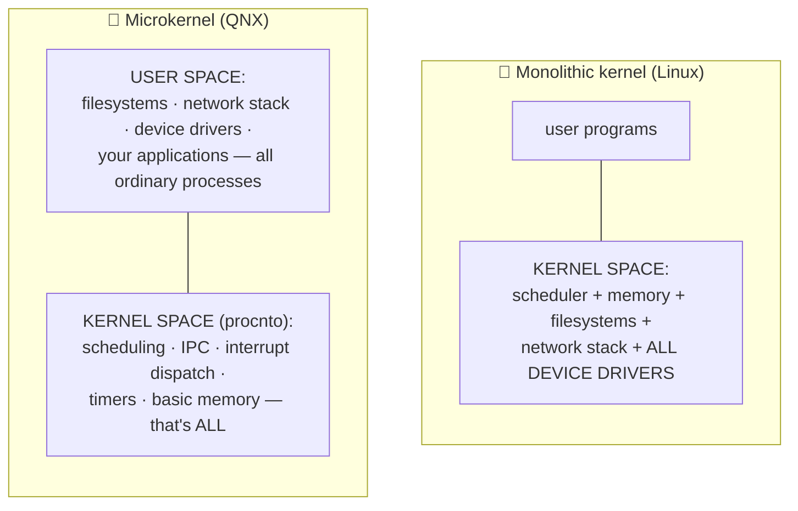
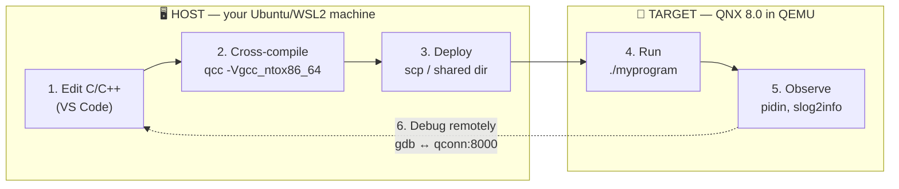

# ❓ Doubts.md

> **The rule:** no question is ever answered only in conversation. Every question you ask — at any
> time, about anything, however small — gets a permanent, dated entry here with a short answer and a
> full answer.
>
> Over time this becomes the course's FAQ, and it drives improvements to the chapters themselves.

---

## How an entry works

| Field | Meaning |
|-------|---------|
| **ID** | `D-NNN`, assigned in order, never reused |
| **Date** | When you asked |
| **Context** | What we were doing when you asked |
| **Category** | For the index below |
| **Question** | Your words, verbatim |
| **Short answer** | 2–3 sentences — enough to unblock you |
| **Full answer** | As deep as the question deserves |
| **Related** | Chapters, guides, external links |
| **Status** | ✅ Answered · 🔍 Needs verification (on real hardware/software) · ⬜ Open |
| **Action taken** | Any chapter edit / ADR / ToDo that resulted |

**Categories:** `Concept` · `Setup/Install` · `Toolchain` · `Kernel/IPC` · `Drivers` ·
`Build/Image` · `Debug` · `Hardware` · `Licensing` · `Career` · `Course logistics`

---

## Index

| ID | Category | Question (short) | Status |
|----|----------|------------------|--------|
| [D-001](#d-001) | Concept | What is QNX? | ✅ |
| [D-002](#d-002) | Concept | Why is QNX used? | ✅ |
| [D-003](#d-003) | Concept | Where is QNX used? | ✅ |
| [D-004](#d-004) | Course logistics | How is QNX used / how will I learn it? | ✅ |
| [D-005](#d-005) | Licensing | Is QNX free? Can I really do this at zero cost? | ✅ |

**Open questions: 0** · **Needs verification: 0** · **Answered: 5**

---

## D-001

### What is QNX?

| | |
|---|---|
| **Date** | 2026-08-25 |
| **Context** | Opening request — course scoping |
| **Category** | Concept |
| **Status** | ✅ Answered *(expanded fully in Chapter 02)* |

**Question (verbatim).** *"teach me qnx from scratch (what it is? …)"*

**Short answer.**
QNX is a **commercial real-time operating system (RTOS)** built on a **microkernel** architecture,
owned by BlackBerry. It is **POSIX-compliant**, so ordinary C/C++ Unix-style code runs on it — but
unlike Linux it is designed so that timing is *predictable* and a crashing driver cannot take down
the system.

**Full answer.**

Three words define QNX: **real-time**, **microkernel**, **POSIX**.

**1. Real-time.**
A general-purpose OS (Linux, Windows) optimises for *average* throughput. An RTOS optimises for
*worst-case* timing. On QNX you can state, and rely on, claims like "when this interrupt fires, the
handling thread will run within N microseconds — always." That guarantee is what makes it usable in
an airbag controller or a medical infusion pump. Chapter 01 defines this precisely (hard vs. soft
real-time, latency, jitter, determinism, WCET).

**2. Microkernel.**
This is QNX's defining architectural bet, made in 1980 and never abandoned.

*Diagram: Linux puts drivers, filesystems and the network stack inside the kernel; QNX keeps only
scheduling, IPC, interrupts, timers and basic memory management in the kernel and runs everything
else as normal user-space processes.*

The consequence is dramatic. In Linux, a buggy device driver dereferences a null pointer and the
machine panics. In QNX, that driver is just a process — it segfaults, it dies, and it can be
**restarted while the system keeps running**. This is why QNX appears in systems where a reboot is
unacceptable.

The cost is that components must talk to each other constantly, so QNX's **inter-process message
passing** must be extremely fast. It is — and it is the subject of Chapters 13–14, the heart of this
course.

**3. POSIX.**
QNX implements the POSIX standard. `open()`, `read()`, `write()`, `pthread_create()`, `mmap()`,
sockets — all present and standard. Your existing C/C++ knowledge transfers directly. Thousands of
open-source projects compile for QNX with little or no change (BlackBerry maintains ports at
`github.com/qnx-ports`). What you learn *additionally* is the QNX-native layer underneath — and once
you see it, you realise `open()` and `read()` on QNX are *themselves* just message passing.

**Product naming, decoded.** The names are confusing, so:

| Name | What it actually is |
|------|--------------------|
| **QNX** | The company/brand (a division of BlackBerry) |
| **QNX Neutrino** | The historical name of the microkernel OS (SDP 6.x/7.x era) |
| **QNX OS 8.0** | The current OS, shipped inside SDP 8.0 |
| **`procnto`** | The actual microkernel binary — "**proc**ess manager + **n**eu**t**rin**o**" |
| **QNX SDP** | *Software Development Platform* — the OS **plus** the cross-compilers, IDE, tools and BSPs you install on your Linux/Windows host |
| **QNX Momentics** | The Eclipse-based IDE that ships with SDP |
| **QNX Everywhere** | The free non-commercial licensing programme (2024→) |
| **QNX Hypervisor** | A separate product: a type-1 hypervisor that runs QNX and Linux side by side |

**Related.** Chapter 02 (full history and product family) · Chapter 09 (microkernel internals) ·
Chapter 13 (message passing) · [Glossary](../reference/Glossary.md)

**Action taken.** Content folded into the Chapter 02 outline.

---

## D-002

### Why is QNX used?

| | |
|---|---|
| **Date** | 2026-08-25 |
| **Context** | Opening request |
| **Category** | Concept |
| **Status** | ✅ Answered *(expanded fully in Chapter 03)* |

**Question (verbatim).** *"…why it is used?…"*

**Short answer.**
Because in some systems, being *late* is the same as being *wrong*, and *crashing* is not an option.
QNX is chosen when you need provable timing, fault isolation, and — critically — **pre-existing
safety certification** that would otherwise cost years and millions to obtain yourself.

**Full answer.**

There are five reasons, roughly in order of how often they are the deciding factor.

**1. Deterministic timing.**
The system must respond within a bounded time, *every* time — not on average. Anti-lock brakes,
flight controls, robot motor loops, defibrillators. Linux can be tuned toward this (PREEMPT_RT) but
cannot *guarantee* it the way an RTOS designed for it can.

**2. Fault isolation.**
Because drivers and filesystems are user-space processes with their own MMU-protected address
spaces, a fault in one cannot corrupt another. Combined with the High Availability Manager
(Chapter 27), a failed component can be automatically restarted in milliseconds. Compare: a driver
bug in Linux is a kernel panic.

**3. Safety certification — usually the real reason.**
QNX ships pre-certified to **IEC 61508 SIL 3** and **ISO 26262 ASIL D**, plus IEC 62304 (medical)
and EN 50128 (rail). If you are building a car, certifying your *own* OS is a multi-year,
multi-million-dollar undertaking. Buying an OS that is already certified — with a safety manual and
a certification package — is often the entire business case. Chapter 29 covers this.

**4. Small, auditable trusted computing base.**
The kernel is on the order of tens of thousands of lines, not tens of millions. That is a security
and certification property: less code in the privileged domain means fewer things that can be
catastrophically wrong.

**5. Longevity and support.**
QNX has shipped continuously since 1982 with long-term commercial support contracts. For a product
that must be maintained for 15–20 years (a car, a train, an MRI machine), that matters more than
it does for a web service.

**And the honest counter-argument.** QNX costs money (commercially), has a much smaller ecosystem
and talent pool than Linux, and has fewer ready-made packages. For anything that does *not* need
hard real-time or certification, Linux is usually the better engineering choice. Knowing **when not
to use QNX** is part of being good at this — Chapter 03 argues both sides properly.

**Related.** Chapter 03 · Chapter 27 (HA) · Chapter 29 (functional safety)

---

## D-003

### Where is QNX used?

| | |
|---|---|
| **Date** | 2026-08-25 |
| **Context** | Opening request |
| **Category** | Concept |
| **Status** | ✅ Answered *(expanded fully in Chapter 03)* |

**Question (verbatim).** *"…where it is used?…"*

**Short answer.**
Overwhelmingly in **automotive** (QNX states 275+ million vehicles), and broadly across medical
devices, industrial control, rail, robotics, aerospace and defence — i.e. anywhere failure is
expensive or dangerous.

**Full answer.**

| Domain | Typical use |
|--------|-------------|
| 🚗 **Automotive** — the dominant market | Digital instrument clusters, infotainment/cockpit, ADAS and autonomous-driving compute, domain and zone controllers, telematics gateways, and as the hypervisor host for mixed-criticality ECUs |
| 🏥 **Medical** | Infusion pumps, ventilators, patient monitors, surgical robots, imaging systems |
| 🏭 **Industrial** | PLCs, process control, factory robotics, energy/grid control, mining automation |
| 🚂 **Rail & transport** | Signalling, train control, traffic management |
| ✈️ **Aerospace & defence** | Avionics subsystems, UAVs, ground control, mission systems |
| 🤖 **Robotics / "physical AI"** | Humanoid and mobile robots, drones, AMRs — QNX's current strategic push |
| ⚛️ **Critical infrastructure** | Nuclear plant monitoring, water treatment, SCADA |
| 🌐 **Networking (historical)** | Cisco and other carrier-grade routers used QNX for control planes |

**A pattern worth noticing.** You almost never *see* QNX. There is no QNX logo on the screen, no
QNX desktop. It runs where the consequence of a fault is measured in lives or millions of dollars,
and it is deliberately invisible. This is also why it feels obscure despite being one of the most
widely deployed operating systems on Earth.

**Career note.** Because the talent pool is small and demand (especially automotive) is high, QNX is
an unusually high-leverage specialisation for an embedded engineer. Chapter 34 covers this.

**Related.** Chapter 03 · Chapter 30 (hypervisor) · Chapter 34 (career)

---

## D-004

### How is QNX used — and how will I actually learn it?

| | |
|---|---|
| **Date** | 2026-08-25 |
| **Context** | Opening request |
| **Category** | Course logistics |
| **Status** | ✅ Answered |

**Question (verbatim).** *"…how it is used?"*

**Short answer.**
You install the **QNX SDP** on your Linux host, cross-compile C/C++ with **`qcc`**, and deploy the
binaries to a QNX **target** — which for this whole course is a **QEMU virtual machine** on your own
laptop. You debug the target remotely from your host. No hardware needed.

**Full answer.**

**The workflow.** QNX development is almost always **cross-development**: you write and build on a
powerful host, and run on a constrained target.

*Diagram: the edit → cross-compile → deploy → run → observe → remote-debug loop between your Linux
host and the QNX virtual machine.*

**What "using QNX" means at three levels:**

| Level | You are… | Course part |
|-------|----------|-------------|
| **Application developer** | Writing normal POSIX C/C++ that happens to run on QNX, plus QNX-native IPC | Parts 2 |
| **System / driver developer** | Writing *resource managers* — QNX's user-space drivers that appear as paths like `/dev/mydevice` | Part 3 |
| **System integrator / BSP engineer** | Deciding what the OS image contains, how it boots, and porting it to a board | Parts 4 and 6 |

This course walks all three, in that order.

**Your concrete first 2 weeks:**

1. Read Chapters 00–03 — no software needed. *(Start the licence request in parallel.)*
2. Setup Guide 01 — install QEMU and prerequisites on your host.
3. Setup Guide 02 — myQNX account → QNX Everywhere licence → QNX Software Center → SDP 8.0.
4. Setup Guide 03 — `mkqnximage` builds a QNX VM; you boot it and get a `qnx#` prompt. 🎉
5. Chapter 08 — compile "hello, QNX", deploy it, run it, then debug it remotely.

After step 5 you have a complete, working QNX development loop, and every later chapter is just
"now do something more interesting in that loop."

**Related.** [Setup Guide 03](../guides/Setup_03_QEMU_VM.md) · Chapter 08 · [PLAN.md](../PLAN.md)

---

## D-005

### Is QNX free? Can I really do this at zero cost?

| | |
|---|---|
| **Date** | 2026-08-25 |
| **Context** | Course planning — implied by "guide me to install qnx on qemu" |
| **Category** | Licensing |
| **Status** | ✅ Answered *(expanded fully in Chapter 04)* |

**Question.** *Do I have to pay for QNX to take this course?*

**Short answer.**
No. **QNX Everywhere** gives you QNX SDP 8.0 free under a **non-commercial** licence. You need a free
myQNX account and to submit a licence request. Total course cost: **₹0**.

**Full answer.**

QNX is proprietary commercial software, but since 2024 BlackBerry runs **QNX Everywhere**, a free
programme for students, hobbyists and prototypers.

**What you get free:** QNX SDP 8.0 (the OS + cross-toolchain + IDE + tools), QNX Developer Desktop,
QNX Hypervisor, the Raspberry Pi quick-start image, and the online training courses.

**How to get it** (three steps, detailed in Setup Guide 02):
1. Create a **myQNX account**.
2. Complete the **QNX Everywhere licence form**.
3. Receive your licence, install **QNX Software Center**, use it to install SDP 8.0.

**What "non-commercial" permits** (from QNX's own licensing page, verified 2026-08-25):
- ✅ Learning about QNX; academic coursework and research
- ✅ Hobbyist / maker projects, including on Raspberry Pi or any QNX-provided BSP
- ✅ **Developing training material or books about QNX — even commercially**
  *(this is why this public course repository is legitimate)*
- ✅ Developing open-source software interoperable with QNX, if published free of charge

**What it forbids:**
- ❌ Building or developing a commercial product
- ❌ Putting anything into **production use**
- ❌ **Distributing** the resulting software (that needs a separate *distribution* licence)
- ❌ Demoing to existing or potential customers

> ⚠️ **Warning.** Do not mix commercial and non-commercial QNX licences on the same user account or
> installation. If your employer has a commercial QNX licence, keep this learning installation
> separate — ideally on a personal machine.

**Also free and useful:** all official QNX documentation (`qnx.com/developers/docs/8.0/`), the QNX
online training courses, the `github.com/qnx-ports` open-source ports, and the official Discord
community.

**Related.** Chapter 04 · [Setup Guide 02](../guides/Setup_02_QNX_Account_And_License.md) ·
[ReferenceLinks](../reference/ReferenceLinks.md) · ADR-002, ADR-017

---

## 📝 Changelog

| Version | Date | Change |
|---------|------|--------|
| 1.0 | 2026-08-25 | Created. Seeded with D-001…D-005 from the learner's opening request. |
